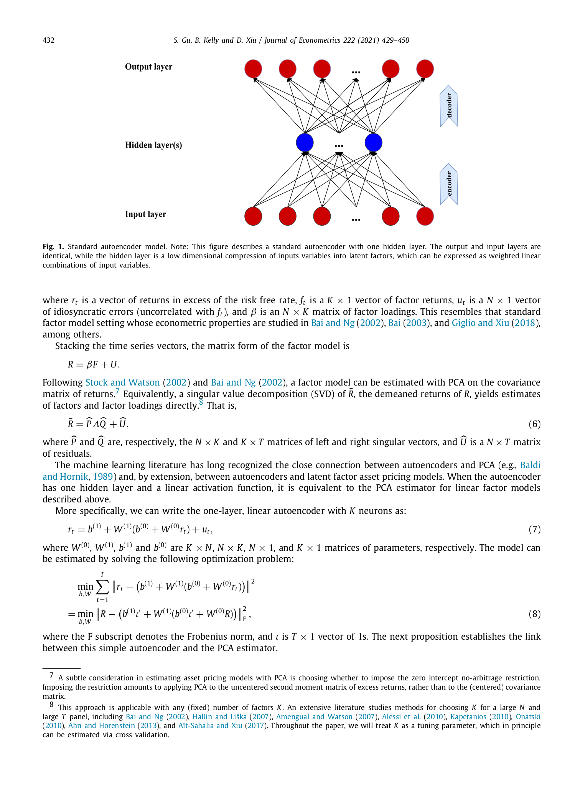

# 05a. Section 2.1 — 표준 Autoencoder + PCA 등가성

## 📌 이 챕터 다 읽으면 알 수 있는 것

- **Autoencoder 가 어떤 모양** 인지 (모래시계 = 입력 → 좁은 압축 → 복원)
- **One-layer 선형 autoencoder = PCA** 라는 Proposition 1 의 의미 — 즉 신경망과 전통 통계학의 다리
- 본 논문이 왜 이걸 출발점으로 쓰는지 — "PCA 잘 알려진 도구의 신경망 후예" 라는 논거

---

이 챕터는 신경망 측면에서 가장 중요한 한 발견을 다룬다:
**"One-layer linear autoencoder = PCA"**.

이걸 알면 autoencoder 가 자산가격에 자연스럽게 fit 하는 이유가 명확해진다.

---

## 5a.1 Autoencoder 가 뭔가?

> **원문**: "An autoencoder is a special neural network in which the outputs attempt to approximate the input variables. The input variables pass through a small number of neurons in the hidden layer(s), forging a compressed representation of the input (encoding), which is then unpacked and mapped to the output layer (decoding)."

**한 줄**: **"입력 → 압축 → 복원"**.

```
       Input               Hidden (bottleneck)         Output
     (N차원)        →         (K차원, K << N)        →     (N차원)
       │                          │                         │
       r                       encoded                  r̂ ≈ r
                          (K차원 잠재요인)
```

**핵심 아이디어**:
- bottleneck layer 가 입력보다 **훨씬 작음** (K << N)
- 그래서 네트워크는 **입력의 가장 중요한 패턴만** 그 작은 차원에 압축할 수밖에 없음
- 그 압축된 표현으로 다시 복원하려고 학습 → 자연히 의미 있는 features 학습

**비유**:
- 한 권의 책 (N단어) → 짧은 요약 (K단어) → 그 요약으로 책 복원 시도
- 좋은 요약 = 핵심을 잘 담은 것
- 좋은 autoencoder = 입력의 핵심 패턴 잘 잡은 것

---

## 5a.2 Autoencoder 의 수학 — 일반적인 다층

> **원문**: "Neural network models (including autoencoders) with $L$ hidden layers can be written using the following recursive formula."

각 layer $l$ 에는 $K^{(l)}$ 개 뉴런. 다음 점화식:

$$
r^{(l)} = g\left(b^{(l-1)} + W^{(l-1)} r^{(l-1)}\right) \quad \text{(Eq. 3)}
$$

### 🔣 식이 말하는 것 한 줄

"전 단계 출력 $r^{(l-1)}$ 에 weight 곱하고 bias 더한 뒤, ReLU 같은 비선형 함수 통과 → 다음 단계 출력". 모든 신경망의 기본 단위.

### 🔣 4-단 기호 풀이

| 기호 | 한국어 | 일상 비유 | 조심할 점 |
|------|--------|-----------|-----------|
| $r^{(l)}$ | layer $l$ 출력 ($K^{(l)} \times 1$) | "$l$ 단계 변환 결과" | 차원이 점점 줄어들 수 있음 |
| $W^{(l-1)}, b^{(l-1)}$ | layer 가중치 + 절편 | "어떻게 섞을지 + 어디부터 시작할지" | 학습으로 결정 |
| $g(\cdot)$ | activation | "비선형 필터" — ReLU (음수 → 0) | **이게 없으면 선형 = PCA** |

**기호 뜻**:
- $r^{(l)}$ — layer $l$ 의 출력 ($K^{(l)} \times 1$ 벡터)
- $r^{(l-1)}$ — 이전 layer 의 출력 (layer $l$ 의 입력)
- $W^{(l-1)}$ — $K^{(l)} \times K^{(l-1)}$ weight matrix
- $b^{(l-1)}$ — $K^{(l)} \times 1$ bias vector
- $g(\cdot)$ — **비선형 activation function** (본 논문은 **ReLU** 사용)

**활성함수 (ReLU)**:
$$
g(y) = \max(y, 0)
$$
양수면 그대로, 음수면 0. 신경망의 비선형성을 가능하게 함.

**비유**: 정보가 layer 를 거치면서:
1. 선형 변환 ($Wr + b$) — "정보를 섞기"
2. ReLU — "0 미만은 잘라내기" (sparse 한 표현)

**왜 비선형**:
- $g$ 없으면 그냥 행렬 곱의 연속 → 결국 한 행렬과 동치. 신경망 의미 사라짐.
- $g$ 가 있어야 "여러 층" 이 의미 있는 비선형 매핑.

---

## 5a.3 첫 layer 의 입력 + 마지막 layer 의 출력

**입력 layer ($l = 0$)**:
$$
r^{(0)} = r = (r_1, \ldots, r_N)'
$$
즉 자산 수익률 벡터 자체.

**최종 출력**:
$$
G(r, b, W) = b^{(L)} + W^{(L)} r^{(L)} \quad \text{(Eq. 4)}
$$
이 출력은 입력과 같은 차원 ($N \times 1$).

### 🔣 식이 말하는 것 한 줄

"마지막 layer 만 **선형** (활성화 없음) → 출력값이 음수도 가능". autoencoder 의 복원 출력은 부호 자유여야 하므로.

### 🔣 4-단 기호 풀이

| 기호 | 한국어 | 일상 비유 | 조심할 점 |
|------|--------|-----------|-----------|
| $G(r, b, W)$ | 전체 모델 출력 | "신경망 끝까지 통과한 결과" | **차원이 입력과 같음** (autoencoder 의 특성) |
| $W^{(L)}$ | 마지막 layer weight ($N \times K^{(L)}$) | "최종 차원으로 다시 펼치는 가중치" | 활성화 없음 (linear) |
| $b^{(L)}$ | 마지막 layer bias | "절편" | 보통 0 으로 둠 |

**비교**:
- 일반 신경망: 입력 → 다른 차원의 출력 (예: classification, regression)
- Autoencoder: 입력 → **같은 차원 (입력 자체 복원)**

→ **목적함수**: $\| r - G(r) \|^2$ 를 최소화하는 $W, b$ 찾기.

---

## 5a.4 Fig. 1 — 표준 Autoencoder 도식



*journal p.432 Fig. 1 발췌 — 한 hidden layer 의 autoencoder. 입력과 출력은 동일 차원 (N개 자산), 가운데 hidden layer 는 작은 차원 (K개 잠재요인).*

### 📖 처음 보는 사람을 위한 — Fig. 1 읽는 법

**한 줄로**: "위에서 데이터 넣으면, 가운데서 좁게 압축됐다가, 아래로 다시 펴진다. 가운데 좁은 부분이 '핵심 요약'."

**그림 구조 — 모래시계 모양**:

```
   위:    ● ● ● ● ● ● ● ● ●  ← 입력 (자산 수익률, N개)
              ↘   ↓   ↙
   가운데:        ● ● ●         ← bottleneck (K개, K<<N)
              ↗   ↓   ↘
   아래:   ● ● ● ● ● ● ● ● ●  ← 출력 (입력 복원, N개)
```

**보면 알 수 있는 3가지**:

| 어디 | 무엇 | 일상 비유 |
|------|------|-----------|
| **위 빨간 점들 (N개)** | 입력 — 매월 모든 자산의 수익률 | "이번달 모든 학생의 모든 과목 점수" (수천 숫자) |
| **가운데 파란 점들 (K개, K=5)** | bottleneck — 잠재요인 | "그 수천 점수의 5개 핵심 패턴" (대입 점수처럼 압축) |
| **아래 빨간 점들 (N개)** | 출력 — 복원된 수익률 | "5개 패턴만으로 다시 모든 점수 추정해 본 것" |

**핵심 메시지**:
- 가운데가 좁으니까 (N개를 K개로) → 신경망은 **버릴 정보를 골라야 함**
- 잘 학습되면 → 잡음만 버리고 **시장의 핵심 패턴 (K=5 요인) 만 가운데에 남음**
- 즉 PCA 의 첫 5개 주성분과 같은 일을 함 (Prop 1 이 정확히 이걸 증명)

**놓치기 쉬운 한 가지**: 이 그림은 **자산 특성 ($z$, 회사의 size·모멘텀 등) 을 안 씀**. 오직 수익률만 봄. 이게 표준 autoencoder 의 약점이고 → 본 논문이 5b 에서 conditional 로 확장하는 이유.

---

**원 본문 해석** (위 가이드를 따라 다시 읽으면):
- 빨간 dots (위·아래) = 입력 / 출력 layer (둘 다 N개 뉴런, 각각 자산 수익률)
- 파란 dots (가운데) = bottleneck (K개 뉴런, 잠재요인)
- 화살표 = weight connections

**Encoder**: 입력 (N차원) → bottleneck (K차원).
**Decoder**: bottleneck (K차원) → 출력 (N차원).
**둘 다 가중치 학습**으로 결정.

### 📖 처음 보는 사람을 위한 — Fig. 1 의 색·점 정밀 풀이

| 그림 요소 | 의미 | 차원 | 본문 식 |
|-----------|------|------|---------|
| **위 빨간 점들 (N개)** | 입력 — 자산 수익률 벡터 $r$ | $N \times 1$ | Eq. 5 의 $r_t$ |
| **가운데 파란 점들 (K개)** | bottleneck — 잠재 요인 $f$ | $K \times 1$ (K << N) | Eq. 5 의 $f_t$ |
| **아래 빨간 점들 (N개)** | 출력 — 복원된 수익률 $\hat r$ | $N \times 1$ | Eq. 7 의 $G(r)$ |
| **위→가운데 화살표** | encoder $W^{(0)}$ | $K \times N$ | Eq. 7 의 $W^{(0)} r$ |
| **가운데→아래 화살표** | decoder $W^{(1)}$ | $N \times K$ | Eq. 7 의 $W^{(1)} (\cdot)$ |

### 🔍 Fig. 1 의 핵심 직관 — "모래시계"

```
   N 뉴런 ── encoder ── K 뉴런 ── decoder ── N 뉴런
   ▒▒▒▒▒                  ▒                    ▒▒▒▒▒
   (정보 풍부)         (압축됨)              (복원)
       ▲                  │                     ▲
       │                  ▼                     │
   r 입력          핵심만 남음           자기 자신 비슷
                 = 시장의 K 요인
```

### 🌱 Fig. 1 한 문장으로

> "신경망에 수익률을 넣어 **좁은 K 차원 (요인)** 으로 압축했다 → 다시 펴 보면 거의 원래 모양 복원 → 그 K 차원이 시장의 핵심 요인".

### 🔑 Fig. 1 의 결정적 통찰 (Proposition 1 의 시각화)

- 활성화 함수 없이 1 hidden layer 면 → **이 그림과 PCA 가 같은 답** (Prop 1).
- 다층 + ReLU → **nonlinear PCA** → 표현력 ↑.
- 본 논문 (Fig 2) 는 여기서 **자산 특성 z 입력** 을 추가해 conditional 로 확장.

---

## 5a.5 정적 선형 요인 모델 — PCA 와 같은 출발

> **원문**: "In this section we explore the connection between autoencoders and PCA."

**정적 선형 요인 모델** (Section 2.1.1):
$$
r_t = \beta f_t + u_t \quad \text{(Eq. 5)}
$$

### 🔣 식이 말하는 것 한 줄

"모든 자산의 시점 $t$ 수익률은 (시간 불변 노출도) × (시점 $t$ 요인) + 잡음" — KPS 의 conditional 모델 (Eq 1) 의 **시간 불변 ($\beta$ 가 $t$ 와 무관) 버전**.

### 🔣 4-단 기호 풀이

| 기호 | 한국어 | 일상 비유 | 조심할 점 |
|------|--------|-----------|-----------|
| $r_t$ | 시점 $t$ 의 N 자산 수익률 벡터 ($N\times 1$) | "오늘 모든 학생 점수" | 시점마다 변함 |
| $\beta$ | 노출도 행렬 ($N \times K$) | "**모든 학생의 5 과목 약점** (시간 불변)" | **상수 가정** — Fama-French 같은 정적 모델의 한계 |
| $f_t$ | 시점 $t$ 잠재요인 ($K \times 1$) | "오늘 시험별 난이도" | 시점마다 변함 |
| $u_t$ | 잔차 | "오늘 학생별 우연" | 평균 0 가정 |

행렬 형태 (모든 $t$ 모음):
$$
R = \beta F + U
$$
$R$ 은 $N \times T$, $F$ 는 $K \times T$.

---

## 5a.6 PCA 추정 — SVD

> **원문**: "Following Stock and Watson (2002) and Bai and Ng (2002), a factor model can be estimated with PCA on the covariance matrix of returns."

PCA 의 표준 SVD 분해 (paper Eq. 6):
$$
\bar R = \hat P \Lambda \hat Q + \hat U \quad \text{(Eq. 6)}
$$

### 🔣 식이 말하는 것 한 줄

"수익률 행렬을 **자산 방향 $\hat P$ × 강도 $\Lambda$ × 시간 방향 $\hat Q$** + 잡음으로 분해". 가장 강한 K 개 방향만 남기면 PCA 의 K-요인 모델.

### 🔣 4-단 기호 풀이

| 기호 | 한국어 | 일상 비유 | 조심할 점 |
|------|--------|-----------|-----------|
| $\bar R$ | demeaned 수익률 행렬 ($N \times T$) | "평균 뺀 점수 변동표" | 각 자산의 시간 평균 뺀 후 |
| $\hat P$ | 좌특이벡터 ($N \times K$) | "자산 공간의 K 개 강한 방향" | 요인 노출도와 비례 |
| $\Lambda$ | 특이값 행렬 ($K \times K$ 대각) | "각 방향의 강도" | 큰 값일수록 중요한 요인 |
| $\hat Q$ | 우특이벡터 ($K \times T$) | "시간 공간의 K 개 강한 방향" | 요인 시간시리즈와 비례 |
| $\hat U$ | 잔차 | "K 방향 외의 잡음" | rank-K 이상 부분 |

### 🌱 일상 비유로 한 번 더

SVD = "**큰 사진 (행렬) 을 가장 중요한 방향들로 분해해서 적은 차원으로 압축**" — 사진의 JPG 압축, 음악의 MP3 압축, 데이터의 PCA 모두 같은 원리.

자산가격 맥락:
- $\hat P$ = "30,000 자산 차원에서 가장 강한 5 개 방향" — 이게 노출도 패턴
- $\hat Q$ = "720 개월 시간 차원에서 가장 강한 5 개 방향" — 이게 시장 충격 시계열
- $\Lambda$ = "각 방향이 얼마나 중요?" — 큰 첫 특이값은 보통 시장 요인, 다음은 size, etc.

**왜 이 형태가 PCA 의 답?**
- 잔차 제곱합 최소화 → Eckart-Young-Mirsky 정리 → SVD top-K = PCA top-K 와 동일.

**왜 이 형태**:
- 잔차 제곱합 최소화 (Frobenius norm 최소)
- 최적 rank-K 근사 (Eckart-Young 정리)
- Bai-Ng 점근 이론으로 일관성 증명됨

**Centered vs Uncentered PCA** (paper footnote 7):
> "A subtle consideration in estimating asset pricing models with PCA is choosing whether to impose the zero intercept no-arbitrage restriction. Imposing the restriction amounts to applying PCA to the **uncentered second moment matrix** of excess returns, rather than to the (centered) covariance matrix."

→ Standard PCA: demean → covariance matrix → SVD. **No-arbitrage 강제**: demean 안 함 → uncentered second moment $RR'/T$ → SVD. 본 논문은 centered 버전을 baseline 으로 보고, Prop 1 도 centered case 증명 (uncentered case 도 paper footnote 9 에서 "similar" 라고 명시).

---

## 5a.7 핵심 발견 — One-layer linear autoencoder = PCA

> **원문**: "When the autoencoder has one hidden layer and a linear activation function, it is equivalent to the PCA estimator for linear factor models described above."

**One-layer linear autoencoder**:
$$
r_t = b^{(1)} + W^{(1)} \left(b^{(0)} + W^{(0)} r_t\right) + u_t \quad \text{(Eq. 7)}
$$

### 🔣 식이 말하는 것 한 줄

"수익률 r 을 작은 K 차원으로 압축 ($W^{(0)} r$) 했다가 다시 N 차원으로 펴 ($W^{(1)} \cdot$ ) 자기 자신에 가깝게 복원" — 압축 + 복원 = autoencoder.

### 🔣 4-단 기호 풀이

| 기호 | 한국어 | 일상 비유 | 조심할 점 |
|------|--------|-----------|-----------|
| $W^{(0)}$ | encoder weight ($K \times N$) | "수익률 → 핵심 K 요약" 압축기 | 차원이 N → K 로 줄어듦 |
| $W^{(1)}$ | decoder weight ($N \times K$) | "K 요약 → 수익률 복원" 펼침기 | $W^{(0)}$ 의 역연산 같은 역할 |
| $b^{(0)}, b^{(1)}$ | bias 벡터 | "상수 보정값" (절편) | 보통 무시해도 큰 영향 없음 |
| **활성함수 g** | identity (선형) | "그대로 통과" — 비선형 효과 없음 | **여기 핵심**. 활성함수 없으면 → PCA 와 동치 |

### 🌱 일상 비유 한 번 더

"수익률 1000 가지 → 핵심 5 개로 압축 → 다시 1000 가지로 복원". 5 개에 본질이 다 담겨야 복원 잘 됨. **그 5 개를 어떻게 잡을지가 학습의 핵심**.

**최적화 문제**:
$$
\min_{b, W} \sum_{t=1}^{T} \| r_t - (b^{(1)} + W^{(1)}(b^{(0)} + W^{(0)} r_t)) \|^2 \quad \text{(Eq. 8)}
$$

### 🔣 식이 말하는 것 한 줄

"**모든 시점 (T 개) 에 대해** 입력 $r_t$ 와 autoencoder 출력의 차이 제곱합을 최소화" — 표준 least squares 형태.

### 🔣 4-단 기호 풀이

| 기호 | 한국어 | 일상 비유 | 조심할 점 |
|------|--------|-----------|-----------|
| $\min_{b, W}$ | $b, W$ 모든 가중치에 대해 최소화 | "weight 다 조정해서 가장 잘 복원" | 4 개 변수 ($W^{(0)}, W^{(1)}, b^{(0)}, b^{(1)}$) |
| $\sum_{t=1}^T$ | 모든 시점 합 | "60 년치 = 720 개월 다 더함" | iid 가정 |
| $\|\cdot\|^2$ | 유클리드 노름 제곱 | "각 자산의 오차 제곱 합" | $N$ 개 자산 합산 |
| 손실 의미 | "**모든 시점·자산의 잔차 제곱 합**" | "전체 시험 점수 복원 오차 총합" | Frobenius norm 의 평방 |

행렬 형태:
$$
\min_{b, W} \| R - (b^{(1)} \iota' + W^{(1)} (b^{(0)} \iota' + W^{(0)} R)) \|_F^2
$$
$\iota$ 는 $T \times 1$ 1-벡터, $\|\cdot\|_F$ 는 Frobenius norm.

---

## 5a.8 Proposition 1 — 등가성

> **원문 (Proposition 1)**: "The optimal solution to (8) is given by:
> $$\hat W^{(1)} = \hat P A, \quad \hat W^{(0)} = (\hat W^{(1)'} \hat W^{(1)})^{-1} \hat W^{(1)'}, \quad \hat b^{(1)} = \bar r - \hat W^{(1)} \hat b^{(0)} - \hat W^{(1)} \hat W^{(0)} \bar r, \quad \hat b^{(0)} = a$$
> where $A$ is any $K \times K$ non-singular matrix, $a$ is a constant scalar, $\bar r$ is the sample average of $r_t$, and $\hat P$ is from Eq. (6)."

### 📖 무지식자용 — Prop 1 이 결국 뭘 말하는가

수식이 어렵게 보이지만 메시지는 **단 한 줄**:

> "신경망의 답 ($\hat W^{(1)}$) = PCA 의 답 ($\hat P$) × 어떤 회전 ($A$)" — **둘이 같은 일을 한다**.

**"회전" 이란?**
- 5 차원 압축 결과는 "어떤 좌표축으로 보느냐" 의 자유 있음. 회전해도 본질 동일.
- 예: 지도에서 "북동쪽 5km" 와 "회전한 좌표계의 동쪽 5km" 는 같은 점.

**왜 중요?**
- 본 논문 전체의 **신뢰성 근거**. "신경망을 쓰지만 PCA 와 자연스러운 연속선상" 임을 보임.
- 표준 통계학자가 익숙한 PCA 가 본 논문 모델의 **0번째 케이스**.
- 비선형성 추가 (CA1+) 는 **그 위의 점진적 확장**, 갑작스러운 점프 아님.

---

**핵심 결론**: 최적 $\hat W^{(1)} = \hat P A$ ↔ PCA 의 좌특이벡터.

**3가지 함의**:
1. **추정된 노출도** = PCA 와 같은 공간 (회전 $A$ 까지)
2. **추정된 요인** $\hat W^{(0)} R$ = PCA 의 요인 같은 것 (회전까지)
3. **잠재요인 모델 추정의 새 framework**: PCA 가 아닌 신경망 최적화로 풀어도 같은 답

→ **증명은 11_appendix_proofs.md** 참조 (Eckart-Young-Mirsky 정리 활용).

---

## 5a.9 왜 이 등가성이 중요한가

> **원문**: "Needless to say, autoencoder models are more general than the linear factor model as they allow for dimension reduction via layers of nonlinear transformations of $r_t$."

**3가지 의미**:

### (a) 신경망 = 자산가격의 자연스러운 확장
PCA = 자산가격 잠재요인 추출의 표준이라면, autoencoder = 그 **자연스러운 비선형 확장**.

### (b) 신경망 도구 (Adam, regularization, batch norm) 적용 가능
PCA 는 closed-form SVD → 정규화·정지·앙상블 같은 ML 도구 적용 어려움.
Autoencoder = gradient descent 학습 → 모든 ML 정규화 도구 그대로.

### (c) 깊이 확장 가능
한 layer linear autoencoder = PCA.
다층 + 비선형 = nonlinear PCA. 더 풍부한 표현력.

**참고**: Hinton-Salakhutdinov (2006, Science) — "Reducing the dimensionality of data with neural networks" — 깊은 autoencoder 가 PCA 압도. 이 논문의 ML 영감.

---

## 5a.10 표준 autoencoder 의 한계

> **원문**: "While the standard autoencoder in (5) is a powerful tool for dimension reduction, it shares the same limitation as PCA that it does not leverage conditioning variables to identify the factor structure, and instead relies only on returns themselves."

**한계**:
- 표준 autoencoder 는 **수익률 $r$ 만** 입력. 자산 특성 $z$ 무시.
- → conditioning information 사용 못 함. KPS 의 강점 (특성 → 노출도) 빠짐.

**해결**: Section 2.2 에서 conditional autoencoder 도입 (chap 05b).

---

## 5a.11 표준 autoencoder vs IPCA — 정합 표

| 항목 | PCA | Standard AE | IPCA (KPS) | Conditional AE (본 논문) |
|------|-----|-------------|------------|---------|
| 차원 축소 | ✓ | ✓ | ✓ | ✓ |
| Covariates 활용 | ✗ | ✗ | ✓ | ✓ |
| 비선형 함수 | ✗ | ✓ | ✗ | ✓ |
| 신경망 학습 도구 | ✗ | ✓ | ✗ | ✓ |
| Closed-form | ✓ (SVD) | ✗ | ✗ (반복) | ✗ |

→ 본 논문 (마지막 열) 이 빈칸 메움.

---

## 5a.12 자기점검 (이 챕터)

### 핵심 3가지
1. **Autoencoder 의 기본 구조 (encoder/bottleneck/decoder)?**
2. **One-layer linear autoencoder 와 PCA 의 관계는?**
3. **표준 autoencoder 의 자산가격 한계는?**

### 답변

1. **Autoencoder 기본 구조 (모래시계)**:
   ```
   입력 (N차원) ──→ encoder ──→ bottleneck (K차원, K≪N) ──→ decoder ──→ 출력 (N차원, 입력 복원 목표)
   ```
   - **입력 = 출력 차원** (autoencoder 의 핵심)
   - **bottleneck 이 좁음** (K << N) → 핵심 정보만 통과 강제
   - 가중치 $W$ 를 학습으로 결정 → 의미 있는 K 차원 표현 추출
   - 자산가격에서 N = 6,200 자산, K = 5 요인 → "수천 자산 변동을 5 개 요인으로 압축"

2. **One-layer linear AE = PCA (Proposition 1)**:
   - 1 hidden layer + 활성화 함수 없음 (linear) + 손실 = 복원 오차 제곱합
   - 위 조건의 최적해: $\hat W^{(1)} = \hat P A$ — PCA 의 좌특이벡터 $\hat P$ 의 회전 ($A$ 는 임의 가역 행렬)
   - 이게 왜 중요한가? **신경망이 새로운 게 아니라 PCA 의 자연스러운 확장**임을 보장.
   - 비선형성 추가 (CA1+) → nonlinear PCA = 본 논문의 모델.
   - 증명 도구: Eckart-Young-Mirsky 정리 ([11_appendix_proofs.md](11_appendix_proofs.md) 참조)

3. **표준 autoencoder 의 자산가격 한계**:
   - **수익률 $r$ 만 입력**. 자산 특성 $z$ 무시.
   - 결과: 같은 시점에 모든 자산에서 같은 정보로 요인 추출. 자산 간 차이 못 잡음.
   - KPS 의 강점 (특성 → 노출도 매핑) 빠짐.
   - **해결**: chap 05b 에서 conditional autoencoder 도입. β-net 이 $z$ 받고, f-net 이 $r$ (또는 $x_t$) 받아 dot product 결합.

다음 [05_method_b_conditional_AE.md](05_method_b_conditional_AE.md) — 메인 모델.
