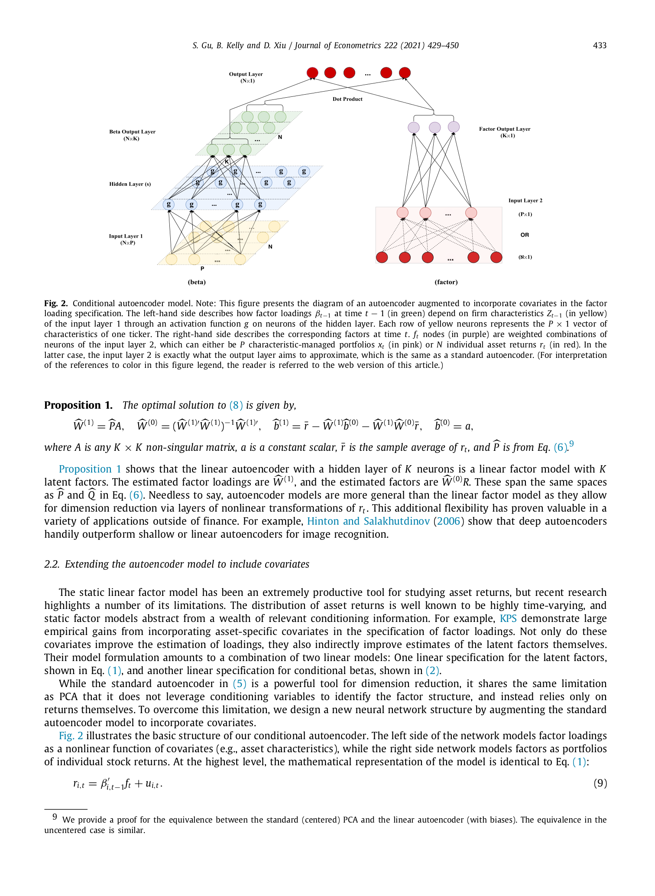

# 05b. Section 2.2 — Conditional Autoencoder (메인 모델)

> **🧒 한 줄 요약**: Characteristics-conditional AE. CA1/CA2/CA3 variants. Conditioning power.


이 챕터가 본 논문의 **심장**. 두 개의 신경망 + dot product 로 구성된 conditional autoencoder.

---

## 5b.1 동기 — 표준 AE 의 한계

> **원문**: "While the standard autoencoder in (5) is a powerful tool for dimension reduction, it shares the same limitation as PCA that it does not leverage conditioning variables to identify the factor structure, and instead relies only on returns themselves."

**핵심 문제**:
- 표준 AE: 수익률 $r$ 만 입력. 자산 특성 $z$ 무시.
- KPS (IPCA): $z$ 활용 ✓, 하지만 선형 $\beta = z'\Gamma$.
- **본 논문**: $z$ 활용 + **비선형** 매핑.

해결 방향: **autoencoder 구조에 두 입력 경로 (returns + characteristics)** 를 두자.

---

## 5b.2 큰 구조 — 두 개의 분리된 신경망

본 논문이 제안하는 conditional autoencoder 는 다음 **두 신경망의 dot product**:

```
                     ┌─────────────────┐
                     │   Beta Network  │
   z_{i,t-1}  ─→     │  (NN of chars)  │ ─→   β_{i,t-1}   (N×K)
   (N×P)             └─────────────────┘                ↘
                                                          dot
                                                         product
                                                        ↗ r̂_{i,t} = β'_{i,t-1} f_t
                     ┌─────────────────┐
                     │  Factor Network │
   r_t       ─→      │   (Autoencoder  │ ─→     f_t      (K×1)
   (N×1)             │   of returns)   │
                     └─────────────────┘
```

**핵심 통찰**:
- **좌측 (Beta network)**: 자산 특성 $z$ → 노출도 $\beta$ 의 비선형 매핑
- **우측 (Factor network)**: 자산 수익률 $r$ → 잠재요인 $f$ 의 autoencoder
- **결합**: $r \approx \beta' f$ (요인 모델 형태 유지)

**No-arbitrage 보존**: 절편 $\alpha$ 없음. $r$ 가 오직 $\beta' f$ 로만 설명.

---

## 5b.3 모델의 최상위 식

Section 2.2 의 시작 (Eq. 9):

$$
r_{i,t} = \beta_{i,t-1}' f_t + u_{i,t} \quad \text{(Eq. 9)}
$$

**기호 뜻**: KPS Eq. 1 과 정확히 **같은 형태**. 차이는 $\beta$ 와 $f$ 가 어떻게 정의되는지에 있음.
- $\beta_{i,t-1}$: 자산 $i$ 의 시점 $t-1$ 특성 $z_{i,t-1}$ 에서 **신경망으로** 산출되는 노출도
- $f_t$: 시점 $t$ 수익률 $r_t$ 에서 **신경망으로** 산출되는 요인

→ KPS framework 유지하면서 매핑만 신경망으로.

---

## 5b.4 Fig. 2 — Conditional Autoencoder 도식



*journal p.433 Fig. 2 발췌 — 본 논문의 핵심 그림. 좌측 (beta network) + 우측 (factor network) + 가운데 dot product 결합.*

**해석**:

### 좌측 (Beta network, $N \times K$ 노출도)
- **입력**: $Z_{t-1}$ ($N \times P$, 노란색) — 모든 자산의 특성
- **Hidden layer(s)**: 녹색 — 비선형 변환 (ReLU)
- **출력**: $\beta_{t-1}$ ($N \times K$, 녹색) — 모든 자산의 노출도

### 우측 (Factor network, $K \times 1$ 요인)
- **입력 두 가지** (둘 중 선택):
  - **(P×1)**: $x_t$ — 특성-management 포트폴리오 (분홍, 작은 차원)
  - **(N×1)**: $r_t$ — 개별 자산 수익률 (빨강, 큰 차원)
- **Hidden layer(s)**: 파란 — autoencoder bottleneck
- **출력**: $f_t$ ($K \times 1$, 보라) — 잠재요인

### 가운데 (Dot product)
- $r_{i,t} = \beta_{i,t-1}' f_t + u_{i,t}$ — 두 출력의 dot product

---

## 5b.5 Beta network 의 수학 (Eq. 10–12)

> **원문**: "The first key difference between our model and IPCA is in the formulation of conditional betas. We specify the $K \times 1$ vector $\beta_{i,t-1}$ as a neural network model of lagged firm characteristics, $z_{i,t-1}$."

$$
z_{i,t-1}^{(0)} = z_{i,t-1} \quad \text{(Eq. 10)}
$$

$$
z_{i,t-1}^{(l)} = g\left(b^{(l-1)} + W^{(l-1)} z_{i,t-1}^{(l-1)}\right), \quad l = 1, \ldots, L_\beta \quad \text{(Eq. 11)}
$$

$$
\beta_{i,t-1} = b^{(L_\beta)} + W^{(L_\beta)} z_{i,t-1}^{(L_\beta)} \quad \text{(Eq. 12)}
$$

**기호 뜻**:
- $z_{i,t-1}^{(l)}$ — beta network 의 layer $l$ 에서 자산 $i$ 의 표현 (시점 $t-1$ 특성)
- $L_\beta$ — beta network 의 hidden layer 수 (예: CA1 → 1, CA2 → 2, CA3 → 3)
- $W^{(l-1)}, b^{(l-1)}$ — 각 layer 의 weight + bias
- $g(\cdot)$ — ReLU (max(y, 0))
- 마지막 layer (Eq. 12) 는 **linear** (no activation) — 노출도가 음수 가능하므로

**일상 비유**: 학생 특성 (학습 시간·성격·과외 여부 등) 을 여러 단계의 "필터" 로 통과시키면서 점점 "약점" 표현으로 변환.
- Layer 1: "학습 패턴" 추출
- Layer 2: "학습 패턴 × 시험 유형" 상호작용
- Layer L: 최종 "과목별 약점"

**왜 이 형태**:
- 다층 + 비선형 ReLU → 특성 간 상호작용·threshold 효과·saturation 다 표현
- 마지막 layer linear → 노출도의 부호·크기에 제약 없음
- 자산별 $i$ 가 같은 가중치 공유 (모든 자산이 같은 NN 사용) → 자산 간 정보 공유 + 부족한 데이터 보강

**조심할 점**:
- 한 자산만 보는 게 아니라 **모든 자산** 의 같은 시점 특성 동시에 입력 → 자산 간 비교가 노출도에 반영
- $L_\beta = 0$ (no hidden layer, linear) → IPCA 와 동치 (Eq. 2)
- $L_\beta \ge 1$ → 비선형 → 본 논문의 진짜 차별점

---

## 5b.6 Factor network 의 수학 (Eq. 13–15)

> **원문**: "On the right side of Fig. 2, we see an otherwise standard autoencoder for the factor specification."

$$
r_t^{(0)} = r_t \quad \text{(Eq. 13)}
$$

$$
r_t^{(l)} = \tilde g\left(\tilde b^{(l-1)} + \tilde W^{(l-1)} r_t^{(l-1)}\right), \quad l = 1, \ldots, L_f \quad \text{(Eq. 14)}
$$

$$
f_t = \tilde b^{(L_f)} + \tilde W^{(L_f)} r_t^{(L_f)} \quad \text{(Eq. 15)}
$$

**기호 뜻**:
- $r_t^{(l)}$ — factor network 의 layer $l$ 출력
- $L_f$ — factor network 의 hidden layer 수
- $\tilde W, \tilde b$ — factor network 의 weight + bias (beta network 와 별도)
- $\tilde g$ — activation (본 논문은 $L_f = 1$ 가정 → linear)
- $f_t$ — $K \times 1$ 요인 (시점 $t$)

**중요한 단순화**:
> **원문**: "Throughout our empirical analysis, we assume a single linear layer on the factor network, that is, $L_f = 1$, in that this structure maintains the economic interpretation of factors: they are themselves portfolios (linear combination of underlying asset returns)."

→ Factor network 는 **선형 1 layer**. 즉 $f_t = \tilde b + \tilde W r_t$. 비선형 안 함.

**왜 factor network 는 선형?**:
- 요인 = 자산 수익률의 **선형결합** (portfolio) 이 자산가격이론 의 정의
- 비선형 매핑은 "이 자산을 0.3, 저 자산을 0.5 가중평균" 같은 portfolio 해석 어렵게 함
- **경제적 해석성** 유지 위해 선형 강제

---

## 5b.7 결합 — Dot Product Layer

> **원문**: "At last, the 'dotted operation' multiplies the $N \times K$ matrix output from the beta network with the $K \times 1$ output from the factor network to produce the final model fit for each individual asset return."

$$
\hat r_{i,t} = \beta_{i,t-1}' f_t \quad \text{(자산 i 시점 t 모델 fit)}
$$

또는 모든 자산 모음:
$$
\hat r_t = \beta_{t-1} f_t \quad (N \times 1)
$$

**일상 비유**: 학생 약점 (beta) × 시험 난이도 (factor) → 점수 변동 (return).

**손실 함수**:
$$
\mathcal{L} = \frac{1}{NT} \sum_{i, t} \| r_{i,t} - \beta_{i,t-1}' f_t \|^2 + \phi(\theta; \lambda) \quad \text{(Eq. 19, 정규화 포함)}
$$

→ 두 네트워크의 모든 weights ($W^{(l)}, b^{(l)}, \tilde W^{(l)}, \tilde b^{(l)}$) 가 함께 학습됨.

---

## 5b.8 Factor network 의 두 가지 입력 옵션

본 논문은 factor network 의 입력으로 두 가지 선택:

### (a) Individual returns $r_t$ (Fig. 2 빨강)
- $r_t \in \mathbb{R}^{N \times 1}$, $N \approx 30,000$
- 직관적이지만 계산 무겁고 panel 불균형 (매월 다른 stocks 활성)

### (b) Managed portfolios $x_t$ (Fig. 2 분홍)
- $x_t \in \mathbb{R}^{P \times 1}$, $P = 94$ (특성 수)
- $x_t = (Z_{t-1}' Z_{t-1})^{-1} Z_{t-1}' r_t$ ← Eq. 16
- 본 논문 실증에서 **(b) 선택** (계산 효율)

---

## 5b.9 Eq. 16 — Managed Portfolio Inputs

> **원문**: "In practice, using the full cross section of individual stock returns in the factor network faces two daunting obstacles. The first is that the number of individual firms in our sample is roughly 30,000, which means that the number of weight parameters in the factor network can be astronomical."

**해결**: 개별 수익률 대신 **characteristic-managed portfolios** 사용.

$$
x_t = (Z_{t-1}' Z_{t-1})^{-1} Z_{t-1}' r_t \quad \text{(Eq. 16)}
$$

**기호 뜻**:
- $Z_{t-1}$: $N \times P$ 자산 특성 행렬
- $r_t$: $N \times 1$ 수익률 벡터
- $x_t$: $P \times 1$ 포트폴리오 수익률 — $j$번째 원소는 "특성 $j$ 기준 long-short portfolio"

**일상 비유**:
- 30,000 학생 점수 → 평균 산출은 매월 다른 학생 군
- 대신 "수학 성적별 그룹화 → 그룹 평균 점수" 산출 → P=94 개 그룹의 안정된 평균

**왜 이 형태**:
1. **차원 축소**: $N=30,000 \to P=94$. weight 수가 30,000 → 94 로 줄어듦.
2. **불균형 해결**: 매월 다른 자산 → managed portfolio 는 항상 P=94.
3. **선례**: KPS, Feng·He·Polson·Xu (2019), Kozak·Nagel·Santosh (2017), Giglio·Xiu (2018) 모두 이 트릭 사용.

**조심할 점**:
- $x_t$ 사용 시 conditional autoencoder 는 사실상 IPCA family 의 부분집합
- 단 beta network 의 비선형성은 그대로 유지

---

## 5b.10 모델 변형 — CA0 ~ CA3

논문에서 비교하는 4가지 conditional autoencoder 변형:

| 모델 | $L_\beta$ (beta NN 깊이) | Beta network 뉴런 수 | Factor network |
|------|------|------|------|
| **CA0** | 0 | (linear, no hidden) | linear, $L_f = 1$ |
| **CA1** | 1 | 32 | linear, $L_f = 1$ |
| **CA2** | 2 | 32, 16 | linear, $L_f = 1$ |
| **CA3** | 3 | 32, 16, 8 | linear, $L_f = 1$ |

**CA0** = linear beta + linear factor → **사실상 IPCA** (proposition 2)

**CA1~CA3** = 깊이 다른 비선형 → 본 논문의 진짜 모델

→ 깊이 1 (CA1) 이 보통 가장 좋음. 깊이 늘려도 큰 개선 X (overfitting).

---

## 5b.11 자기점검 (이 챕터)

### 핵심 3가지
1. **Conditional autoencoder 가 두 신경망 + dot product 인 이유는?**
2. **Beta network 와 Factor network 의 차이는?**
3. **Eq. 16 의 managed portfolio 트릭이 해결하는 두 문제는?**

### 답변
1. (i) 노출도 $\beta$ 는 자산 특성 $z$ 의 비선형 함수여야 하니 별도 NN. (ii) 요인 $f$ 는 자산 수익률 $r$ 의 portfolio 라는 경제적 해석 유지 위해 별도 (단순 선형) NN. (iii) dot product 결합으로 $r = \beta'f + u$ 형태 유지 → no-arbitrage 보존.
2. **Beta network**: 입력 $z$ ($N \times P$), 다층 + 비선형 ReLU, 출력 $\beta$ ($N \times K$). **Factor network**: 입력 $r$ 또는 $x$ ($N$ 또는 $P$ 차원), 단일 linear layer ($L_f=1$), 출력 $f$ ($K \times 1$). factor 는 portfolio 해석을 위해 선형 강제.
3. (a) **자산 수**: 30,000 stocks → 94 특성 → weight 수 폭발 방지. (b) **불균형 panel**: 매월 다른 stocks 활성 → managed portfolio 는 항상 P 개 안정.

다음 [05_method_c_IPCA_special.md](05_method_c_IPCA_special.md) — IPCA 가 본 모델의 특수 케이스.


```viz:gu-ca-architecture:title=paper §3 — CA Architecture,caption=Model selector.
```
