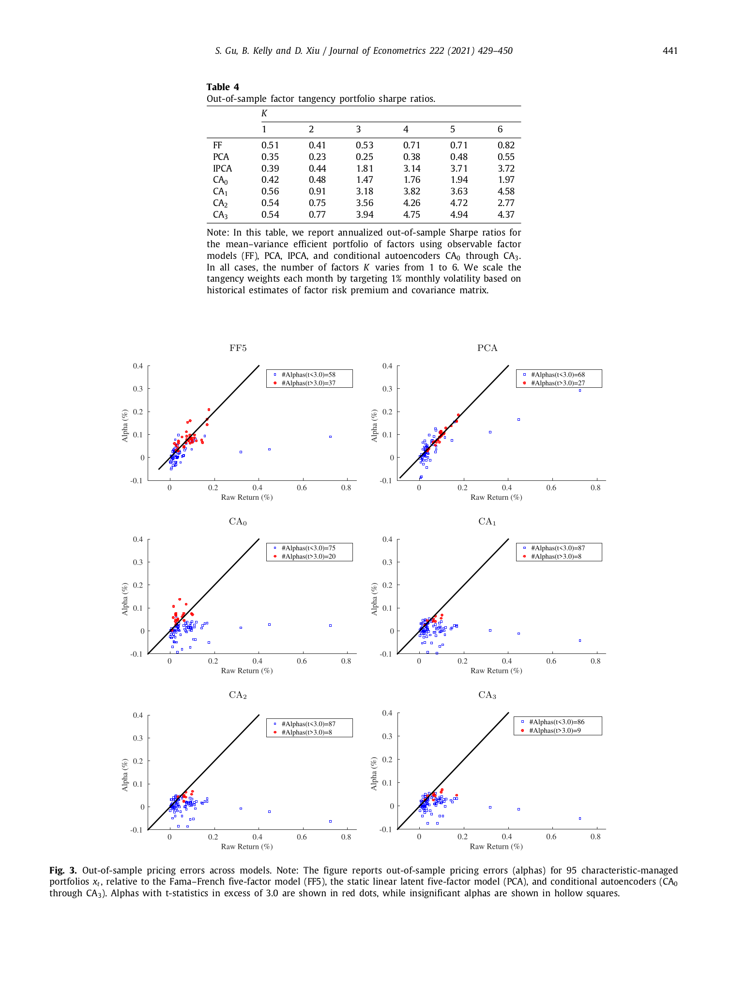

# 07. 실증 (Part B) — R², Sharpe, Pricing Errors

> Section 3.3–3.5 (journal p.437–442) — Tables 1, 2, 3, 4 + Figure 3.

## 7.1 챕터 한 줄 요약

OOS 30년 (1987–2016) 에서:
- **Total R²**: IPCA(K=6) 14.5%, CA1(K=6) 14.3%, CA3(K=6) 13.8% — IPCA 가 약간 우위, CA 들이 근접.
- **Predictive R²**: IPCA(K=6) 0.30%, CA2(K=6) 0.58%, CA3(K=6) 0.57% — CA 가 약 2x.
- **Sharpe (VW long-short K=6)**: FF -0.53, IPCA 0.96, CA2 1.53, CA3 1.51, CA1 1.40 — CA 압도.
- **α |t|>3 개수 (95 managed portfolios)**: FF5 37 → CA2 8.

**핵심 통찰**: IPCA 가 Total R² 에서 약간 우위지만, **Predictive R² 와 Sharpe** 에서는 conditional autoencoder 가 압도. 자산가격결정의 본질 (expected return) 에서 비선형성이 결정적.

---

## 7.2 평가 지표 — Eq. (20), (21)

논문이 KPS 따라 두 가지 R² 정의:

### Total R² (Eq. 20)
$$
R^2_{\text{tot}} = 1 - \frac{\sum_{(i,t)\in OOS}(r_{i,t} - \hat\beta'_{i,t-1}\hat f_t)^2}{\sum_{(i,t)\in OOS} r_{i,t}^2}
$$

→ 모델이 **실현 수익률** 의 횡단면·시계열 변동을 얼마나 설명? **Riskiness** 측정.

### Predictive R² (Eq. 21)
$$
R^2_{\text{pred}} = 1 - \frac{\sum_{(i,t)\in OOS}(r_{i,t} - \hat\beta'_{i,t-1} \hat\lambda_{t-1})^2}{\sum_{(i,t)\in OOS} r_{i,t}^2}
$$

여기서 $\hat\lambda_{t-1}$ = 시점 $t-1$ 까지 추정된 $\hat f$ 의 prevailing sample average.

→ 모델이 **기대 수익률 (위험프리미엄)** 을 얼마나 예측? **Risk compensation** 측정. 자산가격결정의 본질.

**핵심 차이**:
- Total: 같은 시점의 실현 $f_t$ 와 곱 (contemporaneous fit).
- Predictive: 과거 평균 $\bar f$ 와 곱 (forward-looking 예측). 더 어려움.

---

## 7.3 Table 1 — Total R² (개별 주식 $r_t$)

paper Table 1 (정확한 paper 수치):

| Model | K=1 | K=2 | K=3 | K=4 | K=5 | K=6 |
|-------|-----|-----|-----|-----|-----|-----|
| FF | 4.8 | 4.6 | 3.4 | 0.1 | −2.3 | **−6.1** |
| PCA | 7.3 | 3.3 | 5.0 | 5.3 | 4.2 | 3.9 |
| IPCA | 11.2 | 12.4 | 13.3 | 13.7 | 14.3 | **14.5** |
| CA0 | 10.9 | 11.8 | 12.3 | 12.2 | 12.5 | 12.4 |
| CA1 | 10.4 | 11.5 | 12.2 | 12.9 | 13.4 | 14.3 |
| CA2 | 10.7 | 11.8 | 12.6 | 13.2 | 13.6 | 13.8 |
| CA3 | 10.7 | 11.8 | 12.5 | 13.3 | 13.7 | 13.8 |

**관찰**:
- **FF 가 K 증가에 따라 악화** — K=1 (market) 이 4.8% 인데 K=6 (FF5+UMD) 는 −6.1%. 시간 불변 β 의 한계가 패널이 커질수록 드러남.
- **IPCA 가 모든 K 에서 1위** Total R². K=6 에서 14.5%.
- CA1 이 IPCA 에 가장 근접 (K=6: 14.3 vs 14.5).
- **CA0 ≈ IPCA**: K=6 IPCA 14.5 vs CA0 12.4 — 약간 갭이 있지만 함수형상 같다 (Proposition 2). 갭은 $Z'Z$ 가 완전히 상수가 아닌 점 + 학습 알고리즘 차이.
- PCA 가 IPCA 보다 훨씬 낮음 — covariates 활용의 효과 입증.

paper 본문 인용 (p.12, 580–583):
> "The best overall model in terms of explained out-of-sample return variation is IPCA with six-factors, which delivers a 14.5% total R². It is closely followed by the conditional autoencoder with one hidden beta layer of 32 neurons (CA1) and six factors, which achieves an out-of-sample R² of 14.3%."

### 관리 포트폴리오 ($x_t$) 의 Total R²

Table 1 은 개별 주식 $r_t$ 외에 managed portfolio $x_t$ 의 Total R² 도 보고. 개별 주식의 idiosyncratic risk 가 평균되어 사라지므로 **R² 가 훨씬 높음**:

| Model | x_t K=6 | (단위: %) |
|-------|---------|-----------|
| FF | 72.2 |  |
| PCA | 34.8 |  |
| IPCA | **96.7** |  |
| CA0 | 85.9 |  |
| CA1 | 92.2 |  |
| CA2 | 89.3 |  |
| CA3 | 89.0 |  |

→ 관리 포트폴리오 수준에서 IPCA 가 96.7% 의 R² — conditional 모델의 매우 강력한 fit.

paper footnote 15 의 해석: "dynamically reweighting portfolios to maintain roughly constant characteristic values reduces time variation in portfolio betas and thus gives static factor models (including PCA) a better chance to fit the data." → x_t level 에서는 FF·PCA 같은 시간 불변 모델도 비교적 잘 fit (개별 주식 r_t 보다는).

---

## 7.4 Table 2 — Predictive R² (개별 주식 $r_t$)

paper Table 2:

| Model | K=1 | K=2 | K=3 | K=4 | K=5 | K=6 |
|-------|-----|-----|-----|-----|-----|-----|
| FF | 0.08 | 0.08 | <0 | <0 | <0 | <0 |
| PCA | <0 | <0 | <0 | <0 | <0 | <0 |
| IPCA | 0.10 | 0.10 | 0.23 | 0.31 | 0.31 | **0.30** |
| CA0 | 0.11 | 0.11 | 0.23 | 0.25 | 0.27 | 0.27 |
| CA1 | 0.13 | 0.17 | 0.45 | 0.52 | 0.56 | 0.53 |
| CA2 | 0.15 | 0.17 | 0.50 | 0.57 | 0.57 | **0.58** |
| CA3 | 0.14 | 0.17 | 0.52 | 0.55 | 0.54 | 0.57 |

**관찰**:
- **PCA 의 Predictive R² 가 모든 K 에서 < 0** — 평균 수익률 예측에 오히려 해로움.
  - 이유: PCA 는 **분산** 기반 (variance-maximizing) 으로 요인 추출. 평균 수익률 (mean) 과 정렬되지 않음. 첫 PC 는 시장 변동을 잡지만 평균 수익률 예측에는 잡음에 가까움.
- **FF 도 거의 0 ≤ Predictive R²** — 시간 불변 β 의 한계.
- **IPCA 가 0.30%** — covariates 활용으로 큰 도약.
- **CA1, CA2, CA3 가 K=6 에서 0.53, 0.58, 0.57**% — IPCA 대비 **약 1.8–1.9x 우위**.

paper 본문 (p.13, 639–644):
> "Whereas IPCA dominated in terms of total R², its predictive R² of 0.3% per month is nearly doubled by the predictive power of (deep) conditional autoencoders. CA1, CA2, and CA3 generate a predictive R² of 0.53%, 0.58%, and 0.57%, respectively."

→ **본 논문의 결정적 메시지**: Total R² 에서는 IPCA 와 CA 가 막상막하지만, **자산가격결정의 본질인 expected return 예측에서는 nonlinearity 가 결정적**.

```viz:autoencoder-r2-comparison:title=paper Tables 1, 2 — R² across K (interactive),caption=R² type 토글로 Total / Predictive 전환. 모델 toggle 로 비교 그룹 조절. Total R² 에서는 IPCA K=6 = 14.5% 1위, Predictive R² 에서는 CA2 K=6 = 0.58% 가 IPCA 0.30% 의 거의 2배.
```

---

## 7.5 Table 3 — Long-Short Decile Sharpe Ratios

매월 모델의 OOS 예측 수익률로 주식을 10개 decile 로 정렬 → 상위 (decile 10) 매수 + 하위 (decile 1) 매도. 연환산 Sharpe.

### Equal-Weighted

| Model | K=1 | K=2 | K=3 | K=4 | K=5 | K=6 |
|-------|-----|-----|-----|-----|-----|-----|
| FF | −0.66 | −0.85 | −0.40 | −0.30 | 0.36 | −0.21 |
| PCA | 0.28 | 0.09 | 0.13 | −0.08 | −0.12 | 0.15 |
| IPCA | 0.20 | 0.19 | 1.26 | 2.16 | 2.31 | 2.25 |
| CA0 | 0.23 | 0.32 | 1.34 | 1.87 | 2.10 | 2.18 |
| CA1 | 0.30 | 0.39 | 2.12 | 2.63 | 2.67 | 2.60 |
| CA2 | 0.30 | 0.38 | 2.16 | 2.64 | 2.68 | **2.63** |
| CA3 | 0.31 | 0.38 | 2.19 | 2.57 | 2.57 | 2.59 |

### Value-Weighted

| Model | K=1 | K=2 | K=3 | K=4 | K=5 | K=6 |
|-------|-----|-----|-----|-----|-----|-----|
| FF | −0.82 | −1.13 | −0.69 | −0.60 | 0.18 | **−0.53** |
| PCA | 0.12 | −0.18 | 0.05 | −0.10 | −0.30 | −0.08 |
| IPCA | −0.15 | −0.07 | 0.59 | 0.81 | 1.05 | **0.96** |
| CA0 | −0.11 | −0.03 | 0.41 | 0.81 | 0.83 | 0.88 |
| CA1 | −0.03 | 0.11 | 0.91 | 1.30 | 1.48 | 1.40 |
| CA2 | −0.03 | 0.08 | 0.92 | 1.39 | 1.45 | **1.53** |
| CA3 | −0.02 | 0.08 | 1.09 | 1.41 | 1.34 | 1.51 |

**관찰**:
- **CA2 K=6 EW Sharpe 2.63, VW 1.53** — 본 논문의 baseline 자랑 수치.
- **FF VW Sharpe 가 거의 모든 K 에서 음수** — FF 로 long-short 만들면 손실. 시장 평균 SR ≈ 0.5 대비 처참.
- **IPCA K=6 VW 0.96 → CA2 K=6 VW 1.53** — 약 60% 향상.
- **CA1, CA3 는 1.40, 1.51** — CA2 가 미세하게 가장 좋지만 CA1–CA3 가 거의 동일 그룹.

paper 본문 (p.14, 688–695):
> "The overall best performing portfolio is that based on the conditional autoencoder with two hidden beta layers, CA2. This model achieves a Sharpe ratio of 2.63 for the equal-weighted portfolio, and 1.53 with value weights. The performance of CA1 and CA3 is only slightly lower."

→ **운용 관점**: CA2 의 VW Sharpe 1.53 은 헤지펀드 업계 기준 "매우 우수" (SR > 1).

```viz:autoencoder-sharpe-table:title=paper Table 3 — Long-Short Decile Sharpe (interactive),caption=Portfolio 토글로 EW / VW 전환. K 슬라이더로 요인 수 조절. FF 는 K 가 커질수록 악화 (시간 불변 β 의 한계). CA2 K=6 VW = 1.53 이 best. 시장 평균 SR ≈ 0.5 와 비교.
```

---

## 7.6 Table 4 — Tangency Portfolio Sharpe (다른 지표!)

Table 4 는 **decile spread 아닌 mean-variance tangency portfolio** 의 Sharpe (장기 운용효율 측정).

| Model | K=1 | K=2 | K=3 | K=4 | K=5 | K=6 |
|-------|-----|-----|-----|-----|-----|-----|
| FF | 0.51 | 0.41 | 0.53 | 0.71 | 0.71 | 0.82 |
| PCA | 0.35 | 0.23 | 0.25 | 0.38 | 0.48 | 0.55 |
| IPCA | 0.39 | 0.44 | 1.81 | 3.14 | 3.71 | **3.72** |
| CA0 | 0.42 | 0.48 | 1.47 | 1.76 | 1.94 | 1.97 |
| CA1 | 0.56 | 0.91 | 3.18 | 3.82 | 3.63 | 4.58 |
| CA2 | 0.54 | 0.75 | 3.56 | 4.26 | **4.72** | 2.77 |
| CA3 | 0.54 | 0.77 | 3.94 | 4.75 | **4.94** | **4.37** |

**관찰**:
- **숫자 자체가 더 큼**: tangency portfolio 는 weights 가 1% 월별 vol 로 target — 거의 무제약 운용효율 측정.
- **CA3 K=5 가 4.94 로 최고**.
- **IPCA K=6 3.72 vs CA1 K=6 4.58 vs CA3 K=6 4.37** — CA 가 우위.

paper 본문 (p.15, 732–740):
> "All conditional factor specifications (IPCA and CA0 through CA3) produce high unconditional Sharpe ratio statistics, consistent with the findings of KPS. The most dominant overall model on this dimension is CA3 with five factors."

**주의**: Table 4 는 "거래비용·실제 운용 제약 없음" 가정. 실현 가능한 전략 SR 아닌 **이론적 mean-variance 효율** 지표.

---

## 7.7 Pricing Errors (Section 3.5, Fig. 3)

### 측정 대상: 95 Managed Portfolios

**중요** (paper footnote 16): "stock-level idiosyncratic risk is so large that stock-level alpha estimates tend to be extremely noisy." 따라서 본 논문은 **95 개 managed portfolios** $x_t$ 의 α 만 검정.

이 95 개는 94 chars 의 managed portfolio + 1 equal-weighted market portfolio.

### Eq. (불리) — Pricing Error 정의

$$
\alpha_i := \mathbb{E}[u_{i,t}] = \mathbb{E}[r_{i,t}] - \mathbb{E}[\beta'_{i,t-1} f_t]
$$

→ 모델이 설명 못 하는 평균 수익 = pricing error.

### Fig. 3 결과 (journal p.441):



*journal p.441 Fig. 3 — 95 managed portfolios 의 α scatter. 6 panel (FF5, PCA, CA0–CA3). 빨간 dots = |t(α)|>3.0 (유의 미스프라이싱), 빈 사각형 = insignificant. 각 panel 안에 유의 α 개수 표시.*

> "For the five-factor Fama–French model, 37 of the 95 managed portfolios have alpha t-statistics in excess of 3.0. For CA2, that number drops to 8 out of 95. Furthermore, those that remain significant are economically small (below 7 basis points per month) compared to alphas from the Fama–French model."

**결과 요약** (paper Fig. 3, K=5):

| Model | # \|t(α)\| > 3.0 (out of 95) | 잔존 유의 α 의 크기 |
|-------|-------------------------------|----------------------|
| FF5 | **37** | 큼 |
| PCA | (Fig 3 에 표시, 본 논문 본문에는 미발표) | 큼 |
| CA0 | (Fig 3 에 표시) | 작음 |
| CA1 | (Fig 3 에 표시) | 작음 |
| CA2 | **8** | < 7 bps/월 |
| CA3 | (Fig 3 에 표시) | 작음 |

**의미**:
- FF5: 95 개 portfolio 중 37 개가 통계적으로 유의한 mispricing → FF5 가 못 설명하는 "anomaly" 가 많음.
- CA2: 8 개만 유의 + 그것조차 economically small (< 7 basis points/월).
- → **CA 의 no-arbitrage 통과 강력 입증**.

**Bonferroni 보정**: 95 개 동시 검정 시 chance 로 |t|>3 이 0.13 × 95 ≈ 12.4 개 예상 ([±3σ] 외 영역의 양측 확률 ≈ 0.27%). CA2 의 8 은 chance 보다 적음.

---

## 7.8 Variance vs Pricing — 본 절의 핵심 통찰

paper 본문 (Section 3.5, 744–754) 의 메시지:

> "An important implication emerges from a comparison of Table 2 versus the return prediction analysis of Gu et al. (2019). In their paper, the best performing machine learning model forecasts monthly individual stock returns ... with an R² of 0.40%. Yet theirs are pure prediction models – there is no factor structure or risk-return tradeoff ... In contrast, the nonlinear factor models in this paper force all the characteristic-based predictability to come solely through factor risk exposures ... Despite this restriction, the conditional autoencoder model achieves nearly identical predictive power for monthly stock returns, 0.58% for the CA2 specification."

**의미**: 
- 일반 ML 예측 모델 (no asset pricing structure): R² = 0.40%
- CA2 (factor structure + no-arbitrage 강제): R² = 0.58%
- → **이론 제약을 부과한 CA 가 오히려 더 잘 예측**.

이게 본 논문의 가장 중요한 한 발견: **"특성이 수익을 예측하는 이유는 anomaly (이론 위반) 가 아니라 위험 보상 (이론 충족)"** — risk factor view 의 강력 지지.

---

## 7.9 K (요인 수) 의 효과

요인 수 K 를 늘리면 (1 → 6):

| 지표 | 추세 |
|------|------|
| **FF Total R²** | 점진적 악화 (4.8 → −6.1) — 시간 불변 β 가 K 증가에서 더 손해 |
| **IPCA Total R²** | 단조 증가 (11.2 → 14.5) |
| **CA1/2/3 Total R²** | 단조 증가, K=4–6 에서 수렴 |
| **CA Predictive R²** | K=3 부터 급격 증가, K=4–6 에서 수렴 |
| **CA VW Sharpe** | K=3 부터 1+ , K=4–6 수렴 |

**해석**: 본 데이터셋에서 **K=5–6 이 거의 충분**. K=1, 2 는 market 와 size 효과만 잡아 부족.

paper 의 권장 baseline: **K=6 또는 K=5** (Table 3 결과로 CA2 K=6 VW=1.53, CA3 K=5 tangency 4.94).

---

## 7.10 정리 — 4개 표의 메시지

```
┌─────────────────────────────────────────────────────┐
│ Total R² (K=6):                                     │
│   FF -6.1 « PCA 3.9 « CA0 12.4 ≈ CA3 13.8           │
│   ≈ CA2 13.8 ≈ CA1 14.3 ≲ IPCA 14.5                 │
│                                                     │
│ Predictive R² (K=6):                                │
│   FF/PCA < 0 « IPCA 0.30 ≈ CA0 0.27                 │
│   « CA1 0.53 ≈ CA3 0.57 ≲ CA2 0.58                  │
│                                                     │
│ VW Long-Short Sharpe (K=6):                         │
│   FF -0.53 « PCA -0.08 « IPCA 0.96                  │
│   ≈ CA0 0.88 « CA1 1.40 ≈ CA3 1.51 ≲ CA2 1.53       │
│                                                     │
│ Tangency Sharpe (K=5):                              │
│   FF 0.71 « PCA 0.48 « CA0 1.94                     │
│   ≈ IPCA 3.71 « CA1 3.63 ≈ CA2 4.72 ≲ CA3 4.94      │
│                                                     │
│ # |t(α)| > 3 (out of 95 managed portfolios):        │
│   FF5: 37  →  CA2: 8                                │
└─────────────────────────────────────────────────────┘

⇒ Variance (Total R²): IPCA 이 약간 우위
⇒ Pricing (Predictive R²): CA1-3 ≫ IPCA 압도
⇒ Trading (Sharpe): CA1-3 ≫ IPCA
⇒ No-arbitrage (α): CA 가 거의 통과
```

---

## 자기점검 (이 챕터)

### 핵심 3가지
1. PCA 의 Predictive R² 가 모든 K 에서 음수인 이유는?
2. Total R² 에서 IPCA 가 약간 우위지만 Predictive R² 와 Sharpe 에서는 CA 가 압도하는 이유는?
3. CA2 의 95 개 managed portfolio 중 8 개 |t(α)|>3 이 "no-arbitrage 통과" 의 강한 증거인 이유는?

### 답변
1. PCA 는 수익률의 **분산** 을 최대화하는 방향으로 요인을 추출 — 첫 PC 가 시장 변동 (high variance) 을 잡지만 이는 평균 수익률 (mean) 과 정렬되지 않음. 따라서 추정된 $\hat f$ 의 평균 $\bar f$ 로 expected return 을 예측하면 오히려 잡음을 더해 negative R².
2. **Variance ≠ Mean**. 선형 IPCA 는 평균을 분산 구조로 잘 잡아 Total R² 우수. 그러나 expected return (mean) 은 비선형 interaction (size × momentum 등) 에 의존하므로 **NN 의 universal approximation** 이 결정적. → CA1+ 가 Predictive R² 와 Sharpe (mean 기반 운용 성과) 에서 우위.
3. 95 개 동시 검정 시 chance 로 |t|>3 이 약 12.4 개 예상 (Bonferroni). 8 은 chance 보다 적음 — 모델이 거의 모든 mispricing 을 설명. 또 잔존 8개의 α 가 < 7 bps/월 로 **economically small** — 통계적으로도 경제적으로도 no-arbitrage 충족.
