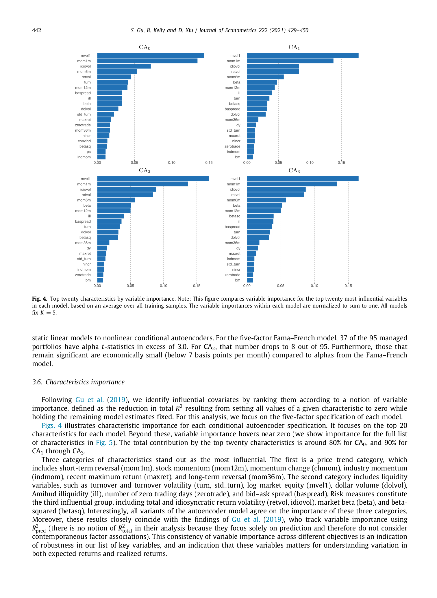
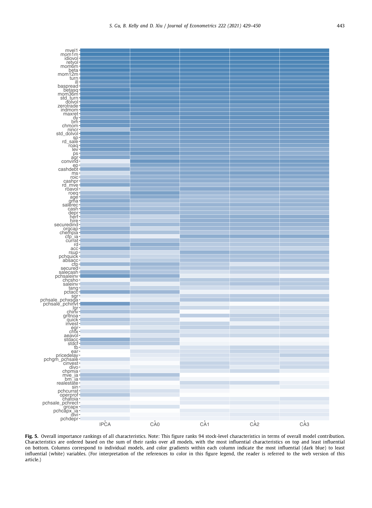
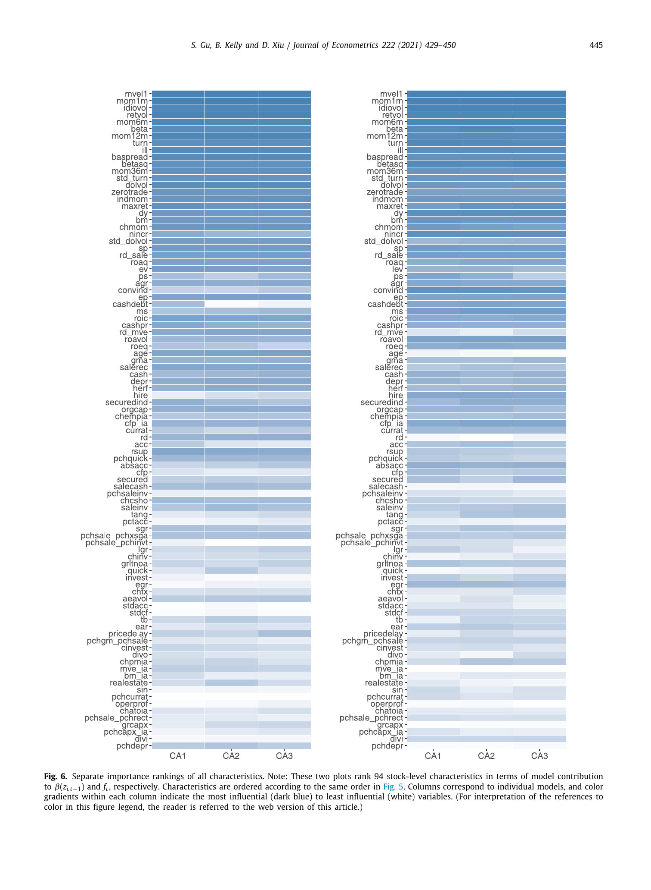

# 08. 실증 (Part C) — 어떤 특성이 중요한가? Robustness.

> **🧒 한 줄 요약**: 94 characteristics 의 *importance ranking*. Size, BM, momentum dominant.


> Section 3.6–3.7 (journal p.441–444) — Figures 4, 5, 6 + Table 5.

## 8.1 챕터 한 줄 요약

CA 모델이 학습한 가중치를 분석하면, **price trend** (mom1m, mom12m, chmom, indmom, maxret, mom36m), **liquidity** (turn, std_turn, mvel1, dolvol, ill, zerotrade, baspread), **risk** (retvol, idiovol, beta, betasq) — 세 카테고리가 가장 중요. **Top 20 특성이 모델 contribution 의 ~80% (CA0) ~ ~90% (CA1–CA3) 차지**. β 네트워크와 factor 네트워크의 변수 중요도 ranking 이 거의 일치 (Fig. 6). Robustness check: 주식을 odd/even permno 로 분할해도 CA2 의 성능 거의 동일 (Table 5).

---

## 8.2 변수 중요도 측정법 (journal p.441, Section 3.6)

paper 본문 (815–817):
> "We identify influential covariates by ranking them according to a notion of variable importance, defined as the **reduction in total R² resulting from setting all values of a given characteristic to zero** while holding the remaining model estimates fixed. For this analysis, we focus on the five-factor specification of each model."

**측정법**:
1. 학습 끝난 CA 모델 고정.
2. 한 특성 $z^{(j)}$ 의 모든 값을 0 으로 설정 (즉 그 특성 "제거").
3. OOS Total R² 다시 계산.
4. **원래 R² − 변경된 R² = 변수 j 의 importance**.

**왜 이 방법**:
- 단순 partial derivative ($\partial \hat r / \partial z$) 가 아닌 **counterfactual**: "이 특성을 가졌다고 모델에 알려주지 않으면 얼마나 손해?"
- NN 의 비선형 효과를 직접 포착 (gradient 는 한 지점에서의 기울기만).
- **K=5 fixed** for fair comparison across CA0–CA3.

---

## 8.3 Figure 4 — Top 20 특성 (CA0–CA3 별)



*journal p.442 Fig. 4 — 4 panel (CA0, CA1, CA2, CA3). 각 panel 의 top 20 특성을 importance 막대로 표시. 모든 모델에서 같은 카테고리 (price trend, liquidity, risk) 가 top.*

paper 본문 (journal p.441):
> "Figs. 4 illustrates characteristic importance for each conditional autoencoder specification. It focuses on the top 20 characteristics for each model. Beyond these, variable importance hovers near zero ... The total contribution by the top twenty characteristics is around **80% for CA0, and 90% for CA1 through CA3**."

→ **Sparsity 의 강력한 실증 증거**: 94 개 중 20 개로 거의 모든 explanatory power.

### Top 카테고리 (journal p.441)

paper 가 명시한 **3 카테고리**:

**(A) Price Trend (가격 추세)**:
| 변수 | 의미 |
|------|------|
| **mom1m** | 1-month reversal (단기 역전) |
| **mom12m** | 12-month momentum (12개월 모멘텀) |
| **chmom** | momentum change (모멘텀 변화) |
| **indmom** | industry momentum (산업 모멘텀) |
| **maxret** | recent maximum return (최대 일별 수익) |
| **mom36m** | long-term reversal (장기 역전, 3년) |

**(B) Liquidity (유동성)**:
| 변수 | 의미 |
|------|------|
| **turn** | turnover (회전율) |
| **std_turn** | turnover volatility |
| **mvel1** | log market equity (시가총액 로그) |
| **dolvol** | dollar volume |
| **ill** | Amihud illiquidity |
| **zerotrade** | number of zero trading days |
| **baspread** | bid-ask spread |

**(C) Risk (위험 측정)**:
| 변수 | 의미 |
|------|------|
| **retvol** | total return volatility |
| **idiovol** | idiosyncratic volatility (CAPM 잔차 stddev) |
| **beta** | CAPM beta |
| **betasq** | beta-squared |

paper 본문 (827–828):
> "Interestingly, all variants of the autoencoder model agree on the importance of these three categories."

→ **CA0, CA1, CA2, CA3 모두 같은 카테고리를 top 으로 선정**. ML 모델의 일관성.

paper 본문 (828–833):
> "Moreover, these results closely coincide with the findings of Gu et al. (2019), who track variable importance using R²pred ... This consistency of variable importance across different objectives is an indication of robustness in our list of key variables."

→ Gu, Kelly, Xiu (2019, RFS) supervised ML 예측 모델의 top 변수와도 일치 → **변수 ranking 의 robustness**.

### 정확한 순위 (1, 2, 3, ...)

**주의**: paper 의 Fig. 4 는 **막대그래프** 만 제공. 본문에 명시적 numerical ranking 없음. 카테고리 단위에서만 "이 변수들이 top 20" 으로 묶음.

→ "1위 = mvel1, 2위 = mom1m, ..." 같은 specific ordering 은 paper 에서 확인 불가. **Fig. 4 막대 그래프 시각 확인** 만 가능.

---

## 8.4 Figure 5 — 94 특성 전체 Ranking Heatmap



*journal p.443 Fig. 5 — 94 특성을 모든 모델 합산 ranking 내림차순. 5 column (IPCA, CA0–CA3). 진한 파랑 = 매우 중요, 흰색 = 거의 무관.*

journal p.443, Fig. 5 note:
> "This figure ranks 94 stock-level characteristics in terms of overall model contribution. Characteristics are ordered based on the sum of their ranks over all models, with the most influential characteristics on top and least influential on bottom. Columns correspond to individual models, and color gradients within each column indicate the most influential (dark blue) to least influential (white) variables."

**시각화 구조**:
- 행: 94 특성 (위에서 아래로 모든 모델 합산 ranking 내림차순).
- 열: 각 모델 (IPCA, CA0, CA1, CA2, CA3).
- 색: 진한 파랑 = 그 모델에서 매우 중요, 흰색 = 거의 무관.

**관찰**:
- 위쪽 (top 20) 이 거의 모든 모델에서 진한 파랑 — 모델 간 합의.
- 아래쪽 (rank 50+) 은 흰색 일색 — 거의 모든 모델에서 무시.
- **→ 94 특성의 자연스러운 dichotomy**: ~20 importan + ~74 거의 noise.

---

## 8.5 Figure 6 — β 네트워크 vs Factor 네트워크 분리



*journal p.445 Fig. 6 — 좌측 panel: β-network 만의 importance. 우측 panel: factor-network 만의 importance. 둘 다 같은 순서로 정렬된 94 특성 × CA1/CA2/CA3 컬럼. 두 panel 의 진한 파랑 패턴이 거의 일치 → 두 네트워크가 같은 특성 사용.*

paper 본문 (journal p.444):
> "We further look into the importance of characteristics for the beta and factor networks separately, in Fig. 6. To calculate the characteristics importance for the beta (resp. factor) network, we again set all values of a given characteristic in the beta (resp. factor) network to zero, without altering the values of this characteristic in the factor (resp. beta) network, and then measure the reduction in total R². Interestingly, the **relative importance of characteristics is consistent for the two networks**."

→ β 네트워크 (특성 → 노출도) 와 factor 네트워크 (managed portfolio 의 가중치 학습) 모두 **거의 같은 특성** 을 중요하게 봄. 모델 내부의 일관성.

**왜 중요**: 두 네트워크가 독립적으로 학습되었지만 같은 특성을 중요하게 선정 → 변수 중요도가 모델 우연 (random initialization 등) 이 아닌 **데이터의 진짜 구조 반영**.

---

## 8.6 Table 5 — Odd / Even Permno 분할 Robustness (journal p.444, Section 3.7)

paper 본문 (881–885):
> "We re-train the CA2 model using subsamples of stocks comprised of odd or even permnos, respectively. We report the out-of-sample total R² (%), predictive R² (%), equal-weight and value-weight Sharpe ratios for the subsamples in Table 5."

**테스트 구조**:
- 약 30,000 개 주식을 permno (CRSP 고유 ID) 의 홀짝으로 분할 → 14,984 odd + 14,908 even.
- 각 부분집합으로 **별도 학습** + 다른 부분집합에서 평가 (또는 같은).
- **CA2 K=5 만 검정** (paper Table 5 note: "All estimates are based on the five-factor CA2 model").

### paper Table 5 (정확한 paper 수치)

| Testing sample | Training sample | Total R² (%) | Pred R² (%) | EW SR | VW SR |
|----------------|-----------------|--------------|-------------|-------|-------|
| Odd | Odd | 13.7 | 0.48 | 2.42 | 1.28 |
| Odd | Even | 13.6 | 0.49 | 2.38 | 1.26 |
| Even | Odd | 13.6 | 0.52 | 2.52 | 1.29 |
| Even | Even | 13.5 | 0.54 | 2.53 | 1.19 |

**관찰**:
- **모든 셀이 거의 동일 값**: Total R² 13.5–13.7, Pred R² 0.48–0.54, EW SR 2.38–2.53, VW SR 1.19–1.29.
- 학습 sample 과 평가 sample 이 **완전히 분리** 되어도 (예: Odd 로 학습 → Even 으로 평가) 성능 거의 변동 없음.

paper 본문 (884–885):
> "Throughout, the CA2 model performs almost equally well, **even when the assets used in the training and testing samples are completely non-overlapped**."

**의미**: CA2 가 **자산 특이적 (asset-specific) 패턴** 이 아닌 **횡단면 보편 패턴** 을 학습 — 일반화 가능성의 강력한 증거.

---

## 8.7 함의 — Factor Zoo 와 Sparsity

본 절의 발견은 학계 위기를 직접 다룸:

### (1) "Factor Zoo" 비판에 대한 응답
- Cochrane (2011 AFA Address): "학계가 매년 새 factor 를 발견하지만 대부분 중복/우연".
- 본 논문 발견: **94 특성 중 20개로 ~90% explanatory power**. → 나머지 ~74개는 거의 noise 또는 중복.
- → ML 모델이 **데이터 주도적으로 진짜 factor 선별**.

### (2) Sparsity 의 실증 증거
- LASSO 가 통계학적으로 가정하는 sparsity 가 **데이터 자체에서 발현**.
- → 학계가 향후 새 factor 발견보다 **기존 factor 의 통합/정리** 에 집중해야.

### (3) Cross-Model Consistency
- CA0, CA1, CA2, CA3 모두 같은 top 카테고리 선정.
- Gu, Kelly, Xiu (2019) supervised ML 의 top 변수와도 일치.
- → 변수 importance 의 **objective-invariant robustness**.

---

## 8.8 비선형 효과 — 추정 (paper 본문 미세부)

**주의**: 본 논문은 변수 importance 만 보고. **partial dependence plot** 이나 **size × momentum interaction heatmap** 은 paper Figure 에 명시되지 않음 (Online Appendix 가 있을 수 있으나 본 PDF 22쪽 본문엔 미포함).

→ CA 가 어떤 함수형 (비선형 함수의 모양) 으로 매핑하는지의 직접 시각화는 본 논문 본문 범위 외. 후속 연구 또는 본 해체의 **인터랙티브 viz** 에서 재현할 항목.

paper 본문 (3.6 절 끝) 의 명시: 변수의 **상호작용 (interaction)** 효과는 정량적 시각화 미발표.

---

## 8.9 그림으로

```
[ 94 특성 → 모델 contribution ]

  Rank        Categories
  ─────       ──────────────────────────────────
  Top 20      Price trend:   mom1m, mom12m, chmom, indmom, maxret, mom36m
              Liquidity:     turn, std_turn, mvel1, dolvol, ill, zerotrade, baspread
              Risk:          retvol, idiovol, beta, betasq
              (+ 일부 valuation, profitability 변수)
                   │
                   │ Contribution: ~80% (CA0), ~90% (CA1-CA3)
                   │
  Rank 21-94  Near-zero contribution
                   │
                   │ Sparsity 의 실증 증거
                   │ → "Factor Zoo" 종말

[ β 네트워크 vs Factor 네트워크 (Fig. 6) ]
  같은 특성을 중요하게 선정 (cross-network consistency)

[ Odd/Even permno robustness (Table 5) ]
  완전 분리 학습/평가 → 성능 거의 동일
  → Cross-section generalizability
```

---

## 8.10 학계 기여

본 절의 학계적 의미:

### (1) Anomaly Replication Crisis
- 학계 발표 anomaly 의 절반 이상이 OOS replication 실패 (McLean & Pontiff 2016, Harvey et al. 2016).
- 본 논문: 94 anomaly 를 한 framework 에서 동시 검증 → **20 개만 robust**.

### (2) Methodology Standardization
- 변수 중요도 측정의 표준 방법 제시 (zero-out reduction in R²).
- 분리 네트워크 importance (Fig 6) 의 framework — β 와 factor 의 의미 분해.

### (3) Cross-Validation Standard
- Table 5 의 odd/even permno 분할 → 자산 universe 의 robustness test 표준 제공.
- Time-only OOS 외 cross-section split 도 적용 가능.

---

## 자기점검 (이 챕터)

### 핵심 3가지
1. 변수 중요도 측정 방법의 핵심은? (partial derivative 와의 차이)
2. Top 20 특성이 ~90% contribution 인 것의 의미는?
3. Table 5 의 odd/even permno 결과가 의미하는 것은?

### 답변
1. **Counterfactual**: 한 특성의 모든 값을 0 으로 두고 R² 감소량 측정. Partial derivative (한 지점의 기울기) 가 아닌 "그 특성이 없다고 생각하면 얼마나 못 푸나" 의 NN 비선형 효과 직접 포착. K=5 고정.
2. (a) **Sparsity 의 실증 증거** — 94 변수 중 대부분이 noise/중복. (b) Cochrane 의 "Factor Zoo" 비판에 대한 답 (학계가 새 factor 보다 정리 필요). (c) 모든 CA 모델 (CA0-CA3) 이 같은 top 변수 선정 → 모델 우연 아닌 데이터의 진짜 구조 반영.
3. **횡단면 generalizability**: 자산을 완전히 분리 (학습 = odd, 평가 = even) 해도 CA2 성능이 거의 변동 없음 (Total R² 13.5–13.7 등). → 학습된 비선형 매핑이 자산 특이 (asset-specific) 가 아닌 **데이터 전체의 보편 구조** 반영. 다른 자산군 (다른 시장, 채권 등) 으로의 확장 가능성 시사.


```viz:gu-char-importance:title=paper §6 — Char Importance,caption=Top-N slider.
```
