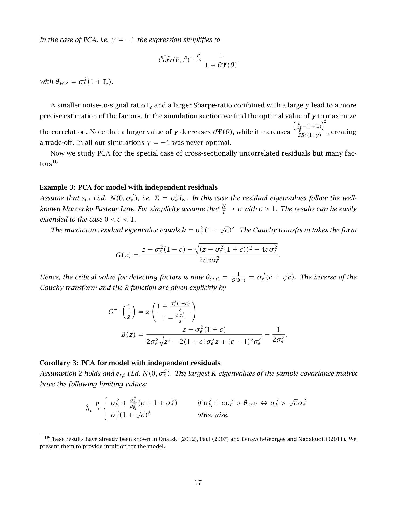
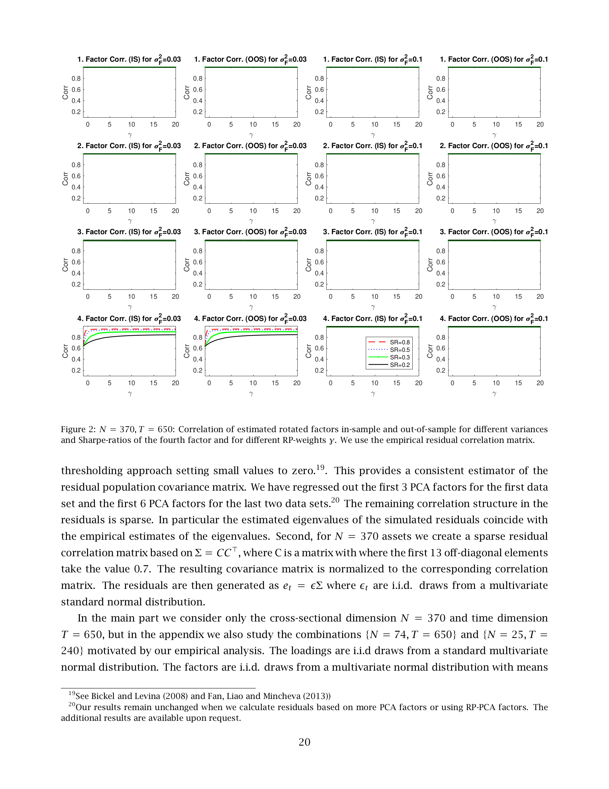
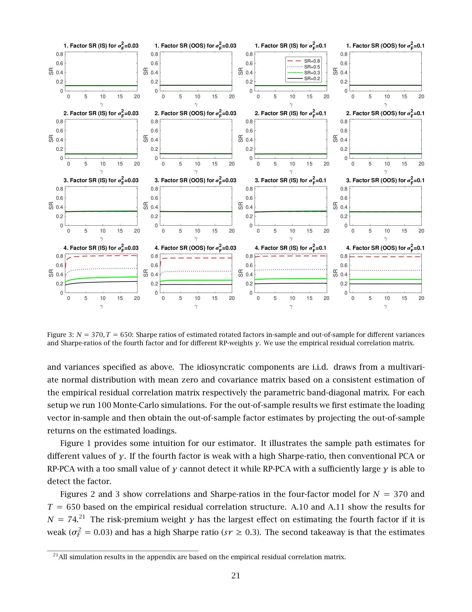

# 10. Section 6 (Simulation) — 시뮬레이션으로 이론 검증

> **🧒 한 줄 요약**: Monte Carlo simulation. Convergence + finite sample.


논문 18쪽 ~ 24쪽 (Section 6 전체)을 풀어본다.

이 섹션은 **가짜 데이터로 RP-PCA의 우수성을 보여주는** 파트.

---

## 10.1 시뮬레이션의 목적

> **원문**: "Next, we illustrate the performance of RP-PCA and its ability to detect weak factors with high Sharpe-ratios using a simulation exercise. We simulate factor models that try to replicate moments of the data that we are going to study in section 7."

**풀어 설명**:
- 목표: RP-PCA의 약한 요인 검출 능력을 시뮬레이션으로 보임.
- 시뮬은 Section 7의 실증 데이터의 모멘트를 모방.

> "The parameters of the factors and idiosyncratic components are based on our empirical estimates. We analyze the performance of RP-PCA for different values of $\gamma$, sample size and strength of the factors. Conventional PCA corresponds to $\gamma = -1$."

**풀어 설명**:
- 다양한 $\gamma$, 표본 크기, 요인 강도 변화.
- PCA = $\gamma = -1$ baseline.

---

## 10.2 시뮬레이션 디자인 — 4-요인 모델

### 정규화
> "In a factor model only the product $F\Lambda^\top$ is well-identified and the strength of the factors could be either modeled through the moments of the factors or the values of the loadings. Throughout this section we normalize the loadings to $\Lambda^\top\Lambda/N \xrightarrow{p} I_K$ and vary the moments of the factors."

**풀어 설명**: 식별 문제 때문에 로딩을 $I_K$ 로 정규화, 요인 모멘트로 강도 조절.

> "The factors are uncorrelated with each others and have different means and variances. The variance of the factor can be interpreted as the proportion of assets affected by this factor."

**풀어 설명**:
- 요인끼리 무상관.
- **요인의 분산** = "이 요인이 영향 미치는 자산 비율".

> "With this normalization a factor with a variance of $\sigma_F^2 = 0.5$ could be interpreted as affecting 50% of the assets with an average loading strength of 1."

**예시**: $\sigma_F^2 = 0.5$ = "50% 자산이 영향 받고, 평균 로딩 강도 1".

### 강한/약한 매핑
> "The theoretical results for the weak factor model are formulated under the normalization $\Lambda^\top\Lambda/N \xrightarrow{p} I_K$. The PCA signal in the weak factor framework corresponds to $\sigma_F^2 \cdot N$ under the normalization in the simulation."

**풀어 설명**: 약한 요인 이론의 정규화와 시뮬 정규화 간 매핑: $\sigma_F^2 N$ 이 PCA 신호 크기.

### 신호잡음비 설정
> "The strength of a factor has to be put into relationship with the noise level. Based on our theoretical results the signal to noise ratio $\frac{\sigma_F^2}{\sigma_e^2}$ with $\sigma_e^2 = \frac{1}{N}\sum_{i=1}^N \sigma_{e,i}^2$ determines the variance signal of a factor."

**풀어 설명**: 신호잡음비 = $\sigma_F^2 / \sigma_e^2$.

> "Our empirical results suggest a signal to noise ratio of around 5-7 for the first factor which is essentially a market factor. The remaining factors in the different data sets seem to have a variance signal between 0.04 and 0.8."

**풀어 설명**:
- 실증 데이터에서 1번째 (시장) 요인: 신호잡음비 5-7.
- 2번째 이후: 0.04~0.8 (훨씬 약함).

### 시뮬 모델 — 4-요인

> "Based on this insight we will model a four-factor model with variances $\Sigma_F = \text{diag}(5, 0.3, 0.1, \sigma_F^2)$. The variance of the fourth factor takes the values $\sigma_F^2 \in \{0.03, 0.1\}$. The first factor is a dominant market factor, while the second is also a strong factor. The third factor is weak, while the fourth factor varies from very weak to weak."

### 시뮬 디자인 표

| 요인 | $\sigma_F^2$ | 해석 |
|------|---------|------|
| 1 | 5 | 강한 시장 요인 |
| 2 | 0.3 | 강한 요인 |
| 3 | 0.1 | 약한 요인 |
| 4 | 0.03 또는 0.1 | 매우 약한 ~ 약한 요인 |

> "We normalize the factors to be uncorrelated with each other. The Sharpe-ratios are defined as $SR_F = (0.12, 0.1, 0.3, sr)$, where the Sharpe-ratio of the fourth factor varies between the following values $sr \in \{0.2, 0.3, 0.5, 0.8\}$. These parameter values are consistent with our data sets."

### 샤프 비율 표

| 요인 | $SR$ | 해석 |
|------|------|------|
| 1 | 0.12 | 평범한 SR (시장 SR과 비슷) |
| 2 | 0.1 | 평범한 SR |
| 3 | 0.3 | 좋은 SR |
| 4 | 0.2 ~ 0.8 | 가변 (시뮬 핵심 변수) |

**핵심**: 4번째 요인은 **약한 분산 + 가변 SR** — 이게 RP-PCA의 효과 측정 대상.

---

## 10.3 잔차 구조 설정

### 잡음 정규화
> "The properties of the estimation approach depend on the average idiosyncratic variance and dependency structure in the residuals. We normalize the average noise variance $\sigma_e^2 = 1$, which implies that the factor variances can be directly compared to the variance signals in the data."

**풀어 설명**: 평균 잡음 분산을 1로 정규화 → 요인 분산이 신호잡음비와 동일하게 해석 가능.

### 각주 17
> "For the empirical data sets with $N = 370$ assets the average noise variance is around $\sigma_e^2 = 2.5$. Instead of normalizing $\sigma_e^2 = 1$ we could also multiply $\Sigma_F$ by 2.5 and obtain the same factor model that is consistent with the data."

**풀어 설명**: 실증에선 $\sigma_e^2 \approx 2.5$. 시뮬에선 1로 정규화 (편의).

### 두 가지 잔차 구조
> "We use two different set of residual correlation matrices."

**두 가지 시도**:
1. **경험적 잔차 상관행렬**: 실제 실증 데이터에서 추출.
2. **Band-diagonal 희소 행렬**: 인공적 구조.

#### 첫 번째: 경험적 잔차
> "First, the correlation matrix of our simulated residuals is set to the empirical correlation that we observe in the data. In more detail, we have estimated the residual correlation matrix based on N = 25 size and value double-sorted portfolios, N = 74 extreme deciles sorted portfolios and N = 370 decile sorted portfolios as described in the empirical Section 7. In each case we have first regressed out the systematic factors and then estimated the residual covariance matrix with a hard thresholding approach setting small values to zero."

**풀어 설명**:
- 실증 데이터에서 시스템 요인 회귀로 제거.
- 잔차 공분산을 **hard thresholding** (= 작은 값 0으로) 으로 추정.
- 결과: sparse한 추정 잔차 상관.

#### 두 번째: Band-diagonal
> "Second, for $N = 370$ assets we create a sparse residual correlation matrix based on $\Sigma = CC^\top$, where C is a matrix with where the first 13 off-diagonal elements take the value 0.7. The resulting covariance matrix is normalized to the corresponding correlation matrix."

**풀어 설명**: 인공적 sparse 상관 구조. 처음 13개 비대각 = 0.7.

### 잔차 시뮬
> "The residuals are then generated as $e_t = \epsilon\Sigma$ where $\epsilon_t$ are i.i.d. draws from a multivariate standard normal distribution."

**풀어 설명**: 표준 정규 × $\Sigma$ 행렬로 종속 구조 입힘.

---

## 10.4 차원 설정

> "In the main part we consider only the cross-sectional dimension $N = 370$ and time dimension $T = 650$, but in the appendix we also study the combinations $\{N = 74, T = 650\}$ and $\{N = 25, T = 240\}$ motivated by our empirical analysis."

**주요 시뮬 셋팅**:
- **메인**: $N = 370$, $T = 650$ (실증과 매칭)
- **부록**: $N = 74, T = 650$ 및 $N = 25, T = 240$

### 시뮬 절차
> "The loadings are i.i.d draws from a standard multivariate normal distribution. The factors are i.i.d. draws from a multivariate normal distribution with means and variances specified as above. The idiosyncratic components are i.i.d. draws from a multivariate normal distribution with mean zero and covariance matrix based on a consistent estimation of the empirical residual correlation matrix respectively the parametric band-diagonal matrix. For each setup we run 100 Monte-Carlo simulations."

### 정리
- **Loading $\Lambda$**: i.i.d. 표준정규
- **Factor $F$**: i.i.d. 다변량 정규 (위 평균/분산)
- **잔차 $e$**: 위 두 잔차 구조 중 하나로
- **100번 Monte-Carlo 반복**.

### Out-of-sample
> "For the out-of-sample results we first estimate the loading vector in-sample and then obtain the out-of-sample factor estimates by projecting the out-of-sample returns on the estimated loadings."

**풀어 설명**: 
1. 학습 기간 데이터로 $\hat\Lambda$ 추정.
2. 평가 기간 데이터를 $\hat\Lambda$ 에 사영해 $\hat F$ 얻음.
3. 진짜 $F$와 비교.

---

## 10.5 결과 1 — Figure 1: 시계열 path



*원문 p.19 Figure 1 발췌 — 4번째 weak+high-SR factor 는 PCA / 작은 γ 의 RP-PCA 로는 거의 0 으로 추정되고, γ=10, 20 에서만 진짜 path 를 추적한다.*


> "Figure 1 provides some intuition for our estimator. It illustrates the sample path estimates for different values of $\gamma$. If the fourth factor is weak with a high Sharpe-ratio, then conventional PCA or RP-PCA with a too small value of $\gamma$ cannot detect it while RP-PCA with a sufficiently large $\gamma$ is able to detect the factor."

### 풀어 설명

**Figure 1 보는 법**:
- 4개 패널 = 4개 요인
- 각 패널 안에: 진짜 path (초록) + 추정 path들 (다양한 $\gamma$)

**관찰**:
- **요인 1, 2 (강한 요인)**: 모든 추정량이 진짜와 거의 일치. $\gamma$ 무관.
- **요인 3 (약한 요인)**: 추정량들이 진짜와 어느 정도 일치.
- **요인 4 (매우 약한, 높은 SR)**: 
  - PCA ($\gamma = -1$): **추정값이 거의 0** (완전 실패)
  - RP-PCA $\gamma = 0$: 약간 실패
  - RP-PCA $\gamma = 10, 20$: **진짜 path와 일치** → 검출 성공!

### Figure 1의 의미
**핵심 시각화**: 약한 요인은 PCA로 잡지 못하고, **충분히 큰 $\gamma$ 가 필요함을 직관적으로 보여줌**.

---

## 10.6 결과 2 — Figures 2, 3: 상관계수 & 샤프 비율

> "Figures 2 and 3 show correlations and Sharpe-ratios in the four-factor model for $N = 370$ and $T = 650$ based on the empirical residual correlation structure."

### Figure 2 (Correlation)
- x축: $\gamma$ (0 ~ 20)
- y축: 추정-진짜 요인 상관계수
- 4개 요인 × 2개 $\sigma_F^2$ × IS/OOS = 16개 sub-plot

**관찰**:
- **요인 1, 2, 3**: 상관계수가 1 근처, $\gamma$ 변화에 거의 무영향.
- **요인 4**: 
  - $\sigma_F^2 = 0.03$ (매우 약함) + 낮은 SR: 상관계수 작음.
  - $\sigma_F^2 = 0.03$ + 높은 SR (0.8): $\gamma$ 클수록 상관계수 증가 (0.6 → 0.85).
  - $\sigma_F^2 = 0.1$: 비슷한 패턴이지만 덜 극명.

### Figure 3 (Sharpe-ratio)
같은 구조, y축 = 추정 SR.

**관찰**: 
- 강한 요인: 추정 SR 일정.
- 약한 요인 4 + 높은 진짜 SR: $\gamma$ 증가 시 추정 SR 증가.

### 풀이 — 의미
> "The risk-premium weight $\gamma$ has the largest effect on estimating the fourth factor if it is weak ($\sigma_F^2 = 0.03$) and has a high Sharpe ratio ($sr \ge 0.3$). The second takeaway is that the estimates of the strong factors are essentially not affected by the properties of the weak factors and vice versa."

### 핵심 메시지 — Decoupling
**Decoupling (분리)**: 강한 요인 추정과 약한 요인 추정이 서로 영향을 거의 안 줌.

**시사점**: 
- 먼저 강한 요인을 추출.
- 잔차를 사영해서 강한 요인 효과 제거.
- 남은 데이터에서 약한 요인 추출.

→ **2단계 접근 가능**.

> "Hence, one could first estimate the strong factors and project them out and then estimate the weak factors from the projected data. Motivated by this finding we will study a one-factor model in more detail."

**풀어 설명**: 위 발견 때문에 단순 1-요인 모델로 디테일 분석.

---

## 10.7 결과 3 — Figures 4, 5: 이론 vs Monte-Carlo



*원문 p.22 Figure 4 발췌 — 통계 모델 예측(상)과 Monte-Carlo 시뮬(하)이 거의 완벽히 일치.*



*원문 p.23 Figure 5 발췌 — 잔차 종속 vs i.i.d. 가정 별 임계값 차이.*


> "Figure 4 compares the prediction of our weak factor model theory with the Monte-Carlo simulation for the empirical and the band-diagonal residual correlation matrix."

### Figure 4 (이론 vs 시뮬)
- 4개 sub-plot: (이론, 시뮬) × (band-diagonal, 경험적)
- x축: $\sigma_F^2$ (요인 분산)
- y축: 상관계수
- 색: 다양한 $\gamma$ (-1, 0, 10, 50)
- 진짜 $sr = 0.8$ (높은 샤프).

**관찰**: 이론 예측과 Monte-Carlo가 **거의 완벽 일치**.

> "We consider one factor with Sharpe-ratio 0.8, but increasing variance. The prediction of our statistical model is confirmed by the Monte-Carlo simulation."

**핵심**: 이론 (Theorem 2)이 finite-sample에서 잘 작동함을 검증.

### Figure 4 보는 법
- 같은 색 선이 (이론, 시뮬) 두 그림에서 비슷한 모양이면 이론 OK.
- 작은 $\sigma_F^2$ (왼쪽)에서 $\gamma$ 효과 큼 → 큰 $\gamma$ 가 상관계수 끌어올림.
- 큰 $\sigma_F^2$ (오른쪽)에서 모두 1에 수렴.

> "It convincingly shows how weak factors can be better estimated with RP-PCA with a large $\gamma$ when the Sharpe-ratio is high."

### Figure 5 ($\rho^2$ 곡선)
- x축: 신호 $\theta$
- y축: $\rho^2$
- 비교: i.i.d. 잔차 vs 의존성 있는 잔차

**관찰**: 잔차 종속 있으면 임계값이 더 큼 → 약한 요인 검출 더 어려움.

> "It is apparent that increasing the signal strength for detecting weak factors becomes more relevant for correlated residuals."

**풀어 설명**: 잔차 상관 있으면 RP-PCA의 효과가 더 큼.

---

## 10.8 결과 4 — Figures 6, 7: 1-요인 모델 상세

> "Figures 6 and 7 provide more refined results for the one-factor model for $N = 370$ and $T = 650$ for the empirical and band-diagonal residual correlation matrix. We consider a factor variance $\sigma_F^2 \in \{0.03, 0.05, 0.1, 0.3, 1.0\}$ which ranges from weak to strong factors."

### Figure 6, 7 (1-요인, 다양한 강도)
- 행: $\sigma_F^2 = 0.03 \sim 1.0$
- 열: (이론, MC-IS, MC-OOS) × (Correlation, SR)
- 색: 진짜 SR (0.2, 0.3, 0.5, 0.8)

**관찰**:
- $\sigma_F^2 = 0.03$ (매우 약함):
  - 낮은 SR: $\gamma$ 영향 작음 (어차피 못 잡음).
  - 높은 SR: $\gamma$ 클수록 큰 개선.
- $\sigma_F^2 = 1$ (강함):
  - $\gamma$ 영향 거의 없음.

> "The risk-premium weight $\gamma$ has the largest effect on correlations, Sharpe-ratios and pricing errors if the factors are weak ($\sigma_F^2 = 0.03$ or 0.05) and have a high Sharpe ratio ($sr \ge 0.3$)."

### 부록의 Pricing Error 결과
> "Figures A.12 to A.16 show the results for $N = 74$ and $N = 25$ and include estimates of the root-mean-squared pricing errors."

**풀어 설명**: 부록에는 다양한 $N, T$, 그리고 가격결정오차 결과까지.

### Overfitting 경계
> "Note, that if there is not much information in the mean, i.e. the Sharpe-ratio of the factor is low, a too high value $\gamma > 10$ can lead to an overestimation of the Sharpe-ratio in-sample."

**풀어 설명**:
- 평균에 정보 없는데 $\gamma$ 매우 크게 잡으면 → **in-sample SR 과대평가**.
- 잡음을 신호로 오인.

> "This makes sense as if too much weight is given to an uninformative mean, the estimator will pick up some of the non-zero residuals."

**풀어 설명**: 잔차에 우연히 평균 있으면 그걸 신호로 착각.

> "Note, that the out-of-sample results provide reliable estimates that are not affected by overfitting issues."

**중요**: **OOS는 overfitting 영향 없음** → 신뢰할 수 있는 평가 지표.

> "Our estimator has a larger effect for smaller values of $N$ as this implies a weaker signal for the factors."

**풀어 설명**: 작은 $N$ → 신호 약 → RP-PCA의 효과 더 큼.

---

## 10.9 시뮬레이션 결과 종합

### 5가지 시뮬 메시지

1. **약한 요인 + 높은 SR**: PCA 못 잡음, RP-PCA 잡음. (Figure 1)
2. **Decoupling**: 강한/약한 요인 추정 분리됨. (Figures 2, 3)
3. **이론 검증**: Theorem 2 예측과 MC 일치. (Figures 4, 5)
4. **신호잡음 트레이드오프**: 약한 신호 + 높은 SR에서 $\gamma$ 효과 극대. (Figures 6, 7)
5. **Overfitting 경계**: 너무 큰 $\gamma$ + 낮은 SR은 in-sample overestimate. OOS는 안전.

---

## 10.10 시뮬 디자인 한 표로 정리

| 항목 | 값 |
|------|------|
| 요인 수 | 4 |
| 요인 분산 | $(5, 0.3, 0.1, \sigma_F^2)$ |
| 4번째 분산 | $\{0.03, 0.1\}$ |
| 요인 SR | $(0.12, 0.1, 0.3, sr)$ |
| 4번째 SR | $\{0.2, 0.3, 0.5, 0.8\}$ |
| $\sigma_e^2$ | 1 (정규화) |
| 잔차 구조 | 경험적 / band-diagonal |
| 주 차원 | $N=370, T=650$ |
| 부록 차원 | $N=74, T=650$ / $N=25, T=240$ |
| 반복 | 100 Monte-Carlo |
| $\gamma$ 범위 | $-1$ ~ $20$ (또는 50) |

---

## 10.11 Section 6 핵심 정리

| 결과 | 한 줄 요약 |
|------|-----------|
| Figure 1 | 약한 + 높은 SR 요인: PCA 실패, RP-PCA 성공 (시각적) |
| Figures 2, 3 | $\gamma$ 효과는 약한 요인에 집중 (decoupling) |
| Figures 4, 5 | Theorem 2 이론이 finite sample에서 잘 작동 |
| Figures 6, 7 | 1-요인 모델로 디테일 — 약한 신호 + 높은 SR이 RP-PCA의 sweet spot |
| 경계 조건 | 너무 큰 $\gamma$ + 낮은 SR = in-sample overestimate (OOS는 안전) |

**핵심 메시지**:
> **시뮬레이션은 RP-PCA가 PCA가 못 잡는 약한 요인을 성공적으로 잡음을 입증. 효과는 약한 분산 + 높은 SR에서 극대화. 이론 (Theorem 2)과 finite-sample 결과가 잘 맞음.**

다음 파일(**11_실증분석_Section7.md**)에서는 **진짜 주식 데이터로 실증**한 결과를 본다.

---


---

## 인터랙티브 시각화

```viz:rppca-factor-path:title=Figure 1 재현 — 약한 요인 검출;caption=4번째 weak+high-SR 요인의 추정 path. PCA(γ=-1)는 거의 0(검출 실패) · γ가 클수록 진짜 path 추적.
```

## 자기점검 (이 챕터)

### 핵심 3가지
1. **4-요인 시뮬 디자인에서 4번째 요인의 특징은?**
2. **Figure 1의 시각적 핵심 관찰은?**
3. **"Decoupling" (분리) 의 의미와 시사점?**

### 답변
1. 분산 σ²_F ∈ {0.03, 0.1} (매우 약함 ~ 약함), SR ∈ {0.2~0.8} (가변). 약한 + 가변 SR 조합 → RP-PCA 효과 측정 표적.
2. PCA와 작은 γ의 RP-PCA는 4번째 요인 path를 추정값 거의 0으로 만들지만 (검출 실패), γ=10, 20에서는 진짜 path 추정 성공.
3. 강한/약한 요인 추정이 서로 영향 안 줌. 시사: 강한 요인 먼저 추출 → 사영해서 빼고 → 잔차에서 약한 요인 추출 (2단계 가능).
