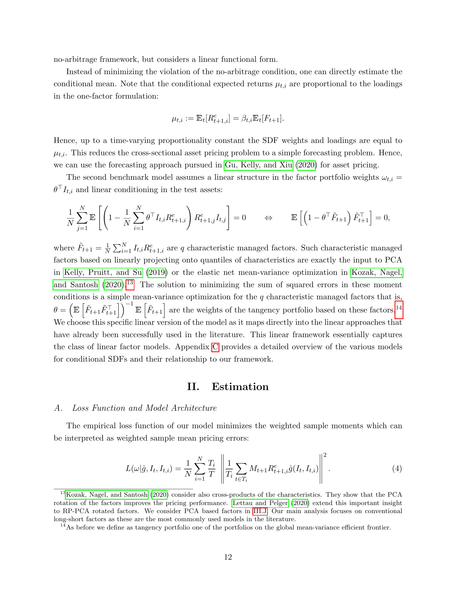

# 05a. Section II.A — Loss Function & Model Architecture

> **🧒 한 줄 요약**: Loss function. Moment-based + adversarial penalty.


> Section II.A (paper p.12–14) — 신경망 학습의 loss function 과 전체 아키텍처.

## 5a.1 챕터 한 줄 요약

Eq (4) — sample 손실 함수. **무한 stock unbalanced panel** 의 SR-weighted squared moment deviation. 두 네트워크 (SDF $\omega$ + conditional $\hat g$) 가 함께 학습.

---

## 5a.2 Empirical Loss Function — Eq (4)

paper Eq (4):

$$
L(\omega \mid \hat g, I_t, I_{t,i}) = \frac{1}{N} \sum_{i=1}^{N} \frac{T_i}{T} \left| \frac{1}{T_i} \sum_{t \in T_i} M_{t+1} R^e_{t+1,i}\, \hat g(I_t, I_{t,i}) \right|^2 \tag{4}
$$

**기호 뜻**:
- $N$ — 총 자산 수 (≈ 10,000).
- $T_i$ — 자산 $i$ 가 관측된 시점 수 (자산마다 다름).
- $T$ — 전체 시점 수.
- $T_i / T$ — 자산 $i$ 의 weight. 짧게 관측된 자산은 noisy 하므로 down-weight.

paper p.13 본문:
> "We deal with an unbalanced panel in which the number of time series observations $T_i$ varies for each asset. As the convergence rates of the moments under suitable conditions is $1/\sqrt{T_i}$, we weight each cross-sectional moment condition by $\sqrt{T_i}/\sqrt{T}$, which assigns a higher weight to moments that are estimated more precisely and down-weights the moments of assets that are observed only for a short time period."

→ **GLS-type weighting** for unbalanced panel.

---

## 5a.3 두 네트워크의 역할

paper p.13:
$$
\hat\omega = \min_\omega L(\omega \mid \hat g, I_t, I_{t,i}) \quad \text{(SDF network)}
$$

$$
\hat g = \arg\max_g L(\omega \mid g, I_t, I_{t,i}) \quad \text{(Conditional / adversary network)}
$$

→ 두 네트워크 모두 같은 loss 의 다른 쪽을 최적화 (minimax).

paper 본문:
> "The SDF network has two parts: (1) A LSTM estimates a small number of macroeconomic states. (2) These states together with the firm-characteristics are used in a FFN to construct a candidate SDF for a given set of test assets. The conditioning network also has two networks: (1) It creates its own set of macroeconomic states, (2) which it combines with the firm-characteristics in a FFN to find mispriced test assets for a given SDF M."

→ **각 네트워크 = LSTM (macro) + FFN (full conditioning)**.

---

## 5a.4 Figure 1 — GAN Model Architecture



*paper p.13 Fig. 1 — 본 논문의 핵심 그림. 좌측 SDF network, 우측 Conditional network. 각각 LSTM (macro → hidden state) + FFN (chars + hidden state → output). 두 네트워크가 minimax 로 경쟁.*

paper Fig. 1 note:
> "This figures shows the model architecture of GAN (Generative Adversarial Network) with RNN (Recurrent Neural Network) with LSTM cells. The SDF network has two parts: (1) A LSTM estimates a small number of macroeconomic states. (2) These states together with the firm-characteristics are used in a FFN to construct a candidate SDF for a given set of test assets. The conditioning network also has two networks: (1) It creates its own set of macroeconomic states, (2) which it combines with the firm-characteristics in a FFN to find mispriced test assets for a given SDF M. These two networks compete until convergence, that is neither the SDF nor the test assets can be improved."

---

## 5a.5 본 논문 model 의 4가지 element

paper Section II.A 의 architecture 요약:

### Element 1: FFN (Section II.B)
- 4가지 활용: ω, g, μ (FFN benchmark), β.
- ReLU activation.

### Element 2: LSTM (Section II.C)
- macro 시계열 → hidden state.
- SDF network 와 Conditional network 가 **별도 LSTM** 사용 ($h_t$ vs $h^g_t$).

### Element 3: GAN (Section II.D)
- minimax 게임.
- 3-step training.

### Element 4: Ensemble & Hyperparameters (Section II.E)
- 9 ensemble.
- Dropout regularization.

각 element 는 챕터 05b–05d 에서 상세.

---

## 5a.6 Forecasting Benchmark (FFN, GKX 2020)

paper p.13–14:
$$
\hat\mu = \min_\mu \frac{1}{T}\sum_t \frac{1}{N_t} \sum_{i=1}^{N_t} \left( R^e_{t+1,i} - \mu(I_t, I_{t,i}) \right)^2
$$

→ **Gu, Kelly, Xiu (2020)** 의 best FFN model 과 동일.

paper 본문:
> "We only include the best performing feedforward network from Gu, Kelly, and Xiu (2020)'s comparison study. Within their framework this model outperforms tree learning approaches and other linear and non-linear prediction models. ... the simple forecasting approach does not include an adversarial network or LSTM to condense the macroeconomic dynamics."

→ FFN benchmark = **LSTM 없음 + adversarial 없음 + no-arbitrage 없음**. 순수 prediction.

---

## 5a.7 정리

```
[ GAN 모델 (본 논문) ]                  [ FFN 모델 (GKX 2020) ]
                                                       
  macro I_t      chars I_{t,i}            macro I_t (raw)
       │              │                        │      \
       ▼              │                        │       \
     LSTM             │                        │        \
   (4 states)         │                        ▼         ▼
       │              │                       FFN
       └─── concat ───┘                     (chars + macro)
              │                                  │
              ▼                                  ▼
             FFN                              μ̂ (mean prediction)
        (SDF weights ω)                          │
              │                                  ▼
              ▼                          → β̂ = μ̂ (proportional)
         SDF M_{t+1}
              │
              ↓ ↑
        Conditional network (adversary)
              │
              ▼
        Test assets g
              ↓
        ┌─────────────────────────┐
        │ Loss = (1/N) Σ |E[M·R·g]|² │
        └─────────────────────────┘
              │
        Minimax: min_ω max_g
```

---

## 자기점검 (이 챕터)

### 핵심 3가지
1. Eq (4) 의 $T_i/T$ weight 가 의미하는 것?
2. SDF network 와 Conditional network 의 차이?
3. FFN benchmark 가 GAN 보다 단순한 이유 3가지?

### 답변
1. **Unbalanced panel weighting**. 자산 $i$ 가 더 오래 관측되었으면 (큰 $T_i$) moment 추정이 정확하므로 weight 높임. $\sqrt{T_i}/\sqrt{T}$ — GLS-type. 짧게 관측된 자산 (예: 신생 IPO 직후 만 보임) 의 noise 영향 차단.
2. **SDF network**: $\omega(I_t, I_{t,i})$ 학습 → portfolio weights for SDF. **Conditional network**: $g(I_t, I_{t,i})$ 학습 → test asset conditioning. 둘 다 LSTM (macro → hidden state) + FFN (full) 구조지만 **다른 LSTM, 다른 FFN**.
3. (a) **LSTM 없음** — macro 는 raw 차분만. (b) **Adversarial 없음** — conditioning $g$ 학습 없음. (c) **No-arbitrage 없음** — loss 가 conditional mean MSE.


```viz:dlap-network-architecture:title=paper Fig 1 — Network Architecture,caption=Component selector.
```
