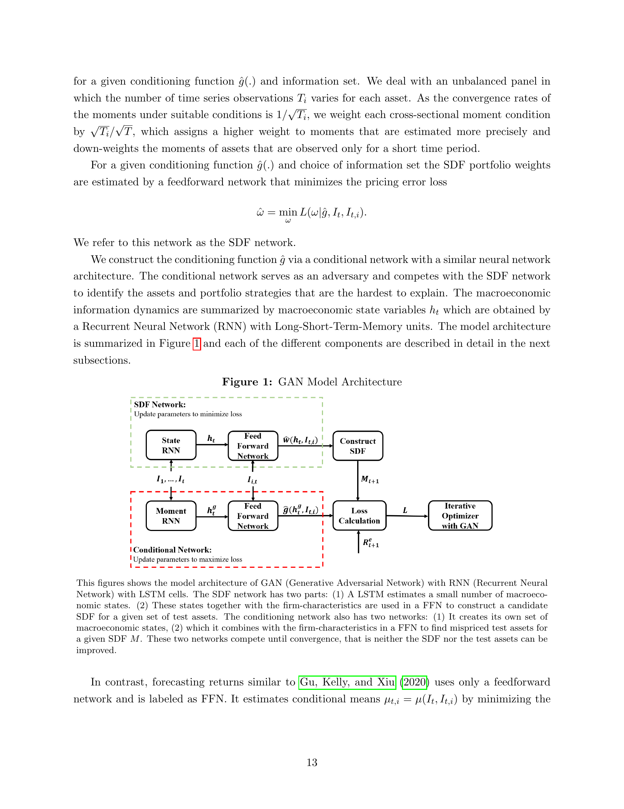

# 05b. Section II.B — Feedforward Network (FFN)

> Section II.B (paper p.14–15) — FFN 의 4가지 활용.

## 5b.1 챕터 한 줄 요약

Feedforward Network — covariates $x = [I_t, I_{t,i}]$ 의 비선형 함수 $y = f(x)$ 추정. ReLU activation, 다층. **4가지 활용**: (1) SDF weights $\omega$, (2) conditioning $g$, (3) conditional mean $\mu$ (forecasting), (4) loadings $\beta$ via $\mathbb{E}_t[F_{t+1} R^e_{t+1,i}]$.

---

## 5b.2 FFN 의 정의

paper p.14:
> "A feedforward network (FFN) is a flexible non-parametric estimator for a general functional relationship $y = f(x)$ between the covariates $x$ and a variable $y$."

**왜 FFN?**
- Universal approximation: 충분히 크고 깊으면 어떤 연속 함수도 근사.
- **Interaction effects** 자동 학습 — kernel/spline 같은 additive 가정 없음.

---

## 5b.3 4가지 활용

paper p.14 본문:
> "We will consider four different FFNs: For the covariates $x = [I_t, I_{t,i}]$ we estimate (1) the optimal weights in our GAN network ($y = \omega$), (2) the optimal instruments for the moment conditions in our GAN network ($y = g$), (3) the conditional mean return ($y = \mathbb{E}_t[R^e_{t+1,i}]$) and (4) the second moment ($y = \mathbb{E}_t[R^e_{t+1,i} F_{t+1}]$) to obtain the SDF loadings $\beta_{t,i}$."

| 활용 | 입력 | 출력 | 사용처 |
|-----|-----|------|--------|
| (1) | $[I_t, I_{t,i}]$ | $\omega_{t,i}$ | SDF network |
| (2) | $[I_t, I_{t,i}]$ | $g(I_t, I_{t,i})$ | Conditional network |
| (3) | $[I_t, I_{t,i}]$ | $\mu_{t,i} = \mathbb{E}_t[R^e]$ | FFN benchmark (GKX 2020) |
| (4) | $[I_t, I_{t,i}]$ | $\mathbb{E}_t[F R^e]$ | β recovery for GAN |

---

## 5b.4 1-layer FFN 의 수학

paper p.14–15:
- 입력: $x = x^{(0)} \in \mathbb{R}^{K^{(0)}}$
- Hidden layer:
$$
x^{(1)} = \mathrm{ReLU}(W^{(0)\top} x^{(0)} + w_0^{(0)})
$$
- Output:
$$
y = W^{(1)\top} x^{(1)} + w_0^{(1)}
$$

**기호 뜻**:
- $W^{(0)} \in \mathbb{R}^{K^{(1)} \times K^{(0)}}$
- $W^{(1)} \in \mathbb{R}^{K^{(1)}}$
- $w_0^{(\ell)}$ — bias

**ReLU activation**:
$$
\mathrm{ReLU}(x_k) = \max(x_k, 0)
$$

paper footnote 16:
> "ReLU activation functions have a number of advantages including the non-saturation of its gradient, which greatly accelerates the convergence of stochastic gradient descent compared to the sigmoid/hyperbolic functions (Krizhevsky et al. (2012)) and fast calculations of expensive operations."

---

## 5b.5 Figure 2 — FFN Illustration (paper p.14) 깊이



(Figure 2, paper p.14)

### Step 1 — 그림의 구조 이해

**3 column layout** (좌→우):
- **Input layer $x^{(0)}$** (왼쪽, 녹색 circles).
- **Hidden layer $x^{(1)}$** (가운데, 파란 circles).
- **Output layer $y_{t,i}$ 또는 $w_{t,i}$** (오른쪽, 분홍 circle).

**입력의 grouping** (paper Fig 2):
- **Macroeconomic Input: $h_t$** (위 group, 녹색 — LSTM hidden state).
- **Firm specific characteristics: $I_{t,i}$** (아래 group, 녹색 — chars).

### Step 2 — 화살표의 의미

**Input → Hidden 화살표** (모든 input → 모든 hidden):
- Fully connected layer.
- 각 화살표 = weight $W^{(0)}_{ki}$.
- $K^{(1)}$ 개 hidden unit 각각이 모든 input 의 weighted sum + bias + ReLU 받음.

**Hidden → Output 화살표** (모든 hidden → output):
- 마찬가지 fully connected.
- 각 화살표 = weight $W^{(1)}_k$.
- Output = 모든 hidden unit 의 weighted sum + bias.

### Step 3 — 그림의 dimensions

paper Fig 2 의 visible elements:
- **Input**: 5 circles (2 macro + 3 chars, visualization 단순화).
- **Hidden**: 8 circles ($K^{(1)} = 8$ in illustration).
- **Output**: 1 circle (scalar — SDF weight $\omega$ for stock $i$ at time $t$).

**실제 paper 설정** (paper p.7 + Appendix I):
- Input: $K^{(0)} = K_h + 46 = 4 + 46 = 50$ (LSTM states + chars).
- Hidden: $K^{(1)} = 64$ (cross-validated).
- Output: 1 (for $\omega$) or $D = 8$ (for $g$).

### Step 4 — 다층 FFN 의 시각

paper 의 best model 은 2-layer:
```
Input (50)  →  Hidden 1 (64)  →  Hidden 2 (64)  →  Output (1 or 8)
                  ReLU              ReLU              Linear
```

Figure 2 는 1-layer illustration. 실제는 2-layer stack.

### Step 5 — Figure 2 의 paper caption 풀이

paper Fig 2 caption (간단):
> "Illustration of Feedforward Network with Single Hidden Layer"

→ paper 가 detail 없이 단순 illustration. Section II.B 본문에서 수식 풀이.

### Step 6 — Figure 2 가 보여주는 4 가지 핵심

1. **두 종류 input 의 통합**: macro hidden states ($h_t$) + firm chars ($I_{t,i}$) 가 concat → FFN.
2. **Fully connected**: 모든 input × 모든 hidden 의 weighted sum.
3. **단일 output**: scalar (per stock, per time) — SDF weight 또는 g instrument.
4. **Per-stock evaluation**: 같은 FFN 이 모든 stock $i$ 에 대해 적용 (parameter sharing).

### Step 7 — 이 architecture 가 의미하는 것

**Universal approximation**:
- FFN 이 충분히 크면 어떤 nonlinear function 도 학습.
- 본 paper 에서는 $\omega = f(h_t, I_{t,i})$ 의 진짜 함수형 발견.

**Cross-sectional + temporal 통합**:
- $h_t$ = temporal (시간 dynamic).
- $I_{t,i}$ = cross-sectional (자산 특성).
- FFN 이 두 정보 결합 → conditional SDF.

→ Figure 2 가 시각적으로 명료.

---

## 5b.6 Deep Network — 다층 확장

paper p.15:
> "A deep neural network combines several layers by using the output of one hidden layer as an input to the next hidden layer. The details are explained in Appendix A.A. The multiple layers allow the network to capture non-linearities and interaction effects in a more parsimonious way."

→ paper 의 **best model 은 2-layer FFN** (Section II.E 의 hyperparameter tuning 결과).

---

## 5b.7 본 논문 의 best FFN 설정 (hyperparameters)

paper p.18 (Section II.E):
> "Our optimal model has two layers, four economic states and eight instruments for the test assets."

**2-layer FFN** + 4 LSTM states + 8 instruments = baseline GAN model.

paper Appendix I (p.66–67) 의 tuning grid:
- Layers: 1, 2, 3
- Nodes per layer: 32, 64
- LSTM states: 2, 4
- Instruments D: 4, 8, 16

→ validation Sharpe ratio 최대화로 선택.

---

## 5b.8 학습 방법 (paper Appendix A.A)

paper Appendix A:
- **Optimizer**: Adam (adaptive learning rate)
- **Activation**: ReLU
- **Regularization**: Dropout (paper p.18) — "form of regularization that has generally better performance than conventional l1/l2 regularization"
- **Ensemble**: 9 models with different seeds, predictions averaged.

paper 본문 (p.18):
> "All our neural networks including the forecasting approach are averaged over nine model fits. Let $\hat w^{(j)}$ and $\hat \beta^{(j)}$ be the optimal portfolio weights respectively SDF loadings given by the j-th model fit. The ensemble model is an average of the outputs from models with the same architecture but different starting values for the optimization, that is $\hat\omega = \frac{1}{9}\sum_{j=1}^{9} \hat\omega^{(j)}$ and $\hat\beta = \frac{1}{9}\sum_{j=1}^{9} \hat\beta^{(j)}$."

---

## 5b.9 FFN 의 universal approximation 의미

### Step 1 — Universal approximation theorem

**정리** (Cybenko 1989, Hornik 1989):
> 단일 hidden layer FFN 으로 (충분히 많은 hidden unit 으로) 모든 continuous function 을 임의 정밀도로 근사 가능.

#### 의미

- Linear model 은 hyperplane 만 표현.
- Polynomial model 은 polynomial 만.
- **FFN 은 어떤 nonlinear function 도 표현**.
- → "Function approximator 의 universal 도구".

#### 본 paper 의 함의

SDF 의 진짜 함수 형태는 unknown.
- Linear/polynomial assumption 은 위험 (misspecification).
- FFN 으로 학습 → 진짜 함수에 가까이 갈 수 있음.
- → "ML × 이론" 통합의 토대.

### Step 2 — Depth (multi-layer) 의 의미

paper p.15:
> "The multiple layers allow the network to capture non-linearities and interaction effects in a more parsimonious way."

**왜 multi-layer 가 효율적**:
- 1-layer FFN 으로 어떤 함수든 근사 가능 — but exponentially many hidden units.
- 2+ layers 로 같은 함수를 polynomially fewer units 로 표현.
- → **Depth 의 power**: parsimony.

#### 비유 (조립)
- 1-layer = 모든 부품을 한 단계에서 조립 — 단순한 부품 매우 많이 필요.
- Multi-layer = 부품 → 모듈 → 시스템 의 hierarchical 조립 — 더 효율.

### Step 3 — Hidden unit 수의 의미

paper 의 hyperparameter:
- $K^{(1)}$ = first hidden layer 의 unit 수 = 64.
- $K^{(2)}$ = second hidden layer 의 unit 수 = 64 (2-layer model).

**왜 64 인가**:
- Cross-validation 으로 선택 (32, 64 tested).
- 작은 unit → underfit (capacity 부족).
- 큰 unit → overfit (data 대비 너무 큼).
- 64 가 sweet spot.

---

## 5b.10 Dropout Regularization 자세히

paper p.18:
> "Dropout is a form of regularization that has generally better performance than conventional l1/l2 regularization."

### Step 1 — Dropout 의 원리

**학습 시**: hidden unit 의 일부를 random 으로 **0 으로 fix** (drop).
- 매 training iteration 마다 다른 unit drop.
- Dropout rate (예: 0.3) = 30% unit 을 random 으로 drop.

**Test 시**: 모든 unit 사용, but weights 를 (1 - dropout rate) 로 scale.

### Step 2 — 왜 작동하는가

**3 가지 효과**:

1. **Ensemble 효과**: 매 iteration 마다 다른 sub-network 학습 → implicit ensemble.
2. **Co-adaptation 방지**: hidden units 가 서로 의존 못 함 (drop 될 수 있으니).
3. **Robustness**: 일부 unit 없어도 작동.

### Step 3 — vs L1/L2 regularization

| 측면 | L1 | L2 | Dropout |
|------|-----|-----|---------|
| 메커니즘 | Sparsity 강제 | Magnitude shrinkage | Random drop |
| 효과 | Feature selection | Smooth function | Ensemble |
| Deep NN 에서 | OK | OK | **best** (paper) |

paper 의 선택: Dropout (deep NN 에 더 적합).

---

## 5b.11 자기점검 (이 챕터)

### 핵심 5가지
1. **FFN 의 4가지 활용 중 (1)-(2) 와 (3)-(4) 의 차이?**
2. **ReLU 가 다른 activation 보다 본 논문에서 적합한 이유?**
3. **본 논문의 best FFN 설정 (layers, states, instruments) 은?**
4. **Universal approximation 이 본 paper 에서 갖는 의미?**
5. **Dropout 이 L1/L2 보다 deep NN 에 좋은 이유?**

### 답변
1. **(1)-(2)** 은 GAN 의 두 네트워크 (SDF $\omega$, conditional $g$) 의 main 모델. **(3)** 은 별도 benchmark (FFN forecasting, GKX 2020 의 best model). **(4)** 는 GAN 학습 후 β 계산용 보조 — $\mathbb{E}[F R^e]$ 를 별도 FFN 으로 추정.
2. (a) **Non-saturation of gradient** — sigmoid/tanh 는 큰 입력에서 gradient ≈ 0 (vanishing). ReLU 는 양수 영역에서 gradient = 1 (vanish 안 함). (b) **Fast computation** — max(0, x) 는 single comparison. (c) Krizhevsky et al. (2012) ImageNet 성공의 핵심.
3. **2 layers** (depth), **4 economic states** (LSTM output dim), **8 instruments** (conditioning $g$ dimension $D$). Validation Sharpe ratio 최대화로 선택.
4. SDF 의 진짜 함수 형태는 unknown — linear/polynomial 가정은 misspecification 위험. FFN 은 universal approximator — 어떤 nonlinear function 도 근사 가능. 따라서 paper 의 GAN 이 **이론적으로 진짜 SDF 에 가까이 갈 수 있음**. ML × 이론 통합의 토대.
5. Dropout 이 (a) 매 iteration 다른 sub-network 학습 = **implicit ensemble**, (b) hidden units 의 co-adaptation 방지 — 강제 robustness, (c) 거대한 NN 의 effective regularization. L1/L2 는 weight 의 magnitude 만 처리 — deep NN 의 복잡한 패턴 잡기 부족. Paper p.18 명시: "generally better performance than conventional l1/l2 regularization".
