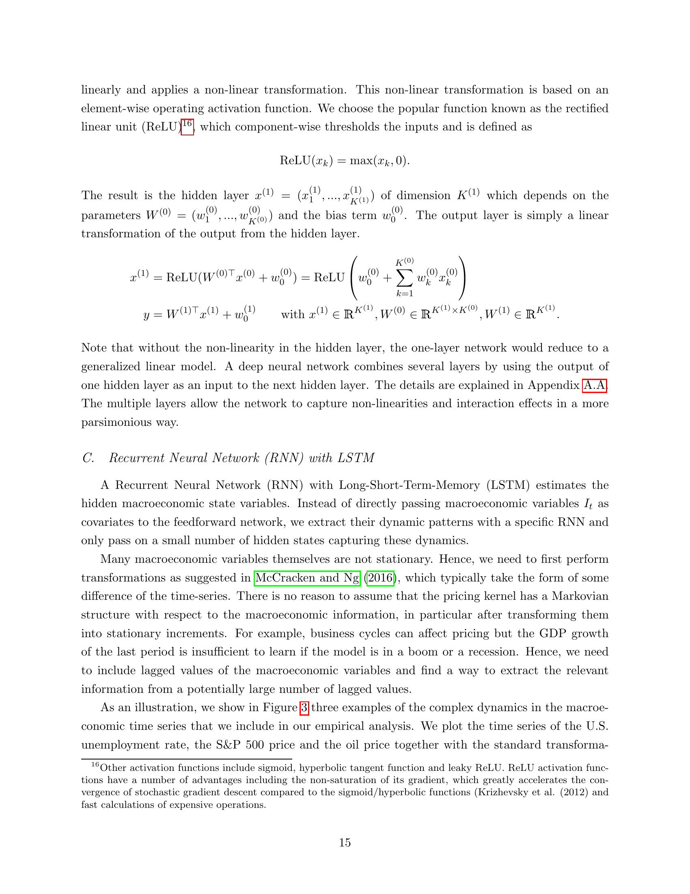

# 05c. Section II.C — RNN with LSTM (Macroeconomic Hidden States)

> **🧒 한 줄 요약**: LSTM for sequential state encoding. Macro indicator time series.

> Section II.C (paper p.15–17) — 178 macro 시계열 → 4 hidden state.

## 5c.1 챕터 한 줄 요약

178개 macroeconomic 시계열을 **4개 hidden state $h_t$** 로 압축. **RNN** (Recurrent Neural Network) 이 시계열 동학을 학습, **LSTM** (Long-Short-Term-Memory) cells 가 short + long-term 의존성 동시 처리. business cycle 같은 long-range pattern 자동 발견.

---

## 5c.2 왜 LSTM 인가?

paper p.15:
> "Many macroeconomic variables themselves are not stationary. Hence, we need to first perform transformations as suggested in McCracken and Ng (2016), which typically take the form of some difference of the time-series. There is no reason to assume that the pricing kernel has a Markovian structure with respect to the macroeconomic information, in particular after transforming them into stationary increments. For example, business cycles can affect pricing but the GDP growth of the last period is insufficient to learn if the model is in a boom or a recession."

→ **단순 increment 만으로는 boom/recession 구별 불가**. 시계열 dynamic pattern 필요.

---

## 5c.3 Figure 3 — Macro 시계열의 비정상성

*paper p.16 Fig. 3 — 3가지 macro 시계열 (Unemployment, S&P 500, Oil Price). 위 행: 원자료 (non-stationary). 아래 행: McCracken-Ng (2016) 변환 후 (stationary increments).*

paper Fig. 3 note:
> "This figure shows examples of macroeconomic time series with standard transformations proposed by McCracken and Ng (2016)."

→ 단순 차분 후 last increment 만 사용 = **business cycle 정보 손실**.

---

## 5c.4 Hidden State Mapping

paper p.16:

목표: 시계열 $\{x_0, \ldots, x_t\}$ → 상태 $h_t$:
$$
h_t = h(x_0, \ldots, x_t) \quad \text{for } t = 1, \ldots, T
$$

**3가지 후보 매핑**:

### (a) Last increment ($h^\Delta$)
$$
h^\Delta_t = x_t
$$
→ 단순 차분의 마지막 값. **시계열 정보 손실**.

### (b) PCA ($h^{PCA}$)
$$
h^{PCA}_t = W_x x_t \quad (W_x \in \mathbb{R}^{p \times K_h})
$$
→ Ludvigson-Ng (2007) 의 macro factor model. cross-sectional 차원 축소만, **dynamic 못 잡음**.

### (c) RNN/LSTM ($h^{LSTM}$)
$$
h^{LSTM}_t = h^{LSTM}(x_0, \ldots, x_t)
$$
→ 본 논문의 선택. **cross-section + time series 동시** 처리.

---

## 5c.5 Vanilla RNN

paper p.17:
$$
h^{RNN}_t = \sigma(W_h h^{RNN}_{t-1} + W_x x_t + w_0)
$$

**기호 뜻**:
- $\sigma$ — activation function.
- $W_h$ — recurrent weight (이전 상태).
- $W_x$ — input weight.

paper 본문:
> "Intuitively, a vanilla RNN combines two steps: First, it summarize cross-sectional information by linearly combining a large vector $x_t$ into a lower dimensional vector. Second, it is a non-linear generalization of an autoregressive process where the lagged variables are transformations of the lagged observed variables."

**한계** (paper):
> "This type of structure is powerful if only the immediate past is relevant, but it is not suitable if the time series dynamics are driven by events that are further back in the past. Conventional RNNs can encounter problems with exploding and vanishing gradients when considering longer time lags."

→ vanilla RNN 은 **long-range dependency** 못 처리.

---

## 5c.6 LSTM Cells

paper p.17:
> "This is why we use the more complex Long-Short-Term-Memory cells. The LSTM is designed to deal with lags of unknown and potentially long duration in the time series, which makes it well-suited to detect business cycles."

**LSTM 의 핵심 idea** (paper Appendix A.B detailed):
- **Forget gate**: 이전 cell state 의 얼마를 기억할지 결정.
- **Input gate**: 새 정보의 얼마를 cell state 에 더할지 결정.
- **Output gate**: cell state 에서 hidden state 로 얼마 출력할지 결정.

이 gate 구조가 **gradient vanishing 방지** + **long-range memory** 가능.

paper 인용:
> "An LSTM uses different RNN structures to model short-term and long-term dependencies and combines them with a non-linear function. We can think of an LSTM as a flexible hidden state space model for a large dimensional system."

---

## 5c.7 LSTM 의 두 가지 역할

paper p.17:
> "On the one hand it provides a cross-sectional aggregation similar to a latent factor model. On the other hand, it extracts dynamics similar in spirit to state space models, like for example the simple linear Gaussian state space model estimated by a Kalman filter. The strength of the LSTM is that it combines both elements in a general non-linear model."

| 역할 | 비유 |
|------|------|
| Cross-sectional aggregation | Latent factor model (PCA-like) |
| Time series dynamics | State space model (Kalman filter-like) |

→ LSTM = **비선형 factor + 비선형 state space** 통합.

---

## 5c.8 Output: 4 Hidden States

paper p.17:
$$
h_t = h^{LSTM}(x_0, \ldots, x_t) \in \mathbb{R}^{K_h}
$$

본 논문 선택: $K_h = 4$.

paper p.18 (hyperparameter tuning):
> "Our optimal model has two layers, four economic states and eight instruments for the test assets."

→ **4 economic states** = LSTM 의 output dimension.

paper p.17 본문:
> "Note, that each state $h_t$ depends only on current and past macroeconomic increments and has no look-ahead bias."

→ **No look-ahead** — 시점 $t$ 의 state 는 $\leq t$ 정보만 사용.

---

## 5c.9 Two LSTMs: SDF Network vs Conditional Network

paper p.18 (Section II.D 의 footnote 18):
> "We allow for potentially different macroeconomic states for the SDF and the conditional network as the unconditional moment conditions that identify the SDF can depend on different states than the SDF weights."

→ SDF network $h_t$ 와 Conditional network $h^g_t$ 는 **별도 LSTM**.

이유:
- SDF $\omega$ 결정에 중요한 macro state ≠ test asset $g$ 결정에 중요한 state.
- 예: SDF 는 recession 에서 변동성 증가에 민감, $g$ 는 momentum reversal 시점에 민감.

---

## 자기점검 (이 챕터)

### 핵심 3가지
1. 단순 macro 차분 (vanilla RNN $h^\Delta$) 의 한계는?
2. LSTM 의 gate 구조가 vanilla RNN 보다 좋은 이유?
3. SDF network 와 conditional network 의 LSTM 이 별도인 이유?

### 답변
1. **시간 동학 손실**. GDP growth 의 마지막 차분만으로는 boom/recession 구별 불가. business cycle 은 long-range pattern (수년~수십년) 인데 단순 차분은 이를 못 잡음.
2. **Gradient vanishing 해결**. Vanilla RNN 은 backprop 시 $W_h$ 의 곱이 쌓이면서 gradient 가 exponentially decay/explode. LSTM 의 **cell state** 는 gate 로 정보를 선택적으로 통과시켜 long-range gradient 가 살아있음. → "기억할 가치 있는 것만 장기 보관".
3. 두 네트워크의 **objective 가 다름** — SDF 는 pricing error 최소화 (어떤 macro state 가 pricing 에 중요), conditional 은 mispriced asset 발견 (어떤 macro state 가 모델 약점 드러내는지). 다른 task 에 다른 representation 이 필요하므로 **별도 LSTM** 으로 학습.
