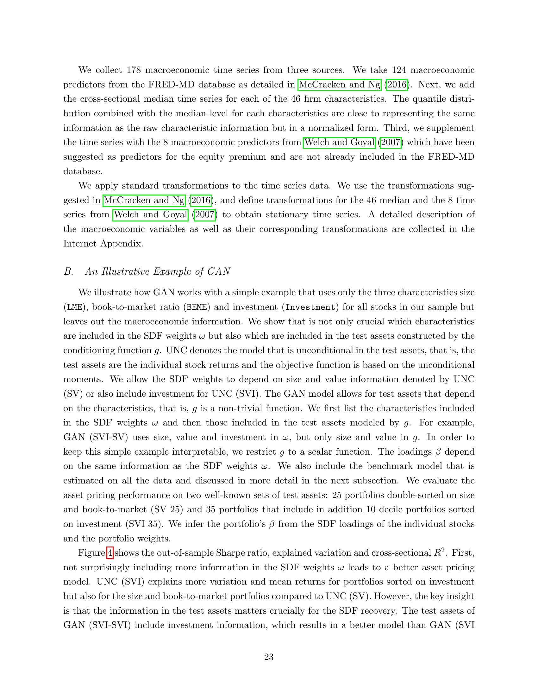
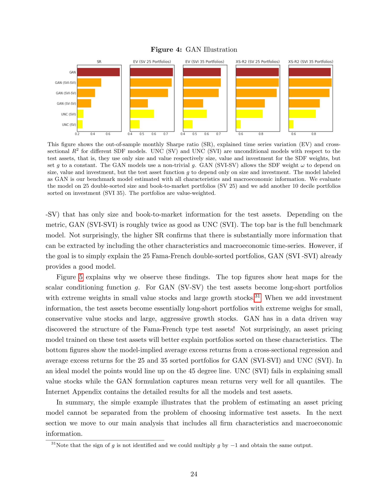

# 08. Data & Illustrative GAN Example — Section III.A–B

> **🧒 한 줄 요약**: CRSP + macro indicators. 1967-2016 sample.

> Section III.A–B (paper p.20–25) — 50년 데이터 + GAN 의 작동 원리를 size-value-investment example 로 보여주기.

## 8.1 챕터 한 줄 요약

CRSP 1967–2016 (50년), 약 10,000 stocks (모든 firm characteristic 보유 sample), 46 firm chars + 178 macro 시계열. 간단한 SVI (size, value, investment) example 로 **adversarial test asset 의 effect** 가 SR 2배 향상 보임.

---

## 8.2 Section III.A — Data

### 8.2.1 Stock Returns (paper p.20–21)

paper:
> "We collect monthly equity return data for all securities on CRSP. The sample period spans January 1967 to December 2016, totaling 50 years."

- **기간**: 1967/01 – 2016/12 = **50 years**
- **유니버스**: CRSP 전 종목
- **무위험**: Kenneth French Data Library 의 one-month Treasury bill

### 8.2.2 Sample Split (paper p.21)

| Period | Years | Use |
|--------|-------|-----|
| Training | 1967–1986 | 20 years |
| Validation | 1987–1991 | 5 years (hyperparameter) |
| **Test (OOS)** | **1992–2016** | **25 years** |

→ 25 년 OOS — **매우 엄격한 검증**.

### 8.2.3 Firm Characteristics (46개)

paper p.21:
> "we collect the 46 firm-specific characteristics listed either on Kenneth French Data Library or used by Freyberger, Neuhierl, and Weber (2020)."

**6 categories** (paper Table A.II):
1. **Past returns** (예: ST_REV, mom1m, mom6m, mom12m, r36_13)
2. **Investment** (예: Investment, NOA, AC, OA)
3. **Profitability** (예: ROA, ROE, OP, PROF)
4. **Intangibles** (예: AT, OL, BEME, A2ME)
5. **Value** (예: BEME, D2P, E2P, S2P)
6. **Trading frictions** (예: SUV, LME, IdioVol, Spread, LTurnover)

### 8.2.4 Stock Universe

paper p.21:
> "The number of all available stocks from CRSP is around 31,000. As in Kelly, Pruitt, and Su (2019) or Freyberger, Neuhierl, and Weber (2020), we are limited to the returns of stocks that have all firm characteristics information available in a certain month, which leaves us with around **10,000 stocks**."

paper footnote 28:
> "Using stocks with missing characteristic information requires data imputation based on model assumptions. Gu, Kelly, and Xiu (2019) replace a missing characteristic with the cross-sectional median of that characteristic during that month. However, this approach introduces an additional source of error and ignores the dependency structure in the characteristic space."

→ 본 논문은 **complete observations only** (대신 N=10,000 으로 줄어듦).

### 8.2.5 Quantile Transformation

paper p.21:
> "For each characteristic variable in each month, we rank them cross-sectionally and convert them into quantiles."

→ Cross-sectional rank → quantile. Gu-Kelly-Xiu (2021) Autoencoder paper 와 같은 처리.

### 8.2.6 Long-Short Factor 의 구성

paper p.21:
> "In the linear model the projection $\tilde F_{t+1} = \frac{1}{N}\sum I_{t,i} R^e_{t+1,i}$ results in long-short factors with an increasing positive weight for stocks that have a characteristic value above the median and a decreasing negative weight for below median values."

→ **Quantile-weighted long-short portfolio**. Kelly-Pruitt-Su (2019) 와 동일.

추가 flexibility:
> "We increase the flexibility of the linear model by including the positive and negative leg separately for each characteristic"

→ Long leg, short leg **별도 weights** — 비대칭 가능.

### 8.2.7 Macroeconomic Variables (178개)

paper p.22:
> "We collect 178 macroeconomic time series from three sources."

| Source | 개수 | 내용 |
|--------|-----|------|
| **FRED-MD** (McCracken & Ng 2016) | 124 | 표준 macro predictors |
| **46 cross-sectional medians** | 46 | 각 firm characteristic 의 cross-sectional median time series |
| **Welch-Goyal (2007)** | 8 | equity premium predictors |
| **합계** | **178** | |

paper 본문:
> "We apply standard transformations to the time series data. We use the transformations suggested in McCracken and Ng (2016), and define transformations for the 46 median and the 8 time series from Welch and Goyal (2007) to obtain stationary time series."

---

## 8.3 Section III.B — Illustrative Example (SVI)

### 8.3.1 Setup

paper p.22:
> "We illustrate how GAN works with a simple example that uses only the three characteristics size (LME), book-to-market ratio (BEME) and investment (Investment) for all stocks in our sample but leaves out the macroeconomic information."

**모델 variants** (SDF weights / conditioning function):
- **UNC (SV)**: ω depends on size + value, $g = $ 상수 (unconditional)
- **UNC (SVI)**: ω depends on size + value + investment, $g = $ 상수
- **GAN (SVI-SV)**: ω depends on SVI, $g$ depends on size + value
- **GAN (SVI-SVI)**: ω depends on SVI, $g$ depends on SVI
- **GAN (benchmark)**: full model (46 chars + 178 macro)

### 8.3.2 Test Assets

paper p.22:
> "We evaluate the asset pricing performance on two well-known sets of test assets: 25 portfolios double-sorted on size and book-to-market (SV 25) and 35 portfolios that include in addition 10 decile portfolios sorted on investment (SVI 35)."

---

## 8.4 Figure 4 — Illustration Results

*paper p.24 Fig. 4 — SR, EV, XS-R² across UNC vs GAN variants. test asset 정보가 SVI 면 SVI 35 portfolios 잘 가격결정.*

paper p.23 본문:
> "GAN (SVI-SVI) is roughly twice as good as UNC (SVI). The top bar is the full benchmark model. Not surprisingly, the higher SR confirms that there is substantially more information that can be extracted by including the other characteristics and macroeconomic time-series. However, if the goal is to simply explain the 25 Fama-French double-sorted portfolios, GAN (SVI -SVI) already provides a good model."

**핵심 발견**: **test asset 의 정보가 SDF 정확도를 결정**. SDF 가 무엇을 가격결정해야 할지 알아야 그 정보를 학습.

---

## 8.5 Figure 5 — Conditioning Function g 의 의미

*paper p.25 Fig. 5 — (a) g for GAN(SV-SV): small value vs large growth 가중. (b) g for GAN(SVI-SVI): + investment 정보 추가. (c)(d) cross-sectional pricing 비교.*

paper 본문:
> "For GAN (SV-SV) the test assets become long-short portfolios with extreme weights in small value stocks and large growth stocks. When we add investment information, the test assets become essentially long-short portfolios with extreme weighs for small, conservative value stocks and large, aggressive growth stocks. **GAN has in a data driven way discovered the structure of the Fama-French type test assets!**"

→ **Adversary 가 Fama-French 의 25 double-sorted portfolio 구조를 자동 발견**. 인간이 직관으로 만든 test asset 을 ML 이 데이터에서 재발견.

paper 결론 (Section III.B):
> "In summary, the simple example illustrates that the problem of estimating an asset pricing model cannot be separated from the problem of choosing informative test assets."

→ **모델 추정과 test asset 선택은 분리할 수 없다** — 본 논문 의 핵심 메시지.

---

## 자기점검 (이 챕터)

### 핵심 3가지
1. paper 가 31,000 stocks 중 10,000 만 사용한 이유?
2. 178 macro 시계열의 3가지 출처?
3. SVI illustrative example 이 입증하는 핵심?

### 답변
1. **Missing characteristic 문제**. 31,000 stocks 전체 중 모든 46 firm characteristics 를 가진 stock 은 ≈ 10,000. Gu-Kelly-Xiu (2019) 는 missing 을 median imputation 했지만, 본 논문은 (Kelly-Pruitt-Su 2019, Freyberger-Neuhierl-Weber 2020 처럼) **complete cases only** 채택. Imputation 의 추가 error 와 dependency structure 무시 방지.
2. **(1) FRED-MD (McCracken-Ng 2016)**: 124 macro predictors. **(2) 46 cross-sectional medians** of firm characteristics — quantile 분포 + median level 이 raw characteristic 정보 거의 동등 (정규화 form). **(3) Welch-Goyal (2007)**: 8 equity premium predictors (dividend-price ratio 등).
3. **Test asset 정보 = SDF 정확도**. GAN (SVI-SVI) 는 GAN (SVI-SV) 보다 두 배 좋음 — 같은 SDF weight 정보지만 **test asset 의 conditioning 이 investment 정보 포함** 으로 학습 quality 다름. 또한 GAN 이 Fama-French type 의 small-value × large-growth 구조를 **자동 발견** — 데이터 driven 으로 적절한 test asset 학습 가능.
