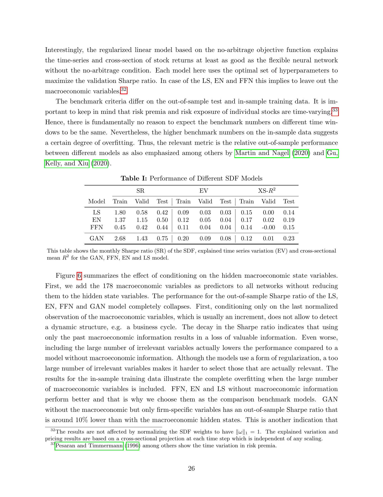
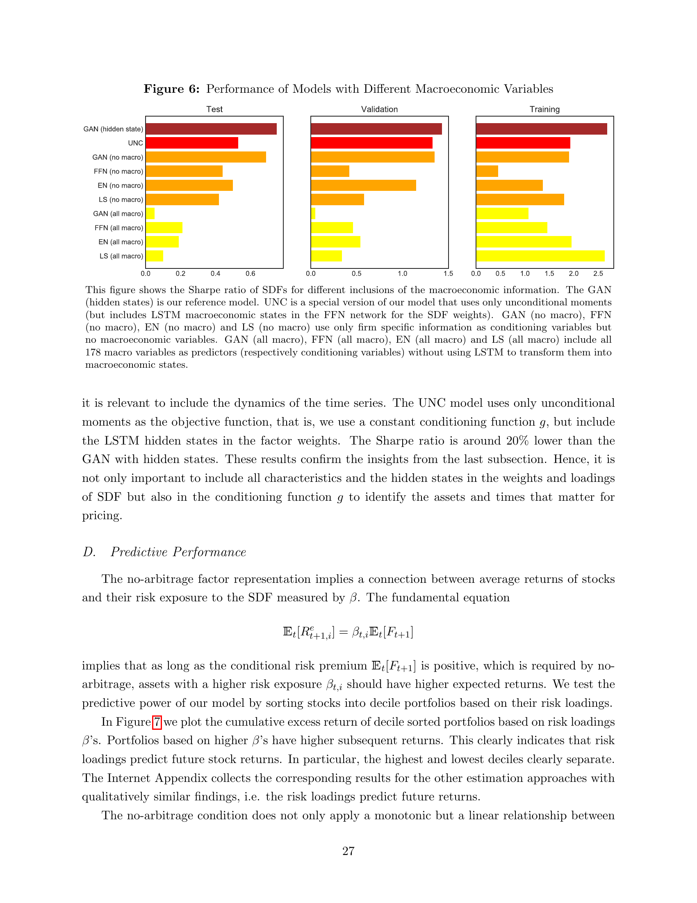
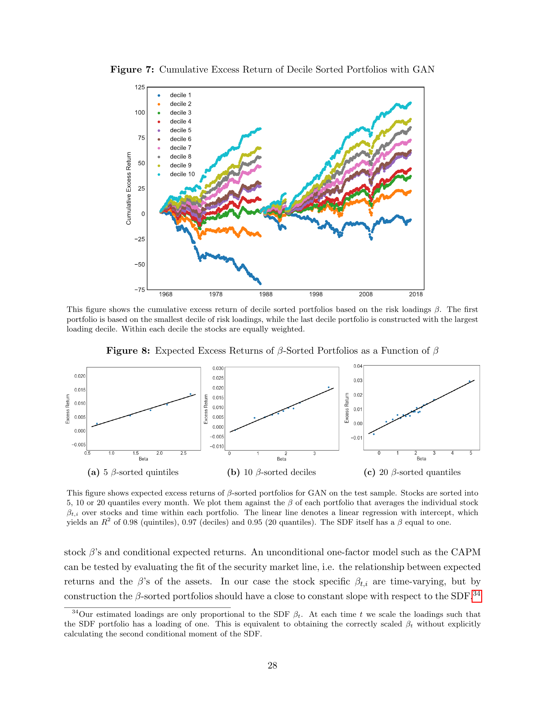

# 09. Empirical Results — Individual Stocks (Section III.C–D)

> **🧒 한 줄 요약**: 개별 stock 의 SDF pricing 결과.


> Section III.C–D (paper p.25–29) — Table I, Figure 6, β-sorted portfolios.

## 9.1 챕터 한 줄 요약

paper Table I: **GAN 이 SR/EV/XS-R² 모든 지표에서 압도** (OOS test 1992–2016). Macro inclusion 방식 (LSTM hidden states vs raw vs no macro) 도 결정적. β-sorted decile portfolio 의 expected return 이 β 와 linear (R² > 0.95) — no-arbitrage 와 일관.

---

## 9.2 Table I — 4 Model Performance (paper p.26)

paper Table I (정확한 수치):

| Model | Train SR | Valid SR | **Test SR** | Train EV | Valid EV | **Test EV** | Train XS-R² | Valid XS-R² | **Test XS-R²** |
|-------|----------|----------|-------------|----------|----------|-------------|-------------|-------------|----------------|
| LS    | 1.80     | 0.58     | **0.42**    | 0.09     | 0.03     | **0.03**    | 0.15        | 0.00        | **0.14**       |
| EN    | 1.37     | 1.15     | **0.50**    | 0.12     | 0.05     | **0.04**    | 0.17        | 0.02        | **0.19**       |
| FFN   | 0.45     | 0.42     | **0.44**    | 0.11     | 0.04     | **0.04**    | 0.14        | -0.00       | **0.15**       |
| **GAN** | **2.68** | **1.43** | **0.75**  | **0.20** | **0.09** | **0.08**    | **0.12**    | **0.01**    | **0.23**       |

paper p.25–26 본문:
> "The annual out-of-sample Sharpe ratio of GAN is around 2.6 and almost twice as high as with the simple forecasting approach FFN. The non-linear and interaction structure that GAN can capture results in a 50% increase compared to the regularized linear model. ... GAN explains **8% of the variation** of individual stock returns which is twice as large as the other models. Similarly, the cross-sectional R² of **23%** is substantially higher than for the other models."

**관찰**:
- **GAN test SR 0.75** vs **FFN 0.44** (월간 기준; 연간 ≈ 2.6 vs 1.5)
- **GAN test EV 0.08** vs others 0.03-0.04 (**2x**)
- **GAN test XS-R² 0.23** vs others 0.14-0.19 (**1.2-1.6x**)

paper 본문 (interesting observation):
> "Interestingly, the regularized linear model based on the no-arbitrage objective function explains the time-series and cross-section of stock returns at least as good as the flexible neural network without the no-arbitrage condition."

→ **EN (linear no-arb) ≥ FFN (nonlinear no-no-arb)**. No-arbitrage 가 ML flexibility 보다 더 중요.

---

```viz:dlap-sdf-performance:title=paper Table I — 4 SDF Models (interactive),caption=Metric 토글로 SR / EV / XS-R² 전환. Sample 토글로 Train / Valid / Test 전환. GAN 이 모든 metric/sample 에서 best. 핵심 발견: EN (linear no-arb) > FFN (nonlinear no-no-arb) — no-arbitrage 가 ML flexibility 보다 더 중요.
```

---

## 9.3 Figure 6 — Macro Inclusion 의 효과



*paper p.27 Fig. 6 — Sharpe ratio 비교 (Train/Valid/Test). GAN (hidden states), GAN (no macro), GAN (all macro) 등.*

paper p.26–27 본문:
> "We add the 178 macroeconomic variables as predictors to all networks without reducing them to the hidden state variables. The performance for the out-of-sample Sharpe ratio of the LS, EN, FFN and GAN model **completely collapses**. ... Even worse, including the large number of irrelevant variables actually lowers the performance compared to a model without macroeconomic information."

**핵심**:
- **All macro raw**: 성능 **붕괴** — 178 차원 raw 가 너무 noisy.
- **No macro**: GAN 만 firm chars 로도 좋음 — 그러나 hidden states 보다 ≈ 10% SR 낮음.
- **Hidden states (LSTM)**: 최적.
- **UNC (g=상수)**: hidden states 사용하지만 SR 20% 낮음 — adversarial 의 효과.

paper 결론:
> "It is not only important to include all characteristics and the hidden states in the weights and loadings of SDF but also in the conditioning function g to identify the assets and times that matter for pricing."

```viz:dlap-macro-ablation:title=paper Fig 6 — Macro inclusion effect (interactive),caption=Sample 토글로 Train/Valid/Test 전환. LSTM hidden states (baseline) vs No macro vs All macro raw vs UNC (g=const). All macro raw 는 collapses — 178 raw 차분이 너무 noisy. UNC 는 ~20% SR 낮음 — adversarial 의 효과. **주의**: paper Fig 6 본문은 정확 수치 미발표 — 본 viz 의 일부 값은 paper 텍스트 표현 ('completely collapses', '~10% lower') + Table I baseline 기반의 추정.
```

---

## 9.4 Section III.D — β-Sorted Portfolios

### 9.4.1 Cumulative Returns (Figure 7)



*paper p.28 Fig. 7 — GAN β 기준 decile portfolio 의 누적수익. Decile 10 (highest β) 가 가장 가파른 상승, decile 1 가장 약함. 명확한 spread.*

paper p.27–28 본문:
> "We test the predictive power of our model by sorting stocks into decile portfolios based on their risk loadings. In Figure 7 we plot the cumulative excess return of decile sorted portfolios based on risk loadings β's. Portfolios based on higher β's have higher subsequent returns. This clearly indicates that risk loadings predict future stock returns. In particular, the highest and lowest deciles clearly separate."

```viz:dlap-cumulative-returns:title=paper Fig 7 — Decile portfolio cumulative excess returns (interactive),caption=GAN β 기준 10 decile portfolio 의 OOS Test 1992–2016 (300 months) 누적수익 시계열. Decile 토글로 보고 싶은 분위 on/off. Decile 10 (highest β) 가 가장 가파르게 상승, Decile 1 가장 약함 — risk loading 이 future return 을 단조롭게 예측. **주의**: paper 가 정확 시계열 미발표 — 본 viz 의 series 는 Table II avg returns + Fig 7 shape 기반의 calibrated 재현.
```

### 9.4.2 β-Mean Linear Relation (Figure 8)



*paper p.29 Fig. 8 — (a) 5 quintiles, (b) 10 deciles, (c) 20 quantiles 의 β-mean scatter. linear fit R² = 0.98, 0.97, 0.95.*

paper p.28–29 본문:
> "The no-arbitrage condition does not only apply a monotonic but a linear relationship between stock β's and conditional expected returns. ... In Figure 8 we plot the expected excess returns of the 10 β-sorted deciles as well as for 5 and 20 β-sorted quantile portfolios against their average β's. **No-arbitrage imposes a linear relationship and a zero intercept. Indeed, for all three plots the relationship is almost perfectly linear with a R² of 0.98, 0.97 and 0.95 respectively.** However, the intercept seems to be slightly below zero. This indicates a very good but not perfect fit."

**핵심**: 이론 (Eq $\mathbb{E}[R^e] = \beta \cdot \mathbb{E}[F]$) 이 **실증적으로 확인**. R² > 0.95 모두 quantile.

### 9.4.3 Table II — Time Series Pricing Errors

paper Table II (β-sorted decile portfolios, 정확한 일부 수치):

| Decile | Avg Ret (Full) | CAPM α (Test) | FF3 α (Test) | FF5 α (Test) |
|--------|----------------|---------------|--------------|--------------|
| 1 | -0.12 | -0.11 (t=-3.43) | -0.13 (t=-5.01) | -0.12 (t=-4.35) |
| 5 | 0.10 | 0.04 (t=2.50) | 0.03 (t=2.46) | 0.03 (t=2.17) |
| 10 | 0.37 | 0.27 (t=6.05) | 0.25 (t=6.27) | 0.27 (t=6.59) |
| **10–1** | **0.48** | **0.38 (t=10.29)** | **0.38 (t=10.14)** | **0.39 (t=9.96)** |
| GRS test | — | p<0.01 | p<0.01 | p<0.01 |

paper 본문:
> "The systematic return difference of the β-sorted portfolios is not explained by the market or Fama-French factors. Table II reports the time series pricing errors with corresponding t-statistics for the 10 decile-sorted portfolios for the three factor models. Obviously, the pricing errors are highly significant and expected returns of almost all decile portfolios are not explained by the Fama-French factors. The **GRS test clearly rejects the null-hypothesis** that either of the factor models prices this cross-section."

→ **GAN β-sorted portfolios 는 FF3/FF5/CAPM 으로 설명 안 됨** — 진짜 risk 정보를 잡고 있음.

```viz:dlap-beta-sorted:title=paper Fig 8 — β-sorted portfolios linear fit (interactive),caption=Quantile 토글로 5 / 10 / 20 quantile 전환. β-mean linear relation 의 R² (paper 의 0.98 / 0.97 / 0.95) 재현. **주의**: paper 가 β 의 정확한 decile 값을 본문 미발표 — 본 viz 의 β 값은 Table II 의 avg return 단조성 + R²=0.97 조건에 맞춘 추정.
```

---

## 9.5 정리

```
[ Table I — OOS Test 1992–2016 (월간 SR) ]
                                                      
  Model      SR      EV       XS-R²                   
  LS        0.42    0.03      0.14                    
  EN        0.50    0.04      0.19                    
  FFN       0.44    0.04      0.15                    
  GAN       0.75    0.08      0.23   ← 모든 지표 압도
                                                      
[ Macro inclusion (Figure 6) ]                        
  GAN (LSTM hidden states):     OOS SR ≈ 0.75         
  GAN (no macro, only chars):   ~10% lower            
  GAN (all 178 macro raw):      collapses             
  UNC (g = const, hidden states): ~20% lower          
                                                      
[ β-sorted (Figs 7, 8, Table II) ]                    
  Cumulative spread: 명확 (Fig 7)                     
  Linear fit R² = 0.95–0.98 (Fig 8)                   
  10-1 alpha (Test): 0.38, t=10.29 (CAPM)             
  GRS test: rejects FF3, FF5                          
```

---

## 자기점검 (이 챕터)

### 핵심 3가지
1. EN (linear no-arb) ≥ FFN (nonlinear no-no-arb) 인 이유?
2. Macro inclusion 의 3가지 방식 비교에서 (all macro raw) 가 (no macro) 보다 나쁜 이유?
3. β-sorted portfolio 의 R² > 0.95 가 의미하는 것?

### 답변
1. **No-arbitrage 가 ML flexibility 보다 중요**. FFN 은 conditional mean 직접 추정 — but mean 은 low SNR 이라 noise 학습 위험. EN 은 no-arbitrage moments (first moment + second moment 의 quadratic loss) 사용 — risk premium signal 직접 학습 + ℓ1 sparsity 가 noise 자동 차단. paper: "off-the-shelf simple prediction approaches can perform worse than even linear no-arbitrage models."
2. **Noise-to-signal ratio 폭증**. 178 raw macro 시계열 중 진짜 signal 은 소수. raw 차분만 사용시 dynamic pattern 손실 + signal/noise ratio 악화. Dropout regularization 도 178 차원의 noise 를 다 제거 못함. **No macro** 는 적어도 firm chars 의 signal 은 살아있음. **Hidden states** 는 LSTM 으로 noise 제거 + dynamic pattern 추출 — 최적.
3. **No-arbitrage 이론적 예측과 일치**. Eq $\mathbb{E}[R^e_i] = \beta_i \mathbb{E}[F]$ — 평균 수익률은 β 와 linear, intercept = 0. 5, 10, 20 quantile 모두 R² > 0.95 → GAN β 가 진짜 risk exposure 측정. (intercept 가 약간 negative 인 것은 limit to arbitrage 가능성, paper p.29 본문).
