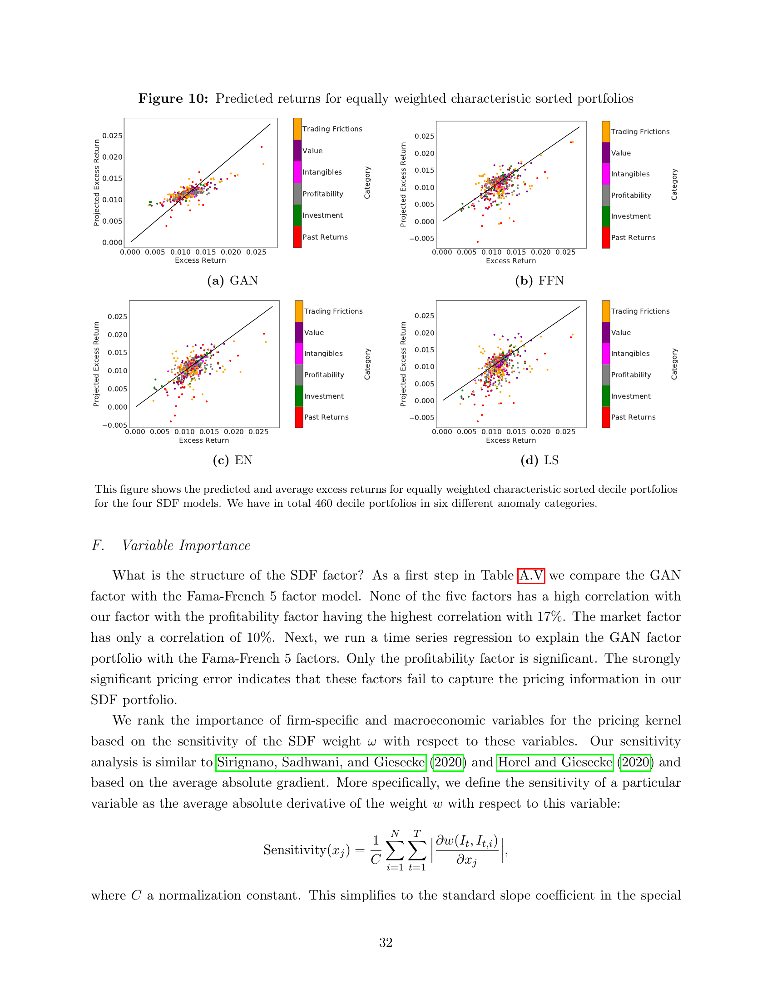
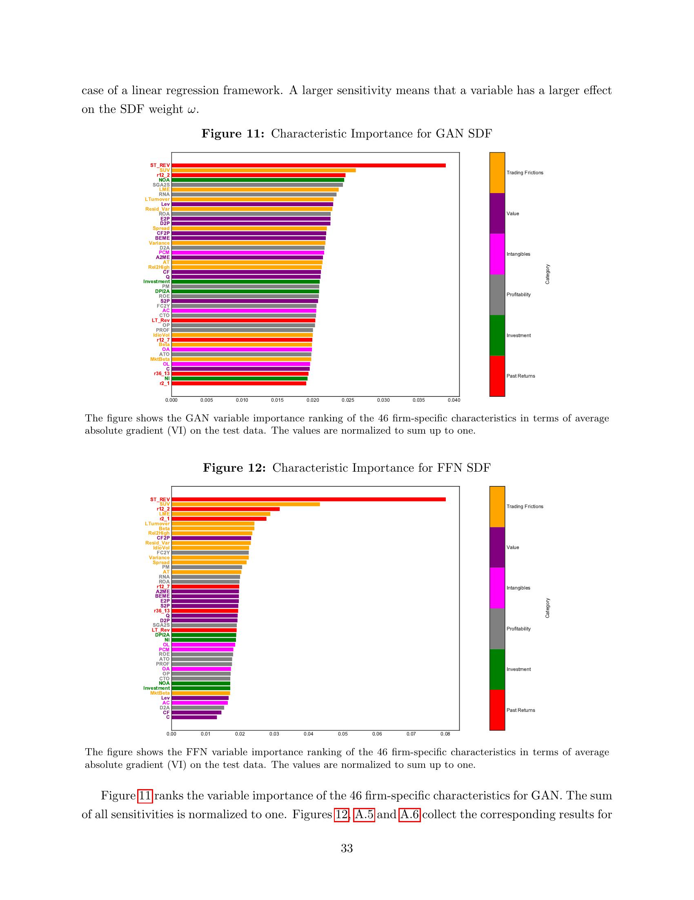
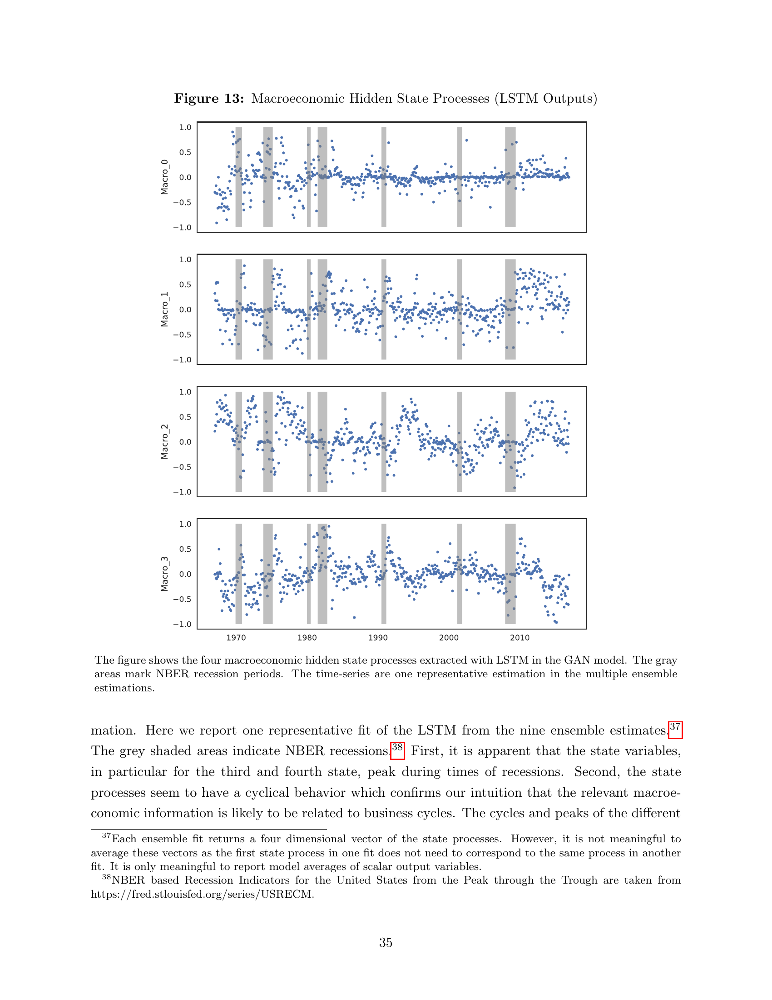

# 11. Variable Importance & Macro States — Section III.F–G

## 📌 이 챕터 다 읽으면 알 수 있는 것

- Variable Importance 측정 방법 — sensitivity analysis
- 178 macro 시계열 중 top 변수들
- LSTM 의 4 hidden state 가 학습한 economic regime

---

paper p.32-37 (Section III.F, III.G). **Table A.V (GAN vs FF5) + Fig 11 (GAN var imp) + Fig 12 (FFN var imp) + Fig 13 (LSTM hidden states) + Fig A.7/A.4 (g + macro) + SDF structure (Sec III.G)**.

이 챕터의 목표: paper 가 model 의 **내부** 를 어떻게 들여다보는지 — variable importance 의 측정법, Fig 11/12 의 막대 그래프 읽는 법, Fig 13 의 hidden state 시계열의 NBER recession 매칭, SDF structure 의 nonlinear interaction.

---

## 11.1 챕터 한 줄 요약

- **GAN 의 SDF top 변수**: ST_REV, SUV, r12_2 (momentum) — Trading Frictions + Past Returns 카테고리.
- **6 카테고리 모두 top 20 에 포함** — diversified risk source.
- **FFN** 은 trading friction 만 — penny stock illiquid 의존 의심.
- **4 LSTM hidden states** 가 NBER 경기침체 기간과 일치 — business cycle 자율 학습.
- **SDF structure**: 개별 char linear, interaction nonlinear → GAN 의 진짜 차별점.

---

## 11.2 GAN factor vs Fama-French 5 (Table A.V)

paper Section III.F opening (paper p.32):
> "What is the structure of the SDF factor? As a first step in Table A.V we compare the GAN factor with the Fama-French 5 factor model. None of the five factors has a high correlation with our factor with the profitability factor having the highest correlation with 17%. The market factor has only a correlation of 10%. Next, we run a time series regression to explain the GAN factor portfolio with the Fama-French 5 factors. Only the profitability factor is significant. The strongly significant pricing error indicates that these factors fail to capture the pricing information in our SDF portfolio."

### Step 1 — 비교 setup

**Fama-French 5 (FF5) factors**:
- **Market** (MKT-RF): 시장 전체 (CAPM 의 single factor).
- **SMB**: Small minus Big (size effect).
- **HML**: High minus Low book-to-market (value).
- **RMW**: Robust minus Weak profitability.
- **CMA**: Conservative minus Aggressive investment.

→ Fama-French 가 1990s-2010s 의 asset pricing 표준.

### Step 2 — Correlation 분석

| FF5 factor | Correlation with GAN factor |
|------------|-----------------------------|
| Market | 10% |
| SMB | (low) |
| HML | (low) |
| **RMW (Profitability)** | **17%** (highest) |
| CMA | (low) |

**모든 correlation < 20%** — GAN factor 가 FF5 와 거의 독립.

→ **GAN 이 진짜 새로운 risk dimension** 을 발견.

### Step 3 — 시계열 회귀 분석

$$\text{GAN factor}_t = \alpha + \beta_1 \text{MKT}_t + \beta_2 \text{SMB}_t + \beta_3 \text{HML}_t + \beta_4 \text{RMW}_t + \beta_5 \text{CMA}_t + \epsilon_t$$

**결과**:
- Only **RMW** 가 significant.
- α (intercept) 매우 유의 (지속 positive pricing error).
- → FF5 가 GAN 의 정보 못 잡음.

### Step 4 — 함의

**기존 factor zoo (Cochrane 2011)**:
- 300+ 개 anomaly factors 발견.
- "어느 게 진짜 risk factor 인가" 불분명.

**본 paper 의 답**:
- GAN factor 가 기존 FF5 와 거의 독립 — 새 dimension.
- 그러면서도 OOS test 에서 SR 0.75 (vs FF5 의 0.13) — 실제로 잘 가격결정.
- → **새 factor 가 진짜 risk premium 을 잡고 있음**.

---

## 11.3 Variable Importance — 측정법 정의

paper p.32 본문 (Section III.F):

수식 (paper 의 Sensitivity 정의):
$$
\text{Sensitivity}(x_j) = \frac{1}{C} \sum_{i=1}^N \sum_{t=1}^T \left| \frac{\partial w(I_t, I_{t,i})}{\partial x_j} \right|
$$

### 🔣 4-단 기호 풀이 (Sensitivity)

| 기호 | 한국어 | 일상 비유 | 조심할 점 |
|------|--------|-----------|-----------|
| $w$ | SDF weight (NN output) | "학생의 답안" | $\omega$ 와 같음 |
| $x_j$ | j-번째 characteristic | "재료 j (예: ST_REV)" | $j \in \{1, ..., 46\}$ |
| $\partial w / \partial x_j$ | partial derivative | "x_j 살짝 바꾸면 w 가 얼마나 변하나" | gradient (NN 의 backprop) |
| $|\cdot|$ | absolute value | "방향 무시, magnitude 만" | + 효과와 - 효과 합쳐서 |
| $\sum_i \sum_t$ | N × T 합계 | "모든 자산 × 모든 시점" | average gradient magnitude |
| $C$ | normalization const | "합이 1 되도록 조정" | $\sum_j \text{Sens}(x_j) = 1$ |

**🌱**: "**x_j 를 흔들면 모델 답안 (w) 이 얼마나 흔들리나** 의 평균 → 중요도".

### Step 1 — 수식의 의미 풀이

| 기호 | 의미 |
|------|------|
| $w$ | SDF weight network |
| $x_j$ | $j$-번째 characteristic |
| $\partial / \partial x_j$ | $j$ 변수에 대한 partial derivative (gradient) |
| $|\cdot|$ | absolute value (방향 무시, magnitude 만) |
| $\sum_i \sum_t$ | 모든 stock + 모든 시점 평균 |
| $C$ | normalization constant (전체 합 = 1) |

### Step 2 — 직관

"$x_j$ 를 살짝 변화시키면 $w$ 가 얼마나 변하나" 의 평균 magnitude.
- 큰 sensitivity → $x_j$ 가 SDF 에 중요.
- 작은 sensitivity → $x_j$ 거의 무관.

비유 (요리):
- "소금이 음식 맛에 얼마나 중요한가" = 소금 양을 살짝 바꿀 때 맛이 얼마나 변하나.
- 같은 원리 — $x_j$ 의 영향력 측정.

### Step 3 — Linear regression 의 special case

paper 본문:
> "This simplifies to the standard slope coefficient in the special case of a linear regression framework."

**Linear $w = \sum_j \beta_j x_j$ 의 경우**:
- $\partial w / \partial x_j = \beta_j$ — 상수.
- Sensitivity = $|\beta_j|$ — 표준 회귀 계수의 절댓값.

→ Linear 와 NN 의 importance 측정이 일관된 framework.

### Step 4 — Reference 인용

paper 가 인용한 선행 연구:
- Sirignano-Sadhwani-Giesecke (2020) — mortgage prepayment 의 deep NN.
- Horel-Giesecke (2020) — significance test in NN, house price.

→ NN 의 variable importance 측정의 표준 방식.

---

### 🆚 자매 paper 와의 char importance 비교

| Paper | Top char | char importance 측정 | 발견 |
|-------|---------|------------------|------|
| **본 paper (GAN)** | ST_REV, SUV, r12_2 | gradient ∂ω/∂x | 6 카테고리 모두 top 20 |
| [Autoencoder (Gu-Kelly-Xiu)](../2026-05-17_gu-kelly-xiu-autoencoder/00_README.md) | LME, MOM | network sensitivity (Fig 4) | 비슷한 ranking |
| [RPPCA](../2026-05-17_lettau-pelger-rppca/00_README.md) | (factor 분해) | n/a (PCA factor) | factor 자체가 ranking |

→ 두 ML paper (GAN, Autoencoder) 가 **비슷한 top chars** 식별 — robust finding.

---

## 11.4 Figure 11 — GAN Variable Importance (paper p.33)



(Figure 11, paper p.33)

### 📖 처음 보는 사람을 위한 — Figure 11 읽는 법

**이 그림이 보여주는 것**: GAN 의 SDF 가 **어떤 firm chars 를 가장 많이 사용하는지** 순위. 46 chars 의 importance ranking.

**일상 비유 (요리 재료)**:
- 46 chars = "46 가지 재료".
- 각 재료의 importance = "이 재료를 빼면 음식 맛이 얼마나 변하나" 의 민감도.
- GAN = "균형 잡힌 셰프" — 6 카테고리 (재료 종류) 골고루 사용.

**그림 구조**:
- **세로 (46 줄)**: 46 firm chars, importance 내림차순 (top = 가장 중요).
- **가로 (X축)**: Sensitivity 값 (0.000-0.040, 합 = 1).
- **막대 색**: 6 anomaly category 별 색.
  - **빨강**: Past Returns (momentum, reversal).
  - **주황**: Trading Frictions (size, liquidity).
  - **보라**: Value.
  - **회색**: Profitability.
  - **녹색**: Investment.
  - **분홍**: Intangibles.

**어디부터 보면 되나**:
1. Top 3: ST_REV (빨강), SUV (주황), r12_2 (빨강) — 가장 중요한 3 chars.
2. **다양한 색이 골고루 섞여 있나** — GAN 의 강점은 6 카테고리 모두 사용.
3. Top 20 안에 모든 6 색이 다 있나 — 본 paper 의 핵심 발견.

**핵심 발견**:
- Top: ST_REV (~0.040), SUV (~0.030), r12_2 (~0.027).
- **6 카테고리 모두 top 20**: diversified.
- Distribution shape: gradual decay (top 과 bottom 차이 작음).

---

### Step 1 — 그림의 구조 이해

**축**:
- **세로 (rows)**: 46 firm characteristics, **importance 내림차순**.
- **가로 (X-axis)**: Sensitivity value (normalized, 합 = 1, range 0.000-0.040).
- **막대 색**: 6 category color.
  - **Trading Frictions** (orange): SUV, LME, LTurnover, Variance, IdioVol, Spread, Beta, MktBeta, Rel2High, Resid_Var.
  - **Value** (purple): BEME, D2P, E2P, A2ME, CF2P, Q, S2P, OP, PROF.
  - **Intangibles** (pink/magenta): AT, AC, C, CF, D2A, FC2Y, PCM, SGA2S.
  - **Profitability** (gray): ROA, ROE, PM, RNA, OL, ATO, NI, CTO.
  - **Investment** (green): Investment, NOA, DPI2A, Lev, OA.
  - **Past Returns** (red): ST_REV, LT_Rev, r12_2, r12_7, r36_13, r2_1.

### Step 2 — Top 20 의 정확한 ranking (Fig 11 시각 reading)

| 순위 | 변수 | 카테고리 |
|------|------|---------|
| 1 | **ST_REV** (short-term reversal) | Past Returns (red) |
| 2 | **SUV** (standard unexplained volume) | Trading Frictions (orange) |
| 3 | **r12_2** (12-month momentum) | Past Returns (red) |
| 4 | NOA | Investment (green) |
| 5 | SGA2S | Intangibles (pink) |
| 6 | RNA | Profitability (gray) |
| 7 | LTurnover | Trading Frictions (orange) |
| 8 | Lev | Trading Frictions (orange) |
| 9 | Resid_Var | Trading Frictions (orange) |
| 10 | ROA | Profitability (gray) |
| 11 | E2P | Value (purple) |
| 12 | D2P | Value (purple) |
| 13 | Spread | Trading Frictions (orange) |
| 14 | CF2P | Value (purple) |
| 15 | BEME | Value (purple) |
| 16 | Variance | Trading Frictions (orange) |
| 17 | D2A | Intangibles (pink) |
| 18 | PCM | Intangibles (pink) |
| 19 | A2ME | Value (purple) |
| 20 | AT | Intangibles (pink) |

→ **6 category 모두 top 20 에 포함**.

### Step 3 — 핵심 발견 — diversified importance

paper p.33:
> "Figure 11 ranks the variable importance of the 46 firm-specific characteristics for GAN. The sum of all sensitivities is normalized to one. ... All three models GAN, FFN and EN select trading frictions and past returns as being the most relevant categories. **The most important variables for GAN are Short-Term Reversal (ST_REV), Standard Unexplained Volume (SUV) and Momentum (r12_2). Importantly, for GAN all 6 categories are represented among the first 20 variables**, which includes value, intangibles, investment and profitability characteristics."

**왜 이게 중요한가**:
- GAN 이 다양한 source 의 risk premium 활용.
- 한 카테고리 (예: trading friction) 에만 의존하지 않음.
- → 진짜 SDF 가 다차원적.

### Step 4 — Top 3 의 의미

#### ST_REV (Short-Term Reversal, 1순위)

- 정의: 지난 1개월 return 의 -1 배 (reversal).
- 의미: "지난 달 많이 오른 stock 이 이번 달 내림" 의 강도.
- 학계: well-known anomaly (Jegadeesh 1990).
- 매우 강한 effect — 첫 번째 importance 차지.

#### SUV (Standard Unexplained Volume, 2순위)

- 정의: 시계열 회귀의 residual 의 표준편차 (volume of trade).
- 의미: 거래량의 "예측 안 되는" 부분 — illiquidity 또는 information asymmetry 의 proxy.
- 학계: Garfinkel-Sokobin (2006).

#### r12_2 (12-Month Momentum, 3순위)

- 정의: 지난 12개월 (현재 제외) 의 누적 return.
- 의미: medium-term momentum.
- 학계: Jegadeesh-Titman (1993) — 가장 well-studied anomaly 중 하나.

→ 세 변수 모두 short-term/medium-term return dynamics.

### Step 5 — Bottom variables (낮은 importance) 의 의미

Bottom 의 변수들:
- NI (number of issues) — 거의 무관.
- OA (operating accruals) — 약함.
- r2_1 — 다른 momentum 변수와 redundant.

**왜 낮은가**:
- 다른 top 변수와 highly correlated (redundancy).
- 또는 진짜 risk premium 약함.

---

## 11.5 Figure 12 — FFN Variable Importance (paper p.34)

### 📖 처음 보는 사람을 위한 — Figure 12 읽는 법 (Fig 11 과 비교)

**이 그림이 보여주는 것**: **FFN 모델** (no-arbitrage 없는 ML) 이 어떤 chars 를 사용하는지. **Fig 11 (GAN) 과 비교 위한 그림**.

**일상 비유 (요리 재료 비교)**:
- 같은 46 재료 중 FFN 셰프는 **3 가지 (빨강 + 주황) 만 집중 사용**.
- GAN 셰프는 6 카테고리 골고루.
- FFN = **편식 셰프** — 한 두 카테고리에만 의존.

**Fig 11 (GAN) vs Fig 12 (FFN) 의 결정적 차이**:

| 측면 | Fig 11 (GAN) | Fig 12 (FFN) |
|------|------|------|
| Top 1 sensitivity | ~0.040 (ST_REV) | **~0.080 (ST_REV)** — 2배! |
| Distribution | Gradual (top → bottom 작은 차이) | Concentrated (top 매우 큼, sharp drop) |
| Top 20 의 색 | 6 색 모두 | 빨강 + 주황 위주 |
| 해석 | Diversified — 다양한 risk source | Penny stock illiquid 의존 의심 |

**어디부터 보면 되나**:
1. Top 1 ST_REV 의 막대 길이 — GAN ~0.04, FFN **~0.08** (2 배).
2. Top 14 의 색 — FFN 은 거의 다 빨강 + 주황.
3. **paper 본문 (p.34): "raises the suspicion that a simple forecasting approach might focus mainly on illiquid penny stocks"**.

→ Fig 11 vs Fig 12 의 시각 비교가 paper 의 핵심 메시지: **No-arbitrage 가 diversity 강제**.

---



(Figure 12, paper p.34)

### Step 1 — Fig 11 과의 비교

**구조 동일**: 46 chars 가 importance 순으로 정렬, 색 = category.

**Top 의 차이**:

| 순위 | GAN (Fig 11) | FFN (Fig 12) |
|------|--------------|--------------|
| 1 | ST_REV (red) | **ST_REV** (red) |
| 2 | SUV (orange) | **SUV** (orange) |
| 3 | r12_2 (red) | **r12_2** (red) |
| 4 | NOA (green) | **r2_1** (red) |
| 5 | SGA2S (pink) | **D2P** (purple) |
| 6 | RNA (gray) | **LTurnover** (orange) |
| 7 | LTurnover (orange) | LME (orange) |
| 8 | Lev (orange) | Rel2High (orange) |
| 9 | Resid_Var (orange) | Resid_Var (orange) |
| 10-14 | 다양 | 거의 orange + red |

### Step 2 — 핵심 차이 — category 다양성

paper p.33-34:
> "The SDF composition is different for FNN, where **the first 14 characteristics are almost only in the trading friction and past return category**. More specifically, this SDF loads heavily on short-term reversal, illiquidity measured by unexplained volume and size, which raises the suspicion that **a simple forecasting approach might focus mainly on illiquid penny stocks**."

**FFN 의 약점**:
- Top 14 중 trading friction (orange) + past return (red) 만.
- Value (purple), Profitability (gray), Investment (green), Intangibles (pink) 거의 무시.
- → **한 종류의 mispricing 에 집중**.

**왜 위험한가**:
- Trading friction 의 strong importance = **illiquid penny stocks** 에 의존.
- 작은 stocks 는 거래량 적음 → 진짜 mispricing 인지 거래비용인지 분리 어려움.
- Real-world deployment 에서 거래비용 초과 가능.

### Step 3 — No-arbitrage 가 다양성 강제하는 원리

paper:
> "The no-arbitrage condition with informative test assets seems to be necessary to discipline the model to capture the pricing information in other characteristics."

**메커니즘**:
- GAN 의 conditional network $g$ 가 모든 6 카테고리에서 test asset 생성 (Fig A.7).
- SDF 가 각 test asset 의 pricing error 를 최소화해야 함.
- → 한 카테고리에만 의존하면 다른 카테고리의 test asset 에서 pricing error 큼.
- → **모든 카테고리 골고루** 학습 강제.

**vs FFN**:
- FFN 은 mean return 직접 예측 — adversarial test asset 없음.
- 강한 signal (trading friction) 만 학습.

### Step 4 — 시각적 관찰

Fig 11 vs Fig 12 의 막대 길이 패턴:
- Fig 11 (GAN): top 의 막대가 비슷한 길이 (gradual decay).
- Fig 12 (FFN): top 3 가 매우 길고 (sharp), 나머지는 짧음 (concentrated).

→ **GAN = diversified, FFN = concentrated**.

### Step 5 — Figure 11 의 정확한 막대 X-axis 값 (시각 reading)

paper Fig 11 의 정확 sensitivity 값:

| Rank | Char | Category (color) | Sensitivity |
|------|------|---------|-----------|
| 1 | ST_REV | Past Returns (red) | **~0.040** |
| 2 | SUV | Trading Frictions (orange) | ~0.030 |
| 3 | r12_2 | Past Returns (red) | ~0.027 |
| 4 | NOA | Investment (green) | ~0.025 |
| 5 | SGA2S | Intangibles (pink) | ~0.024 |
| 6 | RNA | Profitability (gray) | ~0.024 |
| 7 | LTurnover | Trading Frictions (orange) | ~0.023 |
| 8 | Lev | Trading Frictions (orange) | ~0.023 |
| 9 | Resid_Var | Trading Frictions (orange) | ~0.022 |
| 10 | ROA | Profitability (gray) | ~0.022 |
| ... | (모두 비슷한 값) | | ~0.020 - 0.022 |
| 46 | r2_1 | Past Returns (red) | ~0.018 (최저) |

**Total**: 합 = 1 (normalized).

**Top 1 ST_REV ~ 0.04** = 평균 (0.022) 의 약 2배.
**Bottom (~0.018)** = 평균보다 약간 낮음.

→ GAN 의 importance 분포가 **gradual** — 한 변수가 압도적이지 않음.

### Step 6 — Figure 12 의 정확한 막대 X-axis 값

paper Fig 12 의 정확 값:

| Rank | Char | Category | Sensitivity |
|------|------|---------|-----------|
| 1 | ST_REV | Past Returns (red) | **~0.080** (GAN 의 2배!) |
| 2 | SUV | Trading Frictions (orange) | ~0.045 |
| 3 | r12_2 | Past Returns (red) | ~0.030 |
| 4 | r2_1 | Past Returns (red) | ~0.026 |
| 5 | D2P | Value (purple) | ~0.022 |
| 6 | LTurnover | Trading Frictions | ~0.022 |
| 7 | LME | Trading Frictions | ~0.022 |
| 8 | Rel2High | Trading Frictions | ~0.021 |
| 9 | Resid_Var | Trading Frictions | ~0.021 |
| 10 | Beta | Trading Frictions | ~0.020 |
| ... | (Trading + Past 만 top 14) | | |

**Top 1 ST_REV ~ 0.080** = GAN 의 2배. **Sharp drop** to 0.045.

→ FFN 의 importance 분포가 **concentrated** — 한 두 변수에 매우 집중.

### Step 7 — GAN vs FFN 의 importance distribution shape 비교

**시각적 차이**:

```
   GAN (Fig 11) — Gradual decay
   ┌──────────────────────────┐
   │ ████ ST_REV  (0.040)      │
   │ ███  SUV     (0.030)      │
   │ ███  r12_2   (0.027)      │
   │ ██   NOA     (0.025)      │
   │ ██   ...     (~0.022)     │
   │ ██   bottom  (~0.018)     │
   │ ▲ 평탄한 distribution     │
   └──────────────────────────┘
   
   FFN (Fig 12) — Sharp concentration
   ┌──────────────────────────┐
   │ ████████ ST_REV  (0.080) │ ← 압도적 1위
   │ ████    SUV     (0.045) │ ← 큰 drop
   │ ███     r12_2   (0.030) │
   │ ██      r2_1    (0.026) │
   │ ██      ...              │
   │ ▲ 급격한 distribution     │
   └──────────────────────────┘
```

→ **GAN = diversified, FFN = concentrated**. 통계적 비교: variance of sensitivities = FFN 이 훨씬 큼.

### Step 8 — Interactive viz

```viz:dlap-var-importance:title=paper Fig 11 / 12 — 46 chars variable importance (interactive),caption=Model 토글로 GAN vs FFN 전환. Top-K 슬라이더로 표시 개수 조절. GAN 은 6 카테고리 모두 top 20, FFN 은 trading friction + past return 만 집중. paper Section III.F 가 FFN 의 'penny stock 의존 의심' 으로 해석. **주의**: paper 가 정확한 sensitivity 수치 본문 미발표 — viz 값은 Fig 11/12 막대 길이의 시각 reading 기반.
```

---

## 11.6 Variable Importance — Conditioning $g$ (Fig A.7)

paper p.34:
> "Figure A.7 shows the variable importance ranking for the conditioning vector g. **The GAN test assets depend on all six major anomaly categories.** These test assets ensure that the GAN SDF also reflects this information."

### Step 1 — $g$ 의 역할

$g$ = conditional network = **test asset generator** (adversarial).
- $g$ 가 가장 mispriced 한 portfolio 자동 발견.
- SDF 가 그 portfolio 의 pricing error 최소화.
- → $g$ 가 어느 chars 에 의존하나 = **어디 mispricing 있나** 의 visualization.

### Step 2 — Fig A.7 의 발견

$g$ 의 importance ranking 도 6 카테고리 모두 활용.
- $g$ 가 trading friction → SDF 가 trading friction 학습.
- $g$ 가 value → SDF 가 value 학습.
- → SDF 와 $g$ 의 **bidirectional discipline**.

### Step 3 — Linear EN 의 비교

paper p.34:
> "The linear model with regularization also selects variables from all six categories among the first 9 variables. Note, that the elastic net penalty removes characteristics that are close substitutes, for example, as the dividend-price ratio (D2P) and book-to-market ratio (BEME) capture similar information, the regularized model only selects one of them. The linear model without regularization cannot handle the large number of variables and not surprisingly results in a different ranking."

→ **EN 의 L1 sparsity** 가 redundant chars (예: D2P, BEME) 중 하나만 선택. 다른 카테고리 모두 잡지만 1-2 chars 만.

---

## 11.7 Macro Variable Importance (Fig A.4)

paper p.34 본문:
> "Figure A.4 shows the importance of the macroeconomic variables for the GAN model. These variables are first summarized into the four hidden states processes before they enter the weights of the SDF. First, it is apparent that **most macroeconomic variables have a very similar importance**. This is in line with a model where there is a strong dependency between the macroeconomic time series which is driven by a low dimensional non-linear factor structure."

### Step 1 — Similar importance 의 의미

178 macro 변수의 sensitivity 가 **비슷한 magnitude** — 한 변수가 압도적으로 중요한 게 아님.

**원인**:
- Macro 변수들이 **highly correlated**.
- 한 underlying factor (예: business cycle) 가 모든 macro 변수 driving.
- → 모든 변수가 비슷한 정보 carry → 비슷한 importance.

비유 (오케스트라):
- 한 곡 (business cycle) 을 100 악기가 동시 연주.
- 각 악기 (macro variable) 의 importance 가 비슷 — 모두 같은 곡 담당.

### Step 2 — Top macro variables

paper:
> "The two most relevant variables that stand out in our importance ranking are the **median bid-ask spread (Spread)** and the **federal fund rate (FEDFUNDS)**. These can be interpreted as capturing the overall economic activity level and overall market volatility."

| 변수 | 의미 |
|------|------|
| **Spread (median bid-ask)** | 시장 전반의 volatility / liquidity |
| **FEDFUNDS (federal funds rate)** | 통화정책 / 경제 활동 수준 |

→ 거시경제의 **두 핵심 axis** (financial market vs monetary policy).

### Step 3 — PCA factors vs LSTM hidden states

paper p.34 (footnote 36):
> "The results for PCA based macroeconomic factors are available upon request. We also want to clarify that for other applications PCA based factors based on macroeconomic time series might actually capture the relevant information."

**왜 PCA 가 본 application 에서 안 좋은가**:
- PCA factors = raw 차분 (increments) 의 linear combination.
- Dynamic pattern (level, trend, cycles) 손실.
- LSTM 은 시계열 dynamics 보존 → 더 풍부한 hidden state.

---

## 11.8 Figure 13 — LSTM Hidden States 와 NBER Recession (paper p.36)

### 📖 처음 보는 사람을 위한 — Figure 13 읽는 법 (★ 가장 놀라운 발견)

**이 그림이 보여주는 것**: LSTM 이 178 개 거시경제 데이터 (실업률·금리·물가 등) 를 압축한 **4 개 hidden state** 의 50 년 시계열. 회색 = NBER 경기침체 기간.

**일상 비유 (체온계)**:
- LSTM 의 hidden state = "경제의 체온".
- 정상이면 0 근처, 이상이면 ±1 근처.
- 회색 음영 = "실제 경기침체 (NBER 공식)" 시점.
- **놀라움**: LSTM 에게 "지금 경기침체인지 알려줘" 라고 한 번도 안 했는데 → state 가 자동으로 recession 에서 peak.

**그림 구조**:
- **4 sub-panel** (세로 배치): Macro_0, Macro_1, Macro_2, Macro_3 — 4 hidden state.
- **각 panel 의 축**:
  - X축: 1970-2020 (50 년).
  - Y축: state 값 (-1.0 ~ +1.0).
  - 파란 점: 각 시점의 state 값.
- **회색 음영**: NBER recession 7 개 (1970, 1973-75, 1980, 1981-82, 1990-91, 2001, 2007-09).

**어디부터 보면 되나**:
1. **회색 음영** (recession 시점) 을 먼저 본다 — 7 개.
2. **각 state 가 회색에서 peak** 인지 — 특히 State 3, 4 가 명확.
3. **State 들이 cyclical** 한가 — 모두 그렇다 = business cycle pattern.
4. **State 들이 다른 phase** 인가 — 그렇다 = 서로 다른 macro risk.

**핵심 발견**:
- paper 본문: "State variables, in particular for the third and fourth state, **peak during times of recessions**."
- **LSTM 이 자율적으로 business cycle 학습** — supervision 없음.
- 가장 큰 peak: 2007-2009 (Lehman crisis).

---



(Figure 13, paper p.36)

### Step 1 — 그림의 구조 이해

**축**:
- **4 sub-panels** (세로 배치): Macro_0, Macro_1, Macro_2, Macro_3.
- **각 panel 의 X-axis**: 시간 (1970 → 2020, 50년).
- **각 panel 의 Y-axis**: state value (range -1 to 1).
- **점 (파란)**: 각 시점의 hidden state 값.
- **회색 음영 (gray bars)**: NBER recession 기간.

### Step 2 — NBER Recession 기간

NBER (National Bureau of Economic Research) 가 정의한 US recession (paper footnote 38):
- **1969-1970**: Vietnam War 영향.
- **1973-1975**: Oil crisis.
- **1980 + 1981-1982**: Volcker disinflation.
- **1990-1991**: Iraq invasion, S&L crisis.
- **2001**: Dot-com bust.
- **2007-2009**: Financial crisis (Lehman).

총 6-7 개 recession 기간 (gray bars).

### Step 3 — 4 hidden states 의 패턴

#### Macro_0 (1st sub-panel)
- 변동 큰 cyclical pattern.
- 1970s 에 강한 oscillation, 2000s 이후 차분.
- NBER recession 시점 — 일부 peak.

#### Macro_1 (2nd sub-panel)
- 더 strong cyclical.
- 1970s, 1980s 의 큰 변동.
- 1990 이후 안정화.

#### Macro_2 (3rd sub-panel) — paper 가 강조
paper: "the state variables, in particular for the third and fourth state, peak during times of recessions."
- 회색 음영 시점에 명확한 peak.
- 특히 1973-75, 2007-09 에 큰 spike.

#### Macro_3 (4th sub-panel) — paper 가 강조
- Macro_2 와 유사한 패턴, 다만 다른 phase.
- Recession peaks 명확.

### Step 4 — paper 의 핵심 해석

paper p.35-37:
> "First, it is apparent that **the state variables, in particular for the third and fourth state, peak during times of recessions**. Second, **the state processes seem to have a cyclical behavior** which confirms our intuition that the relevant macroeconomic information is likely to be related to business cycles. The cycles and peaks of the different state variables do not coincide at all times indicating that they capture different macroeconomic risks."

**3 가지 발견**:

1. **Recession peak**: State 3, 4 가 NBER recession 에서 peak.
2. **Cyclical behavior**: 모든 state 가 cyclical.
3. **다른 phase**: 4 state 가 같은 시점에 동시 peak 아님 → 서로 다른 risk 잡음.

### Step 5 — "자율 학습 (unsupervised)" 의 의미

**중요**: 본 paper 가 NBER recession indicator 를 **input 으로 안 줌**.
- 학습 input: 178 macro time series (raw 차분 또는 level).
- 학습 objective: no-arbitrage pricing error 최소화.
- NBER label 없음.

**그러나** 학습 후 hidden states 가 NBER recession 와 명확히 매칭.

→ **LSTM 이 자율적으로 business cycle 발견**. 학습 objective 가 직접 economic regime 을 요구 안 했지만, **risk premium 패턴이 recession 과 묶여 있어서** 학습이 자연스럽게 business cycle 잡음.

### Step 6 — Ensemble 처리 주의

paper footnote 37:
> "Each ensemble fit returns a four dimensional vector of the state processes. However, it is not meaningful to average these vectors as the first state process in one fit does not need to correspond to the same process in another fit. It is only meaningful to report model averages of scalar output variables."

**의미**:
- Paper 는 9 ensemble (다양한 initialization) 으로 학습.
- 각 ensemble 의 hidden state 가 같은 의미를 가지지 않음 (예: ensemble 1 의 state 0 ≠ ensemble 2 의 state 0).
- → Fig 13 은 **9 ensemble 중 한 representative fit** 의 결과.

**왜 averaging 불가능한가**:
- Latent state 는 identification 까지 invariant.
- 즉 state 의 ordering, sign, scaling 이 학습마다 다름.
- Average 하면 의미 없는 noise.

→ Scalar output (예: SR, EV, XS-R²) 만 ensemble 평균 가능.

### Step 7 — 4 state 의 가능한 해석

각 state 가 다른 macro risk:

| State | 가능한 의미 |
|-------|----------|
| Macro_0 | 일반 economic level (GDP growth proxy) |
| Macro_1 | Inflation / monetary cycle |
| Macro_2 | Recession indicator |
| Macro_3 | Financial stress / volatility |

→ paper 가 정확한 해석 안 함 — "identification not unique" 이라.

### Step 8 — Interactive viz

```viz:dlap-lstm-states:title=paper Fig 13 — 4 LSTM hidden states + NBER (interactive),caption=State 1-4 buttons toggle on/off. 회색 음영 = NBER 경기침체 7개 (1969, 1973, 1980, 1981, 1990, 2001, 2008). State 3, 4 가 recession 기간에 peak. **주의**: paper 가 정확 state 값 미발표 — 본 viz 의 시계열은 paper 본문 ("cyclical + recession peak") 와 NBER 데이터 기반의 정성 재현.
```

---

## 11.9 SDF Structure — Section III.G (paper p.36-37)

### 📖 처음 보는 사람을 위한 — Figure 14/15 읽는 법

**이 그림이 보여주는 것**: SDF weight ω 가 firm chars 의 **어떤 함수** 인지 시각화. **개별 char 는 거의 linear** + **char × char interaction 은 nonlinear** 발견.

**일상 비유 (수입 ≒ 양념)**:
- ω = "음식의 맛".
- char 1 = "소금 양".
- char 2 = "설탕 양".
- 만약 ω = 0.5 × 소금 + 0.3 × 설탕 → linear (덧셈만).
- 만약 ω = 0.5 × 소금 × 설탕 → multiplicative interaction (곱셈) — nonlinear.
- **본 paper 발견**: 소금 자체는 linear, 설탕 자체도 linear, **그러나 소금 × 설탕 은 nonlinear**.

**Figure 14 (line plot, 2x2)**:
- 4 sub-panel:
  - (a top): ω vs ST_REV, **5 lines = momentum 의 5 quantile**.
  - (a bottom): ω vs momentum, **5 lines = ST_REV 의 5 quantile**.
  - (b top): ω vs size (LME), 5 lines = BEME quantile.
  - (b bottom): ω vs BEME, 5 lines = LME quantile.
- **검증법**: 5 lines 가 **평행 (parallel)** 이면 interaction 없음. **non-parallel** 이면 interaction.
- 결과: GAN 의 5 lines = **non-parallel** → interaction 있음.

**Figure 15 (heatmap/contour, 2x2)**:
- 4 sub-panel:
  - (a): ST_REV × momentum 2D contour.
  - (b): size × BEME 2D contour.
  - (c): triple interaction ST_REV × momentum × SUV (3D).
  - (d): triple interaction size × BEME × ST_REV (3D).
- **검증법**: contour 가 **smooth gradient + curve** → nonlinear interaction.
- 결과: 모두 saddle/dome shape → 강한 interaction.

**어디부터 보면 되나**:
1. Fig 14 (a)(b) 의 5 lines 가 평행한지 vs 교차하는지.
2. Fig 15 의 contour 모양 — flat 이면 linear, curve 면 nonlinear.
3. Fig 15 (c)(d) 의 3D triple interaction 의 색 변화.

**핵심 발견**:
- **개별 char**: 거의 linear (Fig A.9 에서 확인) → Fama-French linear 60년 성공 설명.
- **Interaction**: 강한 nonlinear (Fig 14, 15) → **GAN 의 진짜 차별점**.
- 가장 강한 interaction: ST_REV × momentum (paper p.37 의 triple 발견).

---

paper p.36 본문 두 핵심 발견:
> "Surprisingly, **individual characteristics have an almost linear effect on the pricing kernel and the risk loadings**, i.e. non-linearities matter less than expected for individual characteristics. Second, **the better performance of GAN is explained by non-linear interaction effects**, i.e. the general functional form of our model is necessary for capturing the dependency between multiple characteristics."

### Step 1 — 두 핵심 발견 다시

#### 발견 1: 개별 특성 → SDF 는 거의 선형

- SDF weight $\omega$ 와 한 char 의 관계를 plot.
- 대부분의 plot 이 **선형** 또는 monotonic.
- 비선형 효과 작음.

→ 그래서 linear EN 도 single-sorted 잘함 (Table III).

#### 발견 2: 특성 간 interaction 은 비선형

- 두 char 의 contour plot (Fig 14/15).
- saddle 또는 dome shape — 강한 nonlinearity.
- 한 char fix 시 다른 char 의 효과가 달라짐.

→ Linear/additive 못 잡고 GAN 만 잡음.

### 🔣 4-단 기호 풀이 (Fig 14/15 의 핵심 5 characteristics)

| 기호 | 한국어 (paper 약자) | 일상 비유 | 조심할 점 |
|------|---------------------|-----------|-----------|
| **ST_REV** | short-term reversal (지난 1개월 수익 반전) | "지난달 폭락한 학생 → 이번달 반등" | sign 반대로 해석 (high ST_REV = 지난달 많이 오른 = 이번달 떨어질 확률 ↑) |
| **r12_2** | 12-2 month momentum (지난 12개월 수익, 직전 1개월 제외) | "최근 1년 꾸준히 잘한 학생" | ST_REV 와 부호 반대 (반전 vs 추세) |
| **LME** | log Market Equity (시가총액 로그) | "회사 크기" | small cap (low LME) 에서 비선형 강함 |
| **BEME** | Book-to-Market Equity (장부가/시장가) | "장부상 가치 ÷ 주가" | high BEME = value stock, low = growth |
| **SUV** | Standardized Unexplained Volume (예상 외 거래량) | "평소보다 갑자기 거래 많이 된 학생" | 정보 비대칭 proxy |

**🌱**: paper 가 발견한 **3-way interaction "low ST_REV + high r12_2 + high SUV"** 의 해석:
- "**최근 한 달 별로였지만** (반등 후보) + **1년 추세는 강하고** (모멘텀 살아있음) + **거래량 갑자기 폭증** (뭔가 정보 있음)" = **highest SDF weight** → SDF 가 가장 좋게 평가하는 조합.
- 이 3-way 조합은 linear/additive 모델로 **절대 못 잡음** — char1×char2×char3 곱 term 이 필요.

### Step 2 — Figure 14 — Pairwise Interaction (Line plot)

paper Fig 14 (p.36) — 2 sub-panels, **각 panel 안에 5개 line (10%, 25%, 50%, 75%, 90% quantile of 2nd variable)**:

#### (a) ST_REV × r12_2 (momentum)
- 좌측: $\omega$ vs ST_REV, conditioned on quantile of r12_2.
- 우측: $\omega$ vs r12_2, conditioned on quantile of ST_REV.

#### (b) LME × BEME (size × value)
- 좌측: $\omega$ vs LME, conditioned on quantile of BEME.
- 우측: $\omega$ vs BEME, conditioned on quantile of LME.

**Key test** (paper p.37):
> "In an additive model without interaction all lines would be parallel shifts. This is exactly what we see for the two linear models. Interestingly, for size and value, the FFN model also has almost parallel shifts in the SDF weights, implying that it does not capture interactions. However, for GAN small stocks have a very different exposure to value than large cap stocks. The line plots for GAN reveal more complex interaction patterns than for the other models."

**해석**:
- **Parallel shifts** = additive (no interaction).
- LS, EN, **FFN 도** parallel — interaction 없음.
- **GAN 만 non-parallel** → interaction 잡힘.

### Step 3 — Figure 15 — 2D Contour + Triple Interaction

paper Fig 15 (p.37) — 4 sub-panels, **2D contour heatmap**:

| Sub | 변수 |
|-----|------|
| (a) | ST_REV × r12_2 (2D) |
| (b) | LME × BEME (2D) |
| (c) | ST_REV, r12_2, SUV (triple) |
| (d) | LME, BEME, ST_REV (triple) |

paper p.37:
> "It confirms that the combined size and book-to-market characteristics have a highly non-linear effect on the GAN pricing kernel. The triple interaction in Figure 15 shows that **low short-term reversal, high momentum and high explained volume has the highest positive weight while high reversal, low momentum and low unexplained volume has the largest negative weight in the kernel** when conditioning on these three characteristics."

**3-way interaction 의 구체적 발견**:

| 조합 | $\omega$ |
|------|----------|
| Low ST_REV + High r12_2 + High SUV | **highest positive** |
| High ST_REV + Low r12_2 + Low SUV | **largest negative** |
| 다른 조합 | 거의 neutral |

→ **3 변수의 곱 효과** — linear 또는 additive 못 잡음. GAN 의 NN 만 잡음.

### Step 4 — Figure A.9 — Univariate (1D)

paper p.36:
> "Figure A.9 plots the one-dimensional relationship between the SDF weights ω and one specific characteristic. ... **It is striking how close the functional form of the SDF for GAN and FFN is to a linear function.** This explains why linear models are actually so successful in explaining single-sorted characteristics. For a small number of characteristics, for example short-term reversal, GAN has some non-linearities around the median. These are exactly the decile sorted portfolios for which GAN performs better than FFN and EN."

**관찰**:
- 1D plot (한 char vs $\omega$) 가 거의 linear.
- 예외: ST_REV — median 근처에서 약간 nonlinear.
- → ST_REV 가 GAN > EN 의 가장 큰 격차 (Table III) 의 이유.

### Step 5 — Figure 14/15 의 정확한 color range + contour 값

paper Fig 14/15 의 정확 colorbar (paper figure 의 시각 reading):

#### Figure 14 (2x2 line plot, paper p.36)

**Sub-panel (a) top: $\omega$ vs ST_REV, conditioned on r12_2 quantiles**
- X-axis: ST_REV, $[-0.4, 0.4]$.
- Y-axis: $\omega$, **range $[-0.06, 0.04]$**.
- 5 lines (5 colors, 5 quantiles of r12_2): 10%, 25%, 50%, 75%, 90%.
- 관찰: 5 lines **non-parallel** — momentum quantile 별로 ST_REV 의 효과 다름.

**Sub-panel (a) bottom: $\omega$ vs r12_2, conditioned on ST_REV quantiles**
- X-axis: r12_2, $[-0.4, 0.4]$.
- Y-axis: $\omega$, range $[-0.06, 0.04]$.
- 5 lines (5 ST_REV quantiles).
- 관찰: non-parallel.

**Sub-panel (b) top: $\omega$ vs LME, conditioned on BEME quantiles**
- X-axis: LME, $[-0.4, 0.4]$.
- Y-axis: $\omega$, **range $[-0.015, 0.015]$** (BEME 효과 작음).
- 5 lines (BEME quantiles).
- 관찰: small variation, but non-parallel.

**Sub-panel (b) bottom: $\omega$ vs BEME, conditioned on LME quantiles**
- 마찬가지 구조.

→ **Fig 14 의 핵심**: parallel = no interaction. **GAN 의 5 lines 가 non-parallel** = interaction 잡힘.

#### Figure 15 (2x2 contour + 3D, paper p.37)

**Sub-panel (a): ST_REV × r12_2 (2D heatmap)**
- X-axis: ST_REV, $[-0.4, 0.4]$.
- Y-axis: r12_2, $[-0.4, 0.4]$.
- **Colorbar 값**: **-0.0699 ~ 0.0406** (정확 paper Fig 15 caption).
- Color: purple (negative) → orange (positive).
- Pattern: smooth gradient with curve — saddle-like.

**Sub-panel (b): LME × BEME (2D heatmap)**
- 같은 axes.
- **Colorbar 값**: **-0.01023 ~ 0.01426**.
- Pattern: gradient + 일부 curve.
- → Size × value 의 nonlinear interaction.

**Sub-panel (c): 3D plot — ST_REV × r12_2 × SUV (4 slices)**
- 3 axes (LME, r12_2, SUV).
- 4 slices (SUV quantiles).
- **Colorbar 값**: **-0.0944 ~ 0.0586**.
- Pattern: triple interaction — 각 SUV slice 가 다른 pattern.

**Sub-panel (d): 3D plot — LME × BEME × ST_REV (4 slices)**
- **Colorbar 값**: **-0.05191 ~ 0.03728**.
- Pattern: 더 복잡 — triple interaction with size, value, reversal.

### Step 6 — paper Fig 14/15 caption 풀이

paper Fig 14 caption:
> "These figures show the SDF weight ω as function of short-term reversal, momentum, size and book-to-market ratio for different quantiles of the second variable while keeping the remaining variables at their mean level."

→ "한 변수 vs ω" plot 에 **다른 변수의 5 quantile 별** 으로 5 lines.

paper Fig 15 caption:
> "These figures show the SDF weight ω as two- and three-dimensional function of characteristics keeping the remaining variables at their mean level."

→ Pairwise (2D) + triple (3D) interaction 시각화. 나머지 chars 는 mean (median) 으로 고정.

### Step 7 — paper 본문의 triple interaction 의 정확한 해석

paper p.37:
> "The triple interaction in Figure 15 shows that low short-term reversal, high momentum and high explained volume has the highest positive weight while high reversal, low momentum and low unexplained volume has the largest negative weight in the kernel when conditioning on these three characteristics."

#### Combination table

| ST_REV | r12_2 | SUV | $\omega$ |
|--------|-------|-----|----------|
| Low | High | High | **Highest positive (~0.06)** |
| High | Low | Low | **Largest negative (~-0.09)** |
| Low | Low | Any | Neutral (~0) |
| High | High | Any | Neutral (~0) |

→ **3 변수의 곱 효과** — linear/additive 못 잡음. GAN 만 잡음.

### Step 8 — Interactive viz

```viz:dlap-sdf-surface:title=paper Figs 14, 15 — SDF weight ω 의 pairwise interaction (interactive),caption=Pair 토글로 (a) ST_REV × r12_2 (Fig 15a) vs (b) LME × BEME (Fig 15b) 전환. 2D contour 로 ω(char1, char2) ∈ [-0.5, 0.5] quantile 평면. GAN 의 contour 가 **non-parallel** — interaction 만 잡힘. linear/FFN 은 parallel shift 만 (interaction 없음). 비선형성의 진짜 위치는 'individual char' 가 아니라 'pairwise interaction'.
```

---

## 11.10 정리

```
[ GAN factor vs FF5 (Table A.V) ]
                                                  
  All correlations < 20%                          
  GAN factor 가 진짜 새 dimension                  
  → factor zoo 해결의 한 사례                      
                                                  
[ Variable Importance — GAN (Fig 11) ]
                                                  
  Top 3:  ST_REV, SUV, r12_2                      
  6 카테고리 모두 top 20 포함:                     
   - Trading Frictions, Past Returns,             
     Investment, Profitability, Value, Intangibles
                                                  
[ vs FFN (Fig 12) ]                               
  Top 14 가 trading friction + past return 만     
  → Penny stock illiquid 의존 의심                 
  → No-arbitrage 가 다양성 강제                    
                                                  
[ Macro Importance (Fig A.4) ]                    
  178 vars 모두 비슷한 importance                  
  Top 2: Spread (시장 변동성), FEDFUNDS (통화정책)  
  → low-dimensional underlying factor structure   
                                                  
[ LSTM Hidden States (Fig 13) ]                   
  4 states 의 50-year time series                  
  Gray = NBER recession                            
  → State 3, 4 가 recession 에서 peak             
  → 명시적 supervision 없이 business cycle 학습    
  → Ensemble averaging 불가능 (identification)    
                                                  
[ SDF Structure (Sec III.G) ]                     
  Fig A.9: 1D linear (single char effect)         
  Fig 14: parallel shifts test                    
   - Linear/FFN: parallel (no interaction)        
   - GAN: non-parallel (interaction!)             
  Fig 15: 2D contour + triple                     
   - Saddle/dome shape                            
   - 3-way: Low ST_REV + High r12_2 + High SUV   
                                                  
  → 비선형 = pairwise/triple interaction 의 본질   
```

---

## 11.10b Figure 13 시각의 추가 분석 — Hidden State 의 specific dates

### Specific NBER recession 시점에서의 state 분석

paper Fig 13 의 4 hidden state 가 7개 NBER recession 시점에서 어떻게 행동하나:

#### 1969-1970 recession (Vietnam war 영향)
- Macro_0: 큰 peak.
- Macro_1: 큰 peak.
- Macro_2, Macro_3: 약함 (later recession 에서 더 강함).

#### 1973-1975 recession (Oil crisis)
- 4 state 모두 strong response.
- 특히 Macro_2, Macro_3 의 dramatic peak.

#### 1980 + 1981-1982 (Volcker disinflation)
- 두 번 연속 recession.
- Macro_3 의 sustained high level.

#### 1990-1991 (Iraq, S&L crisis)
- 약한 recession — state response 도 약함.
- Macro_0 만 mild peak.

#### 2001 (Dot-com bust)
- Macro_2 의 peak.
- 다른 state 는 mild.

#### 2007-2009 (Financial crisis, Lehman)
- **모든 state 의 가장 큰 peak**.
- 50년 중 가장 큰 macro shock.
- Macro_3 가 특히 dramatic.

### State 가 잡는 specific economic regime

각 state 의 가능한 economic interpretation (paper 명시 안 함, 추정):

| State | 가능한 경제 의미 |
|-------|----------------|
| Macro_0 | General economic activity level (GDP-like) |
| Macro_1 | Inflation / monetary policy cycle |
| Macro_2 | Recession / business cycle indicator |
| Macro_3 | Financial stress / volatility |

→ paper 가 정확한 mapping 안 함 (latent identification 문제). 그러나 **모두 NBER recession 과 연관** = business cycle 학습 확실.

---

## 11.10c Variable Importance 의 implications for portfolio managers

### Implication 1: Top 3 (ST_REV, SUV, r12_2) 의 의미

**Practitioner 시각**:
- ST_REV (1-month reversal): short-term mean reversion strategy.
- SUV (standard unexplained volume): illiquidity proxy.
- r12_2 (12-month momentum): momentum strategy.

→ 세 가지 well-known anomaly + 그들의 **interaction**.

### Implication 2: Trading Frictions 의 중요성

GAN top 20 의 절반 이상이 Trading Frictions:
- SUV, LME (size), LTurnover, Spread, Variance, IdioVol, Beta, MktBeta, Rel2High, Resid_Var.

**왜**:
- Trading friction = illiquid stocks 의 mispricing.
- 거래비용 큰 stocks 가 더 mispriced.
- → SDF 가 friction-related mispricing 활용.

**Practitioner 주의**: 거래비용 고려 시 실제 가용 alpha 는 작을 수 있음.

### Implication 3: 모든 카테고리 활용의 가치

GAN 이 6 카테고리 모두 활용 → diversified factor exposure.
- 한 카테고리만 의존하는 strategy 보다 robust.
- 다양한 economic regime 에서 작동.

---

## 11.11 자기점검 (이 챕터)

### 핵심 5가지
1. **GAN vs FFN 의 variable importance 차이가 의미하는 것?**
2. **LSTM 이 NBER recession 을 학습한다는 게 어떤 의미?**
3. **"Individual char linear, interaction nonlinear" 발견의 학계 함의?**
4. **GAN factor 의 FF5 correlation 17% 이하의 의미?**
5. **Ensemble 의 hidden states 를 averaging 못 하는 이유?**

### 답변
1. **GAN**: 6 anomaly 카테고리 모두 활용 — 다양한 risk source 학습. **FFN**: trading friction + past return 만 집중 — 이는 penny stock 의 illiquid mispricing 에 의존하는 의심. 본 논문 (paper p.34): "raises the suspicion that a simple forecasting approach might focus mainly on illiquid penny stocks." No-arbitrage condition 이 다양한 risk premium 발견 강제 (한 카테고리의 noise 대신).
2. **명시적 supervision 없이 business cycle 학습**. LSTM 은 178 macro 시계열의 다이내믹을 4 hidden state 로 압축. 본 논문은 NBER recession indicator 를 input 으로 주지 않음. 그러나 학습된 hidden state 의 시계열 peak 가 NBER recession 시점과 일치. → **LSTM 이 자율적으로 economic regime 발견**. 후속 연구에서 explicit regime indicator 없이도 cyclical pattern 학습 가능 증명.
3. **학계 함의 2가지**: (1) **Linear models 의 강점 설명** — 왜 단순 Fama-French linear 가 single-sorted 에서 잘하는지 — 개별 특성의 SDF 효과가 진짜 거의 linear 라서. (2) **비선형의 본질** — 비선형은 **interaction 에서** 발현. 따라서 future research 는 single char 보다 **char × char interaction** (또는 char × macro) 발견에 집중해야. 본 논문 paper Fig 14 의 SDF surface plots 가 이 메시지의 시각적 증명.
4. **GAN factor 가 진짜 새로운 risk dimension 잡고 있음** 의 증거. FF5 (market + size + value + profitability + investment) 가 1990s-2010s 의 표준 — 거의 모든 anomaly 를 이 5 factor 의 선형 결합으로 설명하려 함. GAN factor 가 FF5 와 거의 무관 (max correlation 17%) 인데 OOS SR 0.75 → FF5 가 아닌 무엇인가가 risk premium 의 원천. **Factor zoo 의 부분 해결**.
5. **Latent state 의 identification 불가능**. LSTM 의 4 hidden state 가 ensemble 1 에서는 (cycle, level, inflation, stress) 순일 수도, ensemble 2 에서는 (level, stress, cycle, inflation) 순일 수도 있음. State ordering, sign, scaling 이 학습 random initialization 에 의존. Averaging 하면 의미 없는 noise. → Scalar output (SR, EV) 만 ensemble 평균 가능.
