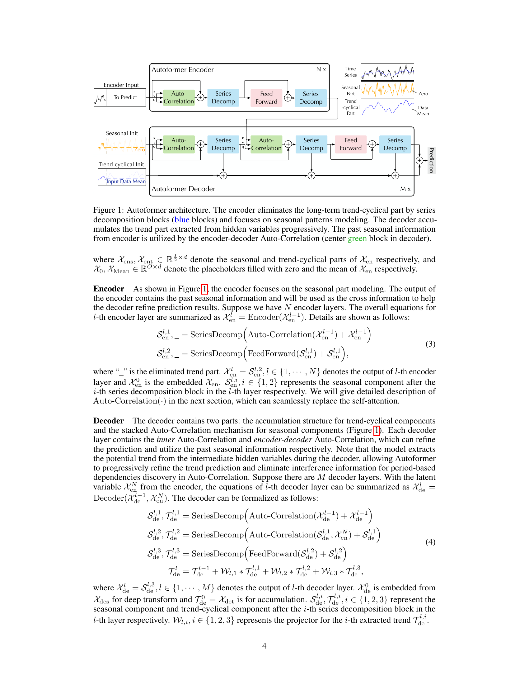

# 05. Architecture — Encoder/Decoder + Series Decomp Block (Eq 1-4)

> 본 논문의 *첫 번째 큰 contribution*. *시계열 분해를 모델 내부 inner block 으로* 통합한 새 architecture.

---

## 5.1 챕터 한 줄 요약

> **"Encoder 가 *trend 제거 + seasonal 만 학습*. Decoder 가 *trend 누적 + seasonal refinement*. 매 layer 사이에 *Series Decomposition Block* 삽입 — *AvgPool 으로 trend 추출 + 나머지 = seasonal*. 4 가지 핵심 식: Eq 1 (분해), Eq 2 (decoder 입력), Eq 3 (encoder layer), Eq 4 (decoder layer)."**

---

## 5.2 Figure 1 — Autoformer 전체 구조 (★ 가장 중요)



*paper p.4 Figure 1.*

### 어떻게 읽나? (Step-by-step)

**Step 1 — 두 큰 부분 구분**:
- **상단 (파랑 박스)**: *Autoformer Encoder* — N번 반복.
- **하단 (파랑 박스)**: *Autoformer Decoder* — M번 반복.

**Step 2 — Encoder 의 흐름** (왼쪽 → 오른쪽):
1. *Encoder Input*: 과거 시계열 $L$ timestep.
2. *Auto-Correlation*: self-attention 의 *대체*.
3. *Series Decomp* (★ 핵심): trend 제거.
4. *Feed Forward*.
5. *Series Decomp*: 또 trend 제거.

**Step 3 — Decoder 의 흐름**:
1. *Seasonal Init* + *Trend-cyclical Init* (두 가지 시작):
   - *Seasonal Init*: encoder 입력 후반부 의 seasonal 부분.
   - *Trend Init*: 과거 데이터 평균.
2. *Auto-Correlation* (self) + *Series Decomp*.
3. *Auto-Correlation* (cross — encoder 출력 사용) + *Series Decomp*.
4. *Feed Forward* + *Series Decomp*.

**Step 4 — 마지막 합치기**:
- *Seasonal output* + *Trend output (누적 된 것)* → 최종 예측.

### 핵심 메시지

이 Figure 1 의 *3 가지 큰 idea*:

1. **Series Decomp Block 이 *encoder/decoder 매 layer 마다*** — *progressive 분해*.
2. **Trend 와 Seasonal 의 *분리 처리***: trend → 누적, seasonal → refinement.
3. **Auto-Correlation 이 *self-attention 대체*** — 점-wise → series-wise.

```viz:autoformer-architecture:title=Fig 1 — Autoformer Architecture (interactive),caption=Encoder N× + Decoder M× 의 흐름. Series Decomp Block 의 매 위치. Trend/Seasonal 분리 처리.
```

---

## 5.3 Series Decomposition Block — *분해의 핵심 도구*

### 일상 비유 — 그래프 의 *두 색 분리*

긴 시계열 그래프를 보면 *2 가지 패턴* 섞임:
- *큰 흐름 (trend)*: 부드럽게 오르락내리락.
- *작은 변동 (seasonal + noise)*: 매일 반복 + random.

**일상 비유**: 매일 *몸무게* 측정 → 그래프:
- *Trend*: 한 달 동안 *서서히 증가* (다이어트 실패).
- *Seasonal*: *매일 아침/저녁 의 1kg 차이*.
- 분해: *Trend 추출 (이동 평균)* + *나머지 = Seasonal + Noise*.

### Equation 1 (paper p.3) — Series Decomposition Block

$$
X_t = \text{AvgPool}(\text{Padding}(X))
$$
$$
X_s = X - X_t
$$

**기호 뜻**:
- $X \in \mathbb{R}^{L \times d}$: 입력 시계열 (length $L$, dimension $d$).
- $X_t$: trend-cyclical 부분 (*큰 흐름*).
- $X_s$: seasonal 부분 (*작은 변동*).
- $\text{AvgPool}(\cdot)$: 이동 평균 (window size = $k$, paper 의 default $k = 25$).
- $\text{Padding}(\cdot)$: 시계열 *경계* 의 padding (length 유지).

**일상 비유**:
- *$X_t$ (trend)*: 시계열 의 *부드러운 평균* — 1주일 평균 같은 것.
- *$X_s$ (seasonal)*: *원본 - 평균* = *순간 변동만 남김*.
- *AvgPool*: 25 timestep 의 *moving average* — *작은 변동 제거*.

**왜 이 형태?**:
- *AvgPool 이 단순 + 효과적*: STL, Wavelet 같은 *복잡 방법* 도 있지만 *AvgPool 이 충분*.
- *Padding 으로 length 유지*: encoder/decoder 의 *shape consistency*.

**조심할 점**: AvgPool 의 *window k* 가 *trend 의 부드러움* 결정. $k$ 가 너무 작으면 *seasonal 도 trend 에 포함*. $k$ 가 너무 크면 *trend 가 너무 부드러움*. Paper default $k = 25$.

### Code 예시 (PyTorch)

```python
def series_decomp(x, kernel_size=25):
    # x: (B, L, d)
    # Padding to keep length
    padding = (kernel_size - 1) // 2
    x_padded = F.pad(x, (0, 0, padding, padding), mode='replicate')
    # Moving average
    x_trend = F.avg_pool1d(x_padded.transpose(1, 2),
                            kernel_size=kernel_size, stride=1).transpose(1, 2)
    x_seasonal = x - x_trend
    return x_seasonal, x_trend
```

---

## 5.4 Decoder Input — 두 가지 *시작 신호* 만들기

### 일상 비유 — *그림 그리기 시작점*

화가 가 그림 그릴 때 *시작점* 필요:
- *큰 형태 시작점 (trend)*: 어떤 모양 으로 그릴까.
- *세부 사항 시작점 (seasonal)*: 어떤 디테일 추가할까.

본 논문 decoder 도 *두 가지 시작점* 필요.

### Equation 2 (paper p.3) — Decoder Input

$$
X_{\text{ens}}, X_{\text{ent}} = \text{SeriesDecomp}(X_{\text{en}, I/2:I})
$$
$$
X_{\text{des}} = \text{Concat}(X_{\text{ens}}, X_0)
$$
$$
X_{\text{det}} = \text{Concat}(X_{\text{ent}}, X_{\text{Mean}})
$$

**기호 뜻**:
- $X_{\text{en}} \in \mathbb{R}^{I \times d}$: encoder 입력 (length $I$).
- $X_{\text{ens}}, X_{\text{ent}}$: encoder 입력 *후반부* 의 *seasonal + trend* (Series Decomp 의 결과).
- $X_{\text{des}}$: decoder 의 *seasonal init* (length $I/2 + O$).
- $X_{\text{det}}$: decoder 의 *trend-cyclical init* (length $I/2 + O$).
- $X_0$: zeros placeholder (length $O$).
- $X_{\text{Mean}}$: encoder 입력 평균 (length $O$).

**일상 비유**: 
- *Seasonal init*: *과거 의 변동 패턴* + *미래 자리 비워둠 (zero)*. → "*과거 변동 보고 미래 변동 예측해 줘*".
- *Trend init*: *과거 의 trend* + *미래 자리 = 평균* (시작점). → "*과거 trend 보고 미래 trend 누적해 줘*".

**왜 이 형태?**: *Decoder 가 두 부품 (seasonal + trend) 을 각각 refinement* 하므로 *각각 의 시작 신호* 필요. *Encoder 후반부* 가 *미래 와 가까운 신호*.

**조심할 점**: *Encoder 입력 의 *후반부 절반 ($I/2:I$)* 만* 분해 사용. 전체 X — *recent 정보 만* 사용.

---

## 5.5 Encoder Layer — *Seasonal 만 학습*

### Equation 3 (paper p.4) — Encoder l-th layer

$$
S_{\text{en}}^{l,1}, \_ = \text{SeriesDecomp}(\text{AutoCorrelation}(X_{\text{en}}^{l-1}) + X_{\text{en}}^{l-1})
$$
$$
S_{\text{en}}^{l,2}, \_ = \text{SeriesDecomp}(\text{FeedForward}(S_{\text{en}}^{l,1}) + S_{\text{en}}^{l,1})
$$

**기호 뜻**:
- $X_{\text{en}}^{l-1}$: (l-1)-th layer 의 출력.
- $S_{\text{en}}^{l,1}$: l-th layer 의 *Auto-Correlation 후 seasonal* 부분.
- $S_{\text{en}}^{l,2} = X_{\text{en}}^{l}$: l-th layer 의 *최종 출력 (= seasonal 만)*.
- $\_$: *trend 부분 무시* — encoder 는 seasonal 만 관심.

**일상 비유**: Encoder 가 *과거 시계열 을 보고* :
1. Auto-Correlation (조각 비교).
2. Series Decomp → trend 제거 + seasonal 만 남김.
3. Feed Forward (비선형 변환).
4. Series Decomp → 또 trend 제거.

**왜 *trend 제거*?**: Encoder 의 목표 는 *seasonal information 학습* — *trend 는 decoder 에서 처리*. *2 분업*.

**조심할 점**: `_` (trend 무시) 가 *paper 의 핵심 기호*. *Decoder 와 다름*.

---

## 5.6 Decoder Layer — *Seasonal Refinement + Trend Accumulation*

### Equation 4 (paper p.4) — Decoder l-th layer

$$
S_{\text{de}}^{l,1}, T_{\text{de}}^{l,1} = \text{SeriesDecomp}(\text{AutoCorrelation}(X_{\text{de}}^{l-1}) + X_{\text{de}}^{l-1})
$$
$$
S_{\text{de}}^{l,2}, T_{\text{de}}^{l,2} = \text{SeriesDecomp}(\text{AutoCorrelation}(S_{\text{de}}^{l,1}, X_{\text{en}}^N) + S_{\text{de}}^{l,1})
$$
$$
S_{\text{de}}^{l,3}, T_{\text{de}}^{l,3} = \text{SeriesDecomp}(\text{FeedForward}(S_{\text{de}}^{l,2}) + S_{\text{de}}^{l,2})
$$
$$
T_{\text{de}}^{l} = T_{\text{de}}^{l-1} + W_{l,1} \cdot T_{\text{de}}^{l,1} + W_{l,2} \cdot T_{\text{de}}^{l,2} + W_{l,3} \cdot T_{\text{de}}^{l,3}
$$

**기호 뜻**:
- $S_{\text{de}}^{l,i}, T_{\text{de}}^{l,i}$: l-th layer 의 *i-th decomp block 의 seasonal/trend*.
- *세 개 의 Auto-Correlation*: 
  - 첫 번째: *Self* Auto-Correlation (decoder 입력 끼리).
  - 두 번째: *Cross* Auto-Correlation (decoder seasonal + encoder 출력).
  - 세 번째: FFN.
- $T_{\text{de}}^{l}$: *Trend accumulation* — 매 layer 마다 *trend 누적*.
- $W_{l,1}, W_{l,2}, W_{l,3}$: *학습 weight* (trend projection).

**일상 비유**: Decoder 가 *그림 점진적 완성*:
1. *Self Auto-Corr* (자기 자신 보기) → seasonal 정제 + trend 추출.
2. *Cross Auto-Corr* (encoder 출력 보기) → seasonal 더 정제 + trend 추출.
3. *FFN* → seasonal 비선형 변환 + trend 추출.
4. *Trend 누적*: 세 trend 를 *합쳐서 다음 layer 로 전달*.

**왜 이 형태?**: *Seasonal 은 layer 마다 정제* + *Trend 는 layer 마다 누적*. 두 *분리 path*.

**조심할 점**: Decoder 의 *trend 가 누적 (+) 형태* — *encoder 의 trend 무시 (_) 와 대비*.

### 최종 예측

$$
\hat X = W_{\mathcal{S}} \cdot X_{\text{de}}^M + T_{\text{de}}^M
$$

- $X_{\text{de}}^M = S_{\text{de}}^{M,3}$: M-th layer 의 *seasonal*.
- $T_{\text{de}}^M$: M-th layer 의 *누적 trend*.
- $W_{\mathcal{S}}$: seasonal projection (dimension matching).

**일상 비유**: *그림 의 최종 완성품* = *세부 사항 (seasonal)* + *큰 형태 (trend)*.

---

## 5.7 본 architecture 의 *3 가지 새 idea*

### Idea 1 — *Series Decomp 가 Inner Block*

- 기존 (Prophet, N-BEATS): 분해 *사전 처리* 만.
- Autoformer: *encoder/decoder 매 layer 마다* 분해 — *progressive*.

### Idea 2 — *Trend vs Seasonal 의 분리 Path*

- Encoder: *seasonal 만* (trend 버림).
- Decoder: *seasonal refinement + trend 누적*.
- 최종: *합치기*.

### Idea 3 — *Auto-Correlation 이 Self/Cross 모두에 적용*

- Encoder self-attention 자리: Self Auto-Correlation.
- Decoder self-attention 자리: Self Auto-Correlation.
- Decoder cross-attention 자리: Cross Auto-Correlation (encoder 출력 사용).

→ *통일된 mechanism*.

```viz:autoformer-seasonal-trend:title=Series Decomp Block (interactive),caption=AvgPool 의 moving average → trend / X - trend → seasonal. 점진적 누적 (Figure 4 idea).
```

---

## 5.8 본 architecture 의 *효과*

본 논문 *Figure 4 + Table 3* 에서 입증:

### Figure 4 (paper p.9) — Progressive Decomposition Visualization

ETT predict-720 에서:
- *No decomp block*: prediction 이 *trend 의 peak/trough 못 잡음*.
- *1 decomp block*: trend 시작 정렬.
- *2 decomp blocks*: trend 더 정확.
- *3 decomp blocks*: trend + seasonal 모두 *진짜 와 거의 일치*.

→ **Progressive decomposition 의 *시각적 증명***.

### Table 3 (paper p.8) — Ablation

| Setup | Predict-720 MSE |
|-------|------------------|
| Origin (decomp 없음) | 0.658 |
| Sep (사전 분해 + 별도 모델) | 0.862 |
| **Ours (inner decomp)** | **0.218** |

→ **Inner decomp 이 *사전 분해 + 별도 모델* 보다 *3 배 좋음***.

---

## 5.9 자기점검

### 핵심 3가지
1. **Series Decomposition Block (Eq 1) 의 의미?**
2. **Encoder vs Decoder 의 *trend 처리* 차이?**
3. **Progressive decomposition 의 의의?**

### 답변
1. **시계열 $X$ 를 *Trend $X_t$* (이동 평균) + *Seasonal $X_s = X - X_t$* (나머지) 로 분리**. AvgPool window $k=25$ 의 *moving average* 가 *부드러운 큰 흐름* 추출 — *trend*. *원본 - trend = seasonal* (작은 변동). **일상 비유**: 몸무게 의 *한 달 평균 (trend) + 매일 변동 (seasonal)* 분리.
2. **Encoder**: *trend 무시 (`_`)* — *seasonal 만 학습*. *과거 시계열의 변동 패턴* 만 관심. **Decoder**: *세 개 trend 모두 보존 + 누적* ($T_{\text{de}}^{l} = T_{\text{de}}^{l-1} + W_{l,1} T_{\text{de}}^{l,1} + W_{l,2} T_{\text{de}}^{l,2} + W_{l,3} T_{\text{de}}^{l,3}$) — *trend 가 매 layer 마다 점진적 향상*. Seasonal 은 refinement, trend 는 accumulation.
3. **기존 분해 (Prophet, N-BEATS): 학습 전 1번 만** — *future 의 분해 불가능*. **본 논문 progressive**: *매 layer 마다 inner block* — *hidden representation 의 분해 가능* — *future 에도 적용*. Figure 4 가 시각적 증명: 0 → 1 → 2 → 3 decomp block 사용 시 *trend 의 peak/trough 점진적 정확*. Table 3 가 정량: *Origin 0.658 → Inner Decomp 0.218* (3 배 향상).

---

다음 챕터: [06_auto_correlation.md](06_auto_correlation.md) — Auto-Correlation 메커니즘 (Eq 5-7).
