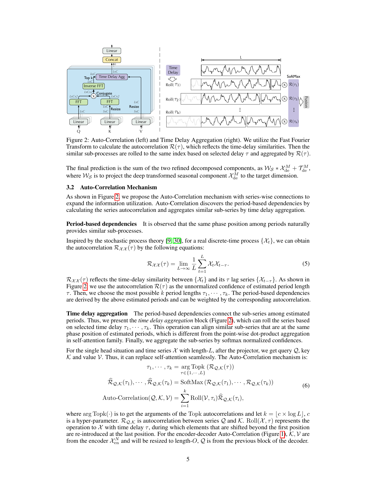
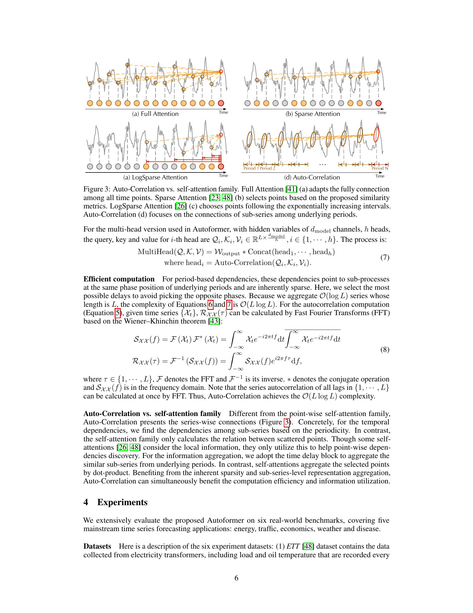

# 06 Auto-Correlation Mechanism — Section 3.2

paper p.5–6 의 Section 3.2 — 본 paper 의 가장 깊은 기여.



(Figure 2, p.5. 왼쪽: Auto-Correlation 의 FFT 흐름. 오른쪽: Time Delay Aggregation 의 Roll(τ) + R(τ) 가중합)

---

## 두 부분으로 나뉜다

> Auto-Correlation discovers the period-based dependencies by calculating the series autocorrelation and aggregates similar sub-series by time delay aggregation. (p.5)

1. **Period-based dependencies** — 어떤 시간 지연 $\tau$ 가 중요한가? → autocorrelation $R(\tau)$ 의 Top-k.
2. **Time delay aggregation** — sub-series 들을 어떻게 합치는가? → `Roll(V, τ)` + softmax 가중합.

---

## Part 1: Period-based dependencies

**Stochastic process 의 autocorrelation 정의** (Eq 5, p.5):

$$
\mathcal{R}_{\mathcal{X}\mathcal{X}}(\tau) = \lim_{L\to\infty} \frac{1}{L} \sum_{t=1}^{L} \mathcal{X}_t \, \mathcal{X}_{t-\tau}
$$

> $\mathcal{R}_{\mathcal{X}\mathcal{X}}(\tau)$ reflects the time-delay similarity between $\{\mathcal{X}_t\}$ and its $\tau$ lag series $\{\mathcal{X}_{t-\tau}\}$. As shown in Figure 2, we use the autocorrelation $\mathcal{R}(\tau)$ as the unnormalized confidence of estimated period length $\tau$. Then, we choose the most possible $k$ period lengths $\tau_1, \cdots, \tau_k$. (p.5)

직관:
- $R(\tau)$ 가 크다 = 시간 지연 $\tau$ 후의 시리즈 모양이 현재와 닮음 = $\tau$ 가 잠재 **주기 길이**.
- 모든 $\tau$ 에 대해 $R(\tau)$ 계산 → Top-k 의 $\tau$ 만 골라 사용.

---

## Part 2: Time delay aggregation

> The period-based dependencies connect the sub-series among estimated periods. Thus, we present the time delay aggregation block (Figure 2), which can roll the series based on selected time delay $\tau_1, \cdots, \tau_k$. (p.5)

**Roll 연산**:
- `Roll(X, τ)` = 시계열 $X$ 를 $\tau$ 만큼 옮김. 끝으로 밀려난 원소는 처음으로 되돌아옴 (cyclic shift).
- 효과: 시간 지연 $\tau$ 의 sub-series 가 "지금" 위치로 정렬.

**Aggregation** (softmax 정규화 + 가중합):

$$
\text{Auto-Correlation}(Q, K, V) = \sum_{i=1}^{k} \text{Roll}(V, \tau_i) \cdot \hat{R}_{Q,K}(\tau_i)
$$

여기서:
$$
\tau_1, \cdots, \tau_k = \arg\,\text{Topk}_{\tau \in \{1,\cdots,L\}} \big(R_{Q,K}(\tau)\big)
$$
$$
\hat{R}_{Q,K}(\tau_1), \cdots, \hat{R}_{Q,K}(\tau_k) = \text{SoftMax}\big(R_{Q,K}(\tau_1), \cdots, R_{Q,K}(\tau_k)\big)
$$

(Eq 6, p.5)

- $R_{Q,K}(\tau)$ = $Q$ 와 $K$ 시리즈 사이의 cross-autocorrelation.
- Top-k 선택 → softmax 로 normalize → 각 $\tau_i$ 에서 $V$ 를 roll 한 결과를 가중합.

**Top-k 크기**:
> $k = \lfloor c \times \log L \rfloor$, $c$ is a hyper-parameter. (p.5)

- $c$ 는 1–3 (paper 의 Section 4 implementation, Appendix B ablation).
- $L = 96, c=3$ → $k = \lfloor 3 \times \log 96 \rfloor = \lfloor 3 \times 4.564 \rfloor = 13$.

## 인터랙티브 시각화 — FFT 자기상관 계산

```viz:autoformer-fft-acorr:title=Auto-Correlation R(τ) FFT 계산 step-by-step,caption=Period 슬라이더로 잠재 주기 P 를 조작. (1) 합성 시계열 X(t) — 두 harmonics + noise. (2) FFT 로 모든 lag 의 R(τ) 계산. Top-k τ (빨강) 가 실제 주기 P 와 2P 에 위치하는 것 확인.
```

```viz:autoformer-topk-delays:title=Top-k τ + Roll(V, τ) Aggregation (Eq 6),caption=Top-k 슬라이더로 k=1~5 조작. (1) Synthetic V(t). (2) R(τ) 의 Top-k 시간 지연. (3) softmax 가중합 = Σᵢ wᵢ · Roll(V, τᵢ). k 가 작을수록 더 단순, 크면 더 부드러운 aggregation.
```

---

## Encoder-Decoder Auto-Correlation 의 특수 처리

> For the encoder-decoder Auto-Correlation (Figure 1), $K, V$ are from the encoder $\mathcal{X}_{en}^N$ and will be resized to length-$O$, $Q$ is from the previous block of the decoder. (p.5)

- Encoder 출력 길이 $I$, decoder 의 query 길이 $I/2 + O$ — 길이 불일치.
- → $K, V$ 를 length-$O$ 로 resize (paper 코드에서 padding/truncation).
- → autocorrelation 계산 가능.

---

## MultiHead 확장 (Eq 7)

> For the multi-head version used in Autoformer, with hidden variables of $d_{\text{model}}$ channels, $h$ heads, the query, key and value for $i$-th head are $Q_i, K_i, V_i \in \mathbb{R}^{L \times d_{\text{model}}/h}$, $i \in \{1, \cdots, h\}$. The process is:
> $$
> \text{MultiHead}(Q, K, V) = W_{\text{output}} * \text{Concat}(\text{head}_1, \cdots, \text{head}_h)
> $$
> $$
> \text{where head}_i = \text{Auto-Correlation}(Q_i, K_i, V_i)
> $$
> (p.6, Eq 7)

표준 multi-head 형태. Self-attention 의 `Attention(Q_i, K_i, V_i)` 를 `Auto-Correlation(Q_i, K_i, V_i)` 로 swap 하면 끝.

---

## Self-Attention 과의 차이 (Figure 3)



(Figure 3, paper p.6. (a) Full Attention, (b) Sparse Attention, (c) LogSparse Attention, (d) Auto-Correlation)

| Mechanism | 의존성 단위 | 집계 방식 | 복잡도 |
|-----------|------------|----------|--------|
| Full Attention [41] | 모든 점-쌍 | dot-product | $O(L^2)$ |
| Sparse Attention [23, 48] | 선택된 점 (LSH/ProbSparse) | dot-product | $O(L \log L)$ |
| LogSparse Attention [26] | 지수적 간격 점 | dot-product | $O(L(\log L)^2)$ |
| **Auto-Correlation** | sub-series @ same phase | weighted sub-series sum | $O(L \log L)$ |

paper 한 줄 (p.6):
> Different from the point-wise self-attention family, Auto-Correlation presents the series-wise connections. ... For the information aggregation, we adopt the time delay block to aggregate the similar sub-series from underlying periods. In contrast, self-attentions aggregate the selected points by dot-product.

**핵심 차이**:
1. 단위가 점 → 시리즈.
2. 집계가 dot-product → Roll + 가중합.

---

## 한 그림으로 직관

**Self-attention 의 dot-product**:
```
점 i   ────query─────►  점 j_1: score_{ij1}
                        점 j_2: score_{ij2}
                        ...
                        → softmax → weighted sum of V[j]
```

**Auto-Correlation 의 Roll**:
```
시계열 전체 X ──→ R(τ_1), R(τ_2), ..., R(τ_k)   ← 잠재 주기 후보
                       ↓
            Roll(V, τ_1)       ──┐
            Roll(V, τ_2)       ──├─→ Σ R̂(τ_i) · Roll(V, τ_i)   ← 가중합
            ...                ──┘
            Roll(V, τ_k)       ──┘
```

→ 결과는 시리즈 전체 길이 $L$. **각 시점이 "내가 지금 보는 패턴은 $\tau_1, \tau_2, \dots$ 전과 비슷하다"는 정보로 갱신**.

---

## "왜 이게 더 좋은가?" — 정보 활용 측면

Sparse attention 의 핵심 문제: 점-쌍을 골라 보는 순간, 선택되지 않은 점의 정보는 **버려짐**.

Auto-Correlation 의 차이:
- Top-k 의 $\tau$ 만 골라도, 각 $\tau$ 에서 `Roll(V, τ)` 는 **시리즈 전체** 를 옮긴다.
- → $V$ 의 모든 원소가 결과에 기여 (단, 다른 위치로 옮겨져).
- → **정보 활용률 100%** (no point dropped).

이것이 paper 가 abstract 에 "Auto-Correlation outperforms self-attention in both efficiency and accuracy" 라고 적은 근거.

다음 [07_complexity_efficiency.md](07_complexity_efficiency.md) 에서 FFT 기반 $O(L\log L)$ 계산을 깊게.
