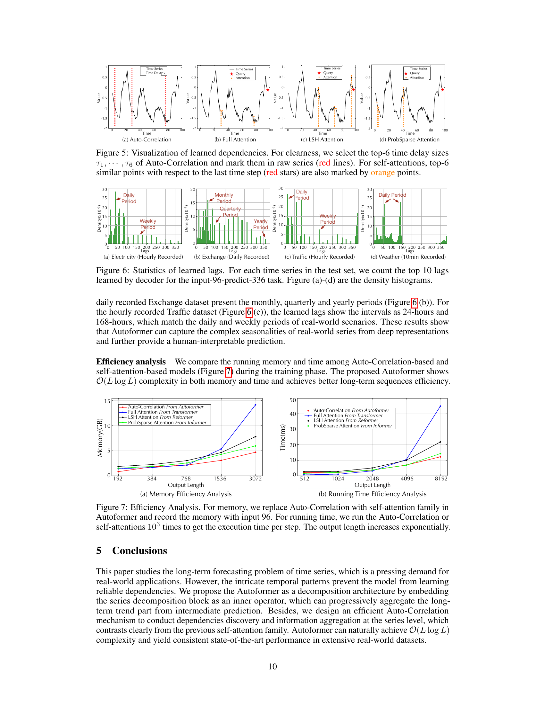

# 07 Complexity & Efficiency — FFT 와 Wiener–Khinchin

paper p.5–6 Section 3.2 의 "Efficient computation" + Figure 7 의 실측.

---

## 왜 FFT 가 필요한가

Eq 5 의 정의 대로 모든 lag $\tau \in \{1, \dots, L\}$ 의 $R(\tau)$ 를 계산하면:
- 각 $\tau$ 마다 $O(L)$ 곱셈 → 총 $O(L^2)$.
- $L = 720$ 이면 $L^2 = 518{,}400$ ≈ 50만 연산. self-attention 의 $O(L^2)$ 와 같음 → 효율 이득 없음.

→ FFT 가 필요.

---

## Wiener–Khinchin 정리 (Eq 8)

> For the autocorrelation computation (Equation 5), given time series $\{\mathcal{X}_t\}$, $\mathcal{R}_{\mathcal{X}\mathcal{X}}(\tau)$ can be calculated by Fast Fourier Transforms (FFT) based on the Wiener–Khinchin theorem [43]:
> 
> $$\mathcal{S}_{\mathcal{X}\mathcal{X}}(f) = \mathcal{F}(\mathcal{X}_t)\,\mathcal{F}^*(\mathcal{X}_t) = \int_{-\infty}^{\infty} \mathcal{X}_t e^{-i 2\pi t f} dt \cdot \overline{\int_{-\infty}^{\infty} \mathcal{X}_t e^{-i 2\pi t f} dt}$$
>
> $$\mathcal{R}_{\mathcal{X}\mathcal{X}}(\tau) = \mathcal{F}^{-1}(\mathcal{S}_{\mathcal{X}\mathcal{X}}(f)) = \int_{-\infty}^{\infty} \mathcal{S}_{\mathcal{X}\mathcal{X}}(f) e^{i 2\pi f \tau} df$$
>
> where $\tau \in \{1, \cdots, L\}$, $\mathcal{F}$ denotes the FFT and $\mathcal{F}^{-1}$ is its inverse. $*$ denotes the conjugate operation and $\mathcal{S}_{\mathcal{X}\mathcal{X}}(f)$ is in the frequency domain. (p.6, Eq 8)

**한 줄 정리**: 자기상관 $R(\tau)$ = $|\mathcal{F}(X)|^2$ 의 inverse FFT.

이산형 (실제 코드) :
```
F = FFT(X)            # O(L log L)
S = F * conj(F)       # O(L)
R = IFFT(S).real      # O(L log L)
# R 은 길이 L 의 벡터 — 모든 lag 의 autocorrelation
```

> Note that the series autocorrelation of all lags in $\{1, \cdots, L\}$ can be calculated at once by FFT. Thus, Auto-Correlation achieves the $O(L \log L)$ complexity. (p.6)

→ **모든 $\tau$ 의 R 을 한 번에**.

---

## Complexity 분석

| 단계 | 연산 | 복잡도 |
|------|------|--------|
| 1. FFT of $Q, K$ | 2 FFTs | $2 \cdot O(L \log L)$ |
| 2. Cross-spectrum $\mathcal{F}(Q) \cdot \mathcal{F}^*(K)$ | 점별 곱 | $O(L)$ |
| 3. IFFT → $R_{Q,K}(\tau)$, 모든 $\tau$ | 1 IFFT | $O(L \log L)$ |
| 4. Top-k 선택 ($k = c \log L$) | 부분 정렬 | $O(L)$ |
| 5. Softmax on k 개 | normalize | $O(k) = O(\log L)$ |
| 6. Roll(V, τ_i) for i=1..k | k 개 cyclic shift | $O(k \cdot L) = O(L \log L)$ |
| 7. 가중합 | $\sum_i \hat{R}_i \cdot \text{Roll}(V, \tau_i)$ | $O(k \cdot L) = O(L \log L)$ |
| **총** | | $\mathbf{O(L \log L)}$ |

Self-attention 의 $O(L^2)$ 와 동일한 메모리 슬롯이 아닌 **선형-로그** 수준으로 떨어짐.

---

## 왜 "선택된 점" 만 보는 sparse 보다 더 좋은가

| 비교 | Sparse Attention (Informer/Reformer) | Auto-Correlation |
|------|-------------------------------------|------------------|
| 선택 단위 | 점 $L$ 개 중 일부 | 시간 지연 $\tau$ 의 Top-k |
| Aggregation 의 단위 | 선택된 점들 (≪ $L$) | 시리즈 전체 (모든 점이 한 번씩 등장) |
| 정보 손실 | 선택되지 않은 점의 정보 ↓ | 없음 (모든 점이 Roll 로 재배치) |

paper 의 한 줄 강조 (p.6):
> Benefiting from the inherent sparsity and sub-series-level representation aggregation, Auto-Correlation can simultaneously benefit the computation efficiency and information utilization.

**점이 sparse 한 게 아니라, 의미 있는 $\tau$ 가 sparse** 한 것 — paper 가 inherent sparsity 라고 부르는 이유.

---

## Figure 7 — 실측 Memory & Time



(Figure 7, paper p.10. (a) Memory(GB) vs Output Length, (b) Time(ms) per step vs Output Length.)

**실험 설계** (p.10 caption):
- Autoformer 에서 Auto-Correlation 만 self-attention 으로 교체 (다른 부분 동일).
- Input fixed = 96, Output 은 192, 384, 768, 1536, 3072 (a) / 512, 1024, 2048, 4096, 8192 (b).
- 1000회 실행 평균.

**(a) Memory**: predict-3072 에서
- Auto-Correlation (Autoformer) ≈ ~5GB
- ProbSparse (Informer), LSH (Reformer) ≈ 비슷한 수준의 $O(L\log L)$
- Full attention (Transformer) ≈ ~15GB → OOM

**(b) Time**: predict-8192 에서
- Auto-Correlation 이 가장 빠름
- Full attention 은 OOM 으로 측정 불가

→ 동일 복잡도 클래스 ($O(L\log L)$) 임에도 **실제 wall-clock + memory 가 더 효율적**.

이유: FFT 가 highly optimized (cuFFT 등) → CUDA 에서 매우 빠름. 반면 ProbSparse 의 KL-divergence 계산은 softmax + log-softmax 가 더 무거움.

---

## 효율의 실제 이점 — 학습 가능 길이

Table 4 (ch10) 에서:
- Input-336-predict-1440 setting 에서 Auto-Correlation 만 OOM 없이 학습 가능 (MSE 0.574).
- Full Attention, LogSparse, LSH, ProbSparse 모두 OOM 또는 비효율.

→ Autoformer 의 효율이 단순한 자랑이 아니라 **장기 forecasting 의 학습 가능 한계** 를 넓힌다.

---

## 정리

Auto-Correlation 의 **세 단계 ($Q, K$ → R(τ) 전 lag, Top-k 선택, Roll+가중합)** 가 모두 **$O(L \log L)$** 내에서 끝난다. FFT 가 핵심 도구.

다음 [08_data_baselines.md](08_data_baselines.md) 에서 6개 dataset + 10개 baseline + 실험 셋업.
