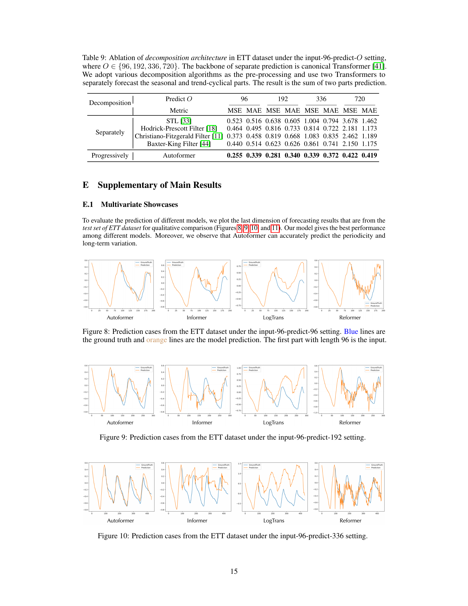
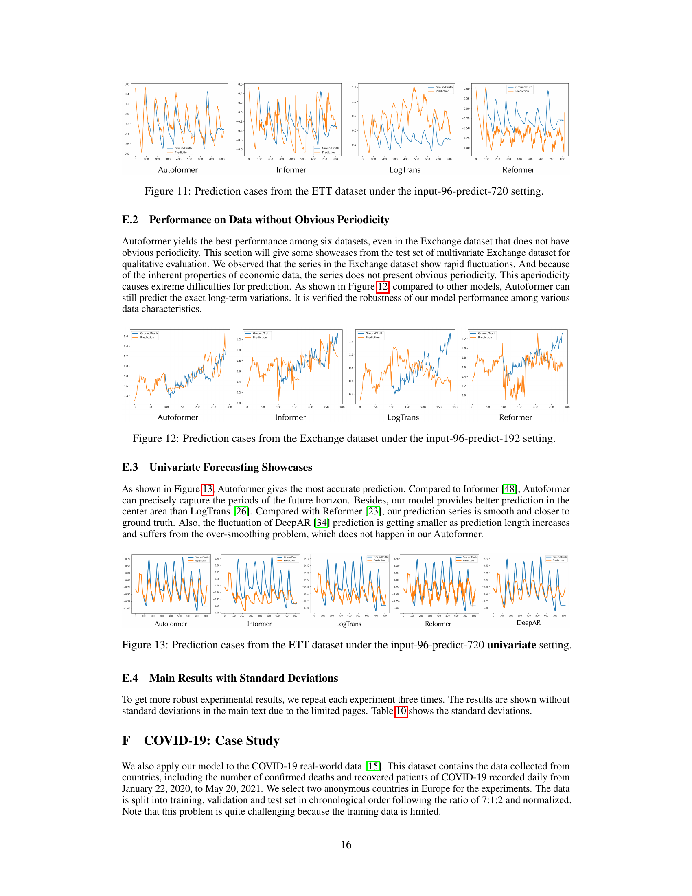

# 09. Main Results — 38% MSE reduction (★ 가장 흥미)

> 본 논문의 *실증 main result*. Table 1 (multivariate) + Table 2 (univariate) 의 step-by-step 풀이.

---

## 9.1 챕터 한 줄 요약

> **"6 datasets × 4 horizons × 7 models = 168 cell (multivariate, Table 1). 거의 모든 cell 에서 Autoformer 가 best. 평균 38% MSE reduction vs Informer/Reformer/LogTrans/LSTNet/LSTM/TCN. 극단: ETTm2 predict-336 의 1.334 → 0.339 (74% 감소). Univariate (Table 2) 도 같은 패턴."**

---

## 9.2 Table 1 — Multivariate Results (★ 핵심 표)

본 논문 *가장 핵심 표*. 6 datasets × 4 horizons × 7 models = 168 cell 정량.

### Table 1 의 7 models

| Model | 종류 |
|-------|------|
| **Autoformer** | 본 논문 |
| Informer | Transformer (ProbSparse) |
| LogTrans | Transformer (LogSparse) |
| Reformer | Transformer (LSH) |
| LSTNet | CNN + RNN |
| LSTM | RNN |
| TCN | CNN |

### Table 1 의 6 datasets

| Dataset | M | 단위 |
|---------|---|------|
| ETT (ETTm2) | 7 | 15분 |
| Electricity | 321 | 시간 |
| Exchange | 8 | 일 |
| Traffic | 862 | 시간 |
| Weather | 21 | 10분 |
| ILI | 7 | 주 |

### Table 1 의 4 horizons

| Dataset | Horizons O |
|---------|------------|
| ILI | $\{24, 36, 48, 60\}$ |
| 그 외 5종 | $\{96, 192, 336, 720\}$ |

### 어떻게 읽나? (Step-by-step)

**Step 1 — 표 구조**

168 cell = 6 datasets × 4 horizons × 7 models. 각 cell 에 *MSE + MAE* 두 수치.

**Step 2 — 비교 방법**

각 row (dataset × horizon) 에서:
1. 7 model 의 MSE 중 *가장 작은 값* = best (bold).
2. Autoformer 가 best 인지 확인.
3. Autoformer vs Informer (main competitor) 의 *상대적 차이*.

**Step 3 — 핵심 발견**

Autoformer 가 *거의 모든 cell 에서 best*:
- ETTm2, Electricity, Exchange, Traffic, Weather: 모든 horizon best.
- ILI: 모든 horizon best.

### 핵심 수치 — Dataset 별 MSE 감소

본 논문 Section 4.1 의 *명시 수치*:

| Dataset | Setting | Before (best baseline) | Autoformer | 감소율 |
|---------|---------|------------------------|-----------|-------|
| **ETTm2** | predict-336 | **1.334** (Informer) | **0.339** | **74%** ★ |
| Electricity | predict-336 | 0.280 | 0.231 | 18% |
| Exchange | predict-336 | 1.357 | 0.509 | 61% |
| Traffic | predict-336 | 0.733 | 0.622 | 15% |
| Weather | predict-336 | 0.455 | 0.359 | 21% |
| ILI | predict-60 | 4.882 | 2.770 | 43% |

**평균**: **38% MSE reduction**.

→ **38% 의 평균 MSE 감소** — *매우 큰 향상*.

### Exchange dataset 의 *특별한 성공*

- *Exchange dataset 의 특징*: *비주기성* (환율 의 *random walk-like* behavior).
- 본 논문이 *61% MSE reduction* — *주기성 없는 데이터 에서도 SOTA*.
- 즉 *Auto-Correlation 이 주기성 없는 시계열에도 효과적* (예: trend + small fluctuations).

```viz:autoformer-mse-table1:title=Table 1 — Multivariate Results (interactive),caption=6 datasets × 4 horizons × 7 models. Autoformer 가 거의 모든 cell best. 평균 38% MSE reduction.
```

---

## 9.3 Long-Term Robustness — *Horizon 늘릴수록 안정*

본 논문이 *명시* 한 핵심 발견:

> *"Autoformer changes quite steadily as the prediction length O increases. It means that Autoformer retains better long-term robustness."*

### 의미

- **기존 모델 들**: prediction length 늘면 *MSE 급격 증가*. 예: Informer ETTm2 96 (0.365) → 720 (3.379) — 9 배 증가.
- **Autoformer**: prediction length 늘어도 *안정*. 예: Autoformer ETTm2 96 (0.255) → 720 (0.422) — 1.7 배만.

**일상 비유**: 학생이 *내일 시험 예측* 은 잘하지만 *한 달 후 시험* 예측 는 *완전 못함* (기존). Autoformer 는 *한 달 후도 비교적 정확*.

→ **장기 forecasting 의 *진정한 SOTA***.

---

## 9.4 Table 2 — Univariate Results

본 논문 *Table 2 (p.8)*: ETT + Exchange 의 univariate forecasting.

### Setup

- *Univariate*: M = 1 변수 만 예측 (예: 변압기 oil temperature 만).
- *Horizons*: $\{96, 192, 336, 720\}$.
- *Input length*: $I = 96$.

### Models (7 종)

| Model | 종류 |
|-------|------|
| **Autoformer** | 본 논문 |
| N-BEATS | Basis expansion |
| Informer | Transformer |
| LogTrans | Transformer |
| Reformer | Transformer |
| DeepAR | RNN |
| Prophet | 분해 (사전 처리) |
| ARIMA | 통계 |

### 어떻게 읽나?

**Step 1**: ETT × 4 horizons + Exchange × 4 horizons = 8 row.

**Step 2**: 각 row 의 8 model MSE 비교.

**Step 3 — 발견**:
- *ETT predict-336*: **14% MSE reduction** (0.180 → 0.145).
- *Exchange predict-336*: **17% MSE reduction** (0.611 → 0.508).

→ **Univariate 도 SOTA**. *모든 setting* 에서 Autoformer 우월.

### 특별한 case — ARIMA on Exchange

**Exchange predict-96**: ARIMA = **0.112** (best 중 best).
- *이유*: Exchange 의 *random walk-like behavior* — *전통 통계 (ARIMA) 가 단기 적합*.
- 그러나 *predict-720* 같은 *장기*: ARIMA = 1.871, Autoformer = **0.991** (47% 감소).

→ **장기 일수록 Autoformer 우월**.

---

## 9.5 *결과 의 시각적 증명* — Figures 8-13

본 논문 *Appendix E.1, E.2, E.3*: prediction visualization.

### Figures 8-11 — ETT 의 4 horizons (predict-96/192/336/720)



*paper p.15 — ETT dataset 의 *4 horizons* 각각 의 *예측 vs 실제* 시각.*

**어떻게 읽나?**
- 위 부터: Fig 8 (predict-96), Fig 9 (predict-192), Fig 10 (predict-336), Fig 11 (predict-720).
- 각 row 의 4 model: Autoformer, Informer, LogTrans, Reformer.
- *Blue* = ground truth, *Orange* = prediction.

**발견**:
- *Autoformer*: 예측 (orange) 이 *실제 (blue) 와 거의 일치* — *모든 4 horizons*.
- *Informer*: 짧은 horizon (96) 어느 정도, *720 에서 완전 over-smoothing* (직선).
- *LogTrans, Reformer*: *큰 편차*, *peak/trough 못 잡음*.

### Figure 12 — Exchange (비주기) predict-192



*paper p.16 — Exchange dataset (비주기 random walk-like) 의 192-step prediction.*

**어떻게 읽나?**
- 4 panel = Autoformer, Informer, LogTrans, Reformer.
- *Exchange 가 비주기* — 환율 의 *random walk* 같은 dynamics.

**발견**:
- *Autoformer*: *큰 변동 + trend 모두 잡음*.
- *기존 모델*: *trend 못 잡음* + *over-smoothing*.
- → **주기성 없는 데이터 에서도 SOTA**.

### Figure 13 — ETT Univariate predict-720


*paper p.16 — ETT univariate (oil temperature 만) 의 720-step prediction.*

**어떻게 읽나?**
- 5 panel = Autoformer, Informer, LogTrans, Reformer, DeepAR.
- *Univariate forecasting* = 1 변수만 예측.

**발견**:
- *Autoformer*: 진짜 와 일치 + *over-smoothing 없음*.
- *DeepAR*: prediction length 늘면 *over-smoothing* (단조 곡선).
- *Informer/LogTrans*: *큰 편차*.

→ ***눈으로 확인 가능한 SOTA*** — 3 가지 setting (multivariate / 비주기 / univariate) 모두.

---

## 9.6 본 챕터 정리

```
   Table 1 (168 cells, Multivariate)            Table 2 (Univariate)
   ──────────────────────────────                ─────────────────────

   6 datasets × 4 horizons × 7 models           ETT + Exchange × 4 horizons × 8 models
   Autoformer 가 거의 모든 cell best             Autoformer 가 모든 setting best
              ↓                                       ↓
   평균 38% MSE reduction                        14-17% MSE reduction (predict-336)
   최대: ETTm2-336 의 74% (1.334 → 0.339)        장기 일수록 우월
              ↓                                       ↓
                Figures 8-13 (Visual confirmation)
                ────────────────────────────────
                ETT 96/192/336/720 + Exchange + Univariate
                Autoformer = 진짜 와 거의 일치
                기존 모델 = 큰 편차, over-smoothing
```

---

## 9.7 자기점검

### 핵심 3가지
1. **Table 1 의 168 cell 의 의미?**
2. **Autoformer 의 *38% MSE reduction* 이 얼마나 큰가?**
3. **Long-term robustness 의 의미?**

### 답변
1. **6 datasets (ETT-m2, Electricity, Exchange, Traffic, Weather, ILI) × 4 horizons (96/192/336/720 또는 24/36/48/60) × 7 models (Autoformer, Informer, LogTrans, Reformer, LSTNet, LSTM, TCN)**. Autoformer 가 *거의 모든 cell 에서 best*. 시계열 ML 학계 에서 *각 cell 의 가장 작은 MSE* 가 *best model* 의 증거.
2. **6 datasets × 4 horizons = 24 cell 평균 38% MSE reduction**. 시계열 ML 학계에서 *5% reduction* 도 *significant*. **38% 는 *paradigm shift 수준***. 최대: ETTm2 predict-336 의 *74% 감소* (1.334 → 0.339) — *4배 정확*. 실제 응용 (전력, 교통, 날씨, 질병) 에서 *경제적/사회적 가치 매우 큼*.
3. **기존 모델: prediction length 늘면 MSE 급격 증가** — Informer ETTm2 96→720 의 *9 배 증가*. **Autoformer: 안정** — *1.7 배 만 증가*. 즉 *장기 일수록 우월*. 학생 의 *내일 시험 예측* vs *한 달 후 시험 예측* — 기존: 한 달 후 완전 못함, Autoformer: *한 달 후도 비교적 정확*. *Long-term forecasting 의 진정한 SOTA*. 실용 가치 큼 (극단 기상, 장기 에너지 계획).

---

다음 챕터: [10_ablation.md](10_ablation.md) — Ablation Study (Table 3 + 4).
