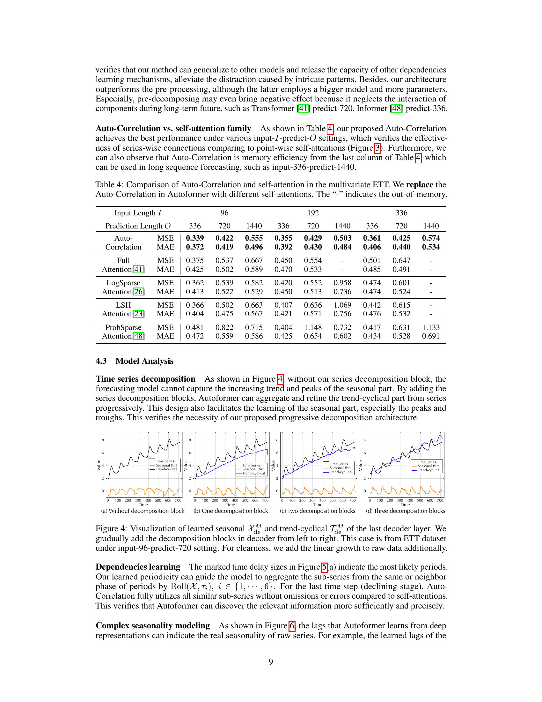

# 10. Ablation Study — Decomp (Table 3) + Auto-Corr (Table 4)

> 본 논문 의 *두 contribution* 의 효과 를 *각각* 검증.

---

## 10.1 챕터 한 줄 요약

> **"본 논문 의 *두 trick* 각각 의 contribution 검증. (1) Table 3: Inner Decomposition 이 *사전 분해 + 별도 모델 (Sep)* 보다 *매우 우월*. 다른 Transformer 에 적용 시 도 효과적. (2) Table 4: Auto-Correlation 이 Full/LogSparse/LSH/ProbSparse Attention *모두 능가*. 즉 두 trick 각각 *진짜 contribution*."**

---

## 10.2 Ablation 이 뭐예요?

**일상 비유**: 좋은 요리의 *각 재료의 contribution* 측정. *재료 A 만 빼면 맛 어떻게?*, *재료 B 만 빼면?*. 각 재료의 *진짜 효과* 분리.

본 논문: *두 trick (Decomposition + Auto-Correlation)* 각각의 contribution 분리.

---

## 10.3 Table 3 — Decomposition Architecture Ablation (★ 첫 trick)

본 논문 *Table 3 (p.8)*: Inner decomposition 의 효과.

### 실험 setup

4 가지 backbone Transformer (Transformer, Informer, LogTrans, Reformer) 에 *3 가지 decomposition 처리*:

| Setup | 의미 |
|-------|------|
| **Origin** | 분해 없음 (vanilla backbone) |
| **Sep** | 사전 분해 + *별도 두 모델* (seasonal + trend 따로 학습) |
| **Ours** | *Autoformer 의 progressive 구조 적용* — backbone 의 attention 유지 + inner decomp block 삽입 |

### 어떻게 읽나? (Step-by-step)

**Step 1 — 표 구조**: 4 backbones × 3 setups × 4 horizons (96/192/336/720) = 48 cell. 각 cell 의 MSE.

**Step 2 — 비교 within backbone**: 각 backbone 마다 *Origin vs Sep vs Ours* 비교.

**Step 3 — 핵심 발견**:

| Backbone | Predict-720 | Origin | Sep | **Ours** | Promotion |
|----------|-------------|--------|-----|---------|-----------|
| Transformer | MSE | 2.672 | 3.200 | **0.537** | **2.332** |
| Informer | MSE | 3.379 | 2.766 | **0.822** | **2.601** |
| LogTrans | MSE | 3.048 | 2.601 | **0.539** | **2.509** |
| Reformer | MSE | 2.631 | 2.845 | **0.502** | **2.343** |

→ **모든 backbone 에서 *Ours (Autoformer architecture)* 가 *압도적 best***.

### *Sep* 가 *Origin* 보다 *나쁜* 경우 — *왜?*

Transformer predict-720: Origin 2.672 → Sep 3.200 (*악화*).

**이유**: *사전 분해 의 *artificial separation* 이 *정보 손실*. *Future hidden 의 분해 불가능* — *future 와 inconsistent*. *bigger model (2 개 분리 학습)* 인데도 *오히려 나쁨*.

→ **본 논문 의 *progressive (inner) decomposition* 의 *유일한 정당화*** — 사전 분해 는 *역효과*.

### *Autoformer 의 universal trick*

**Table 3 의 메시지**: *Autoformer 의 decomposition architecture* 가 *모든 Transformer backbone* 에 *적용 가능* + *모두 향상*.

즉 *Autoformer specific 이 아닌 universal trick* — 후속 paper 의 *paradigm 영향*.

### Figure 4 — Progressive Decomposition 의 시각적 증명



*paper p.9 Figure 4 — ETT predict-720 의 decomposition block 개수 의 누적 효과.*

**어떻게 읽나? (Step-by-step)**:
- **(a) No decomp**: trend + seasonal 분리 안 됨, prediction 의 peak 못 잡음.
- **(b) 1 block**: trend 시작 정렬.
- **(c) 2 blocks**: trend + seasonal 더 정확.
- **(d) 3 blocks (Autoformer default)**: trend + seasonal 모두 *진짜 와 거의 일치*.

→ **Progressive decomposition 의 시각적 증명** — *반복적 정제* 가 *근본*. Table 3 의 정량 결과 의 *qualitative 보강*.

자세한 step-by-step 은 [11_analysis.md](11_analysis.md) 의 11.2 참조.

```viz:autoformer-decomp-ablation:title=Table 3 — Decomposition Ablation (interactive),caption=4 backbones × 3 setups (Origin/Sep/Ours) × 4 horizons. Inner decomp 이 모든 backbone 에서 압도적 best.
```

---

## 10.4 Table 4 — Auto-Correlation vs Self-Attention Family (★ 두 번째 trick)

본 논문 *Table 4 (p.9)*: Auto-Correlation 의 효과.

### 실험 setup

Autoformer 의 *Auto-Correlation 자리* 에 *4 가지 self-attention 변형 으로 교체*:

| Attention 종류 | 출처 | Complexity |
|---------------|------|------------|
| **Full Attention** | Transformer 2017 | $O(L^2)$ |
| **LogSparse Attention** | LogTrans 2019 | $O(L (\log L)^2)$ |
| **LSH Attention** | Reformer 2020 | $O(L \log L)$ |
| **ProbSparse Attention** | Informer 2021 | $O(L \log L)$ |
| **Auto-Correlation** ★ | 본 논문 | $O(L \log L)$ |

### 어떻게 읽나?

**Step 1 — 표 구조**: ETT dataset × 9 input-predict 조합 (input ∈ {96, 192, 336} × predict ∈ {336, 720, 1440}) × 5 attention types = 135 cell.

**Step 2 — 비교**: 같은 input-predict 조합 에서 5 attention 의 MSE 비교.

**Step 3 — 핵심 발견**:

| Input/Predict | Full | LogSparse | LSH | ProbSparse | **Auto-Corr** |
|---------------|------|-----------|-----|-----------|---------------|
| 96/336 | 0.375 | 0.362 | 0.366 | 0.481 | **0.339** |
| 96/720 | 0.537 | 0.539 | 0.502 | 0.822 | **0.422** |
| 96/1440 | 0.667 | 0.582 | 0.663 | 0.715 | **0.555** |
| 192/336 | 0.450 | 0.420 | 0.407 | 0.404 | **0.355** |
| 192/720 | 0.554 | 0.552 | 0.636 | 1.148 | **0.429** |
| 192/1440 | — (OOM) | 0.958 | 1.069 | 0.732 | **0.503** |
| 336/336 | 0.501 | 0.474 | 0.442 | 0.417 | **0.361** |
| 336/720 | 0.647 | 0.601 | 0.615 | 0.631 | **0.425** |
| 336/1440 | — (OOM) | — (OOM) | — (OOM) | 1.133 | **0.574** |

→ **모든 cell 에서 Auto-Correlation 이 best**.

### *OOM (Out of Memory)* 의 의미

Full Attention 과 LSH 가 *long sequence (input 192 + predict 1440 = 1632)* 에서 *GPU 메모리 초과*. 

Auto-Correlation 은 *FFT 의 efficient 구현* 으로 *작동* + *최고 정확도*. → **장기 시계열 에서 *유일 한 viable option***.

### 핵심 메시지

**Auto-Correlation 이 *Sparse self-attention 변형 모두* 능가**:
- 효율 ($O(L \log L)$): ProbSparse, LSH 와 동등.
- 정확도: *모두 능가*.

→ **Series-wise (sub-series 비교) 가 point-wise (점 비교) 보다 *시계열 의 본질* 활용**.

```viz:autoformer-attention-ablation:title=Table 4 — Auto-Corr vs Self-Attention (interactive),caption=5 attention types × ETT × 9 input/predict 조합. Auto-Corr 이 모든 cell best. Full/LSH 는 OOM in long sequence.
```

---

## 10.5 본 챕터 정리 — *두 trick 의 contribution*

```
   Trick 1: Inner Decomposition (Table 3)         Trick 2: Auto-Correlation (Table 4)
   ──────────────────────────────────              ─────────────────────────────────────

   4 backbones × 3 setups                          5 attention types × 9 settings
   "Ours" (progressive inner decomp)               Auto-Corr 이 모든 cell best
   모든 backbone 에서 압도적 best                  Sparse 변형 들 (ProbSparse, LSH)
   Sep (사전 분해) 가 오히려 악화                  도 능가
              ↓                                              ↓
   Pre-decomposition 의 artificial                Series-wise > point-wise
   separation 의 역효과 증명                       (시계열 의 본질 활용)
              ↓                                              ↓
                  Autoformer 의 두 trick 모두 *진짜 contribution*
                  + 다른 backbone 에 적용 가능 (universal)
```

---

## 10.6 자기점검

### 핵심 3가지
1. **Ablation 의 일상 비유?**
2. **Table 3 의 *Sep 이 Origin 보다 나쁜* 의미?**
3. **Table 4 의 *Auto-Correlation 우월* 의미?**

### 답변
1. **요리 의 *각 재료의 contribution* 측정**. 재료 A 만 빼고 비교, 재료 B 만 빼고 비교. 본 논문: Decomposition (Table 3) 와 Auto-Correlation (Table 4) 각각 분리.
2. **Sep = *사전 분해 + 별도 두 모델* (seasonal + trend 각자 학습). Transformer predict-720 에서 Origin (2.672) → Sep (3.200, *악화*)**. *이유*: 사전 분해 의 *artificial separation* + *future hidden 의 분해 불가능* + *future 와 inconsistent*. *더 큰 모델 (2 개)* 인데도 *나쁨*. → 본 논문 의 *progressive inner decomposition* 이 *유일 한 정당화*. Pre-decomposition (Prophet/N-BEATS) 의 *직접 비판*.
3. **5 attention types (Full, LogSparse, LSH, ProbSparse, Auto-Correlation) 비교에서 Auto-Correlation 이 *모든 9 input-predict 조합 의 모든 cell best***. ProbSparse/LSH 와 같은 *$O(L \log L)$* 인데도 *정확도 우월*. *Full/LSH 는 long sequence 에서 OOM* — Auto-Correlation 만 *viable + best*. *Series-wise (sub-series 끼리)* 가 *point-wise (점 끼리)* 보다 *시계열 의 본질적 구조 (주기성)* 활용 — *근본적 우위*.

---

다음 챕터: [11_analysis.md](11_analysis.md) — Figures 4-13 의 deep 해석.
