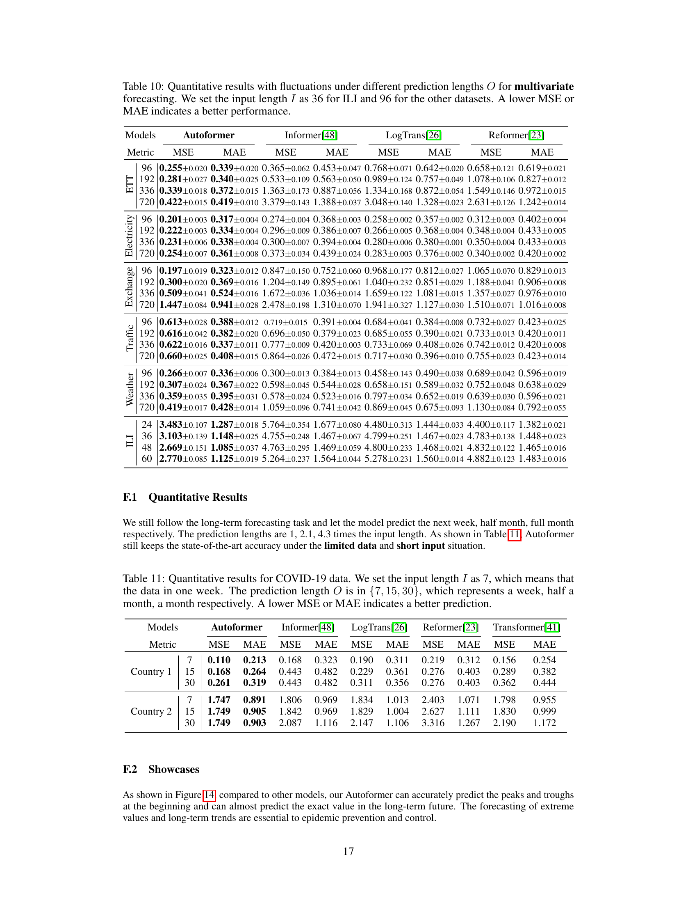

# 14. Appendix F — COVID-19 Case Study (Table 11 + Figure 14)

> Paper *Appendix F*. *제한 된 데이터* + *짧은 input* 의 *극단 setting* 에서 Autoformer 의 robustness.

---

## 14.1 챕터 한 줄 요약

> **"COVID-19 dataset (2개국 의 일별 확진/회복 patient 수, 2020-2021) 에서 Autoformer 가 *Informer/LogTrans/Reformer/Transformer 모두 능가*. *작은 학습 데이터 + 짧은 input (7일)* 의 *극한* 에서도 *SOTA*. Figure 14 가 시각적 증명."**

---

## 14.2 COVID-19 Dataset

### Setup

- **출처**: Dong et al 2020 (COVID-19 web dashboard).
- **국가**: 유럽 의 *2 개 anonymous 국가*.
- **기간**: 2020년 1월 22일 ~ 2021년 5월 20일 (약 1.5년).
- **변수**: 일별 *확진자 (confirmed deaths)* + *회복자 (recovered patients)*.
- **Split**: train : val : test = 7 : 1 : 2 (chronological).

### *왜 COVID-19?*

본 논문 의 *현실 응용 검증*. *극한 setting*:
1. **제한 데이터**: 1.5년 만 (전통 dataset 의 *10년+* 와 대비).
2. **짧은 input**: $I = 7$ (1주일).
3. **Pandemic dynamics**: 일반 시계열과 *다른 dynamics*.

→ *Autoformer 의 generalizability* + *low-resource setting* 검증.

---

## 14.3 Table 11 — Quantitative Results

본 논문 *Table 11 (p.17)*: COVID-19 forecasting 결과.

### Setup

- **Input**: $I = 7$ (1주일).
- **Forecasting horizons**: $O \in \{7, 15, 30\}$ — *1주, 0.5달, 1달* 앞.
- **Models**: Autoformer, Informer, LogTrans, Reformer, Transformer.
- **Metric**: MSE + MAE.

### 어떻게 읽나? (Step-by-step)

**Step 1 — 표 구조**: 2 sub-table (Country 1, Country 2) × 3 horizons × 5 models × 2 metrics = 60 cell.

**Step 2 — Country 1 결과** (확진자 수 예측):

| Horizon | Autoformer | Informer | LogTrans | Reformer | Transformer |
|---------|------------|----------|----------|----------|-------------|
| 7 (1주) | **0.110** | 0.168 | 0.190 | 0.219 | 0.156 |
| 15 (0.5달) | **0.168** | 0.443 | 0.229 | 0.276 | 0.289 |
| 30 (1달) | **0.261** | 0.443 | 0.311 | 0.276 | 0.362 |

→ **Autoformer 가 *3 horizons 모두 best*** (35-65% MSE 감소).

**Step 3 — Country 2 결과** (다른 국가):

| Horizon | Autoformer | Informer | LogTrans | Reformer | Transformer |
|---------|------------|----------|----------|----------|-------------|
| 7 | **1.747** | 1.806 | 1.834 | 2.403 | 1.798 |
| 15 | **1.749** | 1.842 | 1.829 | 2.627 | 1.830 |
| 30 | **1.749** | 2.087 | 2.147 | 3.316 | 2.190 |

→ **Country 2 도 Autoformer best**. 30 일 horizon 에서 *18-47% MSE 감소*.

**Step 4 — 핵심**:

- *Input 7일 만 으로* *1달 앞 (30 일)* 예측 — *극한 ratio* (input/predict = 7/30 = 0.23).
- 다른 dataset 의 input/predict ratio (96/336 = 0.29 등) 와 *비슷 한 수준* — *어려운 setting*.
- *Autoformer 가 모든 cell best* — **저 자원 (limited data) setting 의 robustness 증명**.

---

## 14.4 Figure 14 — Prediction Showcase



*paper p.17 Figure 14 — Country 2 의 input-7-predict-15 setting.*

### 어떻게 읽나? (Step-by-step)

**Step 1 — 5 sub-panel** (5 models):
- Autoformer, Informer, LogTrans, Reformer, Transformer.

**Step 2 — 각 panel**:
- *Blue*: Ground truth (실제).
- *Orange*: Prediction.

**Step 3 — 발견**:

**Autoformer (panel 1)**:
- *진짜 (blue) 와 prediction (orange) 거의 일치*.
- *peak 와 trough 모두 정확*.
- *Long-term trend 잡음*.

**Informer (panel 2)**:
- *Over-smoothing* — 직선 같은 prediction.
- *Peak 못 잡음*.

**LogTrans (panel 3)**:
- *Noisy prediction*.
- *Pattern 못 잡음*.

**Reformer (panel 4)**:
- *큰 편차*.

**Transformer (panel 5)**:
- *Over-smoothing* 비슷.

**Step 4 — 의미**: *Autoformer 의 *극단 시각적 우위***. *제한 데이터* 에서도 *진짜 dynamics 잡음*.

→ *Pandemic forecasting 의 *real-world 가치* — 정부 의 *대응 정책* 에 직접 사용 가능*.

---

## 14.5 *COVID-19 의 실용적 의미*

### 1. *Public Health 응용*

- *확진자 수 예측* → *병원 capacity 계획*.
- *회복자 수 예측* → *재원 일수* 계산.
- *Autoformer 의 정확도* → *정책 결정* 의 *근거*.

### 2. *제한 데이터 시계열 의 paradigm*

대부분 *real-world 응용* 은:
- *짧은 history*.
- *제한 된 학습 data*.
- *Unknown dynamics* (예: pandemic).

Autoformer 가 *이런 setting 에서도 SOTA* → *Robust application* 가능성.

### 3. 후속 응용

본 case study 이후:
- *Climate change forecasting*: 짧은 시계열 (수십년).
- *Medical clinical trials*: 짧은 patient 데이터.
- *Financial crises*: 비주기 + 극단 event.

모두 *Autoformer 의 robustness* 가 의미 있음.

---

## 14.6 본 챕터 정리

```
   Table 11 (COVID 정량)                       Figure 14 (COVID 시각)
   ─────────────────────                      ─────────────────────────

   2 countries × 3 horizons × 5 models         Country 2 의 input-7-predict-15
   Autoformer 가 모든 cell best                Autoformer = 진짜 와 일치
              ↓                                              ↓
   짧은 input (7일) + 제한 데이터              다른 모델 = over-smoothing or noise
   에서도 SOTA                                              ↓
              ↓                                  Pandemic dynamics 잡는 강력 함
   Autoformer 의 robustness                              ↓
              ↓                                  Public health 응용 가능성
   (Limited data + extreme setting)
```

---

## 14.7 자기점검

### 핵심 3가지
1. **COVID-19 case study 의 *극한 setting* 이 뭔가?**
2. **Table 11 의 결과 의 의미?**
3. **Figure 14 의 *Autoformer 의 시각적 우위*?**

### 답변
1. **(1) 제한 데이터**: 1.5년 만 (vs 전통 dataset 10년+). **(2) 짧은 input**: $I = 7$ (1주일 만). **(3) Unknown dynamics**: Pandemic 의 *novel 패턴*. **(4) 작은 M**: 2 변수 (confirmed + recovered) 만. → *모든 측면 의 *극한*. *대부분 real-world 응용 의 challenging setting 의 축약*.
2. **Autoformer 가 2 countries × 3 horizons 모든 cell best**. Country 1 의 horizon 30 에서: Autoformer 0.261 vs Informer 0.443 — *41% MSE 감소*. *Input 7일 만 으로 1달 앞* 예측 — *극한 ratio* (input/predict = 0.23). Autoformer 의 *low-resource robustness* 의 *직접 증명*.
3. **Country 2 input-7-predict-15 의 시각**. **Autoformer**: 진짜 (blue) 와 prediction (orange) *거의 일치*. *Peak/trough 정확 + long-term trend 잡음*. **Informer/Transformer**: *Over-smoothing* — *직선 같은 prediction*. **LogTrans**: *Noisy*. **Reformer**: *큰 편차*. *Pandemic dynamics 의 *복잡 한 patterns* 를 Autoformer 만 capture*. *Public health 응용* 의 직접 가능성.

---

다음 챕터: [15_conclusion.md](15_conclusion.md) — Conclusion + Future Work.
