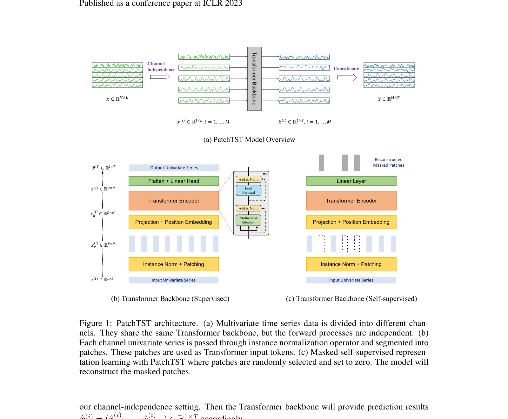
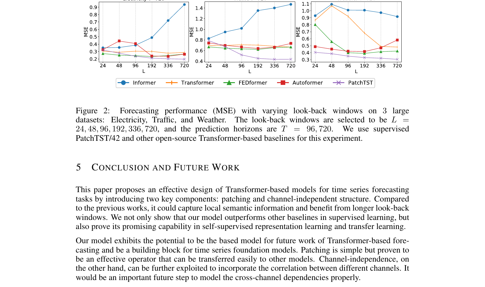
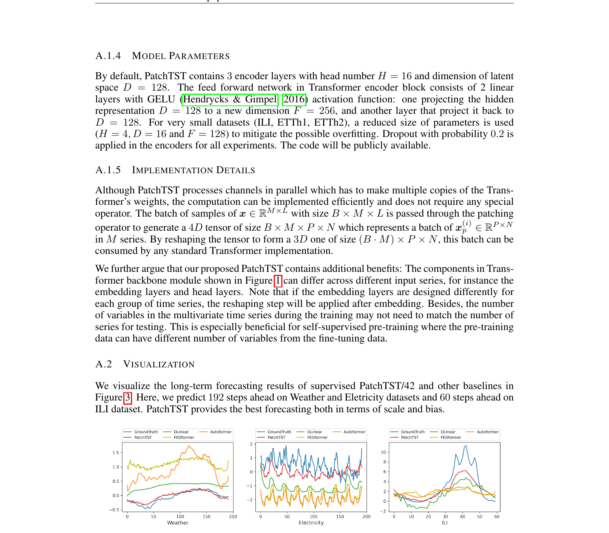
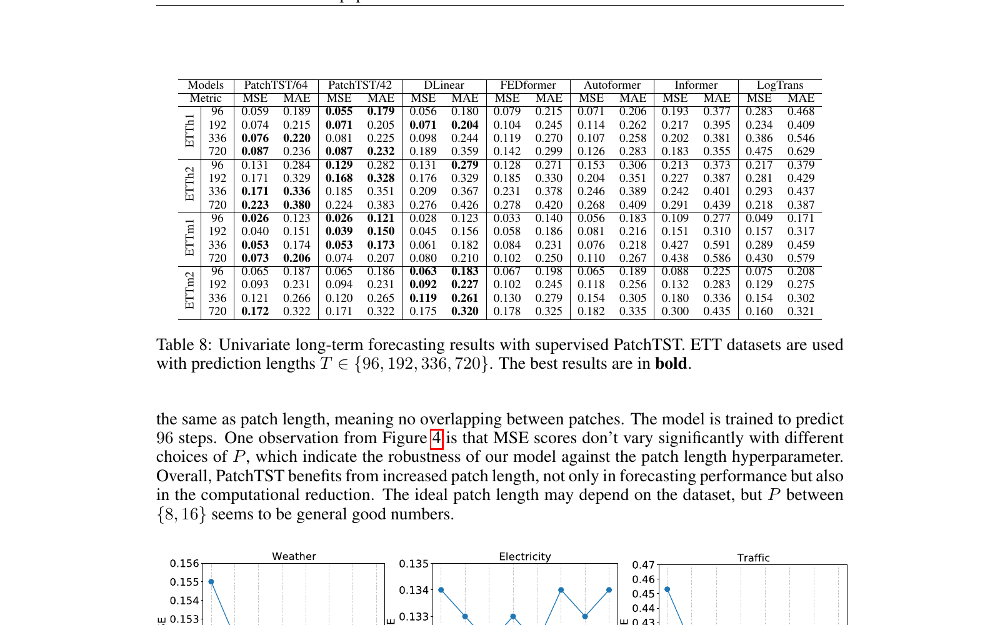
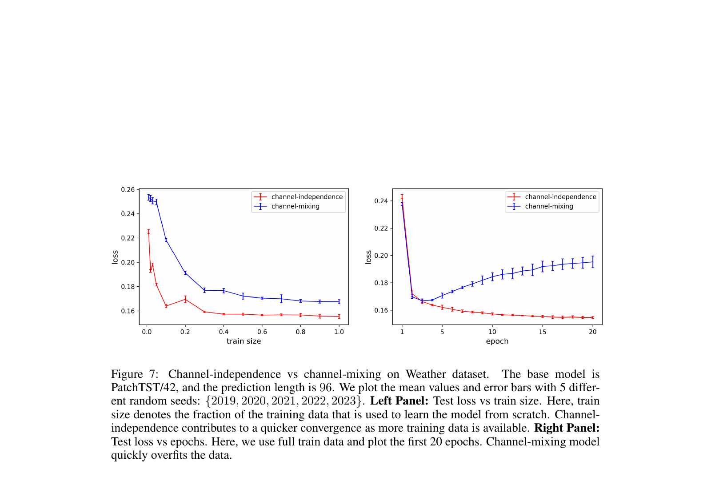

# 17. ASCII 도식 + Figure 1-7 + viz 카탈로그

> 본 deep dive 의 모든 시각 자료를 한 곳에. *step-by-step 가이드 + viz block 카탈로그*.

---

## 17.1 PatchTST 전체 구조 ASCII

```
                      Multivariate 시계열 입력
                  [M channel × L timestep]
                              ↓
              ┌───────────────────────────────────┐
              │  Channel-Independence 분리        │
              │  → M 개 univariate 시계열로 분리   │
              └───────────────────────────────────┘
                              ↓
              [각 channel 마다 (M 개 반복)]
                              ↓
              ┌───────────────────────────────────┐
              │  Instance Normalization           │
              │  → 각 시계열 standardize           │
              └───────────────────────────────────┘
                              ↓
              ┌───────────────────────────────────┐
              │  Patching                          │
              │  L=336 → P=16, S=8 → N=42 patches │
              └───────────────────────────────────┘
                              ↓
              ┌───────────────────────────────────┐
              │  Linear Projection + Position Emb │
              │  Each patch → D=128 token         │
              └───────────────────────────────────┘
                              ↓
              ┌───────────────────────────────────┐
              │  Vanilla Transformer Encoder      │
              │  3 layer × 16 head × D=128        │
              │  + Multi-head Self-Attention      │
              │  + Feed-Forward                   │
              │  + Batch Norm + Residual          │
              └───────────────────────────────────┘
                              ↓
              ┌───────────────────────────────────┐
              │  Linear Prediction Head            │
              │  → T 개 미래 timestep              │
              └───────────────────────────────────┘
                              ↓
              ┌───────────────────────────────────┐
              │  De-Normalize (instance norm 복원) │
              └───────────────────────────────────┘
                              ↓
              [M 개 channel 의 예측 합치기]
                              ↓
                Multivariate 시계열 예측
                  [M channel × T timestep]
```

---

## 17.2 Figure 1 — PatchTST Architecture (★ 가장 중요)



*paper p.4 Figure 1.*

### 어떻게 읽나? (Step-by-step)

**Step 1 — 3 sub-plot**

- **(a) Top**: PatchTST 의 *Supervised forecasting* 흐름.
- **(b) Middle**: *Self-supervised pre-training* 흐름 (masked patch reconstruction).
- **(c) Bottom**: *Channel-independence* 의 *parallel processing* 시각.

**Step 2 — Panel (a) Supervised forecasting**

흐름 (왼쪽 → 오른쪽):
1. *Input*: M channel × L timestep 시계열.
2. *Channel split*: M 개 univariate.
3. *Patching*: 각 시계열을 N patch 로 자름.
4. *Embedding*: patch → D 차원 token.
5. *Transformer encoder*: N tokens 의 self-attention.
6. *Prediction head*: 미래 T timestep 출력.

**Step 3 — Panel (b) Self-supervised pre-training**

흐름:
1. *Input*: 같은 시계열.
2. *Patching* + *40% random mask*.
3. *Transformer encoder* (mask 된 부분 예측).
4. *Reconstruction head*: masked patch 의 값 예측.
5. *Loss*: MSE between 예측 & 진짜.

**Step 4 — Panel (c) Channel-Independence**

흐름:
- M 개 channel 이 *별도 stream* 으로 *parallel* Transformer 통과.
- 모두 *같은 weight* 공유.
- 출력은 각 channel 별 forecast.

### 핵심 메시지

이 Figure 1 이 *본 논문 전체 architecture* 의 시각화. 모든 챕터의 *통합*.

```viz:pat-architecture:title=Fig 1 — PatchTST Architecture (interactive),caption=3 panel 토글 (Supervised / Self-supervised / Channel-Indep). 각 panel 의 정확한 data flow.
```

---

## 17.3 Figure 2 — Look-back Window (Chapter 10 참조)



*step-by-step 가이드는 [10_supervised_results.md](10_supervised_results.md) 챕터의 10.3 참조*.

핵심: PatchTST 가 *longer L 활용 가능*. FEDformer 등은 L > 96 부터 MSE 증가.

---

## 17.4 Figure 3 — Forecasting Visualization (Chapter 10 참조)



*step-by-step 은 [10_supervised_results.md](10_supervised_results.md) 챕터의 10.4 참조*.

핵심: Weather + Traffic 의 192-step 예측. PatchTST 의 예측 = 진짜 거의 일치.

---

## 17.5 Figure 4 — Patch Length Sensitivity (Chapter 12 참조)



*step-by-step 은 [12_ablation.md](12_ablation.md) 챕터의 12.4 참조*.

핵심: $P$ 가 어떤 값이든 *MSE 둔감*. P = 16 의 *robust 선택*.

---

## 17.6 Figure 5 — Model Size Sensitivity


*paper p.20 Figure 5 (Appendix).*

### 어떻게 읽나?

**Step 1**: 6 sub-plot (3 datasets × 2 horizons). 각 sub-plot 에 *model size* 의 함수로 MSE.

**Step 2**: Model size = (D, layer, head 수) 의 조합.

**Step 3 — 발견**:
- *모든 model size 에서 MSE 비슷*.
- 즉 *PatchTST hyperparameter 에 robust*.

```viz:pat-fig5-model-size:title=Fig 5 — Model size sensitivity (interactive),caption=6 hyperparameter combination × 8 datasets. Model size 에 둔감. PatchTST robustness.
```

---

## 17.7 Figure 6 — Attention Maps


*paper p.23 Figure 6 (Appendix).*

### 어떻게 읽나?

**Step 1**: Electricity dataset 의 *시계열 3개* (가구 11, 25, 81) 의 *attention map* 시각.

**Step 2**: 각 attention map 의 색 강도 = *두 token (patch) 간 attention weight*.

**Step 3 — 발견**:
- *Diagonal pattern* (인접 patch 의 attention 가장 큼) — *local temporal pattern* 학습.
- *Specific off-diagonal* (먼 patch 간 attention) — *periodicity* (예: 24시간 주기) 학습.

→ *Transformer 가 시계열의 진짜 패턴 (locality + periodicity) 학습* 확인.

---

## 17.8 Figure 7 — Channel-Indep vs Mixing Curves



*paper p.24 Figure 7 (Appendix).*

### 어떻게 읽나?

**Step 1 — 2 panel**: 
- *Left*: MSE vs *train sample size*.
- *Right*: MSE vs *epoch (학습 시간)*.

**Step 2 — 색**:
- *Blue*: Channel-Independence.
- *Red*: Channel-Mixing.

**Step 3 — 발견**:
- *Left*: Channel-Indep 가 *적은 sample 에서도 잘함* (sample efficiency).
- *Right*: Channel-Indep 가 *학습 빠름* + *최종 MSE 낮음*.

→ Channel-Indep 의 *sample efficiency + training stability* 정량.

```viz:pat-fig7-channel-curves:title=Fig 7 — Channel-indep vs mixing curves (interactive),caption=train size + epoch 두 panel. Channel-indep 가 적은 sample, 빠른 학습, 낮은 MSE.
```

---

## 17.9 인터랙티브 viz 카탈로그 (14개)

본 deep dive 의 모든 viz block:

| viz id | 챕터 | 내용 |
|--------|------|------|
| `pat-patching` | 04 | Patching 메커니즘 슬라이딩 윈도우 |
| `pat-channel-indep` | 05 | Channel-indep vs Channel-mixing |
| `pat-table3-supervised` | 10 | Table 3 256 cells, PatchTST vs 7 baselines |
| `pat-lookback-window` | 10 | Fig 2, longer L 의 효과 |
| `pat-ablation-table7` | 12 | Table 7, P+CI / CI / P / Original |
| `pat-fig4-patch-length` | 12 | Fig 4, P sensitivity |
| `pat-masked-recon` | 08 | Masked patch reconstruction |
| `pat-table1-evolution` | 03 | Table 1 case study |
| `pat-architecture` | 17 (지금) | Fig 1, architecture 3-panel |
| `pat-table15-ci-universal` | 05/18 | CI universal trick |
| `pat-fig5-model-size` | 17 (지금) | Fig 5, size sensitivity |
| `pat-fig7-channel-curves` | 17 (지금) | Fig 7, CI 학습 curves |
| `pat-table11-instance-norm` | 07/18 | Table 11, BN vs LN |
| `pat-table14-seeds` | 20 | Table 14, seed variance |

---

## 17.10 자기점검

### 핵심 3가지
1. **Figure 1 의 3 sub-plot 의미?**
2. **Figure 6 의 attention map 발견?**
3. **Figure 7 의 channel-indep advantage?**

### 답변
1. **(a) Supervised forecasting**: 표준 PatchTST 흐름 (input → channel split → patching → embed → Transformer → head). **(b) Self-supervised pre-training**: 40% mask + Transformer + reconstruction head. **(c) Channel-Independence**: M channel 의 parallel processing, 같은 weight.
2. **Diagonal pattern (인접 patch attention 가장 큼) — local temporal 학습. Off-diagonal specific spots — periodicity (예: 24시간 주기) 학습**. 즉 *Transformer 가 시계열의 진짜 패턴 (locality + periodicity)* 학습 확인. *시계열 specific 변형 (Autoformer auto-correlation) 없이도* 학습 가능.
3. **(Left panel) Train sample size 의 함수**: Channel-Indep 가 *적은 sample 에서도 잘함* — sample efficiency. **(Right panel) Epoch 의 함수**: Channel-Indep 가 *학습 빠름 + 최종 MSE 낮음* — training stability. *Cross-channel mixing 의 spurious correlation 회피* 의 정량 증명.

---

다음 챕터: [18_appendix.md](18_appendix.md) — Appendix Deep Dive (옵션).
