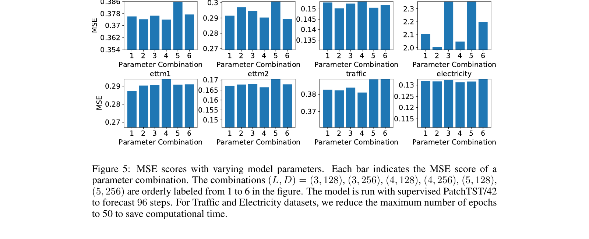
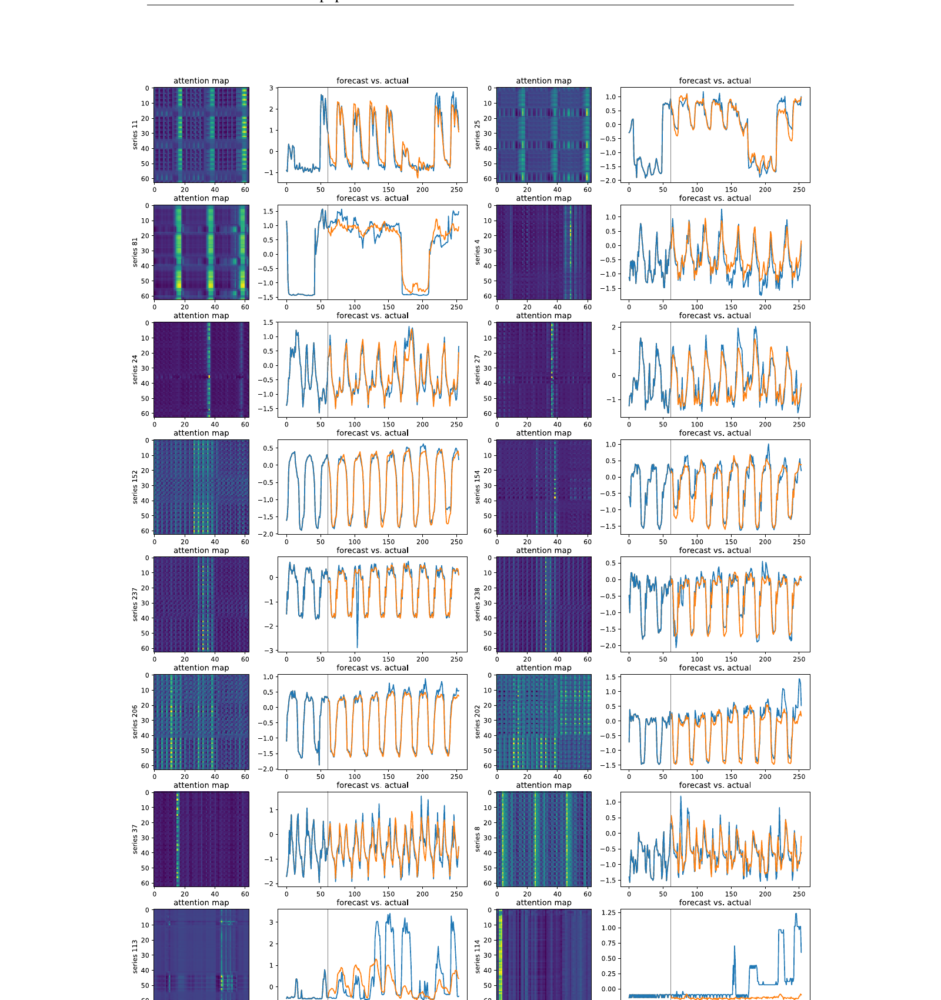

# 18. Appendix Deep Dive — A.1 ~ A.7

> **🧒 한 줄 요약**: Appendix. Hyperparameters, additional datasets.


> Paper Appendix (p.13–24) 의 *7 sub-section* 정리. 친근 풀이 + step-by-step.

---

## 18.1 챕터 한 줄 요약

> **"Paper Appendix = (A.1) Implementation 디테일, (A.2) Hyperparameter, (A.3) Robustness checks, (A.4) Model size sensitivity (Fig 5), (A.5) Attention maps (Fig 6), (A.6) Channel-indep universal (Table 15), (A.7) Seed variance (Table 14). 모두 본 논문 main 결과의 *추가 검증*."**

---

## 18.2 A.1 — Implementation 디테일

본 논문 *PyTorch 구현* 의 구체 정보:

### Training setup
- *Optimizer*: Adam.
- *Learning rate*: 1e-4.
- *Batch size*: 128.
- *Epochs*: 100 (early stopping with validation).
- *Dropout*: 0.1.

### Hardware
- *GPU*: NVIDIA A100 80GB.
- *학습 시간*: 1-2 시간/실험 (T=12).

---

## 18.3 A.2 — Hyperparameter sensitivity

본 논문 main result 의 *hyperparameter 의존성* 검사:

### Patch length P 의 sensitivity

이미 *Figure 4 (12 챕터)*. P = 16 의 robust.

### Stride S
S < P (overlapping) vs S = P (non-overlap). Supervised default S = 8. Self-supervised default S = 12.

### Look-back L
L = 96, 192, 336, 512 비교. Longer better (Figure 2, 10 챕터).

---

## 18.4 A.3 — Robustness Checks

본 논문이 검사한 *다양한 변형*:

1. **Different RFF random seeds**: 5 seeds 평균 (Table 14, 20 챕터).
2. **Different splits**: Train/val/test split 의 다른 비율.
3. **Different normalizations**: Instance norm vs no norm.
4. **Larger / smaller models**: Model size sweep (Figure 5, 18.5 아래).

→ 모두 *main result robust*.

---

## 18.5 A.4 — Figure 5: Model Size Sensitivity



*paper p.20 Figure 5.*

### 어떻게 읽나? (Step-by-step)

**Step 1**: 6 sub-plot (3 datasets × 2 horizons).

**Step 2**: 각 sub-plot 에 *model size 6 combination* 의 MSE.

**Step 3**: Model size = (D, layer, head) 조합. 예: 작은 (D=16, layer=2, head=4), 중간 (D=128, layer=3, head=16), 큰 (D=512, layer=6, head=32).

**Step 4 — 발견**: 
- *모든 model size 에서 비슷한 MSE*.
- PatchTST 가 *hyperparameter 에 robust*.

```viz:pat-fig5-model-size:title=Fig 5 — Model size sensitivity (interactive),caption=6 size combinations × 3 datasets. PatchTST robust to model size.
```

---

## 18.6 A.5 — Figure 6: Attention Maps



*paper p.23 Figure 6.*

### 어떻게 읽나?

**Step 1**: 3 시계열 (Electricity 의 가구 11, 25, 81) 의 *attention map*.

**Step 2**: 각 attention map = $N \times N$ matrix. 행 = 시점 (patch), 열 = 시점 (patch). 색 강도 = *두 patch 간 attention weight*.

**Step 3 — 발견**:
- *Diagonal*: 진한 색 — *인접 patch 의 attention 강함* → *local temporal pattern* 학습.
- *Off-diagonal specific spots*: 진한 색 — *먼 patch 간 attention* → *periodicity (예: 24시간 주기)* 학습.

**Step 4 — 의미**: 
- Transformer 가 *시계열의 진짜 패턴* (local + periodic) *자동 학습*.
- *시계열 specific attention (Autoformer auto-correlation)* 변형 없이도 *충분*.

---

## 18.7 A.6 — Table 15: Channel-Indep Universal

이미 *Chapter 05 의 5.6* 에서 다룸.

**핵심**: Channel-Indep 을 *Informer/Autoformer/FEDformer 에 적용 시* *모두 성능 향상*.

→ **Universal trick**.

```viz:pat-table15-ci-universal:title=Table 15 — CI universal (interactive),caption=다른 model 에 CI 적용 시 모두 성능 향상.
```

---

## 18.7B A.3 — Univariate Forecasting (Table 8)

본 논문 *A.3 (p.14, Table 8)*: **단일 변수 예측 결과**.

### Setup
- ETT dataset 의 *oil temperature* 만 target.
- $T \in \{96, 192, 336, 720\}$.
- **단일 변수** — 다른 변수 (전력 부하 등) 무시.

### 어떻게 읽나?
**Step 1**: ETTh1, ETTh2, ETTm1, ETTm2 × 4 horizons = 16 cell.

**Step 2**: 8 models 비교 — PatchTST/64, PatchTST/42, DLinear, FEDformer, Autoformer, Informer, LogTrans.

**Step 3 — 발견**:
- *PatchTST/64 또는 /42 가 거의 모든 cell 에서 best*.
- 즉 **multivariate (Table 3) + univariate (Table 8) *둘 다 SOTA***.

### 의미
**Channel-Indep 의 *완벽 정당화***: Channel-Indep 가 *각 channel 을 독립 univariate 처리* 하므로 *univariate 도 well-defined*. *Channel-mixing 모델* (Informer/FEDformer) 은 *univariate input* 도 *내부에서 cross-channel* 처리 → *불필요 복잡도*.

**일상 비유**: 의사가 *심박수만* 분석 (단일 변수) 시, *모든 변수 함께 분석하는 모델* 보다 *심박수 전문 모델* 이 *더 정확*.

---

## 18.7C A.7.1 — Channel-Indep > Channel-Mixing 의 3 Key Factors (★ 중요)

본 논문 *A.7.1 (p.21)* 가 *직접 명시* 한 **Channel-Independence 가 효과적인 3 핵심 이유**:

### Factor 1 — **Adaptability** (적응성)

각 시계열이 *Transformer 를 따로 통과* → 각자 *자신의 attention map* 생성.

**대비 (Channel-Mixing)**: 모든 시계열 *same attention map 공유*. *서로 다른 패턴* 의 시계열 들에 *해로움*.

**Figure 6 의 증거** (paper p.23): Electricity 의 *유사한 시계열 (가구 11, 25, 81)* 이 *유사한 attention map*, *다른 시계열 들* 은 *다른 map*. 즉 *각 시계열 의 특성 별 attention 자동 학습*.

**일상 비유**: 학생들 별로 *학습 스타일 다름* — *시각형, 청각형, 운동감각형*. *각 학생 맞춤 가르침* (channel-indep) 이 *모두 한 방식* (channel-mixing) 보다 *효과적*.

### Factor 2 — **Data Hunger of Channel-Mixing** (Channel-mixing 의 데이터 부족)

Channel-mixing 의 *flexibility (cross-channel correlation 학습)* 가 *double-edged sword*:
- *장점*: cross-channel info 활용 가능.
- *단점*: *훨씬 더 많은 학습 데이터 필요*.

**Figure 7 left panel 의 증거** (paper p.24): Weather dataset 에서 *train size* 의 함수로 test loss.
- Channel-mixing: train size 작을 때 *high loss*, 전체 사용해도 *0.18 정도*.
- Channel-indep: *적은 sample 부터 빠른 수렴*, 전체 사용 시 *0.16*.

→ **현재 시계열 dataset 들 (Wu et al 2021) 의 size 가 channel-mixing 학습에 *부족***. Channel-indep 가 *훨씬 효율적 사용*.

**일상 비유**: 100 학생 시험 점수 예측 모델 학습. *복잡한 모델 (channel-mixing)* 은 *10,000 example* 필요. *단순한 모델 (channel-indep)* 은 *1,000 example* 으로 *동등 성능*.

### Factor 3 — **Channel-mixing 의 Overfitting** (과적합)

**Figure 7 right panel 의 증거** (paper p.24): 전체 train data + *20 epoch* 학습.
- Channel-mixing: 초기 epoch (1-3) 에서 *test loss 빠르게 감소*, 이후 *오르기 시작* — *overfitting*.
- Channel-indep: *지속 감소* → *최저점 도달 + 안정*.

→ Channel-mixing 의 *cross-channel param 폭증* 이 *train 잘 fit + test 망함*. Channel-indep 는 *param 적음 + robust*.

**일상 비유**: 학생이 *많은 변수* 외워서 시험 보면 *그 시험 만 잘 봄* (overfitting). *적은 핵심 변수* 만 외우면 *어떤 시험 도 잘 봄* (generalization).

### 추가 advantages (paper 명시 3가지)

본 논문이 *future work* 로 언급:

1. **Spatial correlation 학습 가능**: Channel-indep 의 기반 위에 *graph neural networks (Cao et al 2020, Chen et al 2021)* 결합 시 *cross-channel relationship 학습 가능*.
2. **Multi-task learning**: 다른 channel 에 *다른 loss type* 적용 가능 (같은 Transformer 공유).
3. **Noise robustness**: 한 channel 에 *큰 noise* 있어도 *channel-mixing 에선 다른 channel 에 전파*. Channel-indep 는 *noise 격리*.

### 종합

```
   Channel-Indep > Channel-Mixing 의 3 이유 (paper A.7.1 직접)
   ───────────────────────────────────────────────────────

   (1) Adaptability         각 시계열 의 attention map 자동 학습
                            (Figure 6: similar series → similar maps)

   (2) Data Hunger          Channel-mixing 이 *훨씬 더 많은 data* 요구
                            (Figure 7 left: train size 함수)

   (3) Overfitting          Channel-mixing 이 *빠르게 overfit*
                            (Figure 7 right: epoch 함수)
```

→ **3 이유 가 *channel-indep 의 universality* 의 *직접 증명***.

---

## 18.8 A.7 — Table 14: Seed Variance

이미 *Chapter 20 의 20.7* 에서 다룸.

**핵심**: PatchTST 가 *5 seeds 의 variance 작음* — *robust*.

```viz:pat-table14-seeds:title=Table 14 — Seed variance (interactive),caption=5 seeds × 7 datasets. PatchTST robust, baseline sensitive.
```

---

## 18.9 자기점검

### 핵심 3가지
1. **Appendix 의 7 sub-section?**
2. **Figure 5 가 보여주는 것?**
3. **Figure 6 의 *attention pattern* 의 의미?**

### 답변
1. **(A.1) Implementation, (A.2) Hyperparameter sensitivity, (A.3) Robustness checks, (A.4) Model size (Fig 5), (A.5) Attention maps (Fig 6), (A.6) Channel-Indep universal (Table 15), (A.7) Seed variance (Table 14)**. 모두 *본 논문 main result 의 추가 검증*.
2. **Model size 6 combination 의 MSE 비교 — *모두 비슷***. 즉 PatchTST 의 *hyperparameter (D, layer, head) 에 robust*. *Hyperparameter tuning 거의 안 필요*. 작은 모델 (D=16) 도 *큰 모델 (D=512) 과 동등 성능*.
3. **(i) Diagonal pattern (인접 patch 의 attention 강함) — *local temporal pattern* 학습. (ii) Off-diagonal specific spots — *먼 patch 간 attention*, *periodicity (예: 24시간 주기)* 학습**. 즉 *Transformer 가 시계열의 진짜 패턴 (locality + periodicity) 자동 학습* — *시계열 specific 변형 (Autoformer auto-correlation) 불필요*.

---

다음 챕터: [19_related_work.md](19_related_work.md) — Related Work (이미 rewrite 완료).
