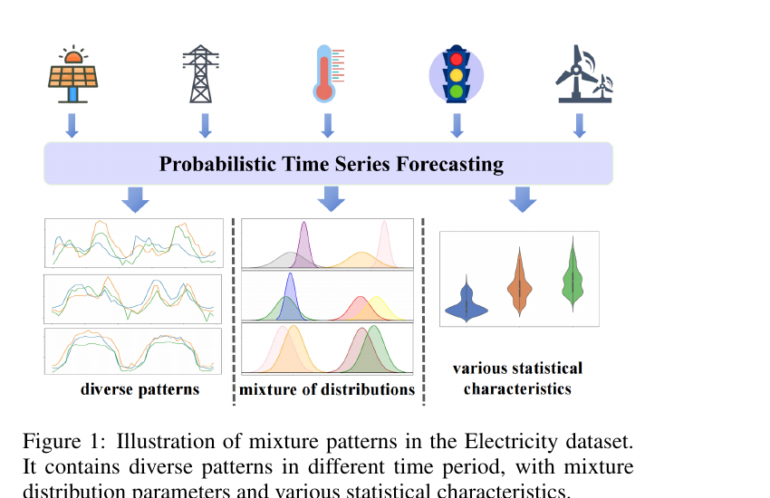

# 03. Section 1 (Introduction) — 왜 이런 연구가 필요한가

## 📌 이 챕터 다 읽으면 알 수 있는 것

- **Probabilistic Forecasting** 의 정확한 정의 — "한 값 예측" 이 아닌 "분포 예측" 이 왜 필요한가
- **Fig 1** 의 정밀 해석 — Electricity 데이터의 3 가지 mixture patterns (Quantile drift / Divergence / GMM)
- 본 논문이 깨려는 **3 가지 학계 challenge** (한 분포 강제 / 다양성 부족 / aggregate metric)
- Autoformer (2021) 의 trend-seasonal 분해 → 본 논문의 quantile-aware 분해의 진화

---

논문 1쪽 ~ 2쪽 (Section 1) 을 풀어본다. 이 섹션은 **본 논문의 동기와 핵심 challenge** 를 다룬다.

---

## 3.1 Probabilistic Forecasting 이 뭔지 정확히

### 원문 정의

> **원문 (paper p.1)**: "The primary objective of probabilistic time series forecasting is to provide probability distribution information regarding uncertainty for predicting values at future time points. Unlike traditional time series forecasting, probabilistic forecasting aims to comprehensively describe the potential range of future values, which is achieved by estimating various quantiles (including median and percentiles) to offer a range of potential outcomes, thereby enhancing decision-making under uncertainty."

### 한 문장씩 풀이

#### 첫 문장
> "The primary objective of probabilistic time series forecasting is to provide probability distribution information regarding uncertainty for predicting values at future time points."

**의역**: "확률적 시계열 예측의 주된 목적은 미래 시점 값 예측에 대한 불확실성의 확률 분포 정보를 제공하는 것이다."

**풀어 설명**:
- 기존 예측 = "내일 5MW".
- 확률적 예측 = "내일 분포가 어떻게 생겼는가" → **uncertainty 자체를 정량화**.

#### 둘째 문장
> "Unlike traditional time series forecasting, probabilistic forecasting aims to comprehensively describe the potential range of future values..."

**의역**: "전통적인 시계열 예측과 달리, 확률적 예측은 미래값의 가능한 범위를 종합적으로 묘사하는 것을 목적으로 한다..."

**풀어 설명**: 핵심은 "**range (범위)**" — 단일 값이 아닌 가능한 값들의 영역.

#### 셋째 문장
> "...which is achieved by estimating various quantiles (including median and percentiles) to offer a range of potential outcomes, thereby enhancing decision-making under uncertainty."

**의역**: "...이는 여러 quantile (median 과 percentile 포함) 을 추정함으로써 달성되며, 그 결과 불확실성 하의 의사결정을 향상시킨다."

**풀어 설명**:
- 방법 = **여러 quantile 동시 추정** (예: 0.1, 0.5, 0.9).
- 결과 = "0.1-quantile = 3 MW, 0.5-quantile = 5 MW, 0.9-quantile = 8 MW" → 80% 신뢰구간 [3, 8] MW.

---

## 3.2 Deterministic vs Probabilistic 의 차이

| 항목 | Deterministic | Probabilistic |
|------|---------------|---------------|
| 대표 모델 | Autoformer, Informer, PatchTST, iTransformer | DeepAR, TFT, **QuantileFormer** |
| 출력 형태 | 단일 값 ($\hat{y}$) | 여러 quantile ($\hat{y}_{0.1}, \hat{y}_{0.5}, \hat{y}_{0.9}$ 등) |
| Loss | MSE ($(\hat{y} - y)^2$) | Pinball / NLL |
| 예측 결과 표현 | "내일 5 MW" | "내일 70% 확률로 4~6 MW" |
| 의사결정 활용 | 단순 (값 그대로 사용) | 풍부 (안전마진·위험 계산 가능) |

**일상 비유**:
- Deterministic = 일기예보가 "내일 비 5mm" 만 말함.
- Probabilistic = 일기예보가 "70% 확률로 3~8mm, 95% 확률로 1~12mm" 라고 말함.
- 후자가 우산을 챙길지·우비를 입을지 더 잘 판단하게 해줌.

---

## 3.3 Fig. 1 — 핵심 motivation 이미지 정밀 해석



(Figure 1, paper p.1)

### 원문 캡션

> "Figure 1: Illustration of mixture patterns in the Electricity dataset. It contains diverse patterns in different time period, with mixture distribution parameters and various statistical characteristics."

### 📖 처음 보는 사람을 위한 — Fig. 1 읽는 법

**한 줄로**: "전력 수요 (Electricity) 데이터의 시간대별 패턴이 **세 가지로 다 다르다** — 이 다양성을 잡는 게 본 논문의 동기".

**그림 안에 뭐가 있나 — 위/아래 2 단**:

| 위치 | 무엇 | 일상 비유 |
|------|------|-----------|
| **위 단** | 5 응용 아이콘 (태양광·전력·온도·신호등·풍력) → 박스 화살표 | "이런 분야들 다 미래 예측 필요" |
| **아래 단 (a) 좌측** | 3 line plot — **diverse patterns** (다양한 모양) | "시계열의 모양 자체가 시점마다 다르다 (계단형·smooth·spiky)" |
| **아래 단 (b) 중간** | 1 분포 그림 — **mixture distribution** | "한 정규분포가 아니라 **여러 봉우리** 의 혼합" |
| **아래 단 (c) 우측** | 통계 차트 — **various statistics** | "평균·분산이 시간대별로 변함 (heteroskedasticity)" |

**그림에서 알아낼 것 3 가지**:
1. **시계열은 한 통계 모델로 다 못 잡음** — diverse patterns + mixture + heteroskedasticity 동시 존재.
2. **기존 모델의 한계**: DeepAR (단일 Gaussian), Transformer (deterministic) 모두 이 다양성 못 잡음.
3. **본 논문의 답**: 세 가지 패턴을 **각각 다른 메커니즘**으로 분해 (quantile drift / divergence / GMM).

**일상 비유**: "이 학교 학생들의 시험 점수 분포가 **학년별로 다르고**, **한 학년 안에서도 봉우리 둘** 이고, **시기별로 평균·분산 변동**" — 단일 모델로는 못 잡고, 분해 + 혼합 분포가 필요.

**놓치기 쉬운 한 가지**: Fig 1 은 **Electricity 데이터 한 개** 의 시각화. 다른 5 dataset 도 비슷한 mixture pattern 을 가진다는 가정 위에 본 논문이 설계됨.

**원문 위치**: paper Fig. 1, journal p.1.

### Figure 1 의 구조 — 한 panel 씩 분석

Figure 1 은 **위 + 아래** 두 단으로 구성:

**위 단**: 5개 응용 분야 아이콘 → "Probabilistic Time Series Forecasting" 박스로 화살표.
- 아이콘 5개: 태양광 (solar), 전력선 (electricity grid), 온도계 (temperature), 신호등 (traffic), 풍력 (wind).
- 메시지: "이 모든 분야가 확률적 예측을 필요로 한다".

**아래 단**: Probabilistic Time Series Forecasting 박스에서 다시 3개 화살표가 아래로 → 3개의 그림 그룹.

#### 아래 단 panel (a): "Diverse patterns" (왼쪽)

- 3개의 line plot.
- 각 plot 마다 3개의 색 (orange, green, blue) 선이 시간에 따라 변동.
- 위·중간·아래 plot 의 모양이 **모두 다름** — 어떤 plot 은 큰 peak 가 있고, 어떤 plot 은 작고 매끄러움.

**의미**: 시계열 데이터가 **같은 dataset 안에서도** 시간대마다 모양이 다양함.
- 예: 전력 수요가 평일 vs 주말 vs 휴일에 완전히 다른 패턴.

#### 아래 단 panel (b): "Mixture of distributions" (가운데, 점선 박스)

- 3개의 분포 모양 그림.
- 각 그림에 **여러 개의 봉우리 (mode)** — 색깔별로 다른 분포.
- 위 그림: 회색·보라·노랑·분홍 봉우리 (4개 mode).
- 중간 그림: 청록·노랑·분홍 (3개 mode).
- 아래 그림: 분홍·파랑·녹색 (3개 mode).

**의미**: 같은 시계열의 **분포가 단일 Gaussian (= 1 봉우리) 이 아니라 multi-modal**.
- 예: 전력 수요 분포가 "평상시 peak + 이벤트 시 peak + 야간 valley" 의 3 봉우리.
- 단일 Gaussian 으로는 표현 불가 → **GMM (Gaussian Mixture)** 필요.

#### 아래 단 panel (c): "Various statistical characteristics" (오른쪽)

- 3개의 violin plot (= 분포 모양 그림).
- 모양이 모두 다름 — 어떤 건 두꺼운 가운데 + 얇은 꼬리, 어떤 건 비대칭, 어떤 건 균등.

**의미**: 시간대마다 **통계적 특성 (평균, 분산, skewness, kurtosis 등) 이 변함**.
- 이걸 **concept drift** 라 부름 (분포가 시간에 따라 변하는 현상).
- 단일 고정 분포로 평생 표현 불가.

### Figure 1 의 종합 메시지

**시계열 데이터의 3가지 복잡성**:

1. **Diverse patterns**: 시간대마다 다른 모양.
2. **Mixture of distributions**: 여러 봉우리 (multi-modal).
3. **Various statistical characteristics**: 시간에 따라 분포 자체가 변함 (drift).

→ 기존 forecasting 모델 (단순 trend + seasonal) 은 이 3가지를 동시에 다루지 못함.

→ 본 논문이 도입하는 **3개 새 도구**:
- (1) Quantile drift (분위수별 trend) ← Diverse patterns 대응.
- (2) Gaussian mixture ← Mixture of distributions 대응.
- (3) VAE 의 variational inference ← Various statistical characteristics 대응.

---

## 3.4 3 가지 핵심 Challenge

### 원문 (paper p.2)

> "First, it is difficult to extract temporal patterns which are entangled and diversified. Second, the mixed distribution of data exacerbates the challenge of capturing probabilistic distribution information. Third, the diverse statistical properties of data complicate models' ability to simultaneously capture quantile information from multiple variates."

### Challenge 1: Entangled diversified patterns (얽혀 있는 다양한 패턴)

**문제**: 시계열에 여러 패턴이 **얽혀** 있다.
- 예: 전력 수요 = (장기 추세 = 매년 증가) + (계절 cycle = 여름 peak, 겨울 valley) + (주간 cycle = 평일 vs 주말) + (일간 cycle = 낮 vs 밤) + (이벤트 = 갑작스러운 정전).
- 이 5개가 동시에 작동.

**기존 시도의 한계**:
- Autoformer 의 trend-seasonal 분해 = 2개 component 만 분리.
- 5개 component 분리 부족 → quantile-level 차이를 못 잡음.

**비유**: 5명이 합창하는 노래를 듣고 "베이스 + 소프라노 + 알토" 3 part 만 분리하면 부족 — 5 part 다 분리해야 정확.

→ **본 논문의 답**: **Quantile Drift 분해** — 여러 quantile level (0.5, 0.6, 0.7, 0.8, 0.9) 마다 별도 trend 추출.

### Challenge 2: Mixed distribution (혼합 분포)

**문제**: 데이터의 underlying distribution 이 **단일 Gaussian 이 아님**.
- Multimodal: 여러 봉우리 (Figure 1 panel b).
- Heavy-tailed: 꼬리가 두꺼움 (극단값이 잦음).
- Skewed: 비대칭 (좌·우 한쪽으로 치우침).

**비유**: 학교 학생들 키 분포 — 남학생 봉우리 + 여학생 봉우리 = 2 모드. 단일 종 모양으로는 부정확.

→ **본 논문의 답**: **Gaussian Mixture decomposition + VAE** — divergence pattern 을 K=8~10 개 Gaussian 의 mixture 로 분해.

### Challenge 3: Diverse statistical properties (다양한 통계 특성)

**문제**: **변수마다** 다른 통계 특성.
- Electricity dataset 의 321개 변수 (321 명 고객) 가 각각 다른 평균·분산·자기상관.
- 일부 변수는 매우 변동성 ↑, 일부는 거의 일정.
- 단일 모델로 모든 변수에 quantile 정보 추출 어려움.

**비유**: 한 강사가 초·중·고·대학 학생 모두에게 같은 수업 → 일부는 너무 쉽고 일부는 너무 어려움.

→ **본 논문의 답**: **Fusion Transformer with cross-attention** — drift + divergence + distribution 3개 path 의 통합 처리.

---

## 3.5 본 논문의 3 contribution

### 원문 (paper p.2) — bullet 인용

> "• We propose a pattern-mixture decomposition method that decomposes long-term time series into quantile drift, divergence patterns, and Gaussian mixture components, which can effectively capture the intricate temporal patterns and stochastic characteristics in time series data."

→ **Contribution 1**: 새 분해 방법 (pattern-mixture).

**풀어 설명**:
- 기존 분해 (STL, Autoformer) = 2 component (trend + seasonal).
- 본 논문 = **3 component** (quantile drift + divergence + GMM).
- 핵심 새로움: **quantile-aware** (분위수별 분해) + **distribution-aware** (분포 분해).

> "• We propose a novel Transformer-based model called QuantileFormer for probabilistic time series forecasting. Based on pattern-mixture decomposition, the quantile drift part is proceeded by a Transformer encoder and the statistical patterns are captured by a Variational AutoEncoder (VAE) network, which are fed into a fusion Transformer to obtain the quantile prediction results."

→ **Contribution 2**: 새 아키텍처 (QuantileFormer).

**풀어 설명**:
- **2개 path**: drift path (Transformer encoder) + divergence path (VAE).
- **융합**: fusion Transformer (cross-attention).
- **출력**: quantile prediction (5개 quantile 동시).

> "• We conduct comprehensive experiments to rigorously assess the efficacy of our proposed method. In addition to employing conventional metrics, we introduce a new performance metric, cpaw (Coverage Probability with Normalized Averaged Width), specifically designed to quantify the precision of the predicted probabilistic intervals. Experimental results show that the proposed method consistently outperforms the baseline methods by a large margin and achieves state-of-the-art performance on six real-world benchmarks."

→ **Contribution 3**: 새 metric (**cpaw**) + 6 dataset SOTA.

**풀어 설명**:
- **cpaw**: "Coverage Probability with Normalized Averaged Width" 의 약자.
- 기존 q-risk metric 은 "quantile accuracy" 만 측정 → "신뢰 구간이 너무 넓어도 정확하면 좋아 보임" 문제.
- cpaw 는 "정확도 (PICP) × 좁음 (PINAW)" 동시 평가.
- (자세한 정의는 ch11)

---

## 3.5-bis ★ Figure 1 이 paper 전체에서 차지하는 위치

> **Fig 1 은 단순한 dataset 시각화가 아니라 paper 의 "선언문"**. 시계열 데이터의 3가지 복잡성을 보이고 → 본 paper 의 3개 답이 정확히 1:1 대응.

| Fig 1 panel | 보여주는 복잡성 | 본 paper 의 답 |
|------------|--------------|-------------|
| (a) Diverse patterns | 시간대마다 다른 모양 | **Quantile Drift 분해** (Eq 4) |
| (b) Mixture of distributions | 여러 봉우리 multi-modal | **GMM + VAE** (Eq 7, 15) |
| (c) Various statistical characteristics | 시간에 따라 분포 변화 | **Fusion Transformer** (Eq 17) |

→ Fig 1 = 문제 정의, 모듈 A/C/D = 답. paper 의 일관된 구조 설계가 명확.

---

## 3.6 본 motivation 의 미학 — 3 contribution 의 직교성

3 contribution 이 **서로 다른 측면** 을 다룸:

| 측면 | Contribution | 해결하는 challenge |
|------|------------|------------------|
| **Representation** (데이터 표현) | 분해 (Pattern-Mixture) | Challenge 1, 2 |
| **Model** (모델 구조) | 아키텍처 (QuantileFormer) | Challenge 3 |
| **Evaluation** (평가) | metric (cpaw) | 기존 metric 의 한계 |

→ 이 셋이 함께 — **probabilistic forecasting 의 end-to-end framework**.

---

## 3.6-bis ★ 3 contribution 의 시너지 — 1+1+1 = 5

3 contribution 이 직교 (orthogonal) 일 뿐 아니라 **시너지** 가 있음:

```
                 응용 동기 (Fig 1)
                        ↓
   ┌────────────────────┴────────────────────┐
   ↓                    ↓                    ↓
[Representation]    [Model]            [Evaluation]
   분해 (C1)          QuantileFormer (C2)    cpaw (C3)
   ↓                    ↓                    ↓
   smooth + complex   분포 학습 가능         정직한 평가
   분리                                       ↓
   ↓                    ↓                    ↓
   학습 안정성 ↑       SOTA 가능              "정확하지만 넓은"
                                              모델을 정직하게 penalize
```

### 시너지 효과

| 결합 | 효과 |
|------|------|
| C1 (분해) × C2 (architecture) | 분해된 path 가 각자 다른 모듈 (encoder, VAE) 로 → 학습 안정 + 표현력 ↑ |
| C2 (architecture) × C3 (cpaw) | cpaw 가 narrow + accurate PI 강조 → architecture 의 design choice 가 정확한 평가 |
| C1 (분해) × C3 (cpaw) | 분해된 envelope 정보가 cpaw 의 PINAW 를 작게 → 좁은 PI 가능 |

→ **3 contribution 이 함께 쓰여야** 본 paper 의 가치가 입증. 하나만 빼도 (ablation, ch13) 큰 손실 — 시너지의 증거.

---

## 3.7 Autoformer 와의 관계 — 본 논문의 직접적 전신

| 측면 | Autoformer (NeurIPS 2021) | QuantileFormer (IJCAI 2025) |
|------|-------------------------|----------------------------|
| 분해 component 수 | 2 (Trend + Seasonal) | **3** (Quantile drift + Divergence + GMM) |
| 분해 도구 | AvgPool (이동 평균) | **QuantileFilt (이동 분위수)** + GMM |
| Attention 형태 | Series-wise (Auto-Correlation, FFT) | **Cross-attention** (drift × divergence) |
| 출력 | Single point | **Multiple quantiles (5개)** |
| Loss | MSE | **Pinball (quantile loss)** |
| 응용 | Deterministic forecasting | **Probabilistic forecasting** |

→ Autoformer 의 "분해를 inner block 으로 통합" 정신을 **확률적 setting** 에 확장.

→ AvgPool 의 일반화 = QuantileFilt. (평균 → 분위수)

---

## 3.8 Section 1 핵심 정리

| 항목 | 내용 |
|------|------|
| 분야 | Probabilistic time series forecasting |
| 응용 | 재생에너지, 교통, 의료 |
| 기존 한계 | Transformer 들이 point-wise 예측에만 집중 |
| 새 challenge 3가지 | Entangled patterns / Mixed distribution / Diverse statistics |
| 본 논문의 3 답 | (1) 3단 분해, (2) QuantileFormer 아키텍처, (3) cpaw metric |
| 전신 모델 | Autoformer (2021) — 분해 정신, deterministic |

**한 줄 핵심**:
> **"기존 Transformer 가 단일 값 예측에만 강하던 것을, 분해 + VAE + cross-attention 의 결합으로 확률적 (분포) 예측으로 확장한 첫 모델."**

다음 [04_related_work.md](04_related_work.md) 에서 기존 3 분야의 lineage 정리.

---

## 자기점검 (이 챕터)

### 핵심 3가지

1. **Figure 1 이 보여주는 시계열 데이터의 3가지 복잡성은?**
2. **본 논문이 식별한 3가지 challenge 와 각각에 대한 답은?**
3. **Autoformer 와 QuantileFormer 의 가장 중요한 차이 3가지는?**

### 답변

1. **Fig 1 의 3 패턴 — 시계열의 동시 복잡성**:
   - **(a) Diverse patterns** (panel a): 시간대마다 다른 모양 — 계단형/smooth/spiky 가 한 시계열 안에 공존. 일상 비유: "이 학교 학생 키 분포가 학년별로 모양이 다르다".
   - **(b) Mixture of distributions** (panel b): 여러 봉우리 (multi-modal) 분포. 일상 비유: "한 학년 안에도 남자 봉우리 + 여자 봉우리 두 개".
   - **(c) Various statistical characteristics** (panel c): 시간에 따라 평균·분산 자체가 변동 (heteroskedasticity / concept drift). 일상 비유: "이 학년의 평균이 학기마다 변동".
   - **이 3 가지가 동시 존재** → 단일 모델 (DeepAR 의 Gaussian, Transformer 의 deterministic) 로 못 잡음. 본 논문의 동기.

2. **3 challenge → 3 solution 매핑**:
   - **Challenge 1 (얽힌 패턴)** → **Quantile Drift 분해 (Eq 4)**. 시계열을 매끄러운 trend + 잔여 편차로 분리.
   - **Challenge 2 (혼합 분포)** → **Gaussian Mixture + VAE (Eq 7-15)**. K 개 Gaussian 의 weighted sum + VAE 로 weight 학습.
   - **Challenge 3 (다양한 통계 특성)** → **Fusion Transformer Cross-Attention (Eq 16-18)**. 두 path 의 정보를 부드럽게 결합.
   - **본 논문의 핵심**: 3 challenge 를 3 모듈로 분리 처리 — "각 challenge 에 적합한 도구".

3. **Autoformer (2021) → QuantileFormer (2025) 의 4년 진화**:
   - **(a) 분해 component 수**: 2 (trend + seasonal) → **3** (quantile drift + divergence + GMM).
   - **(b) Attention 형태**: Auto-Correlation (FFT-based) → **Cross-Attention** (drift × divergence).
   - **(c) 출력**: 단일 값 (deterministic) → **5개 quantile (probabilistic)**.
   - **(d) Loss**: MSE → **Pinball loss (quantile-specific)**.
   - **본질적 차이**: Autoformer 는 **deterministic** ("내일 5 MW"), QuantileFormer 는 **probabilistic** ("70% 확률로 3~8 MW").
   - **공통점**: 둘 다 시계열 분해를 모델의 inner block 으로 — 분해 paradigm 의 연속.
