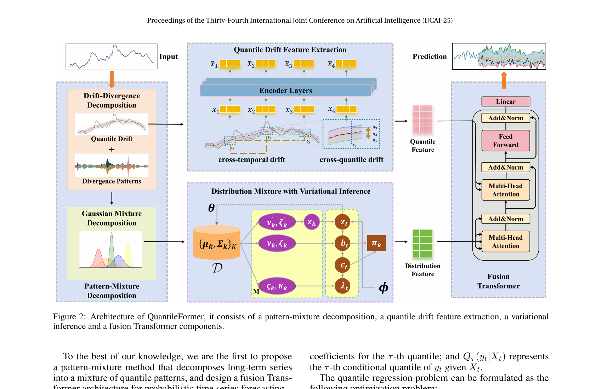

# 06. Section 4.1 (Pattern-Mixture Decomposition) — 본 paper 의 가장 깊은 contribution

## 📌 이 챕터 다 읽으면 알 수 있는 것

- 본 paper 의 **가장 깊은 contribution** — 시계열의 quantile-aware + distribution-aware 분해 (Autoformer 의 trend-seasonal 분해 일반화)
- **Eq 4** (drift-divergence) 와 **Eq 5-7** (Gaussian mixture) 의 정확한 의미
- **Fig 2** 의 전체 architecture 4 모듈 한 picture 씩 — 본 논문의 심장
- 분해의 일상 비유 (시계열을 학생 그룹 → 학년별 약점 + 무리 안의 봉우리들로)

이 chapter 의 핵심 수식: **Eq 4 (drift-divergence 분해) → Eq 5~7 (Gaussian mixture 분해)**.

---



(Figure 2, paper p.3. **전체 architecture** — 4 모듈 구성)

### 📖 처음 보는 사람을 위한 — Fig. 2 (본 논문 심장) 읽는 법

**한 줄로**: "**시계열 입력 → 두 길로 분리 → 각각 처리 → 마지막에 합쳐 quantile 예측**" 의 4 모듈 흐름도.

**그림의 4 모듈 (좌측 위→우측 아래)**:

| 모듈 | 색·위치 | 무엇 | 일상 비유 |
|------|---------|------|-----------|
| **1. Drift-Divergence Decomposition** | 좌측 위 | 시계열을 "추세 (drift)" + "잔여 변동 (divergence)" 두 부분으로 가름 | "학생 점수를 학년 평균 + 개인 편차로 분리" |
| **2. Quantile Drift Feature Extraction** | 우측 위 (Transformer encoder × N) | drift 부분을 Transformer 로 시간 패턴 학습 | "학년별 평균이 시간 따라 어떻게 변하는지" 학습 |
| **3. VAE-based Distribution Inference** | 좌측 아래 (VAE) | divergence 부분을 Gaussian mixture 로 모델링 | "개인 편차 분포에 봉우리 몇 개? 각 위치 어디?" 추론 |
| **4. Fusion Transformer** | 우측 아래 (Cross-Attention) | 두 path 의 결과를 합쳐 quantile 예측 | "학년 평균 + 개인 편차 분포 = 각 학생 시험 점수의 신뢰구간" |

**왜 두 path 인가?**
- **drift (추세)** 는 **deterministic** — Transformer 가 잘 잡음.
- **divergence (잔여)** 는 **stochastic (확률적)** — VAE + Gaussian mixture 가 적합.
- 한 모델로 다 하려면 두 성격이 섞여 성능 ↓. **분리해서 각 도구에 맡기는 게 핵심**.

**그림에서 알아낼 것 4 가지**:
1. **입력 χ (chi)**: 시계열 lookback (과거 데이터).
2. **좌측 위 분기점**: Drift-Divergence Decomposition 이 두 path 의 출발점 — Eq 4.
3. **VAE 의 latent z**: divergence 의 분포를 잠재 변수로 압축 — Eq 8-15.
4. **우측 아래 출력**: $\hat{y}_q$ — 각 quantile (0.5, 0.6, ..., 0.9) 의 예측값. Eq 16-19.

**놓치기 쉬운 한 가지**: Transformer encoder 가 **두 군데** 등장 (drift extraction + fusion 안의 attention). 같은 type 의 도구지만 **다른 역할** — drift 는 sequence modeling, fusion 은 cross-attention 결합.

### 🔍 Fig 2 의 화살표 정밀 매핑 — 정보 흐름

```
       원본 시계열 χ
              │
              ▼
   ┌─────────────────────┐
   │ Drift-Divergence    │  ◄── Eq 4
   │ Decomposition       │
   └──┬──────────────┬───┘
      │              │
      ▼              ▼
   χ^Q = {χ^q}     χ^d
   (5 drift)       (divergence)
      │              │
      ▼              ▼
   ┌─────────┐    ┌────────────┐
   │ Quantile│    │ GMM Decomp.│  ◄── Eq 5-7
   │ Drift   │    │ → D = {d_k}│
   │ Encoder │    └─────┬──────┘
   │ × N     │          │
   └────┬────┘          ▼
        │           ┌──────────┐
        │           │   VAE    │  ◄── Eq 8-15
        │           │ Inference│
        │           └────┬─────┘
        ▼               ▼
       (K, V)         (Q)
   ┌──────────────────────┐
   │  Fusion Transformer  │  ◄── Eq 16-18
   │  (Cross-Attention)   │
   └──────────┬───────────┘
              │
              ▼
       ŷ_q (quantile 예측)
       ↓
       Loss: Pinball (Eq 19)
```

### 🌱 Fig 2 한 문장으로

> "**시계열을 두 줄기로 가르고 (drift + divergence), 각각 다른 도구로 처리하고 (Transformer + VAE), 마지막에 합쳐서 (cross-attention) 각 quantile 예측**".

### 🔑 Fig 2 의 4 가지 핵심 design choice (★ 본 해체 정리)

1. **분해 (Drift + Divergence)**: 한 시계열 안에 deterministic + stochastic 두 성격이 섞임. 분리해서 다른 도구로 처리.
2. **GMM**: Divergence 가 단일 정규분포가 아님 (여러 봉우리). K-mixture 가 자연스러운 답.
3. **VAE**: GMM 의 mixture parameter 를 데이터-driven 으로 학습. 분포의 분포.
4. **Cross-Attention Fusion**: 단순 concat 대신 attention 으로 결합 → "어느 quantile 이 어느 mixture 와 짝짓는지" 학습.

### 🆚 다른 시계열 Transformer 와의 차이

| 모델 | 분해 | 분포 modeling | Fusion |
|------|------|---------------|--------|
| **Autoformer** | trend + seasonal | ✗ (점 예측) | sequential |
| **DeepAR** | ✗ | Gaussian (단일) | RNN |
| **TFT** | ✗ | quantile (multi-head) | gated |
| **본 논문 (QF)** | **quantile-aware + GMM** | **VAE + GMM** | **Cross-Attention** |

→ QF 가 **3 가지 차원 모두에서 첫 통합**.

**원문 위치**: paper Fig. 2, journal p.3.

---

## 6.0 ★ Fig 2 — 전체 architecture 한 picture 씩 정밀 해석

본격적인 분해 풀이 전에, Figure 2 의 **전체 구조** 를 한 번에 본다. 이 그림 하나로 본 paper 의 전체 흐름을 잡을 수 있다.

### Figure 2 의 4 메인 블록 (좌측 상단 → 우측)

```
                Fig 2 구조 (위→아래, 좌→우)

┌──────────────────────┐    ┌──────────────────────────┐
│   Input χ            │ →  │ Quantile Drift Feature   │ → χ^Q_eout
│   (시계열 입력)        │    │ Extraction               │   (drift, K,V)
└──────────────────────┘    │ (Transformer Encoder × N)│
         │                  └──────────────────────────┘
         ↓                                                ↘
┌──────────────────────┐                                   ↘
│ Drift-Divergence     │                                    ↘
│ Decomposition        │                                     ↘  ┌─────────┐
│ (Eq 4) — QuantileFilt│                                      → │ Fusion  │
└──────────────────────┘                                        │ Trans-  │ → ŷ
         │                                                       │ former  │  (5 quantile)
         ↓                                                     ↗ │ (Eq 17) │
   χ^d (divergence)                                          ↗   └─────────┘
         │                                                  ↗
         ↓                                                ↗
┌──────────────────────┐    ┌──────────────────────────┐
│ Gaussian Mixture     │ →  │ Distribution Mixture with│  → χ^d_out
│ Decomposition        │    │ Variational Inference    │    (divergence, Q)
│ (Eq 5-7)             │    │ (VAE, Eq 8-15)           │
│ — GauDe              │    │  ϕ encoder, θ decoder    │
└──────────────────────┘    └──────────────────────────┘
```

### 각 블록의 역할 (figure 의 좌상부터 시계방향)

| 블록 | 위치 | 역할 | chapter |
|------|------|------|---------|
| **A. Pattern-Mixture Decomposition** | **좌측** (2 submodule) | 시계열을 drift + divergence + GMM 으로 분해 | **ch06 (이 chapter)** |
| **B. Quantile Drift Feature Extraction** | **상단** | Drift 를 Transformer encoder 처리 | ch08 |
| **C. Distribution Mixture with Variational Inference** | **중하** | GMM components 를 VAE 로 global 분포 추정 | ch07 |
| **D. Fusion Transformer** | **우측** | Drift + divergence path 를 cross-attention 결합 | ch09 |

### Figure 2 의 데이터 흐름

```
원본 χ (input)
   │
   ↓ [블록 A 좌상] Drift-Divergence Decomp (Eq 4)
   │
   ├──→ χ^Q = {χ^q}_{q∈Q} ──→ [블록 B] Quantile Drift Encoder
   │                                    ↓
   │                              χ^Q_eout (drift representation)
   │                                    │
   │                                    ↓ (K, V)
   │
   └──→ χ^d ──→ [블록 A 좌하] GMM (Eq 5-7)
                       ↓
                  D = {(μ_k, Σ_k)}_{k=1}^K
                       │
                       ↓ [블록 C] VAE (Eq 8-15)
                       │   - ϕ encoder: D → prior params
                       │   - θ decoder: latent z → χ^d_out
                       ↓
                  χ^d_out (distribution-enriched divergence)
                       │
                       ↓ (Q)
                                          ↓
                          [블록 D] Fusion Transformer (Eq 16-18)
                          - Cross-Attention: Q from divergence, K/V from drift
                          - Self-Attention: Q from divergence
                          - FFN
                                          ↓
                                       Fusion
                                          ↓
                                       Linear (W)
                                          ↓
                                  ŷ ∈ R^{O × |Q|}
                                  (96 시점 × 5 quantile)
```

### Fig 2 의 우측 — Fusion Transformer 의 내부 (Eq 17 분해)

```
                  drift path (K, V)        divergence path (Q)
                       │                          │
                       ↓                          ↓
                     ┌─────────────────────────────┐
                     │ Multi-Head Self-Attention   │ ← divergence 의 self
                     │ + Add & Norm                │
                     └─────────┬───────────────────┘
                               ↓
                     ┌─────────────────────────────┐
                     │ Multi-Head Cross-Attention  │ ← divergence asks drift
                     │ (Q from divergence, K/V drift)│
                     │ + Add & Norm                │
                     └─────────┬───────────────────┘
                               ↓
                     ┌─────────────────────────────┐
                     │ Feed Forward (FFN)          │
                     │ + Add & Norm                │
                     └─────────┬───────────────────┘
                               ↓
                          Fusion vector
                               ↓
                          Linear (W)
                               ↓
                          ŷ (5 quantile prediction)
```

→ **Figure 2 의 우측 column 의 3개 Add & Norm 블록** 이 Eq 17 의 SelfAtt + CrossAtt + FFN 에 정확 대응.

### ★ 핵심 관찰

> **Fig 2 는 단순히 architecture diagram 이 아니라 paper 의 "철학" 그 자체**. 4 모듈이 각각 다른 contribution 을 isolated 하게 구현:
> - 모듈 A: **representation** (분해)
> - 모듈 B: **smooth processing** (drift encoder)
> - 모듈 C: **distribution learning** (VAE)
> - 모듈 D: **integration** (fusion)
>
> 4 모듈의 design 이 서로 **직교** → ablation (ch13) 에서 각 모듈 제거 시 다른 종류의 성능 저하 → 시너지 명확.

---

### Fig 2 의 모든 요소 (박스, 화살표, symbol) 한국어 매핑

paper Fig 2 를 영어 못 읽어도 100% 이해하도록 각 요소 풀이.

#### 좌측 column — Pattern-Mixture Decomposition 블록

| Figure 요소 | 한국어 의미 | chapter |
|------------|-----------|---------|
| **"Input"** (상단 박스) | 원본 시계열 $\chi$ (입력) | ch06 |
| 왼쪽 위 **line chart** | 원본 시계열의 모양 (예: 1일 hourly) | - |
| **"Drift-Divergence Decomposition"** 블록 | Eq 4 의 분해 단계 | ch06.3 |
| 그 안의 작은 quantile lines | 5개 quantile envelope (q=0.5, 0.6, ..., 0.9) | ch06.3 |
| **"Quantile Drift"** 화살표 | $\chi^Q = \{\chi^q\}$ 출력 → 상단 모듈 B 로 | ch06.3 |
| **"Divergence Patterns"** 화살표 | $\chi^d$ 출력 → 아래 GMM 블록으로 | ch06.3 |
| **"Gaussian Mixture Decomposition"** 블록 | Eq 5-7 의 GMM | ch06.5 |
| **{(μ_k, Σ_k)}** symbol | K개 Gaussian 의 평균·공분산 (= $D$) | ch06.5 |
| **"Pattern-Mixture Decomposition"** 박스 (좌측 통합) | 전체 분해 단계의 통합 | ch06.2 |

#### 상단 column — Quantile Drift Feature Extraction 블록

| Figure 요소 | 한국어 의미 | chapter |
|------------|-----------|---------|
| **5개 horizontal bars** ($x_1, x_2, x_3, x_4, x_5$) | 5개 quantile drift 각각의 token 표현 | ch08 |
| **"Encoder Layers"** 박스 | Multi-head self-attention + FFN × N layers (N=6) | ch08 |
| **"cross-temporal drift"** 화살표 (위쪽) | 시간 축의 dependency 학습 | ch08.2 |
| **"cross-quantile drift"** 화살표 (아래쪽) | quantile 축의 dependency (간접, fusion 에서) | ch08.2 |
| **"Quantile Feature"** 박스 (위 끝) | encoder output $\chi^Q_{eout}$ | ch08.4 |
| (다음 화살표) → Fusion Transformer | K, V 입력 으로 흘러감 | ch09 |

#### 중하단 column — Distribution Mixture with Variational Inference 블록

| Figure 요소 | 한국어 의미 | chapter |
|------------|-----------|---------|
| **θ** (상단 symbol) | decoder parameters | ch07.1 |
| **D** = $\{(\mu_k, \Sigma_k)\}$ (좌측 입력) | GMM components (이전 stage 출력) | ch07.2 |
| **5개 horizontal bars** (encoder side) | divergence pattern $\chi^d$ 의 token | ch07.4 |
| **"νk, λk, ζk"** symbols 또는 비슷한 prior parameters | VAE 의 prior parameters | ch07.5 |
| **5개 horizontal bars** (decoder side, 더 짧음) | latent z_t 또는 reconstructed | ch07.5 |
| **ϕ** (하단 symbol) | encoder parameters | ch07.1 |
| **"Distribution Feature"** 박스 (위 끝) | VAE output $\chi^d_{out}$ | ch07.9 |
| (다음 화살표) → Fusion Transformer | Q 입력으로 흘러감 | ch09 |

#### 우측 column — Fusion Transformer 블록

| Figure 요소 | 한국어 의미 | chapter |
|------------|-----------|---------|
| **"Linear"** (맨 위) | Embedding linear layer (입력 정렬) | ch09.3 |
| **"Add & Norm"** (첫 번째) | Residual + LayerNorm (안정화) | ch09.6 |
| **"Multi-Head Attention"** (첫 번째) | **Self-Attention(Q, Q, Q)** — divergence 의 self | ch09.5 |
| **"Add & Norm"** (두 번째) | Residual + LayerNorm | ch09.6 |
| **"Feed Forward"** | FFN (비선형 변환) | ch09.5 |
| **"Add & Norm"** (세 번째) | Residual + LayerNorm | ch09.6 |
| **"Multi-Head Attention"** (두 번째) | **Cross-Attention(Input, K, V)** — divergence asks drift | ch09.5 |
| **"Linear"** (맨 아래) | 최종 prediction head $W$ (Eq 18) | ch09.7 |
| **"Prediction"** 화살표 (오른쪽 끝) | $\hat{y} \in \mathbb{R}^{O \times \|Q\|}$ — 5 quantile 출력 | ch09.7 |

#### Figure 캡션 + 본 caption 의 "**we are the first**" 문구

paper Fig 2 의 캡션 (p.3 하단):
> "Figure 2: Architecture of QuantileFormer, it consists of a pattern-mixture decomposition, a quantile drift feature extraction, a variational inference and a fusion Transformer components."

→ 4 components 명시. paper 가 "**To the best of our knowledge, we are the first to propose a pattern-mixture method...**" (p.3) 라고 자신감 표명.

### ★ Fig 2 를 5초 안에 읽기

영어 못 읽어도 5초 안에 Fig 2 의 전체 흐름:

```
좌측 (Input + 분해) → 위로 + 아래로
   ↓ 위로: 상단 (Encoder × N) → 우측 상단 (Fusion 의 K, V)
   ↓ 아래로: 중하단 (VAE) → 우측 중단 (Fusion 의 Q)
우측 (Fusion Transformer) → 맨 우측 (Prediction)
```

→ **분해 → 두 갈래 처리 → 결합 → 출력**. 이 4 단어가 Fig 2 의 정신.

---

## 6.1 시작하기 전 — "왜 분해가 필요한가" 다시 한 번

### 일상 비유

음악 신호 분해:
- 한 곡 = **저음 (베이스)** + **중음 (보컬)** + **고음 (심벌즈)**.
- 각 성분을 따로 추출 → 따로 가공 (베이스만 키우기) → 다시 합침 → 더 좋은 mixing.

시계열도 마찬가지:
- 한 시계열 = **장기 추세 (trend)** + **계절 cycle (seasonal)** + **잡음 (noise)**.
- 각각 따로 처리하면 더 정확.

### 시계열 분해의 역사적 진화

| 시대 | 분해 도구 | component 수 |
|------|----------|------------|
| 1960~90 | STL, X-11 (고전 통계) | 2~3 (trend + seasonal + irregular) |
| 2021 | Autoformer (AvgPool inner block) | 2 (trend + seasonal) |
| 2022 | FEDformer (frequency 분해) | 2~3 (frequency-domain) |
| 2025 | **QuantileFormer (본 paper)** | **3** (quantile drift + divergence + GMM) |

본 paper 의 새로움 2가지:
1. **Quantile-aware**: trend 를 1개가 아닌 **5개 quantile** 의 envelope 로 추출.
2. **Distribution-aware**: divergence 를 **K=8~10개 Gaussian** 의 mixture 로 추가 분해.

---

## 6.2 2 submodule 구조

paper p.3 원문:
> "The pattern-mixture decomposition consists of two submodules: a drift-divergence decomposition and a Gaussian mixture decomposition."

### 데이터 흐름

```
원본 시계열 χ
   │
   ↓ submodule 1: Drift-Divergence Decomposition (Eq 4)
   ├── χ^Q = {χ^q}_{q ∈ Q}   ← quantile drift 5개 (smooth, drift path)
   └── χ^d = χ - χ^{0.5}      ← divergence pattern (median 기준 잔차)
                │
                ↓ submodule 2: Gaussian Mixture Decomposition (Eq 5-7)
                D = {(μ_k, Σ_k)}_{k=1}^{K}   ← K 개 Gaussian components
```

**2단계 분해의 의미**:
- **Stage 1**: 원본을 "smooth trend" 와 "복잡한 잔차" 로 나눔.
- **Stage 2**: 복잡한 잔차를 다시 "여러 Gaussian 의 혼합" 으로 분해.

이걸 통해 **smooth + complex + distribution** 의 3가지 정보를 분리.

---

## 6.3 Submodule 1: Drift-Divergence Decomposition (Eq 4)

### paper Eq 4 원문

$$
\chi^q = \text{QuantileFilt}(\text{Padding}(\chi), q)
$$
$$
\chi^d = \chi - \chi^{0.5}
$$

### 🔣 식이 말하는 것 한 줄

"각 quantile q 마다 sliding window 로 매끄러운 trend $\chi^q$ 뽑기 + 원본에서 median trend $\chi^{0.5}$ 를 빼서 divergence (잔여 변동) $\chi^d$ 만들기".

### 🔣 4-단 기호 풀이

| 기호 | 한국어 | 일상 비유 | 조심할 점 |
|------|--------|-----------|-----------|
| $\chi$ (chi) | 원본 시계열 | "1시간 단위 전력 수요 365일치" | 입력 길이 = lookback window |
| $q$ | quantile level (0.5, 0.9 등) | "어느 분위수로 trend 를 뽑을지" | 본 논문은 5개 (0.5~0.9) |
| $\chi^q$ | q-th quantile drift | "q 분위수의 매끄러운 추세선" | smooth (저주파) 성분 |
| $\chi^Q = \{\chi^q\}_{q \in Q}$ | 모든 quantile drift 집합 | "5 개의 envelope 선" | drift path 의 입력 |
| $\chi^{0.5}$ | median drift | "원본의 매끄러운 가운데 선" | divergence 기준선 |
| $\chi^d$ | divergence pattern | "원본 - median = 위·아래 편차" | **stochastic 성분** — VAE 가 잡음 |
| QuantileFilt | sliding window quantile | "이동 평균 의 quantile 버전" | 이동 평균 → 이동 분위수 |
| Padding | 양쪽 끝 보강 | "출력 길이 = 입력 길이 맞추기" | edge effect 방지 |

### 🌱 일상 비유 — "학생 시험 점수 시계열 분해"

학생 1000명의 매월 시험 점수 (시계열) 가 있을 때:
- **$\chi^{0.5}$ (median trend)**: 매월 중간 학생의 점수 변화 → "전체 학력 평균 trend"
- **$\chi^{0.9}$ (90% trend)**: 매월 상위 10% 학생의 점수 변화 → "상위권 학생 trend"
- **$\chi^d$ (divergence)**: 한 학생의 매월 점수 - median → "이 학생의 평균과 다른 정도 (편차)"

본 논문: drift (학년 평균 추세) 는 **deterministic** → Transformer 가 잘 잡음. divergence (편차) 는 **stochastic** → VAE + GMM 이 분포 잡음.

### 🔑 Eq 4 의 결정적 통찰 (★ 본 해체 추가)

**Autoformer (2021) 와의 차이**:
- Autoformer: $\chi^d = \chi - \text{AvgPool}(\chi)$ — 단일 평균만 사용.
- 본 논문: $\chi^d = \chi - \chi^{0.5}$ — **median 사용**.
- 이점: outlier robustness. 평균은 극단치에 민감하나 median 은 안 흔들림.

### 핵심 도구 1: `QuantileFilt` 자세히

paper text (p.3):
> "For each quantile $q$ in the quantile set $Q$, we extract the drift component $\chi^q$ of the original series using a sliding window. We use $\chi^Q$ to represent the set containing all the drift components, i.e., $\chi^Q = \{\chi^q\}_{q \in Q}$."

#### 이동 평균과의 비교

**Autoformer 의 AvgPool (이동 평균)**:
- Window 크기 $w$ 의 이동.
- 각 window 의 **평균** 출력.
- 예: window=3, 데이터 = [3, 5, 2, 7, 4, 9, 6, 1, 8].
  - 시점 $t=2$: window = [3, 5, 2] → 평균 = 3.33.
  - 시점 $t=3$: window = [5, 2, 7] → 평균 = 4.67.
- 결과: 매끄러운 **하나의** trend 선.

**QuantileFormer 의 QuantileFilt (이동 분위수)**:
- Window 크기 $w$ 의 이동.
- 각 window 의 **q-th quantile** 출력.
- 예 (window=3, $q$=0.9, 즉 상위 10% 분위수):
  - 시점 $t=2$: window = [3, 5, 2] → 0.9-quantile ≈ 5.0 (3개 중 가장 큰 값에 가까움).
  - 시점 $t=3$: window = [5, 2, 7] → 0.9-quantile ≈ 7.0.
  - 시점 $t=4$: window = [2, 7, 4] → 0.9-quantile ≈ 7.0.
- 결과: 데이터의 **상위 envelope** (위 경계).

**비유**:
- AvgPool = "이 며칠간 평균 기온은?" (단일 trend)
- QuantileFilt = "이 며칠간 90% 분위수 (최고 기온의 envelope) 는?" (multiple trend)

#### Quantile Drift $\chi^Q$ 의 핵심 의의

- $Q = \{0.5, 0.6, 0.7, 0.8, 0.9\}$ → **5개의 quantile drift**.
- 각 drift 는 **smooth trend** 한 신호.
- 5개를 함께 보면 → **upper/lower envelope 가 시간에 따라 어떻게 변하는가**.

**일상 비유**: 한 학교의 시험 점수를 시간에 따라 추적.
- $\chi^{0.5}$ = median 학생 점수의 시간 변화. "전체적인 학력 수준 trend".
- $\chi^{0.9}$ = 상위 10% 학생 점수의 시간 변화. "상위권 학생들의 trend".
- $\chi^{0.5}$ 와 $\chi^{0.9}$ 간격 = "학력 격차의 변화".

→ 단순 평균 trend 1개보다 **5배 풍부한 정보**.

### 핵심 도구 2: `Padding`

`Padding(χ)` = sliding window 적용 후 길이가 줄어드는 것을 보강.
- 예: window=3 인 경우 양쪽 끝에서 2개씩 데이터가 부족 → 0 또는 미러로 채움.
- 출력 길이 = 입력 길이.

Autoformer 의 동일 도구 (Eq 1) 와 동등한 역할.

### Divergence Pattern $\chi^d$ 의 핵심 의의

$\chi^d = \chi - \chi^{0.5}$:
- 원본에서 median (0.5-quantile drift) 을 뺀 잔차.
- 양수 = "median 보다 높은 시점" / 음수 = "median 보다 낮은 시점".

**왜 median 을 빼나? (평균이 아닌)**:
- 평균은 **outlier 에 민감** — 한 번 큰 값이 들어오면 평균이 흔들림.
- Median 은 **robust** — outlier 영향 적음.
- → divergence pattern 은 **outlier 에 robust 한 잔차**.

**일상 비유**: 100명의 월급 분포에서 "한 명이 100억 받는다" 면 평균은 흔들리지만 median 은 그대로. → median 이 robust 함.

paper text (p.3):
> "The quantile drift $\chi^Q$ represents smooth components of the time series, and the divergence component $\chi^d$ contains complex periodic patterns and distribution characteristics."

→ **Smooth (drift) vs Complex (divergence)** 의 2 path 로 분리.

### Divergence 가 보존하는 정보

$\chi^d$ 에는 다음 3가지가 살아 있음:
1. **복잡한 주기 (cycle)**: 일/주/연 cycle.
2. **분포 특성**: skewness, kurtosis 같은 형상 정보.
3. **이벤트 (event)**: 갑작스러운 spike·crash.

→ 이 풍부한 정보를 **GMM** 으로 추가 분해 (다음 submodule).

---

## 6.4 Drift-Divergence 분해의 인터랙티브 시각화

```viz:qf-drift-divergence:title=Drift-Divergence Decomposition (Eq 4),caption=Quantile slider 로 q ∈ {0.1 0.3 0.5 0.7 0.9} 의 drift 비교. 원본 series + 5개 quantile drift + divergence pattern 동시 표시. q=0.5 가 median drift. q=0.9 는 상위 envelope. divergence 는 median 으로부터의 편차로 복잡 패턴 보존.
```

---

## 6.5 Submodule 2: Gaussian Mixture Decomposition (Eq 5-7)

### 시작하기 전 — Gaussian Mixture 가 정확히 뭔지

**단일 Gaussian (= 정규분포)**: 한 봉우리의 종 모양 분포.
- 평균 $\mu$ (봉우리 위치) + 분산 $\Sigma$ (봉우리 너비).

**Gaussian Mixture Model (GMM)**: 여러 Gaussian 의 **가중합**.
- $K$ 개의 Gaussian 이 각각 다른 $\mu_k, \Sigma_k$ 를 가지고.
- 가중치 $\pi_k$ 로 합쳐짐: $p(x) = \sum_{k=1}^{K} \pi_k \mathcal{N}(x; \mu_k, \Sigma_k)$.

**일상 비유**: 한 학교의 키 분포.
- 단일 Gaussian: 1 봉우리 → "전체 평균 165cm 의 종 모양".
- GMM (K=2): 2 봉우리 → "남학생 봉우리 (평균 173) + 여학생 봉우리 (평균 160)" 의 합.

→ GMM 이 multi-modal 데이터 표현에 더 정확.

### paper Eq 5: 단일 Gaussian 의 정의

$$
f(x | \mu, \Sigma) = \frac{1}{(2\pi)^{d/2} |\Sigma|^{1/2}} \exp\!\left(-\tfrac{1}{2}(x - \mu)^T \Sigma^{-1}(x - \mu)\right)
$$

### 🔣 식이 말하는 것 한 줄

"다변량 정규분포 PDF — x 가 평균 $\mu$ 에서 멀어질수록 exponentially 감소". 한 봉우리의 모양 정의.

### 🔣 4-단 기호 풀이

| 기호 | 한국어 | 일상 비유 | 조심할 점 |
|------|--------|-----------|-----------|
| $\mu$ (mu) | 평균 vector | "봉우리의 중심 위치" | $d$ 차원 (d=시계열 차원) |
| $\Sigma$ (Sigma) | 공분산 행렬 | "봉우리의 너비와 모양" | $d \times d$ 행렬, 양의 정부호 |
| $d$ | 데이터 차원 | "변수의 수" | 본 논문 = 시계열 변수 수 |
| $\|\Sigma\|$ | 행렬식 (determinant) | "분포의 부피 크기" | 정규화 상수 |
| $(x-\mu)^T \Sigma^{-1} (x-\mu)$ | Mahalanobis distance | "중심으로부터 표준화된 거리의 제곱" | $\Sigma$ 가 큰 방향은 거리 감소 |
| $f(x|\mu, \Sigma)$ | PDF 값 | "x 에서 분포의 높이" | 적분 = 1 (확률 정규화) |

### 🌱 일상 비유

학생 키 분포 모델링:
- $\mu = 170$ (평균 키 170cm)
- $\Sigma = 10^2$ (표준편차 10cm)
- $f(170|\mu, \Sigma) = $ 최대값 (봉우리 정점).
- $f(190|\mu, \Sigma) = $ 작은 값 (꼬리).
- 키가 평균에서 멀어질수록 확률 exponentially ↓.

수식 자체는 "교과서의 다변량 정규분포 PDF". 외울 필요 없고 의미만 알면 됨:
- $x$ 가 $\mu$ 에서 멀어질수록 $f(x)$ 가 exponentially 작아짐.
- $\Sigma$ 가 크면 분포가 넓고 평평해짐.

### paper Eq 6: K 개 component 의 likelihood

$$
L(\Theta | \chi^d) = \prod_{i=1}^{N} P(x_i; \Theta)
$$

### 🔣 식이 말하는 것 한 줄

"전체 데이터를 K 개 Gaussian mixture 가 만들어냈을 확률 — **모든 데이터 점의 확률의 곱**". maximize 하면 best $\Theta$.

### 🔣 4-단 기호 풀이

| 기호 | 한국어 | 일상 비유 | 조심할 점 |
|------|--------|-----------|-----------|
| $\Theta = \{(\mu_k, \Sigma_k)\}_{k=1}^K$ | K 개 Gaussian 의 모든 모수 | "K 봉우리의 위치 + 모양 set" | 학습 대상 |
| $L$ | likelihood | "이 모수로 데이터를 관측할 확률" | 크면 좋음 |
| $N$ | 데이터 개수 | "관측 점 수" | divergence pattern 의 시점 수 |
| $\prod_{i=1}^N$ | 곱 (모든 i) | "**모든** 데이터 점이 독립적으로 mixture 에서 나옴" 가정 | iid 가정 |
| $P(x_i; \Theta)$ | mixture 에서 $x_i$ 나올 확률 | "$x_i$ 가 K 봉우리 중 어디든 속할 확률 합" | $\sum_k \pi_k f(x_i \| \mu_k, \Sigma_k)$ |

### 🌱 일상 비유

"학교 학생들의 키 데이터" + "남/녀 두 봉우리 가정":
- 한 학생 키 = 170cm → 남 봉우리에서 0.04 확률 + 여 봉우리에서 0.01 확률 = 0.05.
- 다른 학생 = 165cm → 0.06.
- ...
- 모든 학생의 확률을 **곱** → $L$.
- $L$ 큰 $\Theta$ (남/녀 평균, 편차) = "이 데이터를 가장 잘 설명하는 모수".

**의미**: "$\Theta$ 가 데이터를 얼마나 잘 설명하는가" 의 측도.
- $\Theta$ 가 좋을수록 $L$ 이 커짐 → **maximize $L$** 가 학습 목적 (EM 알고리즘).

### paper Eq 7: GMM 의 결과 — `GauDe`

paper text:
> "GMM decomposition aims to maximize the above likelihood function, which can be achieved by an iterative optimization algorithm such as Expectation-Maximization. We use $\text{GauDe}(\cdot)$ to summarize the above operations."

$$
D = \text{GauDe}(\chi^d)
$$

### 🔣 식이 말하는 것 한 줄

"divergence pattern $\chi^d$ 에 GMM (Gaussian Decomposition) 적용 → K 개 Gaussian 의 모수 set $D$ 출력". Eq 6 의 likelihood 를 EM 으로 최적화한 결과.

### 🔣 4-단 기호 풀이

| 기호 | 한국어 | 일상 비유 | 조심할 점 |
|------|--------|-----------|-----------|
| $\chi^d$ | divergence pattern (입력) | "원본 - median = 위·아래 편차" | Eq 4 의 출력 |
| $\text{GauDe}(\cdot)$ | Gaussian Decomposition 연산 | "데이터에서 K 봉우리 자동 찾기" | EM 알고리즘 내부 |
| $D = \{(\mu_k, \Sigma_k)\}_{k=1}^K$ | GMM components (출력) | "K 봉우리의 위치 + 모양 set" | VAE 의 입력 |
| $K$ | component 수 | "봉우리 개수" | hyperparameter, paper k=4 |

### 🌱 일상 비유

학생 키 데이터에 GauDe 적용:
- 입력 $\chi^d$ = 학생들 키 list.
- $\text{GauDe}(\chi^d)$ = EM 으로 4 봉우리 자동 식별:
  - $D_1 = (\mu_1=160, \Sigma_1=5)$ (여 평균)
  - $D_2 = (\mu_2=172, \Sigma_2=6)$ (남 평균)
  - $D_3 = (\mu_3=180, \Sigma_3=4)$ (운동선수)
  - $D_4 = (\mu_4=155, \Sigma_4=8)$ (저학년)
- $D$ = 위 4 봉우리 set.

→ **데이터로부터 자동 분포 분해**. K 만 지정하면 봉우리 위치·모양 자동 학습.

### 🔑 핵심 통찰 — Eq 5~7 의 chain

```
Eq 5 (단일 Gaussian PDF)
  ↓ K 개 곱 → mixture
Eq 6 (mixture likelihood)
  ↓ EM 으로 maximize
Eq 7 (GauDe — K 봉우리 set 자동 출력)
  ↓ VAE 입력으로
[VAE Inference, Eq 8-15]
```

→ **3 식의 연쇄가 divergence 의 분포 학습 완성**.

### Expectation-Maximization (EM) — GMM 학습 알고리즘

GMM 파라미터 $\Theta$ 를 학습하는 표준 알고리즘 (Dempster et al., 1977):

#### Step 1 (E-step, "Expectation"):
각 데이터 $x_i$ 가 component $k$ 에 속할 확률 추정:
$$
\gamma_{ik} = \frac{\pi_k \mathcal{N}(x_i | \mu_k, \Sigma_k)}{\sum_j \pi_j \mathcal{N}(x_i | \mu_j, \Sigma_j)}
$$

**일상 비유**: 학생들 키 데이터에서 한 학생의 키가 167cm일 때, "이 학생이 남학생일 확률 = 0.6, 여학생일 확률 = 0.4" 같이 soft assignment.

#### Step 2 (M-step, "Maximization"):
$\gamma_{ik}$ 를 가중치로 사용해 $\mu_k, \Sigma_k, \pi_k$ 갱신.

#### Step 3: 수렴할 때까지 반복

**최종 결과**: Likelihood $L(\Theta)$ 가 더 이상 안 커지면 종료. 그때의 $\Theta = \{(\mu_k, \Sigma_k)\}_{k=1}^K$ 가 답.

### GMM 분해의 일상 비유

학교 시험 점수 1000개를 K=3 개 Gaussian 으로 분해:
- Component 1: $\mu_1 = 50, \Sigma_1 = 10$ → "낮은 그룹" 봉우리.
- Component 2: $\mu_2 = 70, \Sigma_2 = 8$ → "중간 그룹" 봉우리.
- Component 3: $\mu_3 = 90, \Sigma_3 = 5$ → "높은 그룹" 봉우리.
- 가중치 $\pi = [0.3, 0.5, 0.2]$ → "30% 낮은 + 50% 중간 + 20% 높은".

→ 단일 종 모양으로 모호하게 표현했던 분포를 **3개 명확한 그룹** 으로 분해.

---

## 6.6 GMM 분해의 인터랙티브 시각화

```viz:qf-gmm-decomp:title=Gaussian Mixture Decomposition of Divergence (Eq 7),caption=K slider 로 component 수 조작 (2~10). Divergence pattern (1D)의 histogram + 추정된 K Gaussian 의 PDF overlay. K 가 작으면 underfit. K 가 너무 크면 overfit. paper 가 권장하는 K ∈ [6 10] 영역에서 fit 이 부드러움.
```

---

## 6.7 통합 — Pattern-Mixture Decomposition 의 전체 흐름

```
원본 χ ──→ Drift-Divergence (Eq 4) ──→ χ^Q (5개 drift, smooth) ──→ Transformer Encoder (ch08)
                                  └─→ χ^d (divergence) ──→ GMM (Eq 7) ──→ D ──→ VAE (ch07)
```

### 왜 2-stage decomposition?

| Stage | 무엇을 잡나? | 후속 처리 |
|-------|------------|-----------|
| Stage 1: Drift-Divergence (Eq 4) | Smooth quantile-level trends + median-centered residual | 각각 별도 path 로 |
| Stage 2: GMM (Eq 7) | Divergence 안의 statistical distribution | VAE 로 latent 추론 |

→ **3 정보 source** 가 생성:
1. **$\chi^Q$** (quantile-aware trends, deterministic) — drift path 의 정보.
2. **$\chi^d$** (divergence residual, deterministic) — divergence path 의 원본.
3. **$D$** (K Gaussian components, probabilistic) — divergence 의 분포 정보.

이 셋이 ch07–09 의 fusion architecture 에서 결합.

### 비유 — 음악 신호 처리

| 단계 | 작업 | 시계열 비유 |
|------|------|----------|
| 1. 원본 → 저음/중음/고음 분리 (필터링) | Stage 1 분해 | Drift (저음, 매끄러운 trend) + Divergence (고음, 복잡한 진동) |
| 2. 고음을 다시 여러 악기로 분리 (심벌즈 + 기타 + 보컬) | Stage 2 GMM | Divergence 를 K Gaussian 으로 분해 |
| 3. 각각 가공 후 다시 mix | Fusion (ch09) | Cross-attention 으로 결합 |

→ 단순 trend 추출보다 훨씬 정교한 처리.

---

## 6.8 Autoformer 와의 비교

| 측면 | Autoformer (2021) | QuantileFormer (2025) |
|------|-------------------|----------------------|
| 분해 횟수 | **1 stage** (trend + seasonal) | **2 stage** (drift+divergence + GMM) |
| Drift 추출 도구 | AvgPool (이동 평균, single) | **QuantileFilt** (이동 분위수, multi-quantile) |
| Drift 출력 수 | 1개 (trend) | **5개** ($\chi^Q$, $Q = \{0.5,...,0.9\}$) |
| Residual 처리 | seasonal = X - trend (그대로 다음 layer 로) | divergence + **추가 GMM 분해** |
| 확률 측면 | 없음 (deterministic) | **GMM 으로 distribution 추정** |
| Layer 위치 | Encoder/decoder 매 layer 마다 반복 | **전처리 (encoder 전에 한 번)** |

→ Autoformer 의 단순 분해를 **2 stage + probability-aware** 로 확장.

→ "분해를 어디에 두느냐" 의 design trade-off: Autoformer 는 progressive (매 layer), QuantileFormer 는 upfront (전처리).

---

## 6.9 Section 4.1 핵심 정리

| 항목 | 내용 |
|------|------|
| 분해 구조 | 2 stage |
| Stage 1 도구 | QuantileFilt (이동 분위수) |
| Stage 1 출력 | $\chi^Q$ (5개 quantile drift) + $\chi^d$ (divergence) |
| Stage 2 도구 | GMM + EM 알고리즘 (`GauDe`) |
| Stage 2 출력 | $D = \{(\mu_k, \Sigma_k)\}_{k=1}^K$, K=8~10 |
| 새 sigil | $\chi^Q, \chi^d, D$ |
| 후속 처리 | $\chi^Q$ → Transformer encoder (ch08), $D$ → VAE (ch07) |
| 의미 | smooth + complex + distribution 3가지 정보 분리 |

**한 줄 핵심**:
> **"Autoformer 의 단일 trend 분해를 (1) 5개 quantile 의 envelope 추출 + (2) 잔차를 K Gaussian 으로 추가 분해하는 2-stage probabilistic 분해로 일반화한 것이 본 논문의 첫 번째 contribution."**

다음 [07_vae_inference.md](07_vae_inference.md) 에서 GMM components $D$ 를 어떻게 VAE 로 처리하는지 (Eq 8~15) 풀이.

---

## 자기점검 (이 챕터)

### 핵심 3가지

1. **QuantileFilt 가 Autoformer 의 AvgPool 과 다른 점은?**
2. **Divergence pattern 에서 평균이 아닌 median 을 빼는 이유는?**
3. **2-stage decomposition 이 만들어내는 3가지 정보 source 는?**

### 답변

1. **AvgPool 과 QuantileFilt 의 차이**:
   - **AvgPool** (Autoformer 사용): sliding window 평균 → **단일 trend**. 데이터 변동 모양 1개만 알려줌.
   - **QuantileFilt** (본 논문): sliding window 의 q-th quantile → **5개 quantile envelope** (q=0.5, 0.6, 0.7, 0.8, 0.9). 분포의 위/아래 모양을 시간 따라 추적.
   - **공통점**: 둘 다 sliding window 도구. 단순 변환.
   - **차이의 의미**:
     - AvgPool 은 평균만 → "이 시계열의 전반적 추세" 만 파악.
     - QuantileFilt 는 분위수별 → "**상위 90% 와 하위 10% 가 각각 시간에 따라 어떻게 변하는가**" 까지 파악.
   - 본 논문이 이걸 도입한 이유: probabilistic forecasting 에는 분포 전체 모양 (특히 extreme quantiles) 정보 필요.

2. **$\chi^d = \chi - \chi^{0.5}$ (median 사용) — 평균 (mean) 대신 median 인 이유**:
   - **Outlier robustness**: 평균은 한 번의 극단 값에 크게 흔들림. 그러나 median 은 거의 영향 없음.
     - 예: [1, 2, 3, 4, 100] 의 평균 = 22 (outlier 영향 ↑), median = 3 (영향 ↓).
   - **시계열 함의**: 전력 데이터의 갑작스러운 spike (예: 발전소 사고) 가 평균을 왜곡. Median 은 그 영향 안 받음 → 진정한 "중심 trend" 보존.
   - **분포 보존**: divergence 가 outlier 에 영향받지 않으면 → **분포 본연의 morphology** (skewness, kurtosis 등) 가 그대로 살아남.
   - **Autoformer 와의 차이**: Autoformer 는 평균. 본 논문은 median. 이게 단순해 보이지만 robustness 에서 큰 차이.

3. **Pattern-Mixture Decomp 의 3 가지 출력**:
   - **(1) $\chi^Q = \{\chi^q\}_{q \in Q}$**: 5개 quantile-aware trends (각 quantile 의 smooth envelope). **Deterministic**, drift path 의 입력.
   - **(2) $\chi^d = \chi - \chi^{0.5}$**: divergence residual (median 으로부터 편차). **Deterministic** but 잡음 많음.
   - **(3) $D = \{(\mu_k, \Sigma_k)\}_{k=1}^K$**: K Gaussian components (divergence 의 분포 정보, $\mu$ 와 $\Sigma$ 의 mixture). **Probabilistic**.
   - **결합 방식 (ch09 의 Fusion Transformer)**: $\chi^Q$ → encoder → K/V, $D + \chi^d$ → VAE → Q. Cross-attention 으로 결합 → 최종 quantile 예측.
   - **핵심 통찰**: 분해된 3 출력이 **다른 도구로 처리됨** (encoder + VAE) — 각 출력의 성격 (deterministic/probabilistic) 에 맞는 도구 선택.
