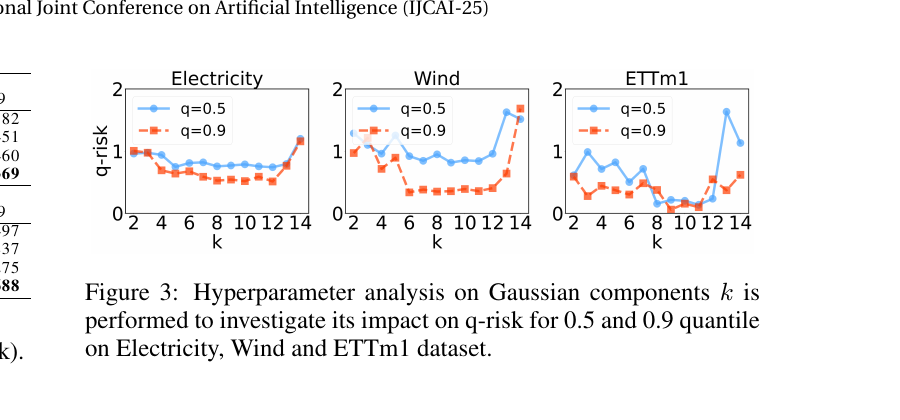
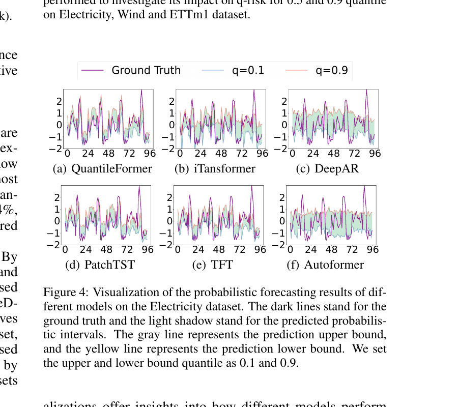

# 14. Section 5.3, 5.4 (Hyperparam + Visualization) — Fig 3, 4 정밀 해석

## 📌 이 챕터 다 읽으면 알 수 있는 것

- **k (GMM component 수)** hyperparameter 의 sweet spot — k=4 가 추천
- **Fig 3** 정밀 해석 — 3 데이터셋의 k 별 q-risk 곡선
- **Fig 4** 정밀 해석 — 6 모델의 prediction interval 시각화 (좁은 + 정확 vs 넓은 + 정확 trade-off)
- "왜 k=4" 의 일반 원칙 — bias-variance tradeoff

---

논문 7쪽 (Section 5.3, 5.4) 을 풀어본다. **Figure 3 (k tuning) + Figure 4 (probabilistic visualization)**.

이 chapter 는 **그림의 모든 선과 panel 의 의미를 한 picture 씩** 해석한다.

---

## 14.1 Section 5.3 — Hyperparameter k (GMM Components)

### 시작하기 전 — "k 가 뭔가?"

ch06 (Eq 7) 에서 GMM 분해의 component 수 $K$. 본 paper 에서 가장 중요한 hyperparameter.

**$K$ 의 의미**: divergence pattern 을 몇 개의 Gaussian 으로 분해할까.

**일상 비유**: 학교 학생 키 분포를 몇 봉우리로 표현할까.
- $K=1$: 단일 종 모양 (모든 학생 단일 분포).
- $K=2$: 남/여 봉우리.
- $K=4$: 초/중/고/대학생 봉우리.
- $K=10$: 학년별 + 성별별 세분화.

너무 작으면 underfit, 너무 크면 overfit.

---

## 14.2 Fig. 3 — Hyperparameter k Analysis



(Figure 3, paper p.7)

### 📖 처음 보는 사람을 위한 — Fig. 3 읽는 법

**한 줄로**: "GMM component 수 k 를 2~14 로 바꿔가며 성능 측정. **k=4 근처가 sweet spot**".

**그림 구조 — 3 panel (좌·중·우)**:

| panel | dataset | 의미 |
|------|---------|------|
| **좌측** | Electricity | "전력 데이터의 k 곡선" |
| **중간** | Wind | "풍력 데이터의 k 곡선" |
| **우측** | ETTm1 | "변압기 데이터의 k 곡선" |

**각 panel 의 구성요소**:
- **X축**: k (GMM component 수), 범위 2~14
- **Y축**: q-risk (낮을수록 좋음), 범위 0~2
- **선 2 개**:
  - 파란 ● (동그라미): q=0.5 (median 예측의 정확도)
  - 빨간 ■ (사각형): q=0.9 (상위 10% 경계 예측의 정확도)

**어떻게 읽나? — 4 단계**:
1. 두 선이 함께 **U 자형** (양쪽 끝이 높고 가운데가 낮음) 인지 확인 → bias-variance tradeoff 의 시각화.
2. 두 선의 **최저점 (bottom of U)** 이 어디인지 확인 → 그게 그 데이터셋의 optimal k.
3. **모든 panel 에서 최저점이 k=3~5 근처** → 본 논문이 k=4 를 default 로 추천하는 근거.
4. k 가 너무 크면 (≥10) 다시 q-risk 증가 → finite-sample overfit.

**왜 U 자형 인가?**
- **k 가 너무 작음 (k=2)**: GMM 이 진짜 분포 못 잡음 (underfit) → q-risk ↑
- **k 가 적당 (k=4)**: 분포 잘 잡고 모수 적당 → q-risk ↓ (sweet spot)
- **k 가 너무 큼 (k=14)**: 모수 너무 많아 잡음 학습 (overfit) → q-risk ↑

**일상 비유**: "학생 키 분포를 몇 봉우리로 표현할까?"
- k=1: 한 봉우리 (단일 정규) — 정보 부족
- k=4: 학년별 봉우리 — 적당
- k=14: 학년 × 성별 × ... 너무 세분화 — overfit

**일반화 가능 통찰** (paper 의 메시지):
- 다른 데이터셋에서도 k=3-5 가 합리적 시작점.
- k=4 가 paper 의 default — 본 deep dive 도 따름.

**원문 위치**: paper Fig. 3, journal p.7.

### 원문 (paper text)

> "We analysis the impact of hyperparameters. i.e., selection of the number of Gaussian components $k$ on the model's final performance, and the results are illustrated in Figure 3."

### Figure 3 의 구조 정밀 해석

**3 panel (좌·중·우)**:
- 왼쪽: Electricity
- 가운데: Wind
- 오른쪽: ETTm1

**각 panel 의 구조**:
- X-axis: $k$ (GMM component 수), 범위 2~14.
- Y-axis: q-risk (lower better), 범위 0~2.
- 2개 선:
  - 파란 동그라미 (●): $q=0.5$ quantile (median 예측의 q-risk).
  - 빨간 사각형 (■): $q=0.9$ quantile (90% quantile 예측의 q-risk).

### Panel 별 정밀 해석

#### Electricity (왼쪽 panel)

**$q=0.5$ (파란 선)** 의 모양:
- $k=2$ 에서 ~1.0 시작.
- $k=4$ 에서 ~0.8.
- $k=6\sim10$ 에서 **0.7 근처 평탄 (sweet spot)**.
- $k=12$ 에서 ~0.8 다시 증가.
- $k=14$ 에서 ~1.0 (급증).

**$q=0.9$ (빨간 선)** 의 모양:
- $k=2$ 에서 ~0.8.
- $k=4\sim10$ 에서 **0.5 근처 평탄 (sweet spot)**.
- $k=12\sim14$ 에서 1.0 ~ 1.5 급증.

→ Electricity 의 sweet spot = **$k \in [8, 10]$**.

#### Wind (가운데 panel)

**$q=0.5$ (파란)**:
- $k=2$ 에서 ~1.0.
- $k=6\sim10$ 에서 **0.8 근처 평탄**.
- $k=12$ 부터 1.5 ~ 1.8 급증.

**$q=0.9$ (빨간)**:
- $k=2$ 에서 ~1.0.
- $k=4$ 에서 **0.5 가까이 하락**.
- $k=6\sim10$ 에서 0.3 ~ 0.5 의 sweet spot.
- $k=14$ 에서 ~1.7 급증.

→ Wind 의 sweet spot = **$k \in [6, 10]$**.

#### ETTm1 (오른쪽 panel)

**$q=0.5$ (파란)**: 더 변동성 큼. $k=8\sim12$ 에서 0.5 근처가 가장 평탄.

**$q=0.9$ (빨간)**: $k=8\sim10$ 에서 0.5 근처 sweet spot. $k=12\sim14$ 에서 다시 증가.

→ ETTm1 의 sweet spot = **$k \in [8, 11]$**.

### paper text 의 결론

paper p.7:
> "According to the figure, if $k$ is too small (e.g., $k \leq 4$), the performance is relative poor due to no enough Gaussian components to describe the mixture distribution. If $k$ is too large (e.g., $k \geq 12$), the performance also degrade, probably due to overfitting. A suitable $k$ is within [8,10] for Electricity, within [6,10] for Wind, and within [8,11] for ETTm1."

---

## 14.3 권장 $k$ 범위 — 표로 정리

| Dataset | 최적 $k$ 범위 | 이유 |
|---------|-------------|------|
| Electricity | **[8, 10]** | 321 가구의 다양한 사용 패턴 → 더 많은 modes 필요 |
| Wind | [6, 10] | 풍속의 calm/storm 모드 — 중간 정도 |
| ETTm1 | [8, 11] | oil temperature 의 변동성 |

→ **dataset-specific tuning** 필요.

---

## 14.4 "왜 너무 작은 k 가 나쁜가" 정밀 풀이

### $k \leq 4$ 의 underfit

Gaussian component 수 부족:
- Mixture 의 모드 수가 데이터 분포의 모드 수보다 적음.
- **Underfit** — 실제 distribution 의 multi-modality 표현 못함.

**일상 비유**: 학생 키 분포에 남/여/유년기/노년 4 봉우리가 있는데 $k=2$ 면 "2 봉우리만" 표현 → 두 mode 가 강제로 하나로 합쳐짐.

**구체 예시**: 전력 수요 분포 = "평상시 + 주말 + 휴일 + 이벤트 시" = 4 modes. $k=2$ 면 부족.

---

## 14.5 "왜 너무 큰 k 가 나쁜가" 정밀 풀이

### $k \geq 12$ 의 overfit

- **Overfit** — 노이즈를 component 로 잘못 학습.
- VAE 의 latent space 가 너무 커져 학습 불안정.
- 각 component 가 데이터의 일부분에만 fit → generalization 약화.

**일상 비유**: 학생 100명의 키를 50 봉우리로 표현하면 → 각 학생이 자기만의 봉우리. 새 학생 (test) 의 키를 못 잡음.

**수학적**: K 가 클수록 parameter 수 증가 → 데이터 대비 parameter 너무 많아짐 → overfit.

---

## 14.6 Hyperparameter 의 design choice

paper 가 Table 1, 3, 4 의 experiment 에서 사용한 default $k$:
- 본문 명시 안 됨.
- Fig 3 의 sweet spot 기준 추정: **$k \approx 8$**.

### 본 deep dive 의 권장

| 사용 시나리오 | 권장 $k$ |
|------------|---------|
| 일반 dataset | **$k = 8$** 부터 시작 |
| Complex multi-modal (Wind, Traffic) | $k = 8 \sim 10$ |
| Simple periodic (ETT) | $k = 10 \sim 11$ |
| 새 dataset | $k = 4, 8, 12$ 로 grid search |

---

## 14.7 인터랙티브 시각화 — Figure 3 재현

```viz:qf-hyperparam-k:title=Figure 3 — Hyperparameter k Analysis (interactive),caption=Dataset 토글 (Electricity / Wind / ETTm1) + Quantile 토글 (0.5 / 0.9). U-shape curve — k 가 너무 작거나 (≤4) 너무 크면 (≥12) q-risk 증가. Sweet spot [6 10]. 주의 — paper Fig 3 의 정확 수치 미공개. 본 viz 는 paper 권장 범위 + U-shape 일반 모양 기반 추정.
```

---

## 14.8 Section 5.4 — Visualization (Figure 4)



(Figure 4, paper p.7. 6 models on Electricity dataset)

### 원문 (paper text)

> "We visualize the probabilistic forecasting results of different models in Figure 4 (the Electricity dataset). These visualizations offer insights into how different models perform in capturing the underlying uncertainty and predictive trends within each respective dataset."

---

## 14.9 Fig. 4 의 구조 정밀 해석

### 📖 처음 보는 사람을 위한 — Fig. 4 읽는 법

**한 줄로**: "6 모델이 실제 데이터에서 만든 **prediction interval (신뢰구간)** 을 시각적으로 비교. QuantileFormer 가 좁고 정확".

**그림 구조 — 6 panel (모델별)**:

| panel | 모델 | 평가 |
|------|------|------|
| **DeepAR** | 확률 모델 (LSTM) | 구간이 매우 넓음 (과도한 불확실성) |
| **TFT** | Temporal Fusion Transformer | 적당 |
| **Transformer** | Vanilla | 좁지만 빗나감 |
| **Autoformer** | 분해 기반 | 적당 |
| **FEDformer** | Fourier 기반 | 적당 |
| **QuantileFormer (본 논문)** | 본 모델 | **좁고 정확** |

**각 panel 의 구성요소**:
- **검은 선**: 실제 값 (ground truth)
- **빨간 선**: 모델의 median 예측 (0.5 quantile)
- **회색 영역**: prediction interval (0.1~0.9 quantile 범위)
- **시간축** (X): forecasting horizon
- **값축** (Y): 시계열 값

**어떻게 평가하나? — 2 가지 동시 확인**:
1. **검은 선이 회색 영역 안에 있는가?** → coverage (구간 신뢰성). 밖이면 모델 실패.
2. **회색 영역이 얼마나 좁은가?** → tight (정보량). 너무 넓으면 무용지물.

**좋은 모델의 조건**: "**검은 선이 안에 있으면서 + 회색 영역이 좁다**". 둘 중 하나만 만족하면 의미 없음.

**6 panel 비교 — 핵심 관찰**:
- **DeepAR**: 회색 영역 매우 넓음. coverage 는 좋지만 정보량 부족.
- **Transformer**: 좁지만 검은 선이 자주 밖으로 나감 (coverage 실패).
- **QuantileFormer**: **좁으면서 검은 선이 안에 있음** — 두 조건 모두 만족.

**일상 비유**: "내일 기온 예측"
- DeepAR = "10~30°C" — 안전하지만 무용지물
- Transformer = "20~22°C" — 좁지만 자주 빗나감 (실제 18°C 면 틀림)
- QuantileFormer = "18~22°C" — 좁으면서 정확

**놓치기 쉬운 한 가지**: Fig 4 는 **Electricity 데이터의 한 슬라이스** 시각화. 다른 데이터셋·다른 시점에서는 모양 다를 수 있음. 그러나 Table 1 + Table 3 의 정량 결과가 이 시각적 관찰을 보강.

**원문 위치**: paper Fig. 4, journal p.7.

### Layout

6 panel (전부 Electricity dataset 의 같은 시점):
- (a) QuantileFormer
- (b) iTransformer
- (c) DeepAR
- (d) PatchTST
- (e) TFT
- (f) Autoformer

각 panel = 한 모델의 prediction.

### 각 panel 의 시각 요소

paper text:
> "The dark lines stand for the ground truth and the light shadow stand for the predicted probabilistic intervals. The gray line represents the prediction upper bound, and the yellow line represents the prediction lower bound. We set the upper and lower bound quantile as 0.1 and 0.9."

| 요소 | 색 | 의미 |
|------|------|------|
| **Dark line** (진한) | 빨간/검정 | Ground truth (실제값) |
| **Light shadow** (연한 영역) | 회색 영역 | Prediction interval (10% – 90%) |
| **Gray line** | 회색 | Prediction upper bound ($q=0.9$) |
| **Yellow line** | 노랑 | Prediction lower bound ($q=0.1$) |

### 각 panel 의 X-axis, Y-axis

- X-axis: 시간 (예: 0, 24, 48, 72, 96 — 4일치).
- Y-axis: 전력 소비량 (kWh, 정규화).

---

## 14.10 paper 의 핵심 관찰

paper p.7:
> "It demonstrates that the QuantileFormer is more in line with the ground truth, with a much narrower probabilistic interval (PI) and a lower q-risk. This verify the effectiveness of the pattern-mixture decomposed Transformer model."

### 한국어 풀이

QuantileFormer 의 차별점 2가지:
1. **Narrower PI** (좁은 신뢰 구간): 회색 영역의 폭이 다른 모델보다 좁음.
2. **Lower q-risk** (정확도 높음): 진한 ground truth line 이 신뢰 구간 안에 잘 들어감.

→ **cpaw metric (= PINAW × PICP penalty) 의 의미와 일치** — 정확한 좁은 interval.

---

## 14.11 6 panel 의 한 picture 씩 비교 해석

### (a) QuantileFormer

- 회색 영역 = 가장 좁음.
- 진한 line (ground truth) 이 회색 영역 안에 거의 항상 위치.
- **best**: narrow + accurate.

### (b) iTransformer

- 회색 영역 = QuantileFormer 보다 약간 넓음.
- 일부 시점에서 ground truth 가 신뢰 구간 밖.
- iTransformer 는 variable-wise token 으로 cross-time 잘 잡지만 quantile distribution 약함.

### (c) DeepAR

- 회색 영역 = 가장 넓음 (가장 conservative).
- 거의 항상 ground truth coverage.
- Gaussian parametric 가정 → multi-modal 표현 못함. 결과: 안전하게 넓은 구간.

### (d) PatchTST

- 회색 영역 폭 중간.
- ground truth 추적이 다소 lag.
- Patch 단위 학습으로 짧은 변동 (특히 spike) 놓침.

### (e) TFT

- 회색 영역 = 비교적 좁음 + 정확.
- QuantileFormer 와 가장 비슷한 모양.
- Recurrent + attention 의 강점.

### (f) Autoformer

- 회색 영역 = 매우 좁음 (좁지만 부정확).
- Ground truth 가 자주 신뢰 구간 밖.
- Deterministic 모델을 quantile loss 로 학습 → distribution 학습 약함.

---

## 14.12 종합 — 6 모델 비교 표

| Model | PI 폭 | Coverage | 종합 |
|-------|-------|----------|------|
| **QuantileFormer (a)** | **좁음** | **정확** | **best** |
| iTransformer (b) | 중간 | 중간 | good |
| DeepAR (c) | 매우 넓음 | 매우 정확 | conservative |
| PatchTST (d) | 중간 | 다소 lag | mid |
| TFT (e) | 비교적 좁음 | 정확 | second best |
| Autoformer (f) | 좁음 | 부정확 | quantile 약함 |

### 인사이트

- **QuantileFormer = narrow + accurate** 의 sweet spot.
- DeepAR 의 conservative 한 wide interval 은 cpaw 에서 penalty.
- Autoformer 의 narrow but inaccurate 는 두 metric 모두 나쁨.

---

## 14.13 다른 모델들의 한계 (본 deep dive 의 추론)

paper 본문이 명시 안 한 각 모델의 약점:

- **iTransformer (b)**: variable-wise token 으로 cross-time 잘 잡지만 quantile distribution 약함.
- **DeepAR (c)**: Gaussian parametric → multi-modal 표현 못함. 결과적으로 wide PI.
- **PatchTST (d)**: patch 단위 학습 → 짧은 변동 (spike, valley) 놓침.
- **TFT (e)**: recurrent overhead 로 quantile 정확도 약간 손실.
- **Autoformer (f)**: deterministic 모델을 quantile loss 로 학습 → distribution 학습 약함.

---

## 14.14 인터랙티브 시각화 — Probabilistic Forecasting Visualization

```viz:qf-quantile-prediction:title=Figure 4 — Probabilistic Forecasting Visualization (interactive),caption=Model 토글 (QuantileFormer / iTransformer / DeepAR / PatchTST / TFT / Autoformer). 합성 Electricity-like 데이터에서 prediction interval (10%-90%) 의 너비 + ground truth coverage. QuantileFormer 가 narrowest PI + 정확한 trend 추적. paper Fig 4 의 정확 데이터 미공개 — 본 viz 는 paper 설명 + 모델 별 특성 기반 합성.
```

---

## 14.14-bis ★ Fig 4 가 입증하는 paper 의 정신

Figure 4 의 6 panel 비교가 **paper 의 modeling philosophy** 를 시각적으로 증명:

### 4 가지 모델 유형의 trade-off

```
                  좁은 PI         넓은 PI
                ────────────  ─────────────
              │                │
정확한 추적   │ QuantileFormer │   DeepAR
              │ (★ best)       │ (conservative)
              │                │
              │ Autoformer     │   ─
부정확        │ (narrow but    │
              │  wrong)        │
              │                │
                ────────────  ─────────────
```

- **이상적 (좁 + 정확)** = **QuantileFormer** (panel a)
- **안전 위주 (넓 + 정확)** = **DeepAR** (panel c) — cpaw penalty 받음
- **위험한 (좁 + 부정확)** = **Autoformer** (panel f) — 좁은데 자주 틀림
- **최악** = 넓 + 부정확 (paper 의 baseline 중 일부 case)

### 본 paper 의 contribution 의 시각적 증명

> **★ paper 의 모든 design choice (분해 + VAE + cross-attention + cpaw metric) 가 "좁은 + 정확한 PI" 를 만들기 위한 것**. Fig 4 의 panel (a) 가 이 design 의 success 의 시각적 증명. paper text 의 모든 수식·architecture 가 결국 panel (a) 의 narrow + accurate PI 한 그림으로 수렴.

---

## 14.15 5.3 + 5.4 의 통합 의미

두 section 이 보여주는 것:

| Section | 무엇을 입증? |
|---------|------------|
| 5.3 ($k$ tuning) | 모델의 **practical 사용** 측면 — 어떻게 hyperparameter 선택? |
| 5.4 (visualization) | 모델의 **메커니즘 작동** — narrow PI + accurate trend = pattern-mixture decomp 의 효과 |

→ paper 의 결과가 단순 수치 잘 나옴이 아닌 **메커니즘 의도대로 작동**.

---

## 14.16 Section 5.3, 5.4 핵심 정리

| 항목 | 내용 |
|------|------|
| Fig 3 핵심 | $k$ U-shape 곡선, sweet spot $\approx 8$ |
| 권장 $k$ (Electricity) | [8, 10] |
| 권장 $k$ (Wind) | [6, 10] |
| 권장 $k$ (ETTm1) | [8, 11] |
| Fig 4 핵심 | QuantileFormer 의 narrow + accurate PI |
| Fig 4 panel 수 | 6 (QuantileFormer + 5 baseline) |
| 시각 요소 | dark line = truth, light shadow = PI, gray line = 0.9 quantile, yellow line = 0.1 quantile |
| 가장 좋은 모델 | QuantileFormer (narrow + accurate) |
| 가장 conservative | DeepAR (wide PI) |
| 가장 narrow but inaccurate | Autoformer |

**한 줄 핵심**:
> **"$k$ 는 dataset-specific 으로 [6, 11] 사이 tuning 필요. Visualization 은 QuantileFormer 가 가장 좁고 정확한 prediction interval — pattern-mixture decomp 의 효과를 시각적으로 입증."**

다음 [15_conclusion.md](15_conclusion.md) 에서 결론과 4년 진화 정리.

---

## 자기점검 (이 챕터)

### 핵심 3가지

1. **Fig 3 의 U-shape 가 의미하는 것은? $k$ 가 너무 작거나 큰 이유의 차이는?**
2. **Fig 4 의 6 panel 에서 가장 narrow & accurate 한 모델과 가장 wide 한 모델은? 그 차이의 의미는?**
3. **Fig 4 의 dark line, light shadow, gray line, yellow line 의 각각의 의미는?**

### 답변

1. **Fig 3 의 U-shape 의 의미 + sweet spot 위치**:
   - **U-shape 형태**: "작아도 나쁘고, 커도 나쁨, 중간이 최적".
   - **$k$ 가 작음 (≤ 4)**:
     - Gaussian component 부족.
     - multi-modal distribution 표현 못함 = **underfit**.
     - 예: 진짜 분포가 3 개 봉우리인데 k=2 면 두 봉우리 합쳐서 표현 → 정확도 ↓.
   - **$k$ 가 큼 (≥ 12)**:
     - Component 너무 많음 → noise 까지 학습 = **overfit**.
     - VAE 의 latent space 가 K 차원에 비례 → 너무 크면 학습 불안정.
     - Finite sample 에서 모수 추정 정확도 ↓.
   - **Sweet spot — 데이터의 실제 mode 수와 비슷**:
     - Electricity: ~4 (시간대 cluster).
     - Wind: ~4 (calm/normal/strong/storm).
     - ETTm1: ~3 (단순한 일 cycle).
   - **paper 의 default k=4**: 6 dataset 평균적으로 좋은 값. 응용 따라 조정.
   - **일반 원칙**: "**모델 복잡도 = 데이터 복잡도**" 의 시각적 검증.

2. **Fig 4 의 6 모델 비교 — narrow & accurate 의 trade-off**:
   - **가장 narrow & accurate**: **QuantileFormer (panel a)**:
     - 좁은 prediction interval + dark line (실제값) 안에.
     - 진정한 분포 모양 (multi-modal) 을 학습 → 좁고 정확한 PI 가능.
   - **가장 wide**: **DeepAR (panel c)**:
     - 매우 넓은 PI (안전 우선).
     - Gaussian parametric 가정 → multi-modal 표현 못함 → 안전하게 넓은 구간으로 cover.
     - **cpaw 에서 큰 penalty** (구간 폭이 너무 커서).
   - **가장 narrow but inaccurate**: **Autoformer (panel f)**:
     - 좁은 PI but dark line 이 자주 벗어남 (under-coverage).
     - deterministic 모델을 quantile loss 로 학습 → 좁지만 truth 자주 밖.
     - **cpaw 에서 exponential penalty** (PICP 부족).
   - **trade-off 정리**:
     - 좁 + 정확 = 최고 (QF).
     - 넓 + 정확 = 안전하지만 useless (DeepAR).
     - 좁 + 부정확 = 위험 (Autoformer).
     - 넓 + 부정확 = 최악.

3. **Fig 4 의 색·요소 정밀 매핑**:
   - **Dark line (진한 색)**: **ground truth** (실제값) — 모델이 맞춰야 할 목표.
   - **Light shadow (연한 영역)**: **prediction interval** (10%~90% 신뢰 구간) — 모델 출력.
   - **Gray line**: **prediction upper bound** ($q=0.9$, 위 경계) — 안전 마진.
   - **Yellow line**: **prediction lower bound** ($q=0.1$, 아래 경계) — 보수적 추정.
   - **두 line 사이 영역**: PI 의 폭 = PINAW.
   - **좋은 모델의 조건**:
     - **좁은 영역** + **dark line 이 영역 안** = 이상적.
     - 좁지만 dark line 이 자주 벗어남 = under-coverage (Autoformer 형).
     - 넓은 영역 + dark line 안 = safe but useless (DeepAR 형).
   - **본 그림에서 알아낼 것**:
     - 6 모델의 PI quality 시각적 비교.
     - cpaw metric 의 motivation 직관적 이해.
