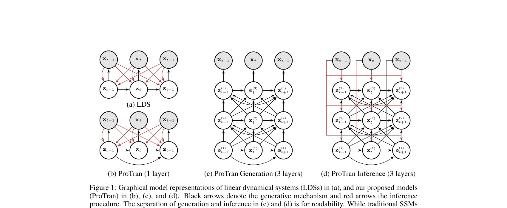

# 06. Single-Layered ProTran — Generative Model (Section 3.1 전반)

## 📌 이 챕터 다 읽으면 알 수 있는 것

- Single-layer ProTran 의 정확한 구조 (Eq 5-9)
- Latent space attention 의 의미
- Generative model 의 정의

---

paper p.4 (Section 3.1 의 generative model 부분). ProTran 의 가장 기본 architecture — Eq 5-9.

이 챕터의 목표: **4 단계의 생성 과정을 step-by-step 으로 풀어 쓴다**. 각 단계가 무엇을 하고 왜 필요한가.

### 🌱 Single-Layer ProTran — 일상 비유

**한 줄로**: "Context (과거 데이터) 와 이전 잠재 들의 attention 을 통해 시점 별로 latent (잠재) 생성 + 관측 emit. **단순 RNN 보다 강력**".

| ProTran 단계 | 작가의 소설 비유 |
|--------------|----------------|
| **Step 0**: Context embedding | 작가가 1-5장 (과거) 읽고 머릿속 정리 |
| **Step 1**: Self-attention on past latents | 6장 쓸 때 5장의 흐름 참고 |
| **Step 2**: Cross-attention to context | "1-5장 어느 장면이 6장과 관련?" 다시 봄 |
| **Step 3**: Sample new latent | 6장의 핵심 idea 결정 (probabilistic) |
| **Step 4**: Hidden update | 6장 완성 + 다음 7장 준비 |
| Final: Emit observation | 6장 출판 (관측 $x_t$) |

**왜 단순 RNN 보다 강력**: 
- RNN은 hidden state 만 → 멀리 떨어진 정보 vanish
- ProTran은 self-attention 으로 모든 과거 직접 참고 + Gaussian sampling 으로 uncertainty 표현

### 🔣 수식 4-단 풀이

| 기호 | 의미 | 차원 |
|------|------|------|
| $x_{1:C}$ | Context (과거 관측) | $(C, N)$ |
| $h_{1:C}$ | Context embedding (Step 0 출력) | $(C, d)$ |
| $w_{1:T}$ | 잠재 hidden state | $(T, d)$ |
| $\bar{w}_t$ | Self-attention 출력 (Step 1) | $(d,)$ |
| $\hat{w}_t$ | Cross-attention 출력 (Step 2) | $(d,)$ |
| $z_t \sim \mathcal{N}(\mu, \sigma^2)$ | Sampled latent (Step 3) | $(d,)$ |
| $x_t = \text{MLP}(w_t)$ | 관측 (최종 emission) | $(N,)$ |

### 🔑 핵심 통찰

> **5개 식 (Eq 5-9) 의 묘수**: Self-attention (past latents) + Cross-attention (context) + Gaussian sampling. 이 셋의 결합이 **probabilistic + non-Markovian + long-range** 동시 달성.

---

## 6.1 큰 그림 — Generative model 의 4 step

ProTran 의 single-layer 는 매 시점 $t$ 마다 **4 step** 으로 잠재를 생성하고 관측을 emit:

```
Step 0 (한 번만): Context 전처리 — Eq 5
   x_{1:C} → h_{1:C}

For each t = 1 to T:
   Step 1: 과거 잠재끼리 self-attention — Eq 6
      w_{t-1} 가 w_{1:t-1} 참고 → \bar{w}_t
   
   Step 2: 잠재가 context 참고 (cross-attention) — Eq 7
      \bar{w}_t 가 h_{1:C} 참고 → \hat{w}_t
   
   Step 3: 잠재 sample (Gaussian) — Eq 8
      \hat{w}_t → z_t ~ N(μ, σ²)
   
   Step 4: Hidden update — Eq 9
      z_t + position 을 \hat{w}_t 에 합 → w_t

Final emission: x_t = MLP(w_t)
```



(Figure 1(b), paper p.2. Single-layer ProTran 의 graphical model. $z_t$ 로 가는 화살표가 $z_1, z_2, \ldots, z_{t-1}$ 모두에서 오는 것 — non-Markovian 의 시각적 표현)

---

## 6.2 Step 0: Context Embedding (Eq 5)

### 원문 (paper p.4)
> Given some contexts $x_{1:C}$, we first apply a linear projection and combine it with a positional embedding to obtain $h_{1:C} \in \mathbb{R}^d$.

paper Eq 5:
$$
h_t = \text{LayerNorm}(\text{MLP}(x_t) + \text{Position}(t))
$$

### 풀어 설명 — 무엇을 하나

**입력**: $x_t \in \mathbb{R}^N$ (시점 $t$ 의 $N$ 차원 관측 — 예: 963개 도로 트래픽)

**3 단계 변환**:
1. **MLP**: $x_t$ 를 $d$ 차원 hidden 으로 변환 (예: $d = 128$).
2. **+ Position**: 시간 정보 (sin/cos position embedding) 더하기.
3. **LayerNorm**: 안정화.

**출력**: $h_t \in \mathbb{R}^d$ (context 의 hidden representation)

**비유**:
- $x_t$ = "오늘의 트래픽 raw 측정값" (1000개 도로 × 한 시점)
- $h_t$ = "그 측정값의 의미를 압축한 128차원 캡션" + 시간 표식

### paper 의 디자인 선택 — 가벼운 인코딩

paper 인용:
> While a traditional transformer model often dedicates an entire encoder for the same purpose [55, 72], we find such a simple mapping works sufficiently well in conjunction with the context-attention module of the corresponding decoder.

→ 일반 Transformer 는 context 처리에 **encoder 전체** 사용. ProTran 은 **MLP 한 번 + position 더하기** 로 끝.
- 이유: 무거운 작업 (잠재 추론) 은 뒤에 다 하니까.
- 효과: 계산량 절약 + 모델 단순.

---

## 6.3 핵심 design — 왜 $w$ 라는 hidden 을 따로 두는가

### 원문 (paper p.4)
> Unfortunately, using stochastic samples of $z_t$ as attention queries is problematic, as purely stochastic transitions make it difficult for the model to reliably retain information across multiple time steps [17, 30, 39]. We therefore encapsulate the latent variables in hidden representations $w_t$ that also has a deterministic component.

### 풀어 설명 — $w$ 가 필요한 이유

**문제**: $z_t$ 가 Gaussian sample (확률적) 이라 매 시점 다른 값. 이걸 attention query 로 직접 쓰면 정보가 들쭉날쭉.

비유:
- 매번 동전 던져서 메시지를 적는 사람 → 첫 메시지를 다음 사람에게 전달하기 힘듦.
- 안정적인 메모 + 동전 던지기 결과를 같이 적는 사람 → 정보 retention 가능.

**해법**: $w_t$ = **deterministic component + stochastic $z_t$ 의 hybrid hidden**.
- $w$ 가 attention 의 Q/K/V 로 사용 (안정).
- $z$ 는 $w$ 안에 encapsulate (확률성 유지).

→ paper 의 design 핵심: **$z$ 는 결과, $w$ 는 작업 변수**.

---

## 6.4 Step 1: 과거 잠재끼리 Self-Attention (Eq 6)

### paper Eq 6:
$$
\bar{w}_t = \text{LayerNorm}(w_{t-1} + \text{Attention}(w_{t-1}, w_{1:t-1}, w_{1:t-1}))
$$

### 풀어 설명 — 한 줄씩

**Attention 의 인자**:
- **Query**: $w_{t-1}$ (이전 시점 hidden)
- **Key**: $w_{1:t-1}$ (모든 이전 시점 hidden)
- **Value**: $w_{1:t-1}$ (같음)

**무엇을 하나**:
- "이전 시점 $w_{t-1}$ 이 자신의 모든 과거 $w_1, w_2, \ldots, w_{t-1}$ 중 어디에 attention 할지" 계산.
- 가중합으로 과거의 정보를 종합한 새 representation 추출.

**Residual + LayerNorm**:
- Attention 결과를 $w_{t-1}$ 에 **더함** (residual connection — 정보 손실 방지).
- LayerNorm 으로 안정화.

**출력**: $\bar{w}_t$ — "과거 전체를 참고한 hidden".

**비유**:
- 회의 사회자가 (Q = $w_{t-1}$) 이전 모든 발언 (K, V = $w_{1:t-1}$) 을 종합해서 다음 안건 ($\bar{w}_t$) 의 초안을 만든다.

### 왜 이게 non-Markovian 의 핵심인가

$w_t$ 가 $w_{t-1}$ 만이 아닌 **$w_1, \ldots, w_{t-1}$ 전체** 의 가중합에 의존.
→ Markov 깨짐. 어제 9시와 오늘 9시 직접 연결.

LDS 와 비교:
- LDS: $z_t = A z_{t-1} + \text{noise}$ — 직선 + 직전만.
- ProTran Eq 6: $w_t \leftarrow \text{Attn}(w_{t-1}, w_{1:t-1})$ — 비선형 + 전체 과거.

---

## 6.5 Step 2: 잠재가 Context 참고 (Eq 7)

### paper Eq 7:
$$
\hat{w}_t = \text{LayerNorm}(\bar{w}_t + \text{Attention}(\bar{w}_t, h_{1:C}, h_{1:C}))
$$

### 풀어 설명 — 한 줄씩

**Attention 의 인자**:
- **Query**: $\bar{w}_t$ (Step 1 의 출력)
- **Key**: $h_{1:C}$ (Eq 5 의 context embedding)
- **Value**: $h_{1:C}$ (같음)

**무엇을 하나**:
- Step 1 의 결과 $\bar{w}_t$ 가 **context $h_{1:C}$ 의 어느 시점에 attention** 할지 결정.
- 예측 시점 $t$ 가 context 의 어느 정보에 의존하는지 선택.

**Residual + LayerNorm**: 마찬가지.

**출력**: $\hat{w}_t$ — "과거 잠재 + context 모두 참고한 hidden".

**비유**:
- 회의 사회자 (Q) 가 자기 안건 초안 ($\bar{w}_t$) 을 가지고 **자료실 책들 (K,V = $h_{1:C}$)** 을 뒤져서 관련 자료 추가.

### 왜 이게 중요한가

이게 **encoder-decoder attention** 의 정신. 표준 Transformer 의 decoder 가 encoder 출력을 참조하는 것과 같은 구조.
- 표준 Transformer: decoder query 가 encoder output 참조.
- ProTran: **잠재 hidden** ($\bar{w}_t$) 가 **context embedding** ($h_{1:C}$) 참조.

paper:
> These two operations [Eq 6, 7] mirror those found in the decoder of Transformer [85], with the stochastic latent variables replacing its decoder inputs.

→ Transformer decoder 구조 그대로, 다만 decoder input 자리에 **잠재 변수** 가 들어감.

---

## 6.6 Step 3: 잠재 Sample (Eq 8)

### paper Eq 8:
$$
z_t = \text{Sample}(\mathcal{N}(z_t; \text{MLP}(\hat{w}_t), \text{Softplus}(\text{MLP}(\hat{w}_t))))
$$

### 풀어 설명 — 가우시안에서 뽑기

**무엇을 하나**:
- $\hat{w}_t$ 를 두 개의 MLP 에 통과시켜 **평균 $\mu$ 와 분산 $\sigma^2$** 를 만듬.
- 그 평균·분산을 가진 Gaussian 에서 $z_t$ 를 sample.

**구체 수식**:
- $\mu_t = \text{MLP}_\mu(\hat{w}_t)$
- $\sigma_t = \text{Softplus}(\text{MLP}_\sigma(\hat{w}_t))$
- $z_t \sim \mathcal{N}(\mu_t, \sigma_t^2 I)$

**왜 Softplus 인가**:
- 분산은 **양수** 여야 함 ($\sigma^2 > 0$).
- Softplus(x) = $\log(1 + e^x)$ — 항상 양수, 미분 가능.
- MLP 의 출력은 음수 가능 → Softplus 가 양수로 변환.

**비유**:
- $\hat{w}_t$ = "오늘의 정보 종합"
- $\mu_t$ = "내가 예상하는 가장 가능성 높은 잠재 상태"
- $\sigma_t$ = "내가 얼마나 확신하는가" (작으면 확신, 크면 불확실)
- $z_t$ = 그 분포에서 뽑은 한 점 (sample)

### Reparameterization trick (paper 명시 안함, 일반 기법)

실제 학습에서는 **reparameterization**:
- $z_t = \mu_t + \sigma_t \odot \epsilon$, $\epsilon \sim \mathcal{N}(0, I)$
- 이렇게 하면 sampling 도 미분 가능 → backprop 가능.
- 모든 VAE 의 표준 trick.

→ 결과: $z_t$ 는 확률적이지만 학습 가능.

---

## 6.7 Step 4: Hidden Update (Eq 9)

### paper Eq 9:
$$
w_t = \text{LayerNorm}(\hat{w}_t + \text{MLP}(z_t) + \text{Position}(t))
$$

### 풀어 설명 — 다음 시점 준비

**무엇을 하나**:
- 방금 sample 한 $z_t$ 를 MLP 로 변환.
- $\hat{w}_t$ + MLP$(z_t)$ + Position$(t)$ 를 모두 합쳐서 $w_t$ 로.

**왜 다 합치나**:
- $\hat{w}_t$: 과거 + context 정보 (Step 2 까지의 결과)
- MLP$(z_t)$: 방금 결정된 stochastic latent
- Position$(t)$: 시간 표식

→ 다음 시점 $t+1$ 에서 Step 1 의 attention 입력으로 쓰일 **"이 시점의 종합 hidden"**.

**비유**:
- 회의록 정리: "오늘의 안건 ($\hat{w}_t$) + 결정 사항 ($z_t$) + 날짜 (Position) → 오늘의 회의록 ($w_t$)".
- 내일 회의 시작할 때 이 회의록 참고.

---

## 6.8 Emission — Final Output

### 원문 (paper p.4)
> Each stochastic sample of $w_{1:T}$ is then mapped to a sequence of $x_{1:T}$ via a multi-layer perceptron.

수식:
$$
x_t = \text{MLP}(w_t)
$$

### 풀어 설명

**무엇을 하나**:
- 매 시점 $w_t$ 를 MLP 에 통과 → 관측 $x_t$ 출력.
- 학습 시: 이 $x_t$ 와 정답 $x_t^{\text{true}}$ 사이 L1 loss (Laplace 가정).

**paper 가 강조**:
> We emphasize that our generation procedure in the latent space is more efficient than others in the observation space, which requires encoding and decoding high-dimensional inputs repeatedly.

→ ProTran 은 **잠재 공간에서 모든 작업 진행**, **마지막에만 emission**. 매 시점 고차원 encode/decode 안 함. → 효율적.

---

## 6.9 전체 흐름 ASCII

```
   Context x_{1:C}
        │
        ↓ Eq 5: MLP + Position + LN
        │
   h_{1:C}  ← context embeddings (전처리 끝, 한 번만)
        │
        │
   For each t in 1..T:
        │
        ↓ Eq 6: Self-Attn (Q=w_{t-1}, K,V=w_{1:t-1})
        │     [과거 잠재 종합]
        │
   ̄w_t ← "과거 전체 참고한 hidden"
        │
        ↓ Eq 7: Cross-Attn (Q=̄w_t, K,V=h_{1:C})
        │     [context 참고]
        │
   ŵ_t ← "과거 + context 모두 참고한 hidden"
        │
        ↓ Eq 8: μ, σ from MLPs → Sample
        │     [확률적 잠재 결정]
        │
   z_t ~ N(μ, σ²)  ← stochastic latent
        │
        ↓ Eq 9: LN(ŵ_t + MLP(z_t) + Position(t))
        │     [hidden update]
        │
   w_t ← "이 시점의 종합 hidden"
        │
        ↓ Append to w_{1:t}, continue to t+1
        ↓
   Final emission:
        x_t = MLP(w_t)
```

---

## 6.10 자기점검 (이 챕터)

### 핵심 5가지

1. **왜 stochastic $z_t$ 를 직접 attention query 로 쓰지 않고 $w_t$ 를 따로 두나?**
2. **Eq 6 (self-attn) 과 Eq 7 (cross-attn) 의 차이는?**
3. **Eq 8 의 Softplus 가 왜 필요한가?**
4. **Reparameterization trick 의 역할?**
5. **ProTran 이 latent space 에서 모든 처리하는 design 의 효율 의의?**

### 답변

1. $z_t$ 는 매 시점 Gaussian sample 이라 **확률적** — attention query 로 쓰면 정보 유지가 어려움 (매번 다른 값). $w_t$ 는 **deterministic component (hat{w}_t, position) + stochastic component (MLP(z_t)) 의 hybrid hidden** 이라 안정적인 attention 기반이 됨. $z$ 는 $w$ 안에 encapsulate → 매 시점 sampling 의 효과는 유지하되, attention 의 입력은 안정.

2. **Eq 6 (Self-attention)**: Q, K, V 가 모두 $w_{1:t-1}$ (과거 잠재끼리). "현재 잠재가 과거 잠재 어디에 의존" 결정. **시간 내 패턴 학습**. **Eq 7 (Cross-attention)**: Q 는 $\bar{w}_t$ (Step 1 결과), K, V 는 $h_{1:C}$ (context). "잠재가 context 의 어느 시점 정보를 참고" 결정. **context-target 연결 학습**. 비유: Eq 6 = "내 일기들 중 어떤 페이지 참고", Eq 7 = "친구 일기들 중 어떤 페이지 참고".

3. 분산 $\sigma^2$ 는 **항상 양수**여야 함 (분산은 음수일 수 없음). MLP 출력은 음수 가능 → 직접 사용 X. **Softplus(x) = log(1 + e^x)** 가 음수도 양수로 **부드럽게 변환 (미분 가능)**. 모든 양수 보장 + 0 부근에서 smooth. 대안: ReLU(x) = max(0, x) — 0 에서 미분 불가, exp(x) — 큰 x 에서 overflow. Softplus 가 standard.

4. **Reparameterization trick**: $z_t = \mu_t + \sigma_t \odot \epsilon$, $\epsilon \sim \mathcal{N}(0, I)$. Sampling 도 미분 가능 → backprop 가능. 모든 VAE 의 표준 trick. 직접 $z_t \sim \mathcal{N}(\mu_t, \sigma_t^2)$ 라고 쓰면 gradient flow 안 됨 (sampling 은 discrete op). reparameterization 으로 stochastic 부분 ($\epsilon$) 을 input 으로 분리 + 학습 가능한 부분 ($\mu, \sigma$) 만 forward pass.

5. **paper Section 3.1 강조**: "Generation procedure in the latent space is more efficient than others in the observation space, which requires encoding and decoding high-dimensional inputs repeatedly". 의미: 매 시점 고차원 입력 ($x_t$, 예: 963차원 트래픽) 을 encode/decode 안 함. **모든 처리가 latent space ($w_t \in \mathbb{R}^d$, $d$ 보통 64-256) 에서**. 마지막에만 emission ($w_t \to x_t$ via MLP). 결과: 계산량 ↓, attention complexity ↓ (latent 차원 작음).

---

다음 [07_single_layer_inference.md](07_single_layer_inference.md) 에서 학습 시에만 쓰는 inference model (Eq 10-11).
