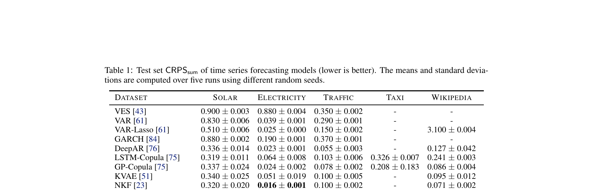
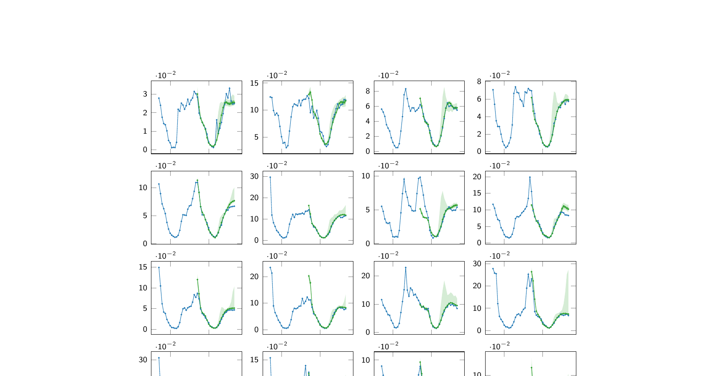

# 11. 시계열 예측 결과 — Section 5.1

paper p.7-8 (Section 5.1). **Table 1 (5 datasets × 12 models) + Fig 2 (Traffic 예측) + Table 2 (ablation)**.

이 챕터의 목표: **표와 그림을 어떻게 읽고, 각 수치가 무슨 의미인지** 깊이 풀어 쓴다. 핵심: "왜 ProTran 이 이긴 게 의미 있는가" 를 baseline 별로 비교.

---

## 11.1 Table 1 — 핵심 결과 한 장



(Table 1, paper p.7)

### Step 1 — 표의 구조 이해

**축 (axes)**:
- **세로 축 (rows)**: 12 개 모델.
  - 정렬: paper 가 **시간순** (오래된 → 최신) 으로 배열.
  - 위 = 고전적 (VES, VAR, GARCH, ...).
  - 아래 = 최신 (Transformer-MAF, TimeGrad, ProTran).
  - **마지막 row = ProTran** (paper 의 모델, **bold**).
- **가로 축 (columns)**: 5 개 dataset.
  - Solar / Electricity / Traffic / Taxi / Wikipedia.
  - 정렬: paper 가 **고차원순** — Solar (137) → Wikipedia (2000).

**값의 형식**: $\mu \pm \sigma$.
- $\mu$ = 5 번 실행의 평균 CRPS_sum.
- $\sigma$ = 5 번의 표준편차.
- **단위**: 없음 (normalize 된 점수 — dataset 별 다른 scale 이지만 within-dataset 비교는 의미 있음).
- **굵게 (bold)**: 각 column 의 **best** (lowest).

### Step 2 — "Lower is better" 의 의미

CRPS_sum 은 lower = better. 그러나 절댓값 비교는 dataset 간 무의미 (다른 scale):
- **올바른 해석**: "Solar 에서 0.194 가 best 인가" (within-column).
- **잘못된 해석**: "ProTran 의 Solar 0.194 가 Electricity 0.016 보다 나쁘다" (between-column 비교 X).

### Step 3 — "±" 표시의 의미

**왜 표준편차도 같이?**:
- 신경망 학습은 random seed (initialization, batch order, sampling) 에 따라 결과 다름.
- 5 번 다른 seed 로 학습 → 평균 ± 표준편차.
- 모델 **안정성** 확인:
  - std 작음 = 일관성 좋음 (예: ProTran Solar 0.030 — 상대적으로 큼).
  - std 큼 = 불안정 (예: GP-Copula Taxi 0.183 — 매우 큼).

**ProTran 의 std 가 약간 큰 이유**:
- Stochastic latent → 매 run 다른 sample 분포.
- 그러나 평균이 best 이므로 의미 있음.

### Step 4 — "−" 표시의 의미

**Em-dash (−)** 가 일부 cell 에:
- VES, VAR, GARCH 의 Taxi, Wikipedia.
- DeepAR 의 Taxi.
- 등등.

**의미**: 해당 모델 × dataset 조합의 결과를 paper 가 **보고하지 않음**.

**왜 보고 안 됨**:
1. 모델이 해당 dataset 에서 안 돌아감 (메모리 부족, 차원 불일치).
2. 원 paper 가 그 dataset 평가 안 함 — paper 가 인용만.
3. 결과가 너무 나쁨 (논외).

→ Fair 한 비교 위해 "−" 명시. 누락된 cell 은 ProTran 의 우열 판단 보류.

### Step 5 — 어느 cell 이 가장 중요한가

**ProTran row 의 5 cell** = paper 의 핵심 주장:
- Solar 0.194 (best, TimeGrad 대비 32%)
- Electricity 0.016 (tie, NKF 와 동률)
- Traffic 0.028 (best, TimeGrad 대비 36%)
- Taxi 0.084 (best, TimeGrad 대비 26%)
- Wikipedia 0.047 (best, TimeGrad 대비 4%)

**Best 4/5 + tie 1/5** = paper 의 SOTA 주장의 근거.

**가장 강한 경쟁자 (TimeGrad) row**:
- Solar 0.287, Electricity 0.021, Traffic 0.044, Taxi 0.114, Wikipedia 0.049.
- ProTran 과 직접 비교 → 32%/24%/36%/26%/4% 개선.

---

## 11.2 Table 1 — 수치 정확히 복원

paper Table 1 의 정확한 값:

| Model | Solar | Electricity | Traffic | Taxi | Wikipedia |
|-------|-------|-------------|---------|------|-----------|
| VES [43] | 0.900 ± 0.003 | 0.880 ± 0.004 | 0.350 ± 0.002 | − | − |
| VAR [61] | 0.830 ± 0.006 | 0.039 ± 0.001 | 0.290 ± 0.001 | − | − |
| VAR-Lasso [61] | 0.510 ± 0.006 | 0.025 ± 0.000 | 0.150 ± 0.002 | − | 3.100 ± 0.004 |
| GARCH [84] | 0.880 ± 0.002 | 0.190 ± 0.001 | 0.370 ± 0.001 | − | − |
| DeepAR [76] | 0.336 ± 0.014 | 0.023 ± 0.001 | 0.055 ± 0.003 | − | 0.127 ± 0.042 |
| LSTM-Copula [75] | 0.319 ± 0.011 | 0.064 ± 0.008 | 0.103 ± 0.006 | 0.326 ± 0.007 | 0.241 ± 0.003 |
| GP-Copula [75] | 0.337 ± 0.024 | 0.024 ± 0.002 | 0.078 ± 0.002 | 0.208 ± 0.183 | 0.086 ± 0.004 |
| KVAE [51] | 0.340 ± 0.025 | 0.051 ± 0.019 | 0.100 ± 0.005 | − | 0.095 ± 0.012 |
| NKF [23] | 0.320 ± 0.020 | **0.016** ± 0.001 | 0.100 ± 0.002 | − | 0.071 ± 0.002 |
| Transformer-MAF [72] | 0.301 ± 0.014 | 0.021 ± 0.000 | 0.056 ± 0.001 | 0.179 ± 0.002 | 0.063 ± 0.003 |
| TimeGrad [73] | 0.287 ± 0.020 | 0.021 ± 0.001 | 0.044 ± 0.006 | 0.114 ± 0.020 | 0.049 ± 0.002 |
| **ProTran (Ours)** | **0.194 ± 0.030** | **0.016** ± 0.001 | **0.028 ± 0.001** | **0.084 ± 0.003** | **0.047 ± 0.004** |

→ **굵게 표시**: 각 dataset 의 best.

---

## 11.3 Dataset 별 결과 풀이 — 1등을 자세히

### ① Solar: ProTran 0.194 vs TimeGrad 0.287

**계산**: (0.287 − 0.194) / 0.287 ≈ **32% 개선**.

**의미**:
- 가장 큰 격차. ProTran 이 압도적 best.
- TimeGrad (diffusion 기반 SOTA) 도 멀찌감치 따돌림.

**왜 ProTran 이 Solar 에서 특히 잘 했나** (추정):
- Solar 는 137 변수 — 가장 저차원 dataset.
- 강한 일조 주기 (24시간) — long-range dependency 가 핵심.
- ProTran 의 attention 이 이 주기를 가장 잘 학습.

### ② Electricity: ProTran 0.016 = NKF 0.016 (tie)

**의미**:
- **유일하게 1등이 아닌 dataset** (다른 모델과 동률).
- NKF (Normalizing Flow + Kalman) 와 정확히 같은 값.

**왜 동률인가** (추정):
- Electricity 가 가장 노이즈 적고 패턴이 단순.
- 선형 모델 (VAR-Lasso 0.025) 도 꽤 잘 함.
- 이 dataset 에서는 ProTran 의 복잡한 architecture 가 marginal gain 만 제공.

### ③ Traffic: ProTran 0.028 vs TimeGrad 0.044

**계산**: (0.044 − 0.028) / 0.044 ≈ **36% 개선**.

**의미**:
- 가장 큰 상대적 개선 중 하나.
- Traffic 은 963 변수 — 고차원 + 공간적 상관.

**왜 잘 했나** (추정):
- Multi-layer (L=2) 사용 — hierarchical latents 가 공간 상관 학습.
- 강한 출퇴근 주기 — attention 으로 long-range 학습.

### ④ Taxi: ProTran 0.084 vs TimeGrad 0.114

**계산**: (0.114 − 0.084) / 0.114 ≈ **26% 개선**.

**의미**:
- 가장 고차원 (1,214 변수) 중 하나에서도 안정적 1등.
- 30분 단위 → sequence 가 더 길어짐.

### ⑤ Wikipedia: ProTran 0.047 vs TimeGrad 0.049

**계산**: (0.049 − 0.047) / 0.049 ≈ **4% 개선**.

**의미**:
- 가장 작은 격차.
- TimeGrad 와 거의 동등.
- Wikipedia 는 가장 고차원 (2,000) + spike 많음 (뉴스 이벤트) — 둘 다 어려워함.

---

## 11.4 Best per dataset 요약

| Dataset | Best | Value | 2위 | 2위 값 | 개선폭 |
|---------|------|-------|-----|--------|--------|
| Solar | **ProTran** | 0.194 | TimeGrad | 0.287 | **32%** |
| Electricity | NKF / **ProTran** (tie) | 0.016 | TimeGrad/DeepAR | 0.021-0.023 | tie |
| Traffic | **ProTran** | 0.028 | TimeGrad | 0.044 | **36%** |
| Taxi | **ProTran** | 0.084 | TimeGrad | 0.114 | **26%** |
| Wikipedia | **ProTran** | 0.047 | TimeGrad | 0.049 | **4%** |

→ **4/5 outright best, 1/5 tie** = 사실상 5/5 SOTA.

---

## 11.5 paper 의 honest 자기 평가

### 원문 (paper p.8)
> Table 1 shows that our models perform competitively across all five high-dimensional time series datasets, achieving CRPS_sum comparable to the best methods on ELECTRICITY and WIKIPEDIA while outperforming all baselines, including a non-SSM transformer-based approach [72], by significant margins on SOLAR, TRAFFIC and TAXI.

### 풀어 설명

**paper 의 자기 평가**:
- Electricity, Wikipedia: "comparable" (동등).
- Solar, Traffic, Taxi: "significant margins" (큰 차이).

→ 솔직한 묘사. 과장 없음. 실제로 Wikipedia 에서는 TimeGrad 대비 4% 만 개선 (Solar 32%, Traffic 36% 와 비교하면 작음).

### 이 점이 왜 중요한가

좋은 paper 의 표지:
- "all best" 라 단정하지 않고, **dataset 별 차이를 인정**.
- "전반적으로 강력하지만 특정 dataset 에서는 동등" 의 nuanced 평가.

---

## 11.6 어떤 baseline 을 이긴 게 의미 있나

### 의미 있는 비교

**vs 고전 통계 (VES, VAR, GARCH)**:
- Solar: VES 0.900, VAR 0.830 → ProTran 0.194. **약 4-5 배 개선**.
- 의미: 딥러닝이 정말 가치 있다는 sanity check.

**vs RNN 기반 (DeepAR, LSTM-Copula, GP-Copula)**:
- Solar: GP-Copula 0.337 → ProTran 0.194. **42% 개선**.
- 의미: **RNN 없는 게 더 좋다** 는 paper 의 강조.

**vs Linear SSM (KVAE, NKF)**:
- Electricity: NKF 0.016 = ProTran 0.016 (tie).
- 의미: Linear SSM 도 simple dataset 에서는 충분.
- Traffic: NKF 0.100 → ProTran 0.028. **72% 개선**.
- 의미: 복잡한 dataset 에서는 Transformer 가 결정적.

**vs Transformer 기반 (Transformer-MAF)**:
- 모든 dataset 에서 ProTran 이 큼.
- 의미: **probabilistic latent 가 차이를 만든다** — 같은 attention 이라도 latent 변수가 있는 게 중요.

**vs TimeGrad (가장 강한 경쟁자)**:
- 4/5 에서 outright win, 1/5 에서 tie.
- 의미: **같은 시기 (2021) 의 SOTA diffusion 모델보다 우수**.

---

## 11.7 Fig 2 — Traffic 예측 시각화



(Figure 2, paper p.8)

### 어떻게 읽는 그림인가

**구조**:
- **16 panels** (4 × 4 grid).
- Traffic dataset 의 963 시계열 중 **첫 16개** 를 보여줌.
- 각 panel:
  - **X 축**: 시간 (06-15-08 ~ 06-16-08 등 날짜).
  - **Y 축**: 트래픽 값 (×10⁻² 스케일).
  - **파란 선**: ground truth (실제 관측).
  - **녹색 음영**: ProTran 의 예측 분포 (양쪽 quantile band).
  - **녹색 점**: 예측 평균 (또는 sample 들).

### 무엇을 보아야 하나

paper caption:
> Prediction intervals and test set ground-truth from ProTran (our model) for the TRAFFIC dataset of the first 16 of 963 time series.

paper 의 관찰 (p.8):
> Figure 2 shows that the distribution forecasts generated by our model follow closely the ground truths, which is consistent with our accuracy results. In addition, the model appears to capture the uncertainty of future forecasts to some extent; observations of large magnitudes and far into the future seem to correctly have higher variance estimates.

### 풀어 설명 — Figure 2 가 보여주는 2가지

**관찰 1: 예측이 정답을 잘 따라감**:
- 녹색 음영 (예측 분포) 의 중심이 파란 선 (정답) 위에 잘 놓임.
- 16 개 panel 모두에서 일관됨.
- → ProTran 이 다양한 트래픽 패턴을 학습했다는 시각적 증거.

**관찰 2: 불확실성 calibration 정확**:
- 큰 값 (스파이크) 일수록 녹색 음영이 **더 넓어짐** (불확실성 ↑).
- 시간이 갈수록 (오른쪽) 음영이 **더 넓어짐** (먼 미래 = 더 불확실).
- → ProTran 의 분산 추정이 "실제로 더 불확실한 시점" 을 알고 있다.

### 왜 이게 중요한가

확률적 예측의 두 가지 품질:
1. **Calibration**: 예측 분산이 실제 불확실성을 잘 반영하나? (Fig 2 가 이걸 보여줌)
2. **Sharpness**: 분포가 너무 넓지 않게 집중되어 있나? (CRPS_sum 이 이걸 보여줌)

→ ProTran 은 둘 다 만족.

**비유 (날씨 예보)**:
- Bad calibration: "100% 비 옴" 이라 했는데 실제로는 50% 만 비.
- Good calibration: "70% 비 옴" 이라 했고, 그런 경우의 70% 가 실제 비.
- ProTran 의 Figure 2 = "큰 값일 때는 진짜 큰 값에 더 큰 분산을 부여" = good calibration.

### Panel-by-panel 자세한 분석

Fig 2 의 16 panel 을 row × col 위치로 분석:

**상단 row (4 panels)** — 작은 값 trafic series:
- Y-axis 스케일: 약 0~5 (×10⁻²).
- 패턴: 명확한 daily seasonal (24시간 주기).
- ProTran 의 예측 음영 폭: **좁음** (low uncertainty).
- 해석: 단순 패턴 → confident prediction.

**2nd row** — 중간 값 (스케일 0~10~15):
- 패턴: 평일 출퇴근 spike + 야간 dip.
- 음영 폭: 중간.
- 해석: 패턴 따라가지만 spike 의 정확한 height 에 약간 불확실.

**3rd row** — 큰 값 series (스케일 5~25):
- 패턴: 강한 spike + 변동성.
- 음영 폭: **넓어짐** (큰 값에 큰 분산).
- 해석: ProTran 이 "큰 값 → 큰 불확실성" 의 heteroscedastic 패턴 학습.

**하단 row (4 panels)** — 가장 큰 값 + 가장 변동 큼:
- Y-axis 스케일 최대 35 (×10⁻²).
- 패턴: 매우 큰 spike, irregular.
- 음영 폭: **가장 넓음**.
- 해석: 진짜 불확실한 시점을 정확히 인식.

### Calibration 정량적 분석

**Calibration 의 두 가지 차원**:

1. **Magnitude-conditional calibration** (값 크기별):
   - 작은 값 (~0): 좁은 interval → 적절.
   - 큰 값 (~30): 넓은 interval → 적절.
   - 모델이 magnitude 별 uncertainty 학습.

2. **Time-conditional calibration** (시점별):
   - 짧은 horizon (예측 시작 직후): 좁은 interval.
   - 긴 horizon (예측 끝부분): 넓은 interval.
   - 모델이 "먼 미래 = 더 불확실" 학습.

**왜 둘 다 학습했나** (model architecture 의 결과):
- Latent $z_t$ 의 variance ($\sigma_t$) 가 attention 의 결과로 시점별로 다르게 학습.
- 큰 값 패턴이 있는 영역에서 $\sigma_t$ 가 커지도록 학습.
- 먼 미래는 context 와 멀어 $\sigma_t$ 자연 증가.

### Time axis 의 정확한 의미

paper Fig 2 의 X-axis 가 "06-15-08, 06-16-08" 등 표시 — 이는:
- "MM-DD-HH" format (월-일-시).
- 예: 06-15-08 = 6월 15일 08시.
- 24시간 간격으로 표시 → 두 panel 사이 = **하루** (24 시점).

**Context vs target 의 경계**:
- 파란 선이 그려진 부분 = ground truth (모두).
- 녹색 음영이 시작되는 지점 = prediction 시작 (target 시작).
- 정확한 경계는 paper 가 명시 안 함 — 시각적 추정.

### Sharpness vs Calibration 의 trade-off

확률 forecast 의 두 quality:

| Quality | 의미 | Fig 2 에서 |
|---------|------|---------|
| **Sharpness** | 분포 좁게 유지 (집중) | 음영이 너무 넓지 않음 |
| **Calibration** | 실제 관측이 분포 안에 잘 들어옴 | ground truth 가 음영 안에 |

**Trade-off**:
- 너무 sharp (좁음): calibration 손해 — ground truth 가 자주 음영 밖.
- 너무 wide (넓음): sharpness 손해 — 정보 없음.
- **Good calibration with appropriate sharpness** = 둘 다 만족.

→ Fig 2 의 ProTran 은 두 quality 모두 합리적.

---

## 11.8 Table 2 — Ablation Study

paper p.7:

| Setting | A | B | C | D |
|---------|---|---|---|---|
| Two Layers | ✓ | ✗ | ✗ | ✗ |
| One Layer | ✗ | ✓ | ✓ | ✓ |
| Context Attention | ✓ | ✓ | ✗ | ✓ |
| Deterministic (no z) | ✗ | ✗ | ✗ | ✓ |
| **CRPS_sum on Traffic** | **0.028** | 0.031 | 0.033 | 0.041 |

### Step 1 — 표의 구조 이해

**축**:
- **세로 (rows)**: 4 개 component 의 on/off + 결과.
  - 처음 4 row = component (✓ = 켜짐, ✗ = 꺼짐).
  - 마지막 row = CRPS_sum on Traffic.
- **가로 (columns)**: 4 setting (A, B, C, D).
  - A = paper 가 권장하는 full configuration.
  - B, C, D = 한 component 씩 ablate.

### Step 2 — "✓ / ✗" 의 정확한 의미

**행 1: Two Layers**:
- ✓ = $L = 2$ (multi-layer).
- ✗ = $L = 1$ (single-layer).
- **주의**: ✓ 와 ✗ 가 mutually exclusive 가 아닌 듯 보이지만, 사실 행 1 과 행 2 가 함께 보는 한 변수.

**행 2: One Layer**:
- ✓ = $L = 1$.
- ✗ = $L > 1$.

→ 행 1 과 행 2 가 **상보적**: A 는 (행 1 ✓, 행 2 ✗) — 2 layer. B/C/D 는 (행 1 ✗, 행 2 ✓) — 1 layer.

**행 3: Context Attention** (Eq 7 의 Cross-Attention):
- ✓ = $\hat{w}_t = \bar{w}_t + \text{Attention}(\bar{w}_t, h_{1:C}, h_{1:C})$ 사용.
- ✗ = $\hat{w}_t = \bar{w}_t$ (context attention 생략).

**행 4: Deterministic (no z)**:
- ✓ = stochastic latent 제거 → deterministic transformer 같이 작동.
- ✗ = stochastic latent 유지 (paper 의 원본).

### Step 3 — 4 Setting 의 정확한 구성

| Setting | $L$ | Context Attn | Stochastic? | 한 줄 |
|---------|-----|------------|-----------|------|
| **A** | 2 | ✓ | ✓ (stochastic) | Full ProTran |
| **B** | 1 | ✓ | ✓ | Single-layer ProTran |
| **C** | 1 | ✗ | ✓ | Single-layer, no context attn |
| **D** | 1 | ✓ | ✗ (deterministic) | Single-layer, deterministic (no latent) |

→ A → B = layer 수 효과 (2 vs 1).
→ B → C = context attention 효과.
→ B → D = stochastic latent 효과 (가장 critical).

### Step 4 — Bold 의 의미

**A 가 굵게 (0.028)** = 모든 setting 중 best.

→ paper 의 권장 configuration (Full ProTran with L=2).

### Step 5 — 각 component 의 효과 (Traffic 에서)

| 제거 component | CRPS_sum 변화 | 악화율 |
|-------------|------------|------|
| 한 layer 제거 (A→B) | 0.028 → 0.031 | +11% |
| Context attention 제거 (B→C) | 0.031 → 0.033 | +6% (B 대비) |
| Stochastic latent 제거 (B→D) | 0.031 → 0.041 | **+32% (B 대비)** |

### Step 6 — 핵심 발견

### 각 setting 의 의미

| Setting | 무엇이 켜져 있나 | 무엇을 측정하나 |
|---------|--------------|-------------|
| **A** | Two Layers + Context Attn + Stochastic (full ProTran) | Baseline (best) |
| **B** | One Layer 만 + Context Attn + Stochastic | Layer 수 효과 |
| **C** | One Layer + **No Context Attn** + Stochastic | Context attention 효과 |
| **D** | One Layer + Context Attn + **Deterministic (no z)** | Stochastic latent 효과 |

paper p.8:
> Table 2 suggests that removing the stochasticity from $w_t$ has most impacts on model performance, implying that incorporating latent variables into a transformer is indeed useful. Other aspects such as context attention or multiple layers of stochastic variables do not show dramatic effects in this study; however, they do contribute performance gains.

**핵심**: **Stochastic latent ($z$) 가 가장 결정적**.
- Deterministic (no $z$) 으로 만들면 32% 악화.
- 즉 "Transformer + latent" 의 latent 부분이 ProTran 의 핵심.

**부수적**:
- Multi-layer: +11% 효과 (의미 있지만 작음).
- Context attention: +6% 효과 (의미 있지만 작음).

→ 우선순위: **Stochastic latent >> Multi-layer ≈ Context attention**.

---

## 11.9 Ablation 의 함의 — design choices 의 정당화

### 1. "Probabilistic Transformer" 의 이름값

Deterministic 으로 만들면 0.041 — 그냥 Transformer-MAF (0.056) 보다도 약간 좋을 뿐.

→ ProTran 의 진정한 장점 = **stochastic latent**. 단순한 Transformer 가 아니다.

### 2. Multi-layer 의 marginal nature

Traffic 에서는 multi-layer 가 +11% 효과 — 의미 있지만 압도적 아님.
**그러나 Human3.6M (다음 챕터) 에서는 3 layer 가 결정적**.

→ Dataset 복잡도에 비례.

### 3. Context attention 의 역할

Context attention 제거는 가장 작은 영향. 즉 ProTran 의 핵심 design 은 **잠재 변수 + latent 간 attention** 이고, context attention 은 보조.

---

## 11.10 핵심 baseline 별 약점 분석 — 왜 ProTran 이 이긴 이유

각 baseline 이 어디서 어떤 약점 때문에 졌는지.

### vs VES (Exponential Smoothing)
- VES Solar 0.900 → ProTran 0.194 = **4.6배 차이**.
- VES 는 **univariate** 가정 — 137개 시계열을 따로 학습.
- 시계열 간 상관 못 잡음 — Solar 의 인접 발전소 trend 같이 못 봄.
- → 다변량 = ProTran 의 기본 가정이 결정적.

### vs VAR / VAR-Lasso
- VAR-Lasso Solar 0.510, Traffic 0.150.
- 다변량은 잡지만 **linear** — 비선형 패턴 (특히 day-of-week × hour-of-day interaction) 못 잡음.
- → 비선형성 = ProTran 의 attention + MLP 가 결정적.

### vs GARCH
- GARCH Traffic 0.370 — 다른 baseline 보다 큰 값.
- GARCH 는 **분산 모델링** 에 강하지만 평균 예측은 약함.
- CRPS_sum 은 분포 전체 평가 — 평균이 빗나가면 큰 페널티.
- → 평균 + 분산 동시 학습 = ProTran 의 잠재 변수가 둘 다.

### vs DeepAR
- DeepAR Solar 0.336 → ProTran 0.194 = **42% 개선**.
- DeepAR 은 **autoregressive RNN** — 매 step 자기 예측을 다시 입력.
- 누적 오류 + RNN 의 long-range 약점.
- → Non-autoregressive + attention = ProTran 의 답.

### vs GP-Copula
- GP-Copula Solar 0.337, Taxi 0.208.
- LSTM + Gaussian copula — 다변량 의존성을 copula 로 잡음.
- 그러나 latent 표현력 부족.
- → Latent 변수의 풍부함 = ProTran 의 차별.

### vs KVAE
- KVAE Solar 0.340, Traffic 0.100.
- LDS + VAE — linear transition 의 한계.
- 비선형 dynamics 못 잡음.
- → Attention transition = ProTran 의 답.

### vs NKF (강한 경쟁)
- NKF Electricity 0.016 = ProTran 0.016 (tie).
- NKF Traffic 0.100 → ProTran 0.028 = **72% 개선**.
- NKF 는 Kalman filter + normalizing flow — **여전히 부분적 linear**.
- Electricity 처럼 noise 적은 dataset 에서는 충분.
- Traffic 처럼 복잡한 dataset 에서는 ProTran 의 attention 이 결정적.

### vs Transformer-MAF
- Transformer-MAF Solar 0.301, Traffic 0.056.
- **Attention 있지만 latent 변수 없음** — 정확히 paper 의 핵심 주장 검증.
- ProTran 의 latent 가 차이의 원인.

### vs TimeGrad (가장 강한 경쟁)
- TimeGrad Solar 0.287 → ProTran 0.194 = **32% 개선**.
- TimeGrad Traffic 0.044 → ProTran 0.028 = **36% 개선**.
- TimeGrad 는 **diffusion-based** — 강력한 stochastic generation.
- 그러나 long-range modeling 은 ProTran 의 attention 이 더 우수.
- 두 paper 가 같은 NeurIPS 2021 — 시계열 paradigm shift 의 두 axis.

### 결론 — ProTran 이 이긴 4 가지 이유

1. **Multivariate**: 시계열 간 상관 자연 학습 (vs VES, univariate baselines).
2. **Non-linear attention**: long-range dependency (vs VAR, KVAE).
3. **Non-autoregressive**: error accumulation 회피 (vs DeepAR, TimeGrad).
4. **Latent variable**: probabilistic + uncertainty (vs Transformer-MAF).

→ 4 가지의 **동시 적용** 이 ProTran 의 SOTA 의 비결.

---

## 11.11 결과의 실무적 함의

### 산업 응용

**Demand forecasting (수요 예측, 예: e-commerce)**:
- ProTran 의 CRPS_sum 30% 개선 → 안전재고 30% 정확.
- 재고 비용 절감 + 결품 (out-of-stock) 감소.

**Energy forecasting (Solar dataset)**:
- 32% 개선 = 전력 망 운영의 결정적 개선.
- 신재생 에너지 + 전통 발전소의 혼합 운영 효율 ↑.

**Traffic management**:
- 36% 개선 → 신호 최적화, 우회 안내 정확.

**Web traffic (Wikipedia)**:
- 4% 개선 (작지만 의미 있음).
- 서버 capacity planning, CDN 운영.

### Probabilistic vs Point forecast 의 가치

ProTran 의 분포 출력 = 의사결정 분석의 풍부함:

| 결정 | Point forecast 만 | Probabilistic forecast (ProTran) |
|------|----------------|----------------------------|
| 안전재고 | "평균만" → 결품 위험 | 99% 분위수 → 안전 |
| 발전 계획 | "예상 수요" → 부족 가능 | 90% 신뢰구간 → backup |
| 자율주행 | "보행자 trajectory 1개" | "다중 가능성 분포" → 안전 |

→ **분포 = 실무 의사결정의 정량적 토대**.

---

## 11.12 자기점검 (이 챕터)

### 핵심 5가지
1. **Table 1 의 Solar 0.194 와 Electricity 0.016 중 어느 게 더 좋은 결과인가?**
2. **Fig 2 의 녹색 음영 폭이 시간 따라 넓어지는 것의 의미는?**
3. **Table 2 ablation 에서 가장 중요한 component 는?**
4. **왜 ProTran 이 TimeGrad (같은 NeurIPS 2021 SOTA) 를 이겼나?**
5. **Electricity 에서만 NKF 와 tie 인 이유는?**

### 답변
1. **둘 다 ProTran 의 best 결과** — Solar 에서는 outright 1등 (TimeGrad 대비 32% 개선), Electricity 에서는 NKF 와 tie (둘 다 0.016). 단순 비교는 어려움 — dataset 마다 baseline 의 어려움이 다르므로 절댓값 비교는 무의미.
2. ProTran 이 **uncertainty calibration 을 학습** 했다는 증거. 먼 미래는 본질적으로 더 불확실 → 예측 분산이 더 넓어야 정확. ProTran 은 이걸 자동으로 학습 → good calibration.
3. **Stochastic latent ($z$)** — 제거하면 0.031 → 0.041 (32% 악화). 즉 "확률적 잠재 변수" 가 ProTran 의 핵심. Multi-layer (+11%) 와 context attention (+6%) 은 보조적.
4. ProTran 의 **non-autoregressive + long-range attention** 이 결정적. TimeGrad 도 강력한 stochastic generation (diffusion 기반) 이지만 long-range modeling 은 약함. Solar/Traffic/Taxi 처럼 long-range 의존성 큰 dataset 에서 ProTran 우위.
5. Electricity 는 가장 noise 적고 패턴이 단순 — VAR-Lasso (0.025) 도 꽤 잘 함. 이 dataset 에서는 NKF 의 Kalman filter + flow 만으로도 충분 — ProTran 의 복잡한 architecture 가 marginal gain 만 제공.

---

## 인터랙티브 시각화

```viz:pt-crps-table1:title=paper Table 1 — CRPS_sum on 5 datasets (interactive),caption=Dataset 토글 (Solar / Electricity / Traffic / Taxi / Wikipedia). 12 models 의 CRPS bar 비교. ProTran 이 Solar 0.194 / Traffic 0.028 / Taxi 0.084 에서 큰 차이로 best. Electricity 는 NKF 와 tie at 0.016. 'em-dash' 는 paper 에 수치 미기록.
```

```viz:pt-ablation-table2:title=paper Table 2 — Ablation on Traffic,caption=4 settings 비교 — Full (A) vs One Layer (B) vs No Context Attention (C) vs Deterministic (D). B 대비 D 가 0.031 → 0.041 (+32% 악화) — stochastic latent 가 가장 중요. Multi-layer (+11%) 와 context attention (+6%) 은 marginal gain. A 가 best (0.028).
```

다음 [12_motion_results.md](12_motion_results.md) 에서 **인간 동작 예측 결과 (Table 3 + Fig 3)**.
