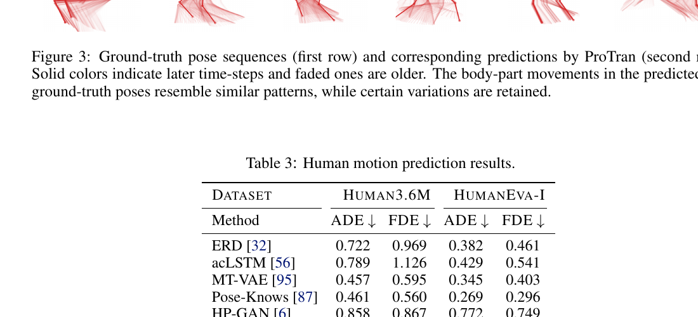
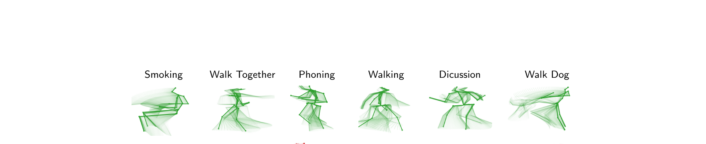

# 12 Human Motion Prediction Results — Section 5.2

paper p.8-9. Table 3 + Fig 3.



(Table 3, paper p.9)

---

## Table 3 — Human Motion Prediction (paper p.9)

paper Table 3 정확 인용. **lower = better**.

| Method | Human3.6M ADE↓ | Human3.6M FDE↓ | HumanEva-I ADE↓ | HumanEva-I FDE↓ |
|--------|---------------|---------------|----------------|----------------|
| ERD [32] | 0.722 | 0.969 | 0.382 | 0.461 |
| acLSTM [56] | 0.789 | 1.126 | 0.429 | 0.541 |
| MT-VAE [95] | 0.457 | 0.595 | 0.345 | 0.403 |
| Pose-Knows [87] | 0.461 | 0.560 | 0.269 | 0.296 |
| HP-GAN [6] | 0.858 | 0.867 | 0.772 | 0.749 |
| Best-Many [11] | 0.448 | 0.533 | 0.271 | 0.279 |
| GMVAE [25] | 0.461 | 0.555 | 0.305 | 0.345 |
| DeliGAN [38] | 0.483 | 0.534 | 0.306 | 0.322 |
| DSP [98] | 0.493 | 0.592 | 0.273 | 0.290 |
| DLow [97] | 0.425 | 0.518 | **0.251** | 0.268 |
| **ProTran (Ours)** | **0.381** | **0.491** | 0.258 | **0.255** |

### Best per cell

| Cell | Best | Value | 2위 |
|------|------|-------|-----|
| Human3.6M ADE | **ProTran** | 0.381 | DLow 0.425 (10% improvement) |
| Human3.6M FDE | **ProTran** | 0.491 | DLow 0.518 (5% improvement) |
| HumanEva-I ADE | DLow | 0.251 | **ProTran** 0.258 |
| HumanEva-I FDE | **ProTran** | 0.255 | DLow 0.268 (5% improvement) |

→ **3/4 cells best**, 1/4 close 2위 (HumanEva-I ADE).

### paper's claim (p.9)

paper:
> Table 3 shows that our models convincingly outperform all baselines based on both metrics ADE and FDE, with the gains significantly higher for the larger dataset Human3.6M. We emphasize that our favorable performance is evaluated using random samples, while the closest competitor, DLow [97], relies on a separate model for selecting samples to promote diversity, which can potentially be combined with our probabilistic transformer for further improvements.

**핵심 주장**:
- "Convincingly outperform" — Human3.6M 에서 큰 차이.
- **Random samples**: ProTran 의 prediction 은 random samples — DLow 는 별도 diversity-promoting model 사용.
- **Combinable**: DLow 의 sample selection 을 ProTran 과 결합 가능 (미래 work).

→ Honest 한 비교 — ProTran 단독으로도 SOTA, 추가 trick 결합 가능성 시사.

---

## 인터랙티브 시각화 — Table 3

```viz:pt-motion-table3:title=paper Table 3 — Motion Prediction ADE / FDE (interactive),caption=Dataset 토글 (Human3.6M / HumanEva-I) + Metric 토글 (ADE / FDE). 11 models 비교. ProTran 이 Human3.6M 양쪽 + HumanEva-I FDE 에서 best. HumanEva-I ADE 만 DLow 가 0.251 with ProTran 0.258 직후.
```

---

## Fig 3 — Pose Prediction Visualization (paper p.9)



(Figure 3, paper p.9)

paper caption:
> Ground-truth pose sequences (first row) and corresponding predictions by ProTran (second row). Solid colors indicate later time-steps and faded ones are older. The body-part movements in the predicted and ground-truth poses resemble similar patterns, while certain variations are retained.

**해석**:
- 6 activity types: **Smoking, Walk Together, Phoning, Walking, Discussion, Walk Dog**
- 각 activity 의 2행:
  - 1행: ground truth pose sequence
  - 2행: ProTran prediction
- Color gradient: faded → solid = 시간 진행

**핵심 관찰** (paper p.9):
> The similarities between the body-part movements in both sequences suggest that our model has been able to capture the temporal dynamics quite well.

→ 6 activity 모두 prediction 이 ground truth 와 visually similar.

---

## Random Samples 의 의미 (paper의 주의)

paper p.9:
> Our favorable performance is evaluated using random samples, while the closest competitor, DLow [97], relies on a separate model for selecting samples to promote diversity, which can potentially be combined with our probabilistic transformer for further improvements.

**평가 방식**:
- ProTran: **random samples** 100개 중 ground truth 와 가장 가까운 것의 ADE/FDE.
- DLow: diversity 위해 별도 model 로 100 samples 골라서 평가.

→ ProTran 이 fair comparison 에서 best 인데, diversity selection 추가하면 더 좋아질 가능성.

---

## Motion vs Time Series — 통합

paper Section 5 의 두 task 가 사실 같은 framework:

| 항목 | Time Series | Human Motion |
|------|-------------|---------------|
| Context | $x_{1:C}$ (과거 관측) | 0.25s / 0.5s 의 motion |
| Target | $x_{C+1:T}$ (미래 예측) | 1s / 2s 의 motion |
| Metric | CRPS_sum | ADE / FDE |
| ProTran 결과 | 4/5 datasets best | 3/4 cells best |

→ ProTran 의 framework 가 **task-agnostic** — 같은 model 이 두 domain 모두 SOTA.

---

## 다음

[13_conclusion.md](13_conclusion.md) 에서 paper 결론 + limitations.
