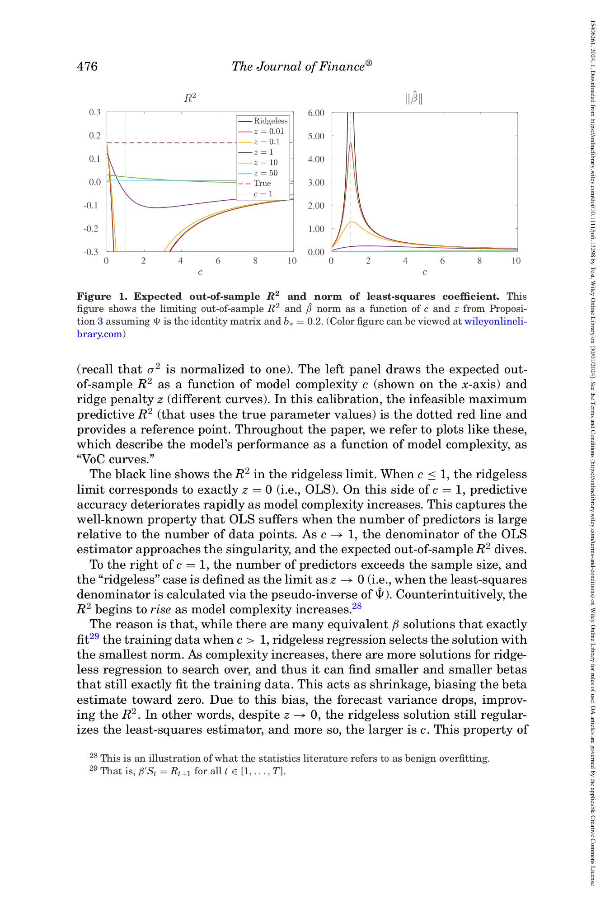
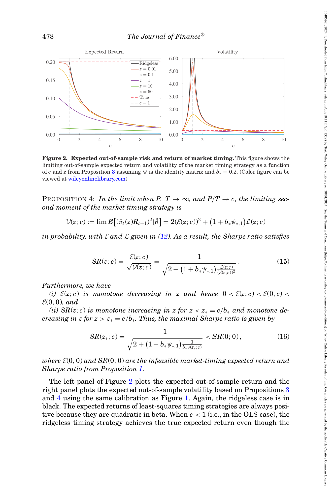
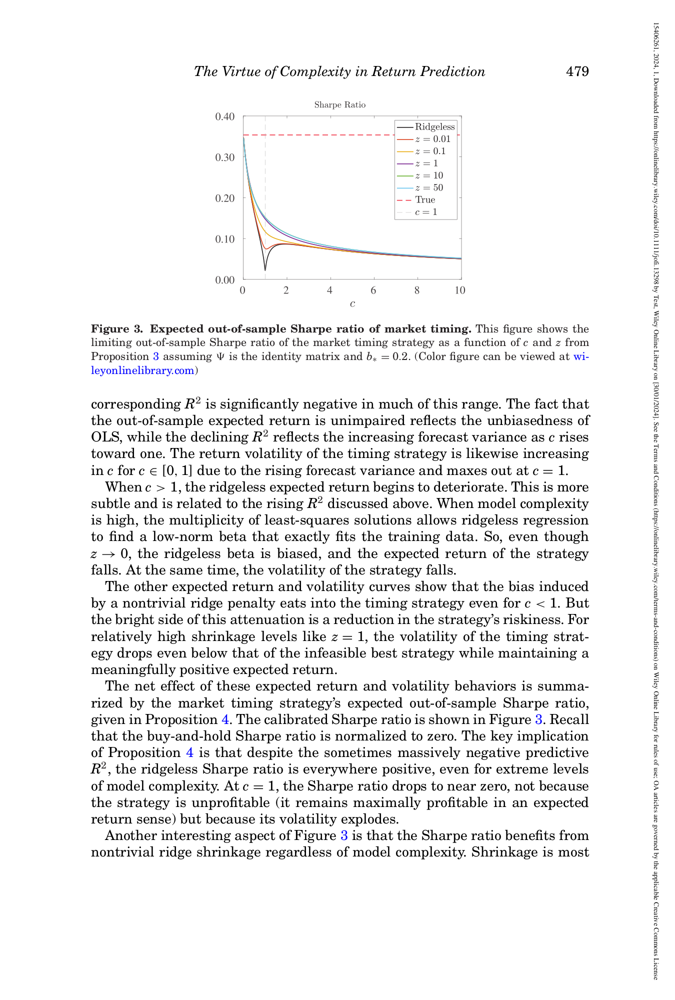

# 05b. *이상적 환경* 의 결과 — 그림으로 이해

## 📌 이 챕터 다 읽으면 알 수 있는 것

- 이상적 환경 (well-specified) 에서의 결과
- Lemma 1, Proposition 1 의 의미
- Infeasible SR < 1/√3 의 의미

---

> 본 챕터는 본 논문의 *Propositions 3, 4* (correctly specified model 의 결과) 를 *그래프 위주* 로 무지식자 친화로. *Figures 1, 2, 3* 의 친근 풀이.

### 🌱 Correctly Specified — 일상 비유

**한 줄로**: "학자의 모델이 진짜 자연 법칙과 정확히 일치하는 이상적 경우 → 그래도 c=1 근처에서 catastrophe 발생 + R² 음수에도 SR 양수라는 놀라운 결과".

| 상황 | 비유 |
|------|------|
| **Correctly specified** | 학자가 "키 = 유전 + 영양 + 잡음" 라는 자연 법칙을 알고, 그대로 모델링 |
| **Misspecified** | 학자가 일부 요인만 알고 (유전만 사용), 영양 무시 |
| **본 챕터** | Correctly specified — 이상적이지만 분석 baseline |

**왜 이상적인 경우도 분석?**: (i) Misspecified 경우와 비교 baseline, (ii) c=1 catastrophe 가 specification 무관하게 발생함 입증, (iii) R² vs SR 분리의 깔끔한 사례.

### 🔣 핵심 기호 4-단 풀이

| 기호 | 의미 | 범위 |
|------|------|------|
| **c** = P/T | 모델 복잡도 (변수/데이터 비율) | $[0, \infty)$ |
| **z** | Ridge regularization 강도 | $[0, \infty)$, 0 = ridgeless |
| **R²** | Out-of-sample 예측 정확도 | $(-\infty, 1]$ |
| **E** | Expected return (timing 전략 기대 수익) | $\mathbb{R}$ |
| **Vol** | Volatility (변동성, std) | $[0, \infty)$ |
| **SR = E/Vol** | Sharpe ratio | $\mathbb{R}$ |
| **빨간 점선** | Infeasible (신의) 값 | "신만 도달 가능한 상한" |

**6개 색 코드** (모든 figure 공통):
- 검정 (z≈0, ridgeless), 노랑 (z=0.01), 빨강 (z=0.1), 보라 (z=1), 하늘색 (z=10), 연두 (z=50)

→ 색이 진할수록 ridge ↑, 안정장치 ↑.

---

## 5b.1 챕터 한 줄 요약

> **"*이상적 환경* (학자의 모델 = 진짜 자연 법칙) 에서 모델 복잡도 c 의 함수로 R², 기대 수익, Sharpe ratio 를 그래프로. *놀라운 발견 1*: ridgeless (안정장치 없음) 가 *c=1 부근에서 catastrophe*, *c > 1 에서 회복*. *놀라운 발견 2*: R² 가 마이너스 100% 이하 임에도 Sharpe ratio 양수 — *R² ≠ 경제 가치*."**

---

## 5b.2 *Correctly specified* 가 뭐예요? — **Section III 의 모든 내용**

### 정의

> **"학자의 empirical model = 진짜 DGP (data-generating process, 자연 법칙). 즉 *정확히 모델링*."**

### 일상 비유

**상황**: 학생 키 = (유전자 점수) + (영양 점수) + 잡음. *진짜* 자연 법칙.

**학자의 모델**: 같은 *유전자 점수* + *영양 점수* 변수를 사용. *동일한 함수 형태*.

→ **모델 = 자연** (correctly specified).

### 비현실적 가정

현실: 학자는 *진짜 자연 법칙* 을 모름. 그저 *근사* 만 함. 즉 *misspecified*.

**그러나 correctly specified case 도 분석 가치 있음**:
- *이론적 baseline* — 가장 단순한 경우.
- 다음 챕터 [05_method_c](05_method_c_misspec.md) 의 *misspecified case* 와 비교.

---

## 5b.3 첫 번째 그림 — Figure 1 (R² vs c, **Section III.A**)

**Equation 11 (식 11)**: $MSE(z;c) = \lim E[(R - S'\hat\beta(z))^2 | \hat\beta(z)]$ — 본 논문 *OOS MSE* 의 정확한 정의.



*paper p.476 Figure 1 — Left: R² as function of c. Right: $\|\hat\beta\|$ norm.*

### 무지식자 친근 풀이

#### Left panel — R² vs c (모델 복잡도)

**x-axis**: c = 변수 수 / 데이터 수.
- c < 1: 데이터 > 변수 (통상 영역).
- c = 1: *interpolation boundary*.
- c > 1: 변수 > 데이터 (high-complexity).

**y-axis**: OOS R² (out-of-sample 예측 정확도).
- R² = 1: 완벽 예측.
- R² = 0: 평균 정도.
- R² < 0: *평균보다 나쁨* (망함).

**여러 색상 선**: 각 *ridge shrinkage* (z) 값.
- 검정 (z ≈ 0): ridgeless.
- 노랑 / 빨강 / 보라 / ...: z = 0.01, 0.1, 1, 10, 50.

### 핵심 패턴 1 — Ridgeless catastrophe

**검정 (ridgeless)** 의 R²:
- c = 0 (데이터 무한): R² = 0.167 (infeasible upper bound).
- c < 1: R² 점점 감소.
- **c → 1: R² → -∞** (catastrophe!) — 학자가 *interpolation boundary 근처* 에서 모델 만들면 *완전 망함*.
- c > 1: 다시 회복.
- c → ∞: R² → 0.

**일상 비유**: *학생 10명 데이터 + 9 과목 변수* (c=0.9). *데이터 부족* + *변수 거의 같음* — 회귀선이 *너무 휘청* → 새 학생 예측 *완전 망함*.

같은 *학생 10명 + 1000 과목 변수* (c=100) — *변수 훨씬 많지만* ridgeless 의 *smallest norm* 성질로 *부드러운 모델* 만듦 → OOS 회복.

### 핵심 패턴 2 — Ridge 의 효과

**z > 0 의 선들**: 모두 *catastrophe 완화*.
- z = 1: R² 가 catastrophe 영역에서 *덜 떨어짐*.
- z = 10: 더 안정. 그러나 *모든 c 에서 R² 약간 낮음* (heavy shrinkage 의 bias).
- z = 50: R² 거의 0 (over-shrunken).

**핵심 메시지**: *적절한 z* 가 가장 좋음 — 너무 작으면 catastrophe, 너무 크면 bias.

#### Right panel — $\|\hat\beta\|$ norm

**y-axis**: 추정 계수의 *크기*.

- *Ridgeless*: c = 1 부근에서 *6+* 까지 spike. *추정 계수가 폭발* — 그래서 OOS 망함.
- *Ridge z 큼*: norm 작음 — 안정.

**일상 비유**: catastrophe 영역에서 *추정 계수 가 1000 같이 비현실적* 으로 큼. ridge 가 *normal 범위 (0.5-5)* 로 끌어내림.

---

## 5b.4 **Proposition 3 (정리 3) — 무엇이 모든 결과를 결정?**

**Section III.A** 의 핵심 정리.

**Equation 12 (식 12)**: Proposition 3 의 식 set — $\mathcal{E}, \mathcal{L}, R^2$ 의 closed form. 또한 $\nu, \nu', \hat\nu$ trace identity 정의.

**Equation 13 (식 13)**: $R^2(0;c) = R^2(0;0) - (1+b_*\psi_{*,1})^{-1} \cdot \{c<1: (c^{-1}-1)^{-1}, c>1: \mu(c)\}$ — ridgeless 의 closed form.

**Equation 14 (식 14)**: $\lim_{c \to \infty} R^2(0;c) = 0 > \lim_{c \to 1} R^2(0;c) = -\infty$ — ridgeless 의 limit behavior.

**각주 27 (Cross-validation 권장)**: $z_*$ 는 *unknown* $b_*$ 의 추정 필요. 본 논문 결과는 *$z$ 에 둔감* — *cross-validation* 같은 simple methods 가 잘 작동.

**각주 28 (Benign overfitting 명명)**: 통계학에서 *benign overfitting* 으로 불림.

**각주 29 (Zero training error)**: $\beta'S_t = R_{t+1}$ for all $t$ — interpolation.

**각주 30 (Benign overfit references)**: Spigler 2019, Belkin 2019, Belkin-Rakhlin-Tsybakov 2019, Belkin-Hsu-Xu 2020, Hastie 2022 — 통계학의 *2019-2022 wave*.

**각주 31 (R²<0 + SR>0 의 simple example)**: 한 predictor + 추정 계수가 *true의 large multiple* — R² 음수 but 예측과 진짜 expected return 의 *correlation 완벽* — timing SR 양수.

본 논문의 *공식 정리*:

> **"모든 portfolio quantity 가 *3 trace 함수* ($\nu$, $\nu'$, $\hat\nu$) 로 표현. 이들은 모두 *Stieltjes m(-z; c)* 의 함수."**

### 무지식자 친근 풀이

**$\nu(z; c)$** = 기대 수익의 building block.

**$\hat\nu(z; c)$** = leverage 의 building block.

**$\nu'(z; c)$** = 위 두 양의 *변화율* (negative).

**Proposition 3 의 식들** (옵션 박스):
- $\mathcal{E}(z; c) = b_* \nu$
- $\mathcal{L}(z; c) = b_* \hat\nu - c \nu'$
- $R^2(z; c) = (2 \mathcal{E} - \mathcal{L}) / (1 + b_* \psi_{*,1})$

→ 위 식 *외워야 할 필요 없음*. 핵심은 **모든 quantity 가 $m(-z; c)$ 하나로 derived** — Proposition 2 의 *마법* 의 구체화.

### Optimal shrinkage z* 의 존재

Proposition 3 가 또 보임:

> **"R² 가 최대가 되는 *최적 ridge* $z_* = c / b_*$."**

**의미**:
- c 크면 (변수 많음) → $z_*$ 크다 (heavy shrinkage 필요).
- $b_*$ 크면 (신호 강함) → $z_*$ 작다 (light shrinkage OK).

본 논문 실증 calibration ($c = 1000, b_* = 0.2$): $z_* \approx 5000$. 즉 *상당한 ridge*.

---

## 5b.5 두 번째 그림 — Figure 2 (기대 수익 + 변동성)



*paper p.478 Figure 2 — Left: Expected return ε. Right: Volatility √V.*

### Left panel — 기대 수익

- **Ridgeless (검정)**: c < 1 에서 *constant 0.2* (infeasible 수치). OLS 의 *unbiasedness* 덕분. c > 1 에서 감소 (smallest norm 의 bias).
- **Ridge z > 0**: c 증가에 따라 *기대 수익 감소* (heavier shrinkage = smaller return).

**핵심 메시지**: *Ridgeless 가 c < 1 에서 기대 수익 perfect* — 그러나 *그게 다임* 보장 안 함 (Sharpe 는 다른 얘기).

### Right panel — 변동성

- **Ridgeless**: c = 1 에서 spike (~6+). c < 1 에서 점점 증가; c > 1 에서 회복.
- **Ridge z > 0**: 변동성 일관되게 낮음.

**메시지**: 학자의 timing 전략의 *변동성* 은 *c, z* 의 함수. c = 1 부근 + ridgeless 가 *가장 변동* 큼.

---

## 5b.6 세 번째 그림 — Figure 3 (Sharpe ratio) ★



*paper p.479 Figure 3 — Sharpe ratio vs c.*

### 무지식자 친근 풀이

**y-axis**: Sharpe ratio.
- 빨간 점선 (infeasible upper bound) ≈ 0.354 (= $1/\sqrt 8$ for calibration).
- 위쪽 = 좋은 timing 전략.

**핵심 발견 1 — Ridgeless SR > 0 *모든* c 에서**

검정 선이 *어디서도 0 미만 안 됨*. 즉 *ridgeless timing 이 항상 양의 SR 향상*.

→ 통상 직관 ("변수 > 데이터 면 망한다") 과 *정반대*.

**핵심 발견 2 — c = 1 dip**

c = 1 부근에서 *모든* 선의 SR 가 최소 (그러나 양수 유지).

**일상 비유**: *interpolation boundary* 에서 학자가 timing 한다고 해도 *최악의 경우 *near zero* 정도*. 망하진 않음.

**핵심 발견 3 — Ridge 가 ridgeless 보다 우월**

z = 1 같은 *moderate ridge* 선이 *모든 c* 에서 ridgeless 보다 *위에 있음*.

→ *Ridgeless 양수 SR 양수* 인데 *Ridge 가 항상 더 좋다*. 본 논문의 권장: *moderate ridge 사용*.

---

## 5b.7 **Proposition 4 (정리 4) — Sharpe ratio 의 정확한 형식**

**Section III.B** 의 핵심 정리.

**Equation 15 (식 15)**: $SR(z;c) = 1/\sqrt{2 + (1 + b_*\psi_{*,1}) \mathcal{L}/\mathcal{E}^2}$ — Proposition 4 의 식.

**Equation 16 (식 16)**: $SR(z_*;c) = 1/\sqrt{2 + (1+b_*\psi_{*,1})/(b_*\nu(z_*;c))} < SR(0,0)$ — 최대 SR (infeasible 보다 작음).

본 논문 정리:

> **"Sharpe ratio = $1/\sqrt{2 + (1 + b_*\psi_{*,1}) \cdot \mathcal{L} / \mathcal{E}^2}$."**

### 무지식자 친근 풀이

이 식의 핵심:
- 분모의 *2*: infeasible 의 경우의 어떤 상수.
- 분모의 *$\mathcal{L} / \mathcal{E}^2$*: *leverage / 기대 수익 제곱*. 이게 낮을수록 SR 높음.

**일상 비유**: SR = *위험 / 수익 의 trade-off*. *leverage 가 작고 수익이 클수록* 좋다 — *직관적*.

### Proposition 4 의 또 다른 발견 — Same $z_*$

> **"Correctly specified case 에서, R² 를 최대화하는 *z* 와 Sharpe 를 최대화하는 *z* 가 *같다* ($z_* = c/b_*$)."**

**의미**: 학자가 R² 만 봐도 자동으로 Sharpe 도 최대화. *우연한 일치*.

다음 챕터 [05c](05_method_c_misspec.md) 의 *misspecified* 에선 이 일치 *깨짐*.

---

## 5b.8 R² vs Sharpe ratio — *놀라운 분리*

### Proposition 4 의 가장 중요한 implication

> **"R² 가 *마이너스 100% 이하* 인 영역 (Figure 1 의 catastrophe) 에서도 Sharpe ratio 는 *양수* (Figure 3)."**

**일상 비유**: 학생의 시험 점수 *예측이 망했지만 (R² 음수)*, *방향 (오를 줄 알았는데 정말 올랐다)* 만 맞으면 *돈 벌 수 있다 (timing 양수)*.

### 더 깊은 의미

**R²** = forecast 의 *정확도 (variance 정합)* — *통계 metric*.

**Sharpe ratio** = *실제 trading 성능* — *경제 metric*.

이 두 metric 이 *correctly specified* 의 경우엔 *대체로 align* (Proposition 4 의 우연). 그러나 *general case* 에선 *분리*.

### 왜 중요?

학자들이 50년간 *R²* 만 봤다 (Goyal-Welch 2008 등). 본 논문이 *R² 비관 → Sharpe 낙관* 전환을 정량화.

→ **finance 분야의 evaluation paradigm 전환**.

---

## 5b.9 Section III.C — *R² 에 대한 본 논문 메시지*

본 논문이 명시적으로 message:

> **"OOS R² 가 *양수* 이는 것은 *경제적 가치 있는 timing 전략의 필요조건이 아니다*."**

### 일상 비유

학생이 시험 100점 (R² = 1) 만이 *좋은 학생* 아니다. *시험은 망쳐도 (R² 낮음)*, *실생활 응용을 잘하면 (Sharpe 높음)* 좋은 학생.

### Campbell-Thompson (2008) heuristic 의 한계

Campbell-Thompson 의 mapping: "R² > 0 이면 양의 timing return".

본 논문 발견: 이 mapping 은 *c = 0 + correctly specified* 의 special case. 일반 c > 0 에선 **invalid**.

→ Finance 분야의 *50년 관습* 의 정리. Goyal-Welch 결론의 *근거가 부적합* 임을 학문적으로 정립.

---

## 5b.10 한 그림으로 — 본 챕터의 핵심

```
   Correctly Specified Model
   (학자의 model = 진짜 자연)
              ↓
   ┌─────────────────────────────────────────┐
   │ Figure 1 (R²):                          │
   │   ridgeless ↘ c → 1 (-∞ catastrophe)   │
   │   ridgeless ↗ c > 1 (benign overfit)   │
   │   ridge z > 0 가 안정화                 │
   │                                          │
   │ Figure 2 (E + Vol):                     │
   │   ridgeless E 는 c < 1 constant         │
   │   c = 1 에서 Vol spike                  │
   │                                          │
   │ Figure 3 (Sharpe ratio):                │
   │   ridgeless SR > 0 *어디서나*           │
   │   c = 1 부근 minimum (but positive)     │
   │   z = 1 가장 robust                     │
   └─────────────────────────────────────────┘
              ↓
   Proposition 3, 4:
   모든 quantity = m(-z; c) 의 함수
   z_* = c / b_* 가 R² 와 SR 양쪽 최적
              ↓
   ★ 가장 중요한 결과:
   R² < 0 임에도 SR > 0 — *경제 ≠ 통계*
              ↓
   Campbell-Thompson 2008 mapping 의 한계
   = finance 분야의 evaluation paradigm 전환
```

---

## 5b.11 자기점검

### 핵심 3가지
1. **Figure 1 의 R² 의 c=1 catastrophe 와 c>1 회복의 이유?**
2. **Figure 3 의 가장 놀라운 발견?**
3. **R² ≠ Sharpe ratio 의 의미?**

### 답변
1. **C = 1 catastrophe**: 변수 ≈ 데이터 에서 OLS 의 *역행렬 singularity* → 계수 폭발 → forecast 폭발 → R² → -∞. **c > 1 회복**: ridgeless 의 *smallest-norm solution* 성질이 *implicit regularization* 으로 작동 — 변수가 많을수록 *더 작은 norm* 해 선택 가능 → forecast variance 감소 → R² 회복. 이게 *benign overfit*.
2. **Ridgeless 가 *모든 c* 에서 SR > 0**. 즉 통상 통계 직관 ("변수 > 데이터 → overfit → 망함") 과 정반대. Ridgeless 라도 *implicit regularization* 덕분에 *양의 Sharpe ratio 향상* 보장. C = 1 dip 도 *작아질 뿐 양수 유지*.
3. **R²** 는 forecast 의 *variance 정합* (통계 metric). **Sharpe ratio** 는 *trading 성능* (경제 metric). Correctly specified case 에서는 *대체로 align* (Proposition 4 의 우연), but 일반 case 에서 *분리*. Implication: *R² 가 -100% 이하 임에도 SR > 0 가능*. Campbell-Thompson (2008) 의 R² → SR mapping 은 *c = 0 special case*; 일반 case 에선 invalid. *Finance 분야의 evaluation paradigm 전환*.

---

다음 챕터: [05_method_c_misspec.md](05_method_c_misspec.md) — *현실적 환경* (misspecified) + **Theorem 1 (본 논문 main result)**.
