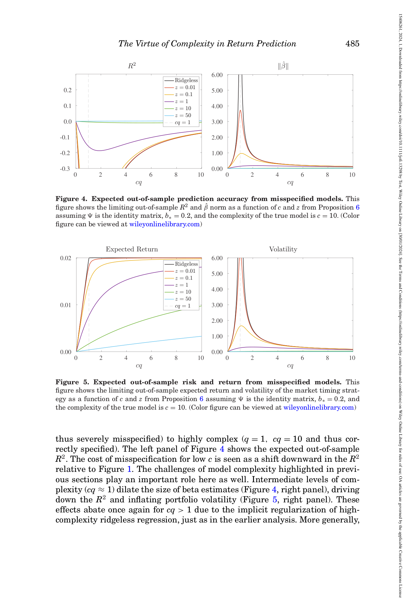

# 06. 이론을 그래프로 — Figures 1-6 시각적 풀이

## 📌 이 챕터 다 읽으면 알 수 있는 것

- 본 논문의 시뮬레이션 setup
- **Figures 1-6** 의 정밀 풀이
- 이론과 시뮬의 일치 검증

---

> 본 논문이 *이론 시뮬* 로 그린 6 개 그래프 를 무지식자 친화로. 각 figure 의 *직관* 위주, 수식 없이.

---

## 6.1 챕터 한 줄 요약

> **"6 개 그래프 가 본 논문 이론을 *눈으로 확인*. *Correctly specified* (Fig 1-3) 에서는 SR 가 c=1 부근 dip. *Misspecified* (Fig 4-6) 에서는 SR 가 *단조 증가* (Theorem 1 의 시각화). 이 두 행동의 차이가 본 논문의 *핵심 메시지*."**

---

## 6.2 공통 설정 — 무엇이 *기준*?

본 논문의 모든 figure 가 같은 *calibration* (가상 데이터):

| 변수 | 값 | 의미 |
|------|-----|------|
| $\Psi$ | $I$ (identity 행렬) | 모든 변수 *균등 분포*, no covariance 구조 |
| $b_*$ | $0.2$ | 진짜 함수의 *signal scale* (작음) |
| $\sigma^2$ | $1$ | 잡음 분산 (normalize) |

이 calibration 의 *기준점* (infeasible 신의 Sharpe):

> **신의 Sharpe ratio ≈ 0.354** (이상적 최대).

모든 그래프의 *빨간 점선* 이 이 값. 학자의 모든 선이 *이 점선 아래*.

---

## 6.3 Figure 1 — *이상적 환경* 의 R²


*paper p.476 Figure 1 — Left: R² vs c. Right: ‖β̂‖.*

### 어떻게 읽나? (Step-by-step)

**Step 1 — 그래프 구조 파악**

이 그림은 *두 panel* (왼쪽 + 오른쪽). 각 panel 은 *6개의 곡선* 이 같은 axes 위에 그려짐.

**Step 2 — Left panel 의 축 의미**

- **X-axis (가로)**: $c = P/T$ = "모델 복잡도". $c = 0$ (왼쪽 끝) = 데이터 무한히 많음. $c = 10$ (오른쪽 끝) = 변수가 데이터의 10배.
- **Y-axis (세로)**: OOS R² (out-of-sample 예측 정확도). Range $[-0.3, 0.3]$. **+0.3 = 매우 정확, 0 = 평균 정도, -0.3 = 평균보다 나쁨**. *y < 0 = 모델 망함*.

**Step 3 — 6개 곡선 의 의미** (각 색)

- **검정** (Ridgeless): $z \approx 0$ — *안정장치 없음*.
- **노랑** ($z = 0.01$): 매우 약한 ridge.
- **빨강** ($z = 0.1$): 약한 ridge.
- **보라** ($z = 1$): 중간 ridge.
- **하늘색** ($z = 10$): 강한 ridge.
- **연두** ($z = 50$): 매우 강한 ridge.

**빨간 점선** (`True`): Infeasible upper bound = 0.167 (신의 R²). *모든 선이 이 점선 아래여야* 함.

**Step 4 — 어떻게 읽나? (왼쪽 → 오른쪽 순서)**

1. **$c = 0$ 근처** (그래프 가장 왼쪽): 모든 선이 *빨간 점선 (0.167) 근처*. 즉 *데이터 무한대면 모든 모델이 infeasible 에 가까움*.
2. **$c = 0.1 \sim 0.8$**: 검정 선이 점차 *떨어짐* (위에서 아래로). 다른 선들은 *비슷한 수준 유지* (z > 0 이 안정).
3. **$c = 1$ 근처 (★ 가장 중요한 지점)**: 검정 선이 *수직으로 떨어짐* — *Y축 -0.3 아래로 사라짐* (실제는 -∞ 발산). 이게 **catastrophe** — interpolation boundary.
4. **$c = 1.5 \sim 3$**: 검정 선이 *다시 올라옴* — $c > 1$ ridgeless 의 *implicit regularization* 작동.
5. **$c = 5 \sim 10$**: 모든 선이 *대체로 0 근처* — 충분히 큰 c 에서 모든 모델이 *infeasible 보다 약간 손실* 정도.

**Step 5 — 주목할 패턴 3가지**

1. **$c = 1$ 부근 catastrophe** (검정 선) — *interpolation boundary* 의 끔찍한 결과.
2. **$c > 1$ 회복** (검정 선) — 통상 직관 ("$c > 1$ → 망함") 반박. **Benign overfit**.
3. **Ridge 가 catastrophe 완화** (보라 / 하늘 선) — 적당한 $z$ 가 *interpolation boundary 통과* 안전.

### Right panel — ‖β̂‖ (계수 크기)

**축 의미**:
- X-axis: 같은 c.
- Y-axis: 학자가 *추정한 계수의 크기* (norm). Range $[0, 6]$.

**Step 6 — 어떻게 읽나?**

1. **$c = 0$ 근처**: 모든 선 *낮은 위치* (norm ≈ 1). 정상.
2. **$c = 1$ 부근**: **검정 선 (ridgeless) 가 6 까지 *spike***. 계수가 *비정상적으로 커짐* — 폭발.
3. **$c > 1$**: 검정 선 norm 다시 감소. ridgeless 의 *smallest norm property*.
4. **다른 ridge 선들**: $c = 1$ 부근 spike *완화* (작게 0-2 사이).

**연결**: Left panel 의 *R² catastrophe* = Right panel 의 *norm spike* — 같은 현상의 두 측면. *계수 폭발 → forecast 폭발 → R² → -∞*.

### 핵심 메시지

> **"$c = 1$ 부근 = ridgeless 의 catastrophe. Ridge 가 이걸 막아주는 *안정장치*. $c > 1$ 에서 ridgeless 가 다시 회복하는 게 benign overfit."**

```viz:voc-r2-curve:title=Figure 1 — R² (interactive),caption=c 슬라이더 + z 슬라이더. ridgeless 의 c=1 catastrophe + c>1 회복. 적절한 z 가 catastrophe 완화. infeasible 빨간 점선이 reference.
```

```viz:voc-r2-curve:title=Figure 1 — R² (interactive),caption=c 슬라이더 + z 슬라이더. ridgeless 의 c=1 catastrophe + c>1 회복. 적절한 z 가 catastrophe 완화. infeasible 빨간 점선이 reference.
```

---

## 6.4 Figure 2 — *이상적 환경* 의 기대 수익 + 변동성


*paper p.478 Figure 2.*

### 어떻게 읽나? (Step-by-step)

**Step 1 — 두 panel 구조**

이 그림은 *두 panel* (Expected Return + Volatility). 같은 *6 색* 곡선 + *infeasible 점선*.

**Step 2 — Left panel 의 축 의미**

- **X-axis**: $c = P/T$.
- **Y-axis**: Expected return $\mathcal{E}(z; c)$. Range $[0, 0.20]$. **0.2 = 신 (infeasible) 의 기대 수익**.

**Step 3 — Left panel 읽는 방법**

1. **$c = 0$ 근처**: 모든 선이 *0.2 근처* (infeasible 와 같음).
2. **$c < 1$, 검정 선**: 거의 *constant 0.2* (수평). 즉 *ridgeless 의 기대 수익이 c 와 무관*. 이게 *OLS 의 unbiasedness*.
3. **$c < 1$, ridge 선들**: 점차 *감소*. Ridge 가 *bias 도입* — 기대 수익 손실.
4. **$c = 1$ 부근**: 모든 선이 *complex 행동*. 검정은 spike 없음 (변동성은 spike).
5. **$c > 1$**: 모든 선이 *감소*. Ridgeless 도 *implicit shrinkage* 로 기대 수익 감소.

**주목할 패턴**: 
- **검정 선의 $c < 1$ flat 0.2** = ridgeless 의 *기대 수익 perfect*.
- **다른 ridge 선의 감소** = *bias cost*.

### Right panel — Volatility (변동성)

**축 의미**:
- X-axis: 같은 c.
- Y-axis: timing 전략의 *변동성 (표준편차)*. Range $[0, 6]$.

**Step 4 — 어떻게 읽나?**

1. **$c < 0.5$**: 모든 선 *낮음* (변동성 1-2). 정상.
2. **$c = 1$ 부근**: **검정 선이 6 까지 spike** — *변동성 폭발*.
3. **$c > 1$**: 검정 선 *감소*. Ridgeless 의 implicit regularization 효과.
4. **Ridge 선들**: 모든 c 에서 *낮은 변동성* (특히 $z = 10$ 가 가장 낮음).

**주목할 패턴**:
- **$c = 1$ 검정 선 spike** = *catastrophe* 의 두 번째 측면 (Figure 1 의 R² 발산 + Figure 2 의 vol spike).

### 핵심 통찰 — Figure 1 + Figure 2 결합

> **"$c = 1$ 부근 *ridgeless 의 두 가지 문제*: (i) R² 음의 발산 (Figure 1 left), (ii) 변동성 spike (Figure 2 right). 두 문제 모두 *Sharpe ratio = E/Vol* 를 *영향*: 분자 (기대 수익) 유지, 분모 (변동성) 폭발 → Sharpe ratio = $0.2/6 \approx 0.03$ — 거의 0."**

다음 Figure 3 가 이 결합 결과를 보여줌.

---

## 6.5 Figure 3 — *이상적 환경* 의 Sharpe ratio ★


*paper p.479 Figure 3 — 이 챕터의 *가장 중요한* 그림.*

### 어떻게 읽나? (Step-by-step)

**Step 1 — 그래프 구조**

이건 *단일 panel*. 6개 색 + 빨간 점선.

**Step 2 — 축 의미**

- **X-axis**: $c = P/T$. Range $[0, 10]$.
- **Y-axis**: **Sharpe ratio**. Range $[0, 0.4]$. **0.354 (빨간 점선) = infeasible 신의 Sharpe**.

**Step 3 — 어떻게 읽나? (왼쪽 → 오른쪽)**

1. **$c = 0$ 근처**: 모든 선 *infeasible 점선 (0.354) 근처* — 신과 같음.
2. **$c = 0.1 \sim 0.7$**: 검정 (ridgeless) 가 *점차 감소* (0.354 → 약 0.20). 다른 선들은 *덜 감소* 또는 *비슷 유지*.
3. **$c = 0.8 \sim 1.2$ (★ 가장 중요한 영역)**: 모든 선 *최저점 도달*. 검정 선 = *0.02 까지 떨어짐* (거의 0). 그러나 *양수 유지* — 즉 *망하진 않음*.
4. **$c = 1.5 \sim 3$**: 모든 선 *점차 회복*. 검정 선이 *0.05 정도로 stabilize*.
5. **$c = 5 \sim 10$**: 모든 선 *거의 비슷한 수준* (0.04 ~ 0.10).

**Step 4 — 4가지 핵심 발견**

#### 발견 1 — *모든 c 에서 모든 선 > 0*

가장 *놀라운* 결과. *Ridgeless* (검정) 라도 *어떤 c 에서도* SR > 0. 

**일상 비유**: 학자의 timing 전략이 *어디서도 시장 buy-and-hold 보다 나쁘진 않음*. *최소한 *동등 또는 약간 향상*.

→ **통상 직관 ("변수 > 데이터 → 망함") 의 정면 반박**.

#### 발견 2 — $c = 1$ 부근 dip

모든 선의 SR 최저점이 $c = 1$ 부근. 검정 선이 *가장 깊이 dip*.

**일상 비유**: 학자가 *interpolation boundary 근처* (변수 ≈ 데이터) 에서 timing 하면 *근거 약한 결과* — 망하진 않음, but 가장 *약함*.

#### 발견 3 — Ridge 가 ridgeless 보다 우월

$z = 1$ 같은 *적당한 ridge* (보라 선) 가 *모든 c* 에서 *검정 (ridgeless) 위*.

**일상 비유**: 학자가 *항상 안정장치 추가* 하면 *항상 좋다*.

→ **본 논문 권장**: *적당한 ridge 항상 사용*.

#### 발견 4 — 비대칭 회복 + benign overfit

$c > 1$ 에서 검정 선이 *영원히 양수 유지* + *대체로 0.05 근처에서 stabilize*. *변수 무한대로 늘려도* SR > 0.

**일상 비유**: *변수 12,000개 + 데이터 12* 같은 *극단적 high-dimensional* 환경에서도 ridgeless 가 *작동*.

### 핵심 메시지 + R² 와의 관계

**Figure 1 + 3 결합**:
- $c = 1$ 부근: Figure 1 의 R² = $-\infty$ (catastrophe), Figure 3 의 SR ≈ 0 (dip).
- $c > 5$: Figure 1 의 R² ≈ 0, Figure 3 의 SR ≈ 0.05 (양수).

> **"R² 가 *음수 ($-100\%$ 이하)* 임에도 SR > 0 가능 — 즉 *경제 가치 와 통계 정확도 의 분리*."**

이게 본 논문의 *가장 강력한 메시지* 중 하나.

```viz:voc-sharpe-curve:title=Figure 3 — Sharpe ratio (interactive),caption=c 슬라이더 + z 슬라이더. 모든 c 에서 ridgeless SR > 0 (R² 음수 임에도). c=1 dip 그러나 양수 유지. z=1 가장 robust.
```

```viz:voc-sharpe-curve:title=Figure 3 — Sharpe ratio (interactive),caption=c 슬라이더 + z 슬라이더. 모든 c 에서 ridgeless SR > 0 (R² 음수 임에도). c=1 dip 그러나 양수 유지. z=1 가장 robust.
```

---

## 6.6 *Correctly* vs *Misspecified* — 패러다임 전환

이제 *misspecified* 결과 (Figure 4-6) 로 가는데, 그 전에 *왜 misspecified 분석이 필요* 한지.

### Correctly specified — 비현실의 baseline

지금까지 본 Figure 1-3 는 모두 *학자의 model = 진짜 자연* 의 가정. 즉 *이상적*.

**현실**: 학자가 *진짜 자연 전체* 를 capture 못 함. *부족한 모델*.

### Misspecified — 현실

학자가 *진짜 자연의 일부* (예: 15개 macro 변수) 만 사용. 자연이 *훨씬 더 많은 변수* 에 의존한다면 *학자 모델 ≠ 자연*.

### 새 변수 — q (학자/자연 비율)

- $q = 1$: 학자 = 자연 (correctly specified).
- $q < 1$: 학자 < 자연 (misspecified).

본 논문 misspecified Figure 의 calibration: *true c = 10*, *학자의 cq* 가 [0, 10] 범위 sweep.

---

## 6.7 Figure 4 — *현실 환경* 의 R²



*paper p.485 Figure 4 — Left: R². Right: ‖β̂‖.*

### 어떻게 읽나? (Step-by-step)

**Step 1 — Setup**

이 그림은 *Figure 1 의 misspecified 버전*. Same 6 색 + 빨간 점선 + 2 panel.

**Step 2 — 축 의미**

- **X-axis**: **$cq$** (학자 모델의 *empirical 복잡도*, not c). True DGP $c = 10$ 고정.
- **Y-axis (Left)**: OOS R². Range $[-0.3, 0.2]$.
- **Y-axis (Right)**: $\|\hat\beta\|$ norm.

**Step 3 — Figure 1 과 비교 (가장 빠르게 의미 파악)**

- *전체 모양 비슷*: $cq = 1$ catastrophe + $cq > 1$ 회복.
- **결정적 차이**: Simple $cq$ 영역의 R² 가 *Figure 1 보다 약 50% 더 낮음* — **approximation gap** (학자가 진짜 자연의 *일부만* capture 해서 손실).

**Step 4 — 핵심 발견**

1. **$cq = 0.1$**: Figure 1 의 약 0.16 대비 *0.05 정도* — *misspecification cost*.
2. **$cq \to 10$ (= q = 1 = correctly specified)**: Figure 1 의 $c = 10$ 과 같은 수준 — *cost 사라짐*.
3. **$cq = 1$ catastrophe**: Figure 1 과 동일.

**메시지**: 학자가 *진짜 자연의 일부* 만 보면 *예측 정확도 손실*. 이게 *misspecified cost*. 그러나 *cq 늘리면 cost 줄어듦*.

---

## 6.8 Figure 5 — *현실 환경* 의 기대 수익 + 변동성


*paper p.485 Figure 5.*

### 어떻게 읽나? (Step-by-step)

**Step 1 — Setup**

Figure 2 (correctly specified) 의 *misspecified 버전*. 같은 2 panel + 6 색.

**Step 2 — Left panel — Expected return (★ Figure 2 와 가장 큰 차이)**

- **X-axis**: $cq$. **Y-axis**: $\mathcal{E}$. Range $[0, 0.025]$.
- **결정적 차이 (vs Figure 2)**:
  - Figure 2: ridgeless 의 E *c < 1 에서 constant 0.2*.
  - Figure 5: ridgeless 의 E *cq 의 monotone increasing*!

**Step 3 — Left panel 어떻게 읽나?**

1. **$cq = 0.1$**: 모든 선 *0 근처* (학자가 변수 적음).
2. **$cq = 0.5$**: 검정 선 *0.01 까지 상승*.
3. **$cq = 1$**: 검정 선 *0.02 peak*.
4. **$cq > 1$**: 검정 선 *flat 0.02 유지* (Eq 19 의 식 $b_*\psi_{*,1} \min\{q, c^{-1}\}$ 의 정확한 패턴).

**Step 4 — 가장 강력한 발견**

**기대 수익이 *cq 의 monotone increasing*** — Figure 2 (correctly specified) 의 *constant* 와 정반대.

→ 이게 **misspecified case 의 핵심**: *학자가 더 많은 변수 사용할수록 기대 수익 단조 증가*.

### Right panel — Volatility

Figure 2 와 유사: $cq = 1$ spike + 회복. *변동성 행동* 은 misspecification 무관.

**메시지**: *Figure 5 left panel 이 Theorem 1 의 *경제적* 의미*. Expected return 단조 증가 → Sharpe ratio 단조 증가 (Figure 6).

---

## 6.9 Figure 6 — Theorem 1 의 시각적 statement ★★


*paper p.486 Figure 6 — **본 논문 의 가장 중요한 그림**. Deep dive 의 *preview viz* 도 이 figure 의 interactive 버전.*

### 어떻게 읽나? (Step-by-step) — *가장 중요한 그림*

**Step 1 — 그래프 구조**

이건 *단일 panel*. **모든 곡선이 *위로 올라간다*** 가 핵심 패턴.

**Step 2 — 축 의미**

- **X-axis**: $cq$ = 학자 모델 의 *empirical 복잡도*. Range $[0, 10]$. 
  - $cq = 0$: 학자가 *변수 거의 못 봄* (가장 simple model).
  - $cq = 10$: 학자가 *진짜 자연의 모든 변수* 봄 (correctly specified).
- **Y-axis**: **Sharpe ratio**. Range $[0, 0.06]$. *위쪽 = timing 잘함*.
- **Calibration**: True DGP complexity $c = 10$ 고정.

**Step 3 — 6개 곡선 의 의미**

같은 색상 코드 (Figure 1 과 동일):
- 검정 (Ridgeless), 노랑·빨강·보라·하늘·연두 = $z = 10^{-3}, 10^{-2}, 10^{-1}, 1, 10, 50$.

**Step 4 — 어떻게 읽나? (왼쪽 → 오른쪽)**

1. **$cq = 0$ 근처** (가장 왼쪽): 모든 선 *0 근처* (학자가 변수 거의 못 보니 timing 안 됨).
2. **$cq = 0.1 \sim 0.9$**: 모든 선이 *점차 위로 상승*. *Approximation gain* 의 직접 시각화.
3. **$cq = 1$ 근처** (★ 주목 지점): 검정 선이 *약한 dip*. 다른 선들은 *부드러운 증가*.
4. **$cq = 1.5 \sim 5$**: 모든 선이 *계속 상승*. 점차 *기울기 둔화* (concave 성질).
5. **$cq = 10$ (correctly specified)**: 모든 선이 *최고점 도달* (SR ≈ 0.05).

**Step 5 — 4가지 핵심 발견 (이 그림의 모든 의미)**

#### ★ 발견 1 — *모든* 곡선 monotone 증가

검정 (ridgeless) 부터 $z = 50$ 까지 *모두* — *cq 의 함수로 단조 증가*. 

→ **이게 Theorem 1 의 시각적 statement**: *복잡함이 미덕*.

#### 발견 2 — Ridgeless 의 *double ascent*

검정 선만 *$cq = 1$ 부근 약한 dip*. 그러나 *dip 후 다시 증가*. 즉:
- $cq < 1$: 증가.
- $cq = 1$ 근처: 약한 감소 (dip).
- $cq > 1$: 다시 증가.

이게 **double ascent** — *증가-dip-증가*.

#### 발견 3 — *Permanent ascent* ($z > 0$)

보라/하늘/연두 선 (z ≥ 1): *dip 없이 부드러운 monotone 증가* — **Permanent ascent**.

→ **Theorem 1 의 정확한 statement**: *적절한 ridge 면 dip 사라지고 부드럽게 단조 증가*.

#### 발견 4 — Concavity (기울기 둔화)

모든 선이 *왼쪽에서 가파르게 상승*, *오른쪽으로 갈수록 기울기 감소*. **Concave** — *추가 변수의 효과 점차 감소*. Diminishing returns to complexity.

### 일상 비유 — 학생 시험 점수

학생이 *공부 시간 vs 시험 점수*. 

- *공부 1시간*: 점수 거의 0 (못 배움).
- *공부 5시간*: 점수 60.
- *공부 10시간*: 점수 75.
- *공부 20시간*: 점수 85.

→ 공부 시간 늘릴수록 *점수 단조 증가*, but *추가 효과 점차 감소* (concave).

본 논문 비유: 학자가 *변수 수 늘릴수록 timing 단조 좋아지지만 추가 효과 점차 감소*. **Theorem 1 의 *기울기 둔화* 의 의미**.

### 의미 — *Use the largest model you can compute*

이 그림이 본 논문 결론의 *수학적 명령*:

> **"학자는 계산 가능한 가장 큰 모델을 사용해야 한다. 더 많이 일수록 SR 더 좋다 (단, 적절한 ridge 와 함께)."**

이게 *자산가격결정 분야의 새 권장 사항*.

```viz:voc-misspec-monotone:title=Figure 6 — Theorem 1 (Virtue of Complexity) (interactive),caption=★ 본 논문의 가장 중요한 시각화. cq 슬라이더 + z 슬라이더. 모든 z 에서 SR monotone increasing — Theorem 1. Ridgeless 의 cq=1 dip (double ascent), z > 0 에서 smooth (permanent ascent).
```

→ **이 viz 가 본 deep dive 의 preview** (LANDING 페이지의 preview).

```viz:voc-misspec-monotone:title=Figure 6 — Theorem 1 (Virtue of Complexity) (interactive),caption=★ 본 논문의 가장 중요한 시각화. cq 슬라이더 + z 슬라이더. 모든 z 에서 SR monotone increasing — Theorem 1. Ridgeless 의 cq=1 dip (double ascent), z > 0 에서 smooth (permanent ascent).
```

→ **이 viz 가 본 deep dive 의 preview** (LANDING 페이지의 preview).

---

## 6.10 정리 — Correctly vs Misspecified 한 표

| 항목 | Correctly Specified | Misspecified |
|------|--------------------|--------------|
| **R² (vs c or cq)** | catastrophe at c=1 + 회복 | 같은 패턴 + approximation gap |
| **기대 수익 (vs c or cq)** | ridgeless c<1 constant | **monotone increasing** ★ |
| **Sharpe ratio (vs c or cq)** | c=1 dip 후 회복 | **monotone increasing (Theorem 1)** ★ |
| **Optimal $z_*$** | $c/b_*$ — R² 와 SR 동시 최적 | $c(1+b_*(\psi(1-q)))/b_*$ |
| **Implication** | simple model 도 OK | **complex model better** |

---

## 6.11 본 챕터의 *visual 흐름*

```
   Figure 1 (R²)            →   c=1 catastrophe + 회복
        ↓
   Figure 2 (E + Vol)       →   ridgeless E constant c<1
        ↓
   Figure 3 (SR)            →   모든 c 에서 SR > 0, c=1 dip
        ↓
        |
   [Correctly Specified ↑]
   ─────────────────────────────────────────────
   [Misspecified ↓]
        |
        ↓
   Figure 4 (R²)            →   Figure 1 + approximation gap
        ↓
   Figure 5 (E + Vol)       →   ★ E monotone increasing
        ↓
   Figure 6 (SR)            →   ★★ Theorem 1 visualization
                                 monotone increasing (Permanent ascent)
```

---

## 6.12 *실증과의 mapping* — 미리보기

Figure 1-6 가 *이론* 시뮬. 그러나 본 논문 Section V (Chapter 07) 의 *실증* 이 정확히 같은 패턴을 *CRSP 1926-2020 + RFF* 로 보임:

- **Figure 7** (실증, T=12) = Figure 4 의 empirical version.
- **Figure 8** (실증, Sharpe) = Figure 6 의 empirical version — *monotone increasing in c*.

저자 표현: **"Extraordinary agreement between empirical patterns and our theoretical predictions"** (놀라울 정도의 이론↔실증 일치).

다음 챕터 [07_empirical](07_empirical.md) 가 이 *실증* 부분.

---

## 6.13 자기점검

### 핵심 3가지
1. **Figure 1 (correctly) 와 Figure 4 (misspecified) 의 가장 큰 차이?**
2. **Figure 3 의 *놀라운* 발견?**
3. **Figure 6 의 의미 — 본 논문 main statement?**

### 답변
1. **R²**의 전체 모양 (c=1 catastrophe + 회복) 은 양쪽 비슷. **결정적 차이는 *기대 수익***: Figure 2 (correctly) 에서는 ridgeless 기대 수익이 *c < 1 에서 constant* (no decrease), Figure 5 (misspecified) 에서는 *cq 의 monotone increasing* — *복잡할수록 기대 수익 증가*. 이게 *misspecified 환경의 본질적 차이*.
2. **Ridgeless (검정) 의 Sharpe ratio 가 *모든 c 에서 양수***. 즉 통상 직관 "변수 > 데이터 → overfit → 망함" 의 정면 반박. R² 가 *마이너스 100% 이하* 인 영역 (Figure 1) 에서도 Sharpe > 0 — *R² 와 Sharpe 의 분리*. 또한 *Ridge z > 0 가 모든 c 에서 ridgeless 보다 우월*.
3. **모든 z 에서 Sharpe ratio 가 cq 의 monotone increasing** — Theorem 1 의 시각적 statement. Ridgeless 에서 *cq = 1 근처 약한 dip (double ascent)*, $z > 0$ 에서 *smooth monotone (permanent ascent)*. 의미: *Use the largest model you can compute* + *적절한 ridge 사용*. 이게 본 논문 의 *Use the largest model* 권장의 *수학적 근거*.

---

다음 챕터: [07_empirical.md](07_empirical.md) — 실제 미국 시장 1926-2020 결과 — *가장 흥미로운* 챕터.
