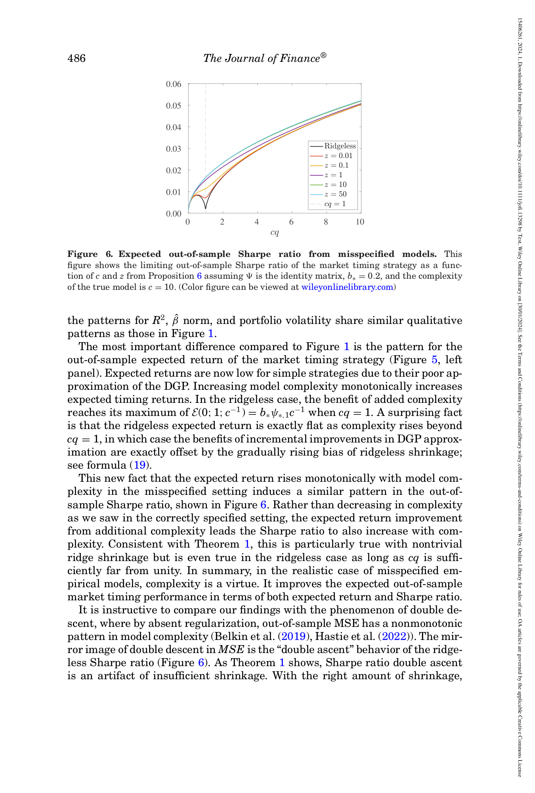

# 06. 이론 시뮬레이션 — Figures 1–6 calibrated VoC curves

> 논문 Section III/IV 의 Figures 1–6 가 모두 같은 calibration 하에 그려짐. $\Psi = I$ (identity), $b_* = 0.2$, $\sigma^2 = 1$, $c = 10$ (Figures 4-6). 이 챕터는 그 시뮬을 한 곳에 모아 deep dive 의 viz 카탈로그와 연결.

---

## 6.1 챕터 한 줄 요약

**같은 calibration ($\Psi = I, b_* = 0.2$) 하에 Figures 1-3 (correctly specified) 과 Figures 4-6 (misspecified, $c = 10$) 의 VoC curves 를 비교. 두 setting 모두 ridgeless $c = 1$ 부근에서 R² 발산 + Sharpe dip. 그러나 misspecified 에서는 Sharpe 가 단조 증가 (Theorem 1) — 이게 본 논문 모든 후속 실증의 이론적 backdrop.**

---

## 6.2 Calibration setup

**공통 parameters**:

| 기호 | 값 | 의미 |
|------|-----|------|
| $\Psi$ | $I$ (identity) | 가장 단순한 covariance (eigenvalue 모두 1) |
| $b_*$ | $0.2$ | $\beta$ scale, $\|\beta\|^2/P = 0.2$ |
| $\sigma^2$ | $1$ | noise variance (normalization) |
| $\psi_{*,1}$ | $1$ | $\Psi$ 의 first moment ($\text{tr}(I)/P = 1$) |
| $b_* \psi_{*,1}$ | $0.2$ | predictive power composite |

**Infeasible benchmark** (Proposition 1):
- Untimed asset SR = 0 (normalization).
- $E[\pi R] = b_* \psi_{*,1} = 0.2$.
- $E[(\pi R)^2] = 3 \cdot 0.04 + 0.2 = 0.32$.
- $SR_\infty = 1/\sqrt{3 + 1/0.2} = 1/\sqrt{8} \approx 0.354$.
- $R^2_\infty = 0.2 / 1.2 \approx 0.167$.

→ 이 값들이 모든 그래프의 reference (점선).

---

## 6.3 Figure 1 — Correctly specified R² + ‖β‖


*원문 p.476 Figure 1 — Correctly specified case. Left: $R^2$ vs $c \in [0, 10]$ for $\log_{10}(z) \in \{-2, -1, 0, 1, 1.7\}$ + ridgeless (black). Right: $\|\hat\beta\|$ vs $c$. infeasible $R^2(0;0) = 0.167$ red dashed.*

**Left panel (R²)**:
- Ridgeless (black): $c < 1$ 부드러운 감소; $c = 1$ 양쪽에서 $-\infty$ 발산; $c > 1$ 회복.
- $z = 0.01$: ridgeless 와 거의 동일 (작은 shrinkage 효과).
- $z = 0.1, 1$: $c = 1$ 발산 완화, 그러나 c < 1 에서 약간 손실.
- $z = 10$: 거의 모든 $c$ 에서 $R^2 \approx 0$ (heavy shrinkage 의 bias).
- $z = 50$: $R^2$ 거의 0 (over-shrunk).

**Right panel (‖β̂‖)**:
- Ridgeless 가 $c = 1$ 에서 약 6 까지 spike.
- $z$ 클수록 $\|\hat\beta\|$ 작음 (shrinkage).
- $c > 1$ 에서 ridgeless 의 $\|\hat\beta\|$ 가 0 쪽으로 떨어짐 (smallest-norm).

```viz:voc-r2-curve:title=Figure 1 — Correctly specified R² (interactive),caption=c 슬라이더로 complexity 변화, z 슬라이더로 ridge shrinkage. b_* 슬라이더로 signal-to-noise. 모든 z 에서 c=1 발산 + 회복 패턴. 적절한 z_* = c/b_* 가 max R².
```

---

## 6.4 Figure 2 — Correctly specified Expected Return + Volatility

*Figure 2 (p.478) — Left: Expected return $\mathcal{E}(z; c)$. Right: Volatility $\sqrt{\mathcal{V}(z; c)}$. Calibration 동일.*

**Left panel (Expected return)**:
- Ridgeless: $c < 1$ 에서 $\mathcal{E} = 0.2$ (constant, infeasible 동일). $c > 1$ 에서 감소.
- $z > 0$: $\mathcal{E}$ 감소 (heavier shrinkage → smaller expected return). Monotone decreasing in $z$ (Proposition 4 (i)).
- $z = 50$: $\mathcal{E} \approx 0$.

**Right panel (Volatility)**:
- Ridgeless: $c = 1$ 부근 spike (~6+).
- $z = 1$: volatility 가 infeasible 보다도 낮음 (excessive shrinkage → too conservative).
- 모든 $z, c$ 에서 volatility ↑ as $c$ ↑ (forecast variance 증가).

---

## 6.5 Figure 3 — Correctly specified Sharpe Ratio


*원문 p.479 Figure 3 — Sharpe ratio vs $c$ for various $z$. 모든 $c$ 에서 ridgeless SR > 0. $c = 1$ dip but 양수. $z = 1$ 최고 SR ~0.35 c < 0.5 영역. ridgeless 도 $c$ 크면 0.04 수준 SR 유지.*

**핵심 관찰**:
- Ridgeless SR > 0 **everywhere** — 통념과 충돌.
- $c = 1$ 에서 SR 가 가장 낮지만 여전히 양수.
- $z > 0$ ridge 가 ridgeless 보다 잘함 (특히 $c \approx 1$).
- $z_*$ 가 SR 도 최적화 (correctly specified 의 우연한 일치).

```viz:voc-sharpe-curve:title=Figure 3 — Correctly specified Sharpe ratio (interactive),caption=c 슬라이더 + z 슬라이더. 모든 c 에서 ridgeless SR > 0 (negative R² 임에도). z 가 너무 크면 (50) SR 감소. z_* = c/b_* 에서 max SR.
```

---

## 6.6 Figures 4–6 — Misspecified VoC

**Setup 추가**: 
- True DGP complexity $c = 10$ (고정).
- Empirical model 의 complexity $cq \in [0, 10]$ (x-axis).
- $q$ 가 0 → 1 로 갈수록 misspecification 감소.
- $q = 1/c = 0.1$ 에서 empirical complexity $cq = 1$ (interpolation boundary).

### Figure 4 (p.485) — R²

*원문 Figure 4 — Misspecified $R^2$ vs $cq$. Same calibration but $c = 10$. Patterns 와 magnitudes 가 Fig 1 과 유사하지만 simple model 의 $R^2$ 가 더 낮음 (approximation gap).*

**핵심 차이** (vs Figure 1):
- *Simple $cq$* 영역: misspecified 의 $R^2$ 가 correctly specified 보다 더 낮음 (approximation gap).
- *$cq = 1$*: 동일하게 발산.
- *Large $cq$*: 비슷한 회복.

### Figure 5 (p.485) — Expected Return + Volatility

*원문 Figure 5 — Left: $\mathcal{E}(z; cq; q)$ vs $cq$. Right: Volatility vs $cq$. **Left panel 이 가장 큰 차이** — Expected return 이 monotone increasing in $cq$.*

**Left panel (가장 중요)**:
- Simple $cq$ 영역: $\mathcal{E}$ 가 매우 낮음 (approximation 안 됨).
- $cq$ 증가 → $\mathcal{E}$ **monotone increasing**.
- Ridgeless: $cq = 1$ 에서 $\mathcal{E}$ peak ($b_* \psi_{*,1} c^{-1} = 0.02$), 그 이후 **flat** (Equation 19).
- Ridge $z > 0$: $\mathcal{E}$ 가 $cq$ 의 monotone increasing, 더 천천히.

**Right panel (Volatility)**:
- Fig 2 와 유사: $cq = 1$ spike.
- $z > 0$ 으로 mitigate.

### Figure 6 (p.486) — Sharpe Ratio (★ 본 논문 핵심)



*원문 p.486 Figure 6 — Misspecified $SR$ vs $cq$. **모든 $z$ 에서 SR monotone increasing in $cq$** (Theorem 1 의 시각화). Ridgeless 에서 $cq = 1$ 약한 dip 있지만 단조 증가. $z = 1, 10, 50$ 에서 smooth monotone (permanent ascent).*

**핵심 관찰** (Theorem 1):
- **모든 $z$**: SR 가 $cq$ 의 monotone increasing.
- Ridgeless ($z = 0$): $cq = 1$ 부근 약한 dip — *double ascent*.
- $z > 0$: dip 사라짐 — *permanent ascent*.
- $cq \to 10$ (q=1, correctly specified) 에서 SR ≈ 0.05.

```viz:voc-misspec-monotone:title=Figure 6 — Theorem 1 (Virtue of Complexity) (interactive),caption=cq 슬라이더로 empirical complexity 변화, z 슬라이더로 shrinkage. 모든 z 에서 SR monotone increasing (Theorem 1). Ridgeless 에서 cq=1 dip (double ascent), z>0 에서 smooth (permanent ascent). 본 논문 핵심 그림.
```

→ **이 viz 가 본 deep dive 의 preview viz** (deep.html LANDING 의 preview).

---

## 6.7 Correctly specified vs Misspecified 비교

```
                  Correctly Specified                   Misspecified
                  ────────────────                       ────────────

  R²    ridgeless ↘ (c < 1)                          모두 ↘ then ↗
              divergence at c = 1                     similar (slightly worse)
              ridgeless ↗ (c > 1, benign overfit)         
                                                                
  E[R^π]  ridgeless constant (c < 1)                  monotone ↗ in cq ★
              decreases (c > 1)                       (Eq 19: min{q, 1/c})
                                                                
  Vol     ridgeless ↗ in c                             similar spike at cq = 1
              spike at c = 1                          (similar magnitudes)
                                                                
  SR    ridgeless dip at c = 1                        ★ monotone ↗ in cq (Theorem 1)
              z_* maximizes                           "permanent ascent" with z_*
              (declining or flat trend)                "use the largest model"
```

---

## 6.8 시뮬레이션의 메시지 (3가지)

### (1) Identification 의 직접 검증

같은 framework 하에서 correctly specified 와 misspecified 의 결정적 차이를 보임:
- Correctly specified: simple > complex (simple model 이 충분).
- Misspecified: **complex > simple** (approximation gain 우세).

### (2) Ridge 의 universal benefit

모든 setting 에서 $z > 0$ 이 $z = 0$ 보다 SR 면에서 일관되게 우월:
- Bias 도입 < variance 감소 효과.
- Optimal $z_*$ exists, $c$ 의 함수.

### (3) Sharpe ratio decoupled from R²

- R² 가 매우 음수 (-100% 이하) 인 영역에서도 SR > 0.
- Campbell-Thompson mapping 의 limitation 입증.

---

## 6.9 실증과의 mapping

Figures 7-11 (Section V, [07_empirical.md](07_empirical.md)) 이 정확히 같은 패턴을 CRSP 데이터 + RFF 로 보여줌:
- Figure 7 (T=12) 이 Figure 4 의 empirical version.
- Figure 8 의 Sharpe Panel A 가 Figure 6 의 empirical version — **monotone increasing in $c$**.

→ 이론과 실증의 **extraordinary agreement** (저자 표현).

---

## 자기점검 (이 챕터)

### 핵심 3가지
1. **$\Psi = I$, $b_* = 0.2$ calibration 의 infeasible benchmark 값?**
2. **Figure 1 (correctly) vs Figure 4 (misspecified) 의 가장 큰 차이?**
3. **Figure 6 의 "double ascent" vs "permanent ascent" 의 구분?**

### 답변
1. $b_* \psi_{*,1} = 0.2$. Infeasible expected return $\mathcal{E}_\infty = 0.2$. Infeasible second moment $\mathcal{V}_\infty = 3(0.2)^2 + 0.2 = 0.32$. **Infeasible Sharpe ratio $SR_\infty = 1/\sqrt{3 + 1/0.2} = 1/\sqrt{8} \approx 0.354$**. Infeasible $R^2 = 0.2/1.2 \approx 0.167$. 모든 Figure 의 red dashed reference.
2. Figure 4 (misspecified) 의 $R^2$ 가 simple $cq$ 영역에서 Figure 1 보다 **더 낮음** — approximation gap (misspecified 의 cost). 둘 다 $cq = 1$ 부근 발산 및 ridgeless 회복은 유사. 본질적 차이는 Expected return (Figure 5 vs Figure 2) — **misspecified 에서 monotone increasing**, correctly specified 에서 constant or decreasing.
3. **Double ascent** — ridgeless ($z = 0$) 의 Sharpe ratio 가 $cq = 1$ 부근에서 dip 후 양쪽 증가 (hump pattern). 통계학의 double descent (MSE) 의 거울 이미지. **Permanent ascent** — optimal shrinkage $z_*$ 와 함께 Sharpe ratio 가 $cq$ 의 monotone increasing (hump 없음, smooth). Theorem 1 의 의미: **충분한 ridge $z$ 만 더하면 double ascent 가 permanent ascent 로 변형**. 본 논문이 ridgeless 가 아닌 *optimal-shrinkage* 를 권장하는 이유.

---

다음 파일 [07_empirical.md](07_empirical.md) — Section V (Empirical) 의 CRSP 1926-2020 + RFF + Figures 7-11 + Table I 모든 결과 풀이.
