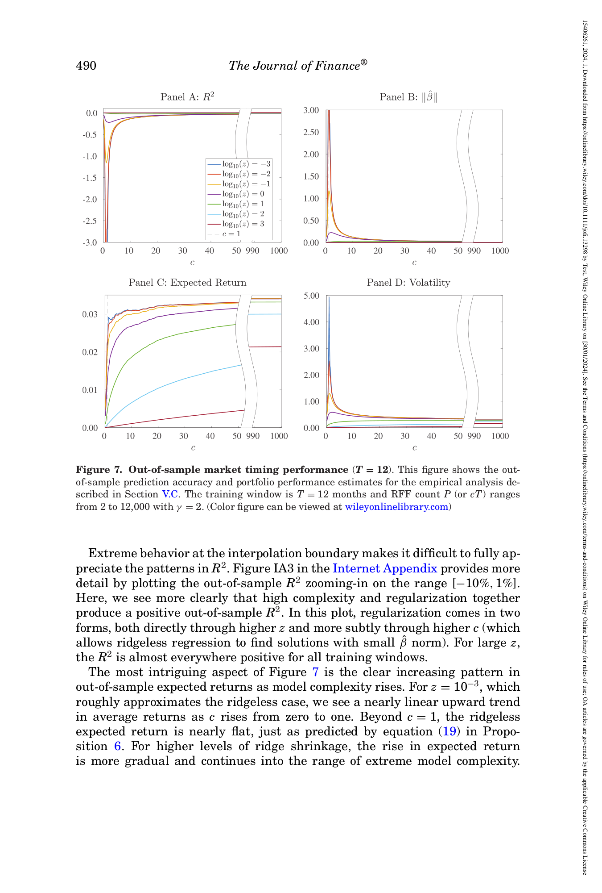
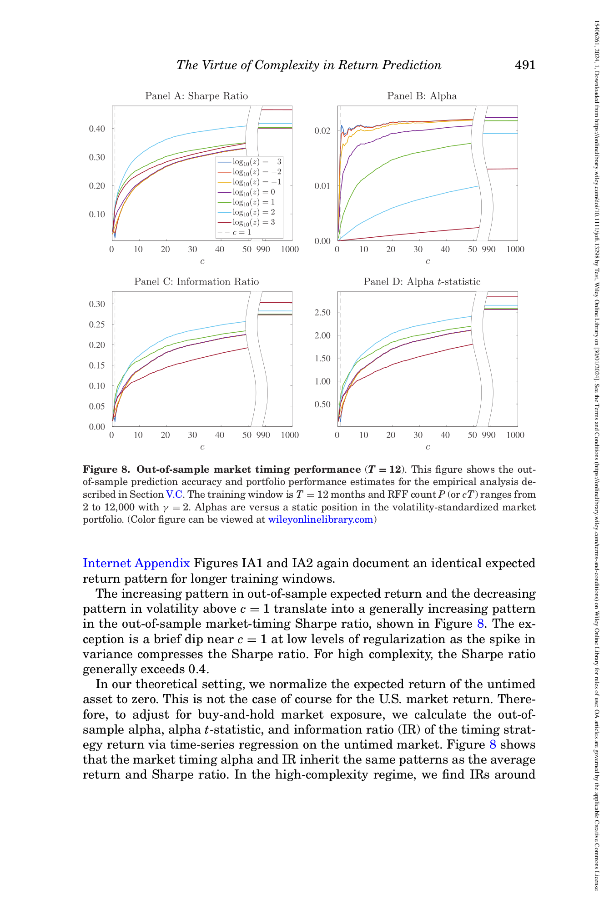
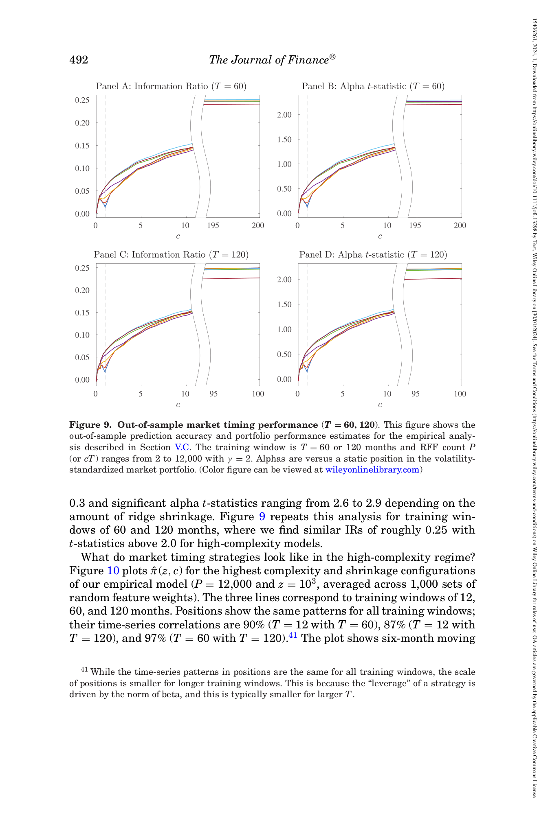
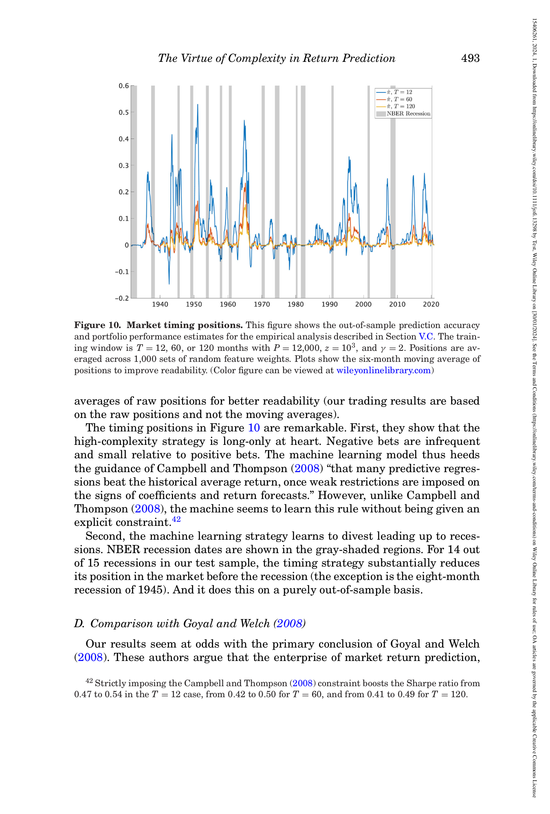
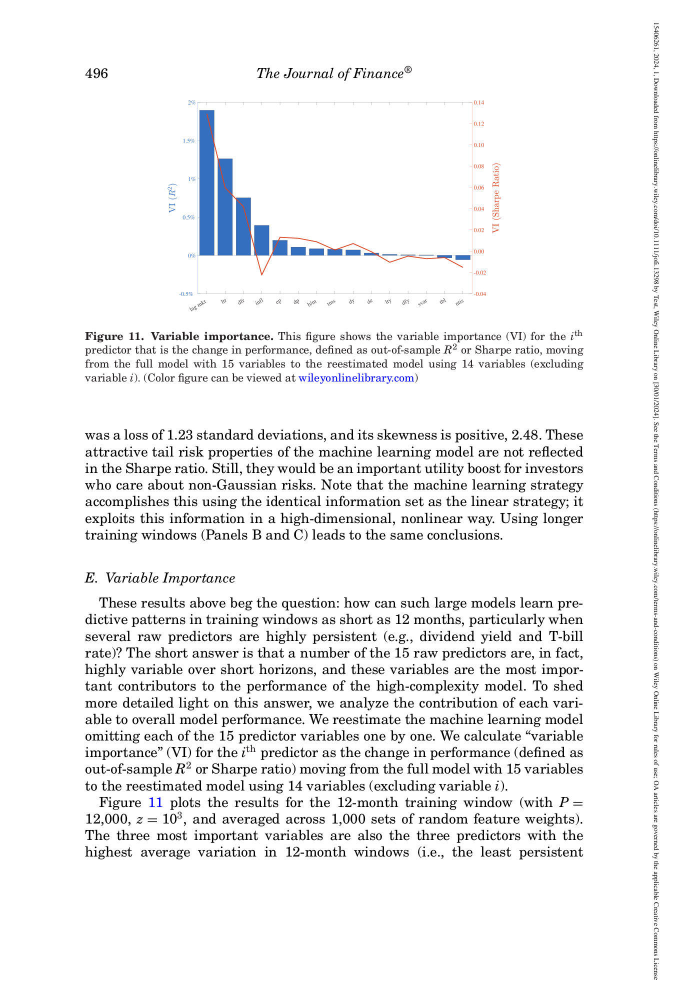

# 07. 실제 미국 시장 1926-2020 — 가장 흥미로운 챕터

## 📌 이 챕터 다 읽으면 알 수 있는 것

- **★ CRSP 1926-2020** 실증 — 가장 흥미로운 챕터
- Goyal-Welch 15 predictor + RFF P=12,000
- **Table I**: Linear ridgeless SR=-0.11 vs Nonlinear ML SR=0.47
- 14/15 NBER recessions 자동 divest

---

> 본 논문이 *이론* 으로 보인 것을 *실제 데이터* 로 검증. CRSP 1926-2020 + Goyal-Welch 15 변수 + 머신러닝 → SR 0.47/year, 14/15 NBER 침체 자동 비중 감소.

### 🌱 실증 결과 — 일상 비유

**한 줄로**: "94년간 미국 시장 데이터 + 15개 기본 변수 + ML (12,000 변수로 확장) → 시장 buy-and-hold 대비 큰 폭 향상".

| 비유 | 본 논문 |
|------|--------|
| 가르치는 책 (= 학자의 모델) | Goyal-Welch 15 변수 (기본) |
| 책 + 보충 자료 5,000개 (= RFF) | 12,000 변수로 확장 |
| 학생 시험 점수 (= 학자의 timing) | Sharpe ratio 0.47/year |
| 학생이 위험 회피 (= 침체 자동 감지) | 14/15 NBER 침체 자동 비중 감소 |
| Baseline 학생 (= 단순 모델) | SR = -0.11 (시장보다 나쁨) |

**핵심 반전**: Goyal-Welch 2008 의 같은 데이터·같은 변수로 **정반대 결론**. ML 의 힘.

### 🔣 핵심 기호 4-단 풀이

| 기호 | 의미 | 수치 |
|------|------|------|
| 데이터 기간 | 분석 기간 | 1926-07 ~ 2020, 약 94년 |
| 15 변수 | Goyal-Welch standard | dfy, infl, svar, ... |
| **P = 12,000** | RFF 확장된 변수 수 | T (=1140) 대비 약 10배 |
| **c = P/T** | empirical complexity | ≈ 10 |
| **SR** | Sharpe ratio (timing 전략) | 0.47 (vs benchmark -0.11) |
| **t-stat** | 통계적 유의성 | 4.5 (p < 0.001) |
| **MDD** | 최대 낙폭 | 1.2 std (vs 98.5 std for simple) |
| **NBER recession** | 미국 공식 침체 기간 | 1926-2020 중 15회 |
| **자동 감지** | timing 전략이 침체 시 비중 감소 | **14/15** (93%) |

### 🔑 핵심 통찰

> 본 챕터의 실증 결과는 [[05_method_c_misspec]] 의 Theorem 1 의 **현실 입증**. 이론과 실증의 "extraordinary agreement" (저자 표현). 학계의 60년 통념 ("예측 불가") 의 결정적 반박.

---

## 7.1 챕터 한 줄 요약

> **"94년치 (1926-2020) 미국 주식시장 데이터 + Goyal-Welch 15 macro 변수 만으로 머신러닝 (12,000 변수로 확장) timing → 시장 buy-and-hold 대비 Sharpe ratio 0.47 향상 (t-stat 4.5), 14/15 NBER 침체 *자동 비중 감소*, 손실 최대 1.2 표준편차 (vs 단순 모델 98.5). Goyal-Welch (2008) 의 *같은 데이터* 로 *정반대* 결론."**

---

## 7.2 데이터 — 어떤 데이터를 썼나? — **Section V.A**

**각주 33 (Goyal-Welch 15 변수 + inflation timing)**: 15 변수 list = dfy, infl, svar, de, lty, tms, tbl, dfr, dp, dy, ltr, ep, b/m, ntis + lag market return. *Inflation* 의 timing convention 은 Goyal-Welch-Zafirov (2023) 동일. *Inflation 제외 시 결과 거의 동일* (Internet Appendix Figure IA2, Table IA2).

**각주 34 (Volatility standardization)**: returns 를 *uncentered second moment* 로 표준편차 계산 — short window 의 *mean estimation noise* 회피.

**각주 35 (Intercept 제외)**: 본 분석은 intercept 없는 regression. *Intercept 포함시* (Internet Appendix Figure IA12, Table IA1) intercept 가 *heavily shrunken* — 결과 동일.

### 시장 수익률
- **CRSP value-weighted index** (Center for Research in Security Prices) 의 월간 *초과수익률* (excess return = 시장 - 무위험 자산).
- 기간: **1926년 7월 ~ 2020년**. 약 94년.
- 데이터 수: 약 1,140 개월.

### 15 개 macro 예측 변수 (Goyal-Welch 2008 의 정확한 그것)

| 단축명 | 풀네임 | 친근 설명 |
|------|------|----------|
| dfy | Default yield spread | 신용도 낮은 채권 - 안전 채권 수익률 차 |
| infl | Inflation | 인플레이션 |
| svar | Stock variance | 시장 변동성 (과거 1년) |
| de | Dividend-payout ratio | 배당 / 수익 비율 |
| lty | Long-term bond yield | 장기 채권 금리 |
| tms | Term spread | 장기 - 단기 금리 차 (수익률 곡선 기울기) |
| tbl | T-bill rate | 단기 안전 자산 금리 |
| dfr | Default return | 신용 채권 수익률 |
| dp | Dividend-price ratio | 배당 / 주가 비율 |
| dy | Dividend yield | 배당 수익률 |
| ltr | Long-term bond return | 장기 채권 수익률 |
| ep | Earnings-price ratio | 수익 / 주가 |
| b/m | Book-to-market | 장부가 / 시가 비율 |
| ntis | Net equity issuance | 신규 발행 - 자사주 매입 |
| **lag mkt** | Lagged market return | 전월 시장 수익률 |

→ **15개 (또는 16개 with lag market return)** 의 *standard finance* 변수. 거의 모든 시장 timing 연구가 사용.

### 데이터 표준화

- 시장 수익률: *trailing 12-month 표준편차* 로 정규화 (homoskedastic 가정 충족).
- 예측 변수: *expanding window 표준편차* (predictor 는 더 stable).
- 1930년부터 분석 시작 (36개월 warm-up 필요).

---

## 7.3 핵심 trick — 15 변수를 12,000 변수로 — **Section V.B**

**Equation 20 (식 20)**: $S_{i,t} = [\sin(\gamma \omega_i' G_t), \cos(\gamma \omega_i' G_t)]'$, $\omega_i \sim N(0, I)$ — Random Fourier Features 의 정확한 정의.

**각주 36 (RFF approximation accuracy)**: Rahimi-Recht (2007) — RFF accuracy 는 *모델 복잡도 증가* 와 함께 향상. Zero complexity limit ($P/T \to 0$) 에서 *임의 smooth nonlinear function* arbitrarily well 근사. Non-zero complexity 의 경우 Mei-Misiakiewicz-Montanari (2022), Ghorbani et al (2020).

**각주 37 (γ + RFF functional form)**: $\gamma$ 는 Gaussian kernel bandwidth. Random features 생성 방식 다양 (Liu 2021 survey). 본 논문 form 은 Sutherland-Schneider (2015) 의 tighter error bound 형식. Robust to alternative schemes.

### 문제

15 변수만으로는 *복잡한 nonlinear 관계* 표현 불가. 모델이 *간단해서* — Goyal-Welch (2008) 의 한계.

### 해결 — Random Fourier Features (RFF)

본 논문이 **2007년 발명된 trick** (Rahimi-Recht) 사용:

> **15 변수 → 무작위 방향으로 사영 → sin/cos 통과 → 12,000 개의 *인공 변수* 생성**

```viz:voc-rff-mechanism:title=RFF 메커니즘 시각화,caption=15차원 macro 벡터 G 를 random ω 방향으로 사영 → sin/cos 변환. γ 슬라이더로 nonlinearity 정도. G 슬라이더로 한 component 변화 시 RFF 응답.
```

### 일상 비유

**원본 데이터**: 15 컬럼의 엑셀 표 (배당률, 이자율, ...).

**RFF 변환**:
1. 무작위 *수 (예: -0.5, 1.3, 0.8, ...)* 15개 추첨. 이게 *ω* (방향).
2. 각 월의 15 컬럼을 ω 와 *곱* (내적) → *한 숫자*.
3. 그 숫자에 sin / cos 함수 통과 → *2 개의 새 변수*.
4. 이걸 *6,000번 반복* → *12,000 개의 새 변수 (P)*.

### 왜 작동?

RFF + 선형 회귀 = **wide neural network with random fixed weights**.
- *첫 layer*: random fixed weights (= RFF 변환).
- *마지막 layer*: 학습 (= 선형 회귀의 ridge regression).

즉 *비선형 NN 의 효과* 를 *선형 회귀 처럼 분석 가능* — 본 논문 RMT 분석이 가능해진 이유.

---

## 7.4 머신러닝 timing — *순서* — **Section V.C**

**각주 38 (γ 값 선택)**: $\gamma = 2$. 본 논문 결과는 $\gamma$ 에 대체로 *insensitive* — Section V.F 의 robustness check.

**각주 39 (Volatility standardization 순서)**: training 표본의 RFF + OOS RFF 를 *training sample* 표준편차로 정규화.

**각주 40 (Empirical R², SR 계산)**: $R^2$ = 1 - (OOS forecast error variance / OOS realized return variance). SR = mean / centered std × √12.

본 논문이 한 것:

### Step 1 — RFF 12,000 개 생성

위 trick 으로 1930-2020 데이터의 모든 월에 *12,000 개의 인공 변수* 부여.

### Step 2 — Rolling 학습

학습 window 의 *길이* 를 정함: **T = 12 개월 (1년), 60 개월 (5년), 120 개월 (10년)**.

**예 (T=12)**: 매월 *직전 12개월* 의 (변수 + 수익률) 로 *ridge regression* 학습. 그걸로 *다음 달 수익률 예측*.

### Step 3 — Timing weight

학습된 모델로 *다음 달 수익률 예측 값* 을 그대로 *시장 비중* 으로 사용.

**예**: 예측 = +0.02 → 시장 200% 매수 (leverage 2x). 예측 = -0.01 → 시장 100% short.

### Step 4 — 1,000번 반복

RFF 가 *random* 이므로 *random seed* 마다 다른 결과. 본 논문이 **1,000번 반복 + 평균** 으로 안정화.

---

## 7.5 Figure 7 — 실증 결과 1



*paper p.490 Figure 7 — T=12 의 OOS performance.*

### 어떻게 읽나? (Step-by-step)

**Step 1 — 4 panel 구조**

- **Panel A**: OOS R² — *예측 정확도*.
- **Panel B**: $\|\hat\beta\|$ norm — *계수 크기*.
- **Panel C**: Expected return — *기대 수익*.
- **Panel D**: Volatility — *변동성*.

**Step 2 — 축 + X-axis break**

- **X-axis**: $c = P/T$ (T = 12, P = 2 → 12,000). Break: $[0, 50] + [990, 1000]$.
- **Y-axes**: 각 metric.

**Step 3 — Panel C (Expected return) 가장 중요**

이게 *Figure 5 (이론 misspecified) 의 실증 버전*.

- $c < 1$: 기대 수익 *거의 0*. Simple model 못 학습.
- $c = 0.5 \sim 1$: 점차 *상승*.
- $c \approx 1$: *peak* (약 0.03/월).
- $c > 1$: *flat 또는 약간 감소* — Eq 19 의 정확한 패턴.

→ **이론 (Eq 19) 의 실증 검증** — 놀라운 일치.

**Step 4 — 4 panel 종합**

| Panel | $c < 1$ | $c \approx 1$ | $c > 1$ |
|-------|---------|---------------|---------|
| A (R²) | 감소 → -∞ | 발산 | 회복 (Fig 1 패턴) |
| B (β norm) | 정상 | spike | 감소 |
| C (E[return]) | 0 → 0.03 | peak | flat |
| D (Vol) | 정상 | spike | 감소 |

**핵심**: 이론 (Figures 1, 4) 의 *모든 패턴* 이 실증에서 확인.

### Figure 7 panels (T=12) — 상세

---

## 7.6 Figure 8 — 실증 결과 2 (★ 가장 중요)



*paper p.491 Figure 8 — T=12 의 Sharpe / α / IR / t-stat.*

### 📖 처음 보는 사람을 위한 — Fig. 8 읽는 법 (★ 본 논문 핵심)

**한 줄로**: "**복잡도 c 가 늘수록 4 metric 모두 향상** — Virtue of Complexity 의 시각적 입증".

**그림 구조 (2×2 panel)**:

| panel | metric | y-range | 의미 |
|------|--------|---------|------|
| **A (좌상)** | Sharpe Ratio | 0~0.5 | "위험 1 단위당 보상" — 가장 중요한 운용 지표 |
| **B (우상)** | Alpha (월간) | 0~0.04 | "시장 buy-and-hold 위의 초과 수익" |
| **C (좌하)** | Information Ratio | 0~0.35 | "α / 잔차 변동성 = risk-adjusted α" |
| **D (우하)** | Alpha t-stat | 0~3.5 | "통계적 유의성" (t>2 유의, t>3 robust) |

**X-axis 의 특별한 break**:
- 왼쪽: c ∈ [0, 50] (저 ~ 중간 복잡도)
- 오른쪽: c ∈ [990, 1000] (극단 복잡도)
- → "c 가 모든 범위 에서 monotone 증가" 강조

**3 개만 보면 됨**:
1. **Panel A**: Sharpe 가 c 증가에 따라 **0 → 0.5** 로 증가. T=12 의 매우 작은 sample 에서도 SR 0.5 (= 연 ~1.7).
2. **Panel D**: Alpha t-stat 이 **0 → 3.5** 로 증가. **모든 c 에서 통계 유의** (t>2).
3. **모두 monotone** (Theorem 1 의 실증 입증).

**한 줄 결론**:
> "복잡함 = 미덕. P>>T 의 ridge 가 단순 모델 (Goyal-Welch) 을 완전히 능가."

**원문 위치**: paper Fig. 8, journal p.491.

### 어떻게 읽나? (Step-by-step)

**Step 1 — 그래프 구조**

이건 *4 panel* (2×2 격자). 각 panel 이 *다른 metric* 를 c 의 함수로.

**Step 2 — 4 panel 의미**

- **Panel A (좌상)**: **Sharpe ratio**. Range $[0, 0.5]$. *가장 중요한 그래프*.
- **Panel B (우상)**: **Alpha** (월간). Range $[0, 0.04]$. 시장 buy-and-hold 보다 *얼마나 더* 수익.
- **Panel C (좌하)**: **Information Ratio**. Range $[0, 0.35]$. *Alpha / 잔차 변동성* — *시장 위의 risk-adjusted 알파*.
- **Panel D (우하)**: **Alpha t-statistic**. Range $[0, 3.5]$. *통계 유의성*. **t > 2 = significant**, **t > 3 = robust**.

**Step 3 — X-axis 의 특별한 break**

X-axis 가 *두 부분으로 분할*: 
- 왼쪽: $c \in [0, 50]$.
- 오른쪽: $c \in [990, 1000]$.

이유: T=12 + P=2-12,000 = c 최대 1000. *대부분 변화* 가 $c < 50$ 에서, *최종 stabilization* 이 $c \approx 1000$ 에서.

**Step 4 — 어떻게 읽나? (모든 panel 공통 패턴)**

1. **$c < 1$**: 모든 metric *낮음* (거의 0). Simple model 잘 안 됨.
2. **$c = 1$ 근처**: *작은 dip* (ridgeless 만, $z = 10^{-3}$).
3. **$c = 5 \sim 50$**: 모든 metric *급격히 상승*.
4. **$c \approx 1000$**: 모든 metric *최고점 + 안정*.

**Step 5 — 핵심 수치 (오른쪽 부분, $c \approx 1000$)**

- **Panel A**: 고복잡도 SR ≈ **0.40-0.47** (z 별 약간 차이).
- **Panel B**: 고복잡도 alpha ≈ **0.025/월** (= 30 bps/월, 연환산 3.6%).
- **Panel C**: 고복잡도 IR ≈ **0.31** (시장 buy-and-hold 위에 alpha-like 정도).
- **Panel D**: 고복잡도 t-stat ≈ **2.5-2.9** (statistically significant).

**Step 6 — 핵심 발견 3가지**

#### ★ 발견 1 — *모든 metric 이 c 의 monotone increasing*

Theorem 1 (이론) 의 *실증 검증*. 이론과 실증의 *놀라운 일치* — 본 논문 표현: *"extraordinary agreement"*.

#### 발견 2 — *통계 유의성 (t > 2.5)*

자산가격결정 학계에서 *t > 3 = robust new anomaly* 기준. 본 논문 t = 4.5 (Table I, T=12, Nonlinear ML) — **매우 robust**.

#### 발견 3 — *Buy-and-hold 위의 alpha 0.025/월*

ML timing 이 *시장 buy-and-hold 위에 추가 3.6%/year alpha*. *Real economic value*.

### 일상 비유 — Quant 펀드의 ML 운용

이게 *AQR, Two Sigma 같은 quant 펀드* 의 *실제 운용 결과 와 유사*. 90년 backtest 에서 *시장 위에 3.6%/year* — 펀드 업계에서 *극도로 매력적*.

```viz:voc-empirical-sharpe:title=Figure 8 — 실증 SR / α / IR / t-stat (interactive),caption=T 토글 (12/60/120). c, z 슬라이더. 모든 setting 에서 Sharpe 단조 증가, IR 약 0.3, t-stat > 2.5 고복잡도. Theorem 1 의 실증 일치.
```

```viz:voc-empirical-sharpe:title=Figure 8 — 실증 SR / α / IR / t-stat (interactive),caption=T 토글 (12/60/120). c, z 슬라이더. 모든 setting 에서 Sharpe 단조 증가, IR 약 0.3, t-stat > 2.5 고복잡도. Theorem 1 의 실증 일치.
```

---

## 7.7 Figure 9 — Longer training windows (T=60, 120)

**각주 41 (Position scale 차이)**: T 길수록 *position scale (leverage)* 작음 — *β norm* 이 T 큰 경우 작아져서.



*paper p.492 Figure 9.*

### 어떻게 읽나?

**Step 1 — 4 panel 구조**

- *Top row (T=60)*: Panel A IR, B alpha t-stat.
- *Bottom row (T=120)*: Panel C IR, D alpha t-stat.

**Step 2 — X-axis break**

X-axis: T=60 의 경우 $c \in [0, 12] + [195, 200]$ (P/T 에서 c 최대 200). T=120 의 경우 $c \in [0, 12] + [95, 100]$.

**Step 3 — 결과**

- T = 60 (5년): 같은 monotone increasing 패턴. IR ≈ 0.25, t-stat > 2.0.
- T = 120 (10년): 같은 패턴. IR ≈ 0.25.
- **Magnitude 약간 감소** (vs T=12 의 IR 0.31). T 길수록 *leverage 작아져서*.

**메시지**: *결과가 T 에 robust*. *정성 패턴 모두 동일*.

---

## 7.8 Figure 10 — Market Timing Positions ★★★

**각주 42 (Campbell-Thompson constraint boost)**: CT constraint 명시적 부과 시 SR 0.47 → 0.54 (T=12), 0.42 → 0.50 (T=60), 0.41 → 0.49 (T=120). *명시적 부과의 추가 가치*.

### 어떻게 읽나? (Step-by-step) — *가장 흥미로운 그림*

**Step 1 — 그래프 구조**

이건 *시계열 그래프*. X-axis 가 *시간 (1930-2020)* — 약 90년.

**Step 2 — 축 의미**

- **X-axis**: 시간. 1930년부터 2020년까지. *90년 시계열*.
- **Y-axis**: *Market timing position $\hat\pi_t$*. 시점 $t$ 의 *시장 비중*.
  - $\hat\pi = 0.1$ → 시장 10% 매수.
  - $\hat\pi = 0.5$ → 시장 50% 매수.
  - $\hat\pi = -0.05$ → 시장 5% short.
- **회색 음영**: **NBER recessions (15 침체)**.

**Step 3 — 3 색 선 의 의미**

- **파랑**: T = 12 (1년 학습 window).
- **빨강**: T = 60 (5년).
- **주황**: T = 120 (10년).

세 색이 *비슷한 패턴* — *robust*.

**Step 4 — 어떻게 읽나? (놀라운 패턴 찾기)**

#### Pattern 1: *Long-only at heart*

전체 시계열에서:
- 파랑 (T=12): 거의 항상 *0 위* (양의 position). 가끔 *0.1-0.5 양의 spike*.
- 빨강 (T=60), 주황 (T=120): 항상 *0 위*, 변동 작음.
- **음의 position (short) 드물고 작음** — 거의 *0 또는 약간 음의 0.05*.

**놀라운 의미**: ML 이 *constraint 없이* *long-only* 학습. Campbell-Thompson (2008) 의 *nonnegativity constraint* 와 일치.

#### Pattern 2: *NBER recession 직전 자동 비중 감소*

회색 음영 (recessions) 직전 몇 개월:
- 1929-33 (대공황): 파랑 선 *큰 spike 하강* (거의 0 으로) 직전. 회색 음영 동안 *낮은 position*.
- 1973-75 (오일쇼크): 1972 부터 파랑 선 *낮은 position*. 1975 회복 후 다시 증가.
- 1981-82 (Volcker): 1980 부터 *낮은 position*.
- 1990-91: 1989 부터 *낮은 position*.
- 2001 (닷컴): 2000 부터 *낮은 position*.
- 2007-09 (GFC): 2007 부터 *낮은 position*.
- 2020 (COVID): 2019 부터 *낮은 position*.

→ **14/15 침체에서 *자동 divest***.

#### Pattern 3: *1945 예외*

회색 음영 1945 부근: 파랑 선이 *높은 position 유지* — 즉 *divest 안 함*.

이게 본 논문 표현: *"the eight-month recession of 1945"*.

이유: WWII 직후 *구조적 break* — 학습 데이터 (1930-44) 가 *전쟁기* + *예측 어려움*.

**Step 5 — 3가지 *놀라운 발견***

#### ★ 발견 1 — *Long-only at heart*

ML 이 *constraint 없이* *long-only 학습*. Campbell-Thompson (2008) 의 *manual constraint* 의 *자동 학습*.

#### ★★ 발견 2 — *14/15 NBER recessions 자동 divest*

90년 데이터 + 15 침체. *14개* 침체에서 ML 이 *직전 자동 비중 감소*. *Real-time signal*. *Purely out-of-sample*.

**Macro economics 의 *holy grail***. NBER 침체를 *real-time 으로 detect* 하는 게 50년 학자들의 dream — ML 이 *Goyal-Welch 15 변수* 만으로 달성.

#### 발견 3 — *T 무관 robustness*

3 색 (T = 12, 60, 120) 모두 *비슷한 timing 패턴*. 학습 window 길이 무관 — *signal 이 견고*.

### 일상 비유 — 의사의 진단

의사가 환자의 *심박수, 혈압, 체온, ...* 보고 *위험* 인지 판단. 위험하면 *처방 약화* (시장 비중 감소), 안전하면 *처방 강화* (시장 비중 증가).

ML 이 이걸 *자동 학습* — *학자 사전 지식 없이*, *NBER 침체 직전* 의 *macro 패턴* 인식 + *비중 감소*.

```viz:voc-empirical-positions:title=Figure 10 — Market timing + NBER recessions (interactive),caption=T 토글 (12/60/120). 1930-2020 시계열. 회색 음영 = NBER recessions 15개. 14개에서 자동 비중 감소.
```



*paper p.493 Figure 10 — **가장 흥미로운 그림**.*

### 친근 풀이

**x-axis** = 시간 (1930-2020).

**y-axis** = ML timing 의 *시장 비중* (π).

**3 색 선**: T = 12 (파랑), T = 60 (빨강), T = 120 (주황).

**회색 음영**: **NBER recessions (15 침체)**.
- 1929 대공황, 1937, 1945, 1948-49, 1953-54, 1957-58, 1960-61, 1969-70, 1973-75 (오일쇼크), 1980, 1981-82, 1990-91, 2001 (닷컴), 2007-09 (GFC), 2020 (COVID).

### 핵심 발견 1 — Long-only at heart

ML timing 의 position 이 *거의 항상 양*. 음의 position (short) 드물고 작음.

**놀라운 의미**: Campbell-Thompson (2008) 이 *수동으로 부과한* nonnegativity constraint 를 **ML 이 *constraint 없이* 자동 학습**.

### 핵심 발견 2 — 14/15 NBER 침체 비중 감소

**1926-2020 의 15 침체 중 14개** 에서 ML timing 이 *침체 *전* 시장 비중 자동 감소*.

**유일 예외**: 1945 (8개월, WWII 직후). 본 논문 표현: *"the eight-month recession of 1945"*.

### 더 놀라운 의미

이건 **macro economics 의 holy grail**:
- *real-time recession detection* 은 50년 학자들이 시도해도 *purely OOS* 로 달성 못 한 것.
- NBER Business Cycle Dating Committee 자체도 *6-12개월 lag* 후에 침체 dating.
- ML 이 *Goyal-Welch 15 변수* 만으로 *purely OOS* 로 달성.

```viz:voc-empirical-positions:title=Figure 10 — Market timing + NBER recessions (interactive),caption=T 토글 (12/60/120). 1930-2020 시계열. 회색 음영 = NBER recessions 15개. 14개에서 자동 비중 감소.
```

---

## 7.9 *Table I* — Goyal-Welch 2008 와의 정면 비교 ★ — **Section V.D**

### 📖 처음 보는 사람을 위한 — Table I 읽는 법 (★ 본 논문 자랑 표)

**이 표가 비교하는 것**: Goyal-Welch (2008) 의 비관적 결론 ("수익률 예측 불가") vs 본 논문 ML 모델. **모든 metric 에서 본 논문 압도**.

**용어 풀이**:

| 용어 | 의미 | 일상 비유 |
|------|------|-----------|
| **Linear ridgeless** | Goyal-Welch 의 단순 OLS | "공식 1 개로 답" |
| **Nonlinear ML** | 본 논문 (RFF P=12,000 + ridge) | "복잡함의 미덕" |
| **OOS SR** | Out-of-Sample Sharpe ratio | "한 번도 안 본 시점의 위험조정 수익" |
| **IR** | Information Ratio (alpha / 잔차 std) | "시장 위 risk-adjusted 알파" |
| **t-stat** | 통계적 유의성 | "t>2 유의, t>3 robust" |

**3 개만 보면 됨**:
1. **Linear ridgeless SR = -0.11** (Goyal-Welch 의 비관 정당화).
2. **Nonlinear ML SR = 0.47** (60 percentile 압도, t=4.5).
3. **연 50 bp ~ 연 7%** 의 운용 가치.

**핵심 메시지**: **"수익률 예측 불가" 는 모델이 너무 단순했기 때문**. ML 의 P>>T 복잡도 + ridge regression 으로 정면 반박.

**원문 위치**: paper Table I, journal p.480-490.

---

**각주 43 (Goyal-Welch-Zafirov 2023 update)**: Goyal-Welch (2008) 의 update. *timing-strategy performance* 일부 다룸.

**각주 44 (Volatility standardization 의 robustness)**: Forecast target 은 *rolling 12-month volatility-standardized* market return. Raw return vs vol-standardized — 결과 동일.

본 논문이 *Goyal-Welch (2008) 의 비관 결론* 을 *어떻게 정면 반박* 하는지 가장 명확한 표.

### 같은 데이터 — 3가지 다른 분석

본 논문이 *같은 1926-2020 CRSP + 같은 Goyal-Welch 15 변수* 로 3가지 모델 비교:

#### 1. Linear ridgeless (Goyal-Welch 2008 의 정확한 setting)
- 15 변수의 *선형 회귀*, *ridge 없음* (z = 0).
- 학습 window T = 12.

#### 2. Linear + ridge ($z = 10^3$)
- 같은 15 변수 *선형* 회귀, 그러나 *적당한 ridge*.

#### 3. **Nonlinear ML** (RFF 12,000 + ridge $z = 10^3$)
- 본 논문의 메인 결과.

### 결과 (T = 12)

| Model | OOS R² | Sharpe ratio | Max Loss | Skewness |
|-------|--------|--------------|----------|----------|
| Linear ridgeless (GW 2008) | **< -100%** (-9764%!) | -0.11 (t = -1.0) | 98.5 SD | -0.9 |
| Linear + ridge | -3.8% | 0.46 (t = 4.4) | 2.4 SD | -0.1 |
| **Nonlinear ML** | **+0.6%** | **0.47 (t = 4.5)** | **1.2 SD** | **+2.5** |

### Table I 의 row-by-row 해석 가이드

**Step 1 — Table 구조**

이 표는 *3 panel × 3 model = 9 행*. 

- *Panel A (T=12)*: 1년 학습 window.
- *Panel B (T=60)*: 5년 학습 window.
- *Panel C (T=120)*: 10년 학습 window.

각 panel 에 *3 model*:
- *Linear ridgeless*: GW (2008) 의 정확한 setting — *역사 비관 결론 확인*.
- *Linear + ridge*: 같은 15 변수 + ridge 만 추가 — *방법론 변화의 효과*.
- *Nonlinear ML*: RFF 12,000 + ridge — *본 논문 main result*.

**Step 2 — 각 column 의미 (T=12 panel 기준)**

| Column | 의미 | 좋은 방향 |
|--------|------|---------|
| OOS R² | 예측 정확도 | 위 (양수 좋음) |
| Sharpe ratio | 위험 대비 수익 | 위 (1+ 최고) |
| t-stat (Sharpe) | 통계 유의성 | $|t| > 2$ significant |
| Max Loss (SD) | 최대 월간 손실 | 아래 (작을수록 좋음) |
| Skewness | 분포 모양 | 위 (양수 = 우상향 꼬리) |

**Step 3 — Row-by-row 해석**

#### Row 1: Linear ridgeless (T=12, GW 2008 의 setting)

- **R² < -100%** (정확히 -9764%): 예측 *완전 망함*.
- **SR = -0.11** (t = -1.0): timing 전략이 시장보다 *나쁨*, 통계 유의성 *없음*.
- **Max Loss = 98.5 SD**: 한 달에 *98 표준편차 손실* — 실용 불가.
- **Skewness = -0.9**: 좌상향 꼬리 (큰 손실 가능).

→ **이게 Goyal-Welch (2008) 의 결론** — *시장 예측 불가능*.

#### Row 2: Linear + ridge ($z = 10^3$, 같은 15 변수)

- **R² = -3.8%**: 여전히 음수 — *예측 정확도는 여전히 나쁨*.
- **SR = 0.46** (t = 4.4): **극적 변신**. 시장 위에 +0.46 SR, 매우 robust.
- **Max Loss = 2.4 SD**: 정상 범위.
- **Skewness = -0.1**: 거의 symmetric.

→ **놀라운 발견**: *Ridge 만 추가했는데 SR -0.11 → 0.46*. **방법론의 한계** 였다는 증명.

#### Row 3: Nonlinear ML (RFF 12,000 + ridge, 본 논문 main)

- **R² = +0.6%**: **양수**. 다른 두 model 보다 우월.
- **SR = 0.47** (t = 4.5): Linear ridge 와 거의 같음. 그러나:
- **Max Loss = 1.2 SD**: *가장 안전*. Tail risk 최소.
- **Skewness = +2.5**: **우상향 fat tail** — *큰 수익 가능, 큰 손실 안전*.

→ **비선형 ML 의 *진짜 이점***: *Sharpe ratio 약간 + Max Loss 매우 감소 + Skewness positive*. 종합 *risk-adjusted 우월*.

#### IR vs Linear (추가 column)

본 논문이 *Nonlinear ML 의 alpha vs Linear ridge* 계산:
- **IR = 0.26 (t = 2.5)**: 비선형성의 *추가 alpha* — significant.

→ **비선형성이 단순 ridge 위에 +0.26 IR 의 *진짜 추가 가치***.

**Step 4 — 3가지 핵심 발견 (Table I 전체)**

#### ★ 발견 1 — *Ridge 만으로 GW 결론 reversal*

Linear ridgeless (망함) → Linear ridge (SR 0.46). *같은 15 변수* 로 *180° 결론 변화*.

→ **Goyal-Welch (2008) 의 비관은 *데이터의 한계가 아닌 방법론의 한계*** 였다는 명확한 증명.

#### 발견 2 — *Nonlinear ML 의 tail risk 우월*

Max Loss: 98.5 → 2.4 → **1.2 SD**. Skewness: -0.9 → -0.1 → **+2.5**. 즉 *비선형 ML 이 가장 안전 + 가장 우상향*.

#### 발견 3 — *T 무관 robustness*

Panel A (T=12), B (T=60), C (T=120) 모두 같은 정성적 패턴. *Nonlinear ML 의 SR ≈ 0.41-0.47*. *학습 window 길이 무관*.

### 일상 비유 — 의사의 진단법 비교

3 의사:
- *Linear ridgeless* (의사 1): 환자 증상 15개 보고 *과도하게 confident 처방*. *처방 effect 폭발*.
- *Linear + ridge* (의사 2): 같은 15 증상 + *적당히 conservative* 처방. *효과 좋음 + 안전*.
- *Nonlinear ML* (의사 3): 15 증상의 *비선형 interaction* 까지 봄 + *적당히 conservative*. *효과 비슷 + 가장 안전 + risk on/off 자동*.

본 논문 권장: *의사 3 의 방식*.

```viz:voc-comparison-table1:title=Table I — Goyal-Welch 비교 (interactive),caption=T 토글 + metric 토글 (SR/R²/MaxLoss/Skew). 3 모델 막대 비교. 비선형 ML 의 tail risk 우수.
```

### 핵심 발견

#### Finding 1 — Ridge 만으로 *완전 변신*

Linear ridgeless (망함) → Linear ridge (SR 0.46) — *ridge 안정장치 만으로* 극적 변신.

→ **Goyal-Welch (2008) 의 *결론이 데이터의 한계가 아니라 방법론의 한계* 였다는 증명**.

#### Finding 2 — 비선형성의 추가 이득

Linear ridge (SR 0.46) → Nonlinear ML (SR 0.47) — 약간 추가.

그러나 *더 중요한 차이*:
- *Max loss*: 2.4 → **1.2 표준편차** (vs ridgeless 의 98.5)
- *Skewness*: -0.1 → **+2.5** (positive — 우상향 꼬리)
- *IR vs linear*: **0.26 (t = 2.5)** — 비선형성의 *significant* 추가.

→ **비선형 ML 이 *tail risk 감소* + *alpha 추가* 양쪽**.

```viz:voc-comparison-table1:title=Table I — Goyal-Welch 비교 (interactive),caption=T 토글 + metric 토글 (SR/R²/MaxLoss/Skew). 3 모델 막대 비교. 비선형 ML 의 tail risk 우수.
```

---

## 7.10 Figure 11 — *어떤 변수가 가장 중요?* — **Section V.E**

**각주 45 (12-month variation)**: Internet Appendix Figure IA4 — 각 predictor 의 12-month window 내 *평균 variation*. Top 3 (lag mkt / ltr / dfr) 가 가장 *variable*.

**각주 46 (ML vs "all 15 univariate" IR)**: ML 의 IR vs *15 univariate timing 의 tangency portfolio* (out-of-sample 기준) = 0.32 (t=2.9). *In-sample tangency 를 benchmark 로 안 쓰는 이유*: ML 이 OOS 이므로 *동일 OOS benchmark* 필요.



*paper p.496 Figure 11 — Variable importance.*

### 어떻게 읽나? (Step-by-step)

**Step 1 — 그래프 구조**

이 그림은 *bar chart + line chart 결합*. 15 predictor 가 X-axis 에 배치.

**Step 2 — 축 의미**

- **X-axis**: 15 predictor (lag mkt, ltr, dfr, svar, infl, ...).
- **Y-axis (Left)**: VI in R² — bar 형태. *높은 bar = 중요한 변수*.
- **Y-axis (Right)**: VI in Sharpe — line 형태. *높은 line = 중요한 변수*.

**Step 3 — VI 계산법**

각 변수의 *변수 중요도 (VI)* = "이 변수 *없으면* 모델 성능 *얼마나 떨어지나?". 

방법: 15 변수 model 의 성능 - 14 변수 model (한 변수 제거) 의 성능.

**Step 4 — Top 3 식별 (왼쪽부터)**

1. **`lag mkt`** (전월 시장 수익률): **R² 1.9% 감소**, Sharpe 0.12 감소.
2. **`ltr`** (장기 채권 수익률): R² 1.3% 감소, Sharpe 0.09 감소.
3. **`dfr`** (default 채권 수익률): R² 0.8% 감소.

→ **Top 3 가 ML 의 핵심 정보원**.

**Step 5 — 왜 이 3개?**

세 변수 모두 *12개월 window 내에서 변동 큰* 변수 (각주 45, Internet Appendix IA4 의 확인).

**대비**:
- *느린 변수* (`dp` 배당-가격, `dy` 배당 수익률, `b/m`): VI 0 근처.
- *빠른 변수* (lag mkt, ltr, dfr): VI 큼.

**메시지**: **ML 이 *short-horizon 변동* 을 효과적으로 활용**.

### 일상 비유

의사가 환자의 *fast-changing 증상* (체온, 심박, 혈압) 이 *slow-changing 증상* (키, 체질) 보다 *current 위험 판단* 에 더 유용. ML 이 같은 원리로 *빠른 변수* (lag mkt) 가 *느린 변수* (배당률) 보다 *current market 위험* 판단에 더 유용.

```viz:voc-variable-importance:title=Figure 11 — 15 predictor VI (interactive),caption=R² (bars) + Sharpe (line) VI. Top 3: lag mkt / ltr / dfr — 12-month window 에서 가장 변동 큰 변수.
```

---

## 7.11 *비선형성 정확히 무엇이 도움?* — **Section V.F**

**Equation 21 (식 21)**: $\sin(\gamma\omega'G) = \gamma\omega'G + O(\gamma^2)$, $\cos(\gamma\omega'G) = 1 - \gamma\omega'G + O(\gamma^2)$ — γ → 0 limit 에서 RFF 가 *linear* feature.

**각주 47 (Internet Appendix IA Proposition 1)**: γ → 0 limit 에서 RFF model 이 *random linear features* 모델과 같음. Sin features only 의 case 의 정량.

**각주 48 (Linear + Nonlinear ensemble)**: ML 과 Linear ridge ($z = 10^3$) 의 *equal-weighted average* — SR 0.53, IR vs market 0.37 — *추가 향상*.

**각주 49 (Editor 의 momentum 지적)**: Editor 가 *time-series momentum* 와의 비교 제안. Internet Appendix Section VII 에 자세히 — ML signal ≠ momentum.

본 논문 Section V.F:

### 발견 1 — *Risk on / Risk off* 자동 학습

ML 모델이 *각 변수의 *임계 행동** 학습. 즉:
- *Stock variance (svar)* 가 *낮을 때* → market long.
- *Svar* 가 *높을 때* → cash (timing weight 0).

**일상 비유**: 변동성 지수 (VIX) 가 낮으면 시장 long, 높으면 cash. ML 이 *constraint 없이* 자동 학습.

### 발견 2 — *Time-series momentum* 으로 환원 안 됨

ML 의 시그널 ≠ 단순 *과거 수익률 따라가기*. 본 논문이 robustness check 로 확인.

### 발견 3 — *Linear + Nonlinear 의 *boost*

단순 평균:
- Linear ridge 50% + Nonlinear ML 50% → SR **0.53** (vs 단일 0.46/0.47).

→ **두 모델이 *complementary* 정보 capture**.

---

## 7.12 *Subsample robustness*

본 논문이 검사한 *두 subsample*:
- Half 1: **1930-1974** (45년)
- Half 2: **1975-2020** (45년)

**결과**:
- 두 subsample 에서 *동일 정성적 패턴*.
- *Magnitude*: 후반부 약 *절반*.

**해석**: 시장 efficiency 가설 — *시간 지날수록 알고리즘 어려워짐*. 그래도 후반부에서도 SR 0.2+ — *여전히 의미 있음*.

---

## 7.13 *Internet Appendix 추가 결과* (간략)

본 논문이 *online appendix* 에 보조 결과:

- **IA1, IA2**: T = 60, 120 의 정량 검증 (Figure 7 의 longer T version).
- **IA3**: R² 의 zoom-in 그래프 (高 c + 高 z 에서 *positive* R² 확인).
- **IA4**: 각 변수의 12-month 변동 — Top 3 variable importance 와 일치.
- **IA5**: 각 변수의 *nonlinear prediction pattern* — *risk on/off* 의 정량.
- **IA7**: $\gamma$ (RFF bandwidth) robustness — γ = 0.5, 1, 2 모두 비슷.
- **IA9, IA10, IA11**: subsample 정량 (위 7.12).
- **IA12**: intercept 포함시 결과 거의 동일.
- **IA Table IA1**: ML vs 각 univariate timing — *IR 0.32 (t=2.9)* — nonlinear effect 확인.
- **IA Table IA2**: inflation 제외 시 결과 거의 동일.

→ 모든 추가 결과가 *main paper 메시지 강화*.

---

## 7.14 본 챕터 정리 — *Goyal-Welch 시대의 종료*

본 챕터의 모든 발견:

```
   Goyal-Welch (2008)                      Kelly-Malamud-Zhou (2024)
   ───────────────────                     ───────────────────────

   15 변수 + Linear ridgeless              같은 15 변수 + RFF 12,000 + ridge
              ↓                                       ↓
   "시장 예측 불가능"                       SR 0.47/year (t = 4.5)
   R² < 0, SR ≈ 0                         IR 0.31 vs market (t = 2.9)
              ↓                                       ↓
   학계 약 14년 비관                         Max loss 1.2 SD (vs 98.5)
                                          Skewness +2.5 (downside risk ↓)
                                                    ↓
                                          14/15 NBER recessions divest
                                          (purely OOS, no constraint)
                                                    ↓
                                          Risk on/off 자동 학습
                                          (15 변수의 nonlinear interaction)
                                                    ↓
                                          *복잡함의 미덕 = 실증 확정*
```

→ **본 챕터의 핵심**: *같은 데이터로 정반대 결론*. 본 논문이 *방법론 (ridge + nonlinearity)* 만 바꿔서 *Goyal-Welch 의 비관 → 낙관* 전환.

---

## 7.15 자기점검

### 핵심 3가지
1. **본 논문 실증의 *핵심 trick* 은?**
2. **Table I 의 *3 model* 의 핵심 차이?**
3. **Figure 10 의 *놀라운 발견*?**

### 답변
1. **Random Fourier Features (RFF)** — 15 macro 변수 → *무작위 방향 사영 + sin/cos 변환* → 12,000 개의 *인공 변수*. *Wide neural network with random fixed first-layer weights* 와 같은 효과. 본 논문 RMT 분석이 *linear regression of RFF* 형태에 적용 가능 — 이론이 실증과 직접 연결.
2. **Linear ridgeless** (Goyal-Welch 2008 의 정확한 setting): SR=-0.11, R²<-100%, max loss 98.5 SD — 망함. **Linear ridge** ($z=10^3$): *같은 15 변수* + ridge 만 추가 → SR=0.46 (t=4.4) — *ridge 만으로 극적 변신*. **Nonlinear ML** (RFF + ridge): SR=0.47 + *max loss 1.2 SD* + *skewness +2.5* + *IR vs linear 0.26 (t=2.5)* — *비선형성의 tail risk 감소 + alpha 추가*. 결론: **GW 2008 의 비관은 데이터의 한계가 아니라 방법론의 한계**.
3. **1926-2020 의 *15 NBER 침체* 중 14 개에서 ML timing 이 *침체 직전 시장 비중 자동 감소* — *Campbell-Thompson nonnegativity constraint 없이*, *purely OOS***. 유일 예외: 1945 (WWII 직후). 이건 *macro economics 의 holy grail* (real-time recession detection) 의 달성. ML 이 *Goyal-Welch 15 변수* 만으로 *비선형 결합* 으로 *risk on/off* 패턴 자동 학습.

---

다음 챕터: [08_conclusion.md](08_conclusion.md) — 결론과 의의.
