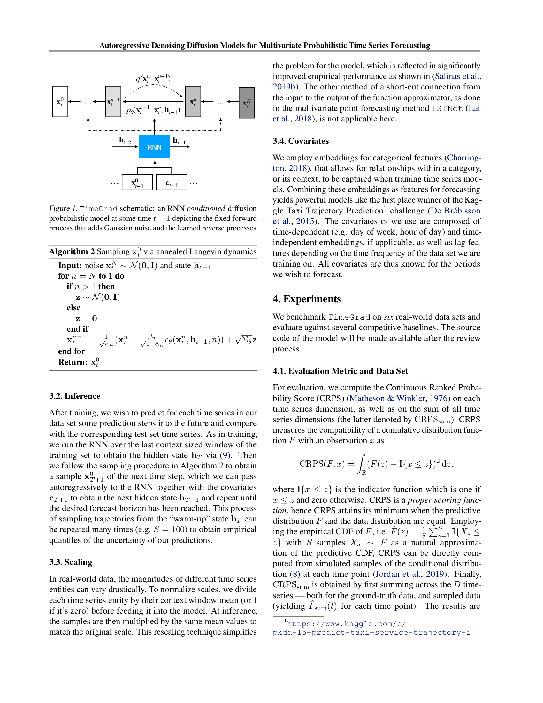

# 05b RNN + Conditional Diffusion — Section 3 본문 (Eq 9, 10)

paper p.3-4. **TimeGrad 의 architectural design**. RNN (LSTM/GRU) + conditional diffusion 의 결합.

---

## 5b.1 챕터 한 줄 요약

> **"RNN (LSTM 2 layer hidden=40) 이 시계열 history → hidden state $\mathbf{h}_{t-1}$ 인코딩 (Eq 9). Conditional diffusion 이 $\mathbf{h}_{t-1}$ + Fourier positional embedding ($n$) 받아 $\epsilon_\theta(\mathbf{x}^n_t, \mathbf{h}_{t-1}, n)$ noise prediction. Network = 8 conditional residual blocks (WaveNet/DiffWave style), Gated Activation Unit + dilated Conv1d. Fig 1 = TimeGrad schematic, Fig 2 = network architecture."**

---

## 5b.2 RNN Encoding (Eq 9)

paper p.3:
> "To model the temporal dynamics we employ the autoregressive recurrent neural network (RNN) architecture from (Graves, 2013; Sutskever et al., 2014) which utilizes the LSTM (Hochreiter & Schmidhuber, 1997) or GRU (Chung et al., 2014) to encode the time series sequence up to time point $t$, given the covariates $\mathbf{c}_t$, via the updated hidden state $\mathbf{h}_t$:"

### Eq 9 — RNN Update

$$
\mathbf{h}_t = \text{RNN}_\theta(\text{concat}(\mathbf{x}^0_t, \mathbf{c}_t), \mathbf{h}_{t-1})
$$

### 수식 4줄 풀이

**기호 뜻**:
- $\mathbf{x}^0_t \in \mathbb{R}^D$ — 시점 $t$ 의 multivariate observation
- $\mathbf{c}_t$ — 시점 $t$ 의 covariates (time-dep + time-indep + lag)
- $\text{concat}(\cdot, \cdot)$ — vector concatenation
- $\text{RNN}_\theta$ — LSTM (paper: 2 layer, hidden=40) or GRU
- $\mathbf{h}_t \in \mathbb{R}^{40}$ — updated hidden state
- $\mathbf{h}_0 = \mathbf{0}$ — initial state

**일상 비유**:
- "운전 기록 일지". 매 시간 (운전 거리, 연료 사용, 풍속) 을 일지에 추가.
- $\mathbf{h}_t$ = "지금까지의 운전 history 요약 (40 차원)".
- 다음 시간 예측 시 $\mathbf{h}_{t-1}$ 만 보면 됨 — 전체 history 다시 안 봐도.

**왜 이 형태인가**:
- **LSTM 의 gate 구조**: long-range dependency 학습. Markov 한계 회피.
- **Shared parameters** $\theta$: 모든 시점에 같은 RNN — 데이터 효율.
- **Covariates $\mathbf{c}_t$ 통합**: time features (hour, day of week) + lag features.

**조심할 점**:
- $\mathbf{h}_t$ 의 dimension (paper 40) 가 작아 high-dim ($D = 2,000$) 정보 압축 부담.
- Per-time-step RNN — Transformer 보다 sequential bottleneck.
- paper Section 6 가 미래 work 로 "Transformer 로 RNN 교체" 명시.

---

## 5b.3 Eq 10 — Approximation by Conditional Diffusion

paper:
> "where $\text{RNN}_\theta$ is a multi-layer LSTM or GRU parameterized by shared weights $\theta$ and $\mathbf{h}_0 = \mathbf{0}$. Thus we can approximate (8) by the model"

### Eq 10 — Joint distribution as RNN conditional

$$
\Pi_{t=t_0}^T p_\theta(\mathbf{x}^0_t | \mathbf{h}_{t-1})
$$

**의미**:
- Eq 8 의 $\Pi_t q_X(\mathbf{x}^0_t | \mathbf{x}^0_{1:t-1}, \mathbf{c}_{1:T})$ 가 RNN 으로 **$\mathbf{h}_{t-1}$ 에 sufficient statistic** 됨.
- $\mathbf{h}_{t-1}$ = 과거 history + covariates 의 통합 representation.

**핵심 가정**: $\mathbf{h}_{t-1}$ 가 "충분한 정보" — Markov property of hidden state.

paper:
> "where now $\theta$ comprises the weights of the RNN as well as denoising diffusion model. This model is autoregressive as it consumes the observations at the time step $t − 1$ as input to learn the distribution of, or sample, the next time step as shown in Figure 1."

---

## 인터랙티브 시각화 — TimeGrad Architecture Flow

```viz:tg-architecture-flow:title=TimeGrad Architecture Flow (Eq 9 + Eq 10),caption=Step 토글로 (1) RNN encoding (2) h_{t-1} (3) Diffusion reverse loop (4) x^0_t output 단계별 highlight. RNN 의 hidden state 가 N=100 diffusion step 모두에 conditioning. 한 시점 t 의 prediction = N forward of ε_θ.
```

---

## 5b.4 Figure 1 — TimeGrad Schematic



*paper p.4 Fig. 1 — RNN-conditioned diffusion at time $t-1$. forward (noise 추가) + reverse (noise 제거) process 둘 다 명시.*

### Fig 1 의 5 요소

paper Fig 1 caption:
> "TimeGrad schematic: an RNN conditioned diffusion probabilistic model at time $t − 1$ depicting the fixed forward process that adds Gaussian noise and the learned reverse processes."

**구조** (top → bottom):
1. **$\mathbf{x}^N_t$ ~ $\mathcal{N}(0, \mathbf{I})$**: pure noise (시작)
2. **$\mathbf{x}^n_t$ → $\mathbf{x}^{n-1}_t$**: forward $q(\mathbf{x}^n_t | \mathbf{x}^{n-1}_t)$ + reverse $p_\theta(\mathbf{x}^{n-1}_t | \mathbf{x}^n_t, \mathbf{h}_{t-1})$
3. **$\mathbf{x}^0_t$**: 최종 clean output
4. **$\mathbf{h}_{t-2} \to \mathbf{h}_{t-1}$**: RNN hidden state
5. **$\mathbf{x}^0_{t-1}, \mathbf{c}_{t-1}$**: 이전 시점 input

---

## 5b.5 Training — Conditional Variant (Eq 7 변형)

paper p.4:
> "Training is performed by randomly sampling context and adjoining prediction sized windows from the training time series data and optimizing the parameters $\theta$ that minimize the negative log-likelihood of the model (10):"

$$
\sum_{t=t_0}^T -\log p_\theta(\mathbf{x}^0_t | \mathbf{h}_{t-1})
$$

paper:
> "starting with the hidden state $\mathbf{h}_{t_0-1}$ obtained by running the RNN on the chosen context window. Via a similar derivation as in the previous section, we have that the conditional variant of the objective (4) for time step $t$ and noise index $n$ is given by the following simplification of (7) (Ho et al., 2020):"

### Conditional Loss (Eq 7 변형)

$$
\mathbb{E}_{\mathbf{x}^0_t, \epsilon, n}\left[\| \epsilon - \epsilon_\theta(\sqrt{\bar\alpha_n}\mathbf{x}^0_t + \sqrt{1-\bar\alpha_n}\epsilon, \mathbf{h}_{t-1}, n) \|^2\right]
$$

### 수식 4줄 풀이

**기호 뜻**:
- $\mathbf{x}^0_t$ — clean data (현재 시점)
- $\mathbf{h}_{t-1}$ — RNN hidden state (조건)
- $n$ — random diffusion step $\sim \text{Uniform}(1, N)$
- $\epsilon \sim \mathcal{N}(0, \mathbf{I})$ — random noise
- $\sqrt{\bar\alpha_n}\mathbf{x}^0_t + \sqrt{1-\bar\alpha_n}\epsilon = \mathbf{x}^n_t$ (Eq 3)
- $\epsilon_\theta(\cdot, \mathbf{h}_{t-1}, n)$ — 추가 조건 $\mathbf{h}_{t-1}$ 의 noise prediction network

**일상 비유**:
- "운전 history (hidden state) 알고 있을 때, 다음 시점의 noisy observation 에서 noise 가 뭐였는지 맞히기" 학습.
- Vanilla DDPM (Eq 7) 의 simple 확장 — **conditioning $\mathbf{h}_{t-1}$ 추가**.

**왜 이 형태인가**:
- **Conditional generation 의 표준 trick**: noise prediction network 에 조건 입력 추가.
- **Loss simplicity**: 단순 MSE — 학습 안정.
- **$\Sigma_\theta = \tilde\beta_n$** (Eq 5의 closed-form) 선택 시 paper 명시: "when we choose the variance in (1) to be $\Sigma_\theta = \tilde\beta_n$ (5), where now the $\epsilon_\theta$ network is also *conditioned* on the hidden state."

**조심할 점**:
- $\mathbf{h}_{t-1}$ 가 매 시점 다른 — 학습 시 context window 마다 different $\mathbf{h}_{t-1}$.
- RNN parameters + diffusion network parameters **동시 학습** — joint optimization.

---

## 5b.6 Algorithm 1 — Training Loop

paper Algorithm 1:
```
for each time series step t ∈ [t₀, T]:
    Input: data x⁰_t ~ q_X(x⁰_t) and state h_{t-1}
    repeat:
        Initialize n ~ Uniform(1, ..., N) and ε ~ N(0, I)
        Take gradient step on:
            ∇_θ || ε - ε_θ(√āⁿ x⁰_t + √(1-āⁿ) ε, h_{t-1}, n) ||²
    until converged
```

**학습 흐름**:
1. Context window $\mathbf{x}^0_{1:t_0-1}$ 를 RNN 통과 → $\mathbf{h}_{t_0-1}$ 계산.
2. Prediction window 의 각 $t = t_0, \ldots, T$:
   - Random $n$ pick
   - Random $\epsilon$ pick
   - $\mathbf{x}^n_t = \sqrt{\bar\alpha_n}\mathbf{x}^0_t + \sqrt{1-\bar\alpha_n}\epsilon$ 계산
   - $\epsilon_\theta(\mathbf{x}^n_t, \mathbf{h}_{t-1}, n)$ forward
   - Loss MSE backward
   - $\mathbf{h}_t = \text{RNN}(\text{concat}(\mathbf{x}^0_t, \mathbf{c}_t), \mathbf{h}_{t-1})$ update (next step 의 condition)

---

## 5b.7 Network Architecture — $\epsilon_\theta$ (Fig 2)

paper p.5:
> "The network $\epsilon_\theta$ architecture consists of conditional 1-dim dilated ConvNets with residual connections adapted from the WaveNet (van den Oord et al., 2016a) and DiffWave (Kong et al., 2021) models."


*paper p.5 Fig. 2 — 8 residual blocks 의 conditional Conv1d network. Gated Activation Unit + skip-connection summation.*

### Fig 2 구조 — 단계별

**Input**:
- $\mathbf{x}^n_t$ — noisy observation
- $n$ — noise step (Fourier positional embedding $\mathbb{R}^{32}$)
- $\mathbf{h}_{t-1}$ — RNN hidden state (FC upsampler)

**Residual block $i$** (8 blocks, $i = 0, \ldots, 7$):
- `Conv1x1` + `ReLU` (input)
- `Conv1x1` + `ReLU` (noise emb $n$)
- `Dilated Conv1d` (bidirectional, dilation $= 2^{i \mod 2}$)
- `Gated Activation Unit`: $\sigma(\cdot) \odot \tanh(\cdot)$ (van den Oord 2016b)
- `Conv1x1` (skip + residual)
- Skip connections summed across 8 blocks

**Output**:
- `Conv1d` + `ReLU` + `Conv1d`
- Final $\epsilon_\theta \in \mathbb{R}^D$

### 핵심 design 선택

| Component | Source | 의미 |
|-----------|--------|------|
| **Dilated Conv1d** | WaveNet | Long-range temporal dependencies (시계열의 long horizon) |
| **Gated Activation** | van den Oord 2016b | $\sigma \odot \tanh$ — multiplicative gating |
| **Skip Connections** | DiffWave | Gradient flow + multi-scale features |
| **Bidirectional** | DiffWave | $\mathbf{x}^n_t$ 의 양방향 정보 — 시간 축 X (per-time-step), feature 축 O |
| **Fourier positional emb** | Transformer | Noise step $n$ encoding |

### Hyperparameters (paper p.5)

| Param | Value |
|-------|-------|
| Residual blocks | 8 |
| Residual channels | 8 |
| Dilations | $2^{i \mod 2}$ (block $i$) |
| Filter size | 1 or 3 |
| Padding | Circular |
| Spatial size | $D$ (channels-first) |
| Noise emb dim | 32 |
| Noise emb max | 500 |

**Output channel size**: 다음 block 의 input 으로 8.

---

## 5b.8 정리 — TimeGrad 전체 architecture

```
                ┌─── time series history ───┐
                │                            │
   x⁰_{t-1}, c_{t-1}                     x⁰_{t}, c_{t}
        │                                    │
        ↓ RNN (LSTM 2 layer, hidden=40)      ↓ ...
        │                                    │
   h_{t-2} ──→ h_{t-1} ──→ h_t ──→ ...
        │
        │ (used as condition)
        ↓
   ┌────────────────────────────────────┐
   │ Diffusion at time t:                │
   │                                     │
   │  x⁰_t ─→ (forward) ─→ x¹_t ─→ ... ─→ xᴺ_t = N(0, I)
   │                                     │
   │  xᴺ_t ─→ ε_θ(·, h_{t-1}, N) ─→ x^{N-1}_t
   │  x^{N-1}_t ─→ ε_θ(·, h_{t-1}, N-1) ─→ x^{N-2}_t
   │  ...                                │
   │  x¹_t ─→ ε_θ(·, h_{t-1}, 1) ─→ x⁰_t │
   │                                     │
   │  (Learned reverse process)          │
   └────────────────────────────────────┘
                │
                ↓ Predicted x⁰_t
```

---

## 자기점검 (이 챕터)

### 핵심 4가지

1. **Eq 9 의 $\mathbf{h}_t$ 가 sufficient statistic 인 가정의 의미는?**
2. **Vanilla DDPM (Eq 7) vs TimeGrad conditional loss 의 차이는?**
3. **WaveNet/DiffWave network 가 TimeGrad 에 적합한 이유는?**
4. **Algorithm 1 의 random $n$ + random $\epsilon$ sampling 이 학습에 결정적인 이유는?**

### 답변

1. **Hidden state $\mathbf{h}_{t-1}$ 가 과거 history 의 "충분한 정보" 를 담는다** 는 가정. 즉 $p(\mathbf{x}^0_t | \mathbf{x}^0_{1:t-1}, \mathbf{c}_{1:T}) = p(\mathbf{x}^0_t | \mathbf{h}_{t-1})$. **현실**: RNN 의 $\mathbf{h}_{t-1}$ 가 40 차원 — long history 의 완전 압축은 불가능. **Approximation**: 짧은 long-range 의존성은 LSTM 의 cell state 로 포착, 매우 긴 의존성은 손실 (Transformer 가 더 좋음 — paper Section 6 future work).
2. **Vanilla DDPM (Ho 2020)**: $\epsilon_\theta(\mathbf{x}^n, n)$ — noise step $n$ + noisy data 만 입력. **TimeGrad**: $\epsilon_\theta(\mathbf{x}^n_t, \mathbf{h}_{t-1}, n)$ — **추가 조건 $\mathbf{h}_{t-1}$** (RNN hidden). 의미: "이 history 일 때 next time step 의 noise 예측". Conditional generation 의 표준 trick.
3. (a) **Dilated Conv1d**: long-range dependency 학습 (시계열의 long horizon). (b) **Gated Activation $\sigma \odot \tanh$**: multiplicative gating — non-linear interaction. (c) **Skip Connections**: gradient flow + multi-scale features. (d) **DiffWave**: audio synthesis paper 의 직접 응용 — audio 도 1D continuous time series (시계열과 동일 구조). Convolutional architecture 가 multivariate 의 feature interaction 학습에 효과적.
4. **Importance sampling 의 variance reduction**: 모든 $n \in [1, N]$ + 모든 $\epsilon$ 을 한 step 에 다 학습하면 batch size 부담 ($N \times \text{batch}$). **Random sampling**: 매 step random $n$ + random $\epsilon$ → 한 step 에 한 노이즈 레벨 학습 → 평균적으로 모든 레벨 학습. 통계적으로 **unbiased gradient estimator**. Ho 2020 의 핵심 trick.

다음 [05_method_c_scaling_covariates.md](05_method_c_scaling_covariates.md) — Scaling + Covariates (Section 3.3-3.4).
