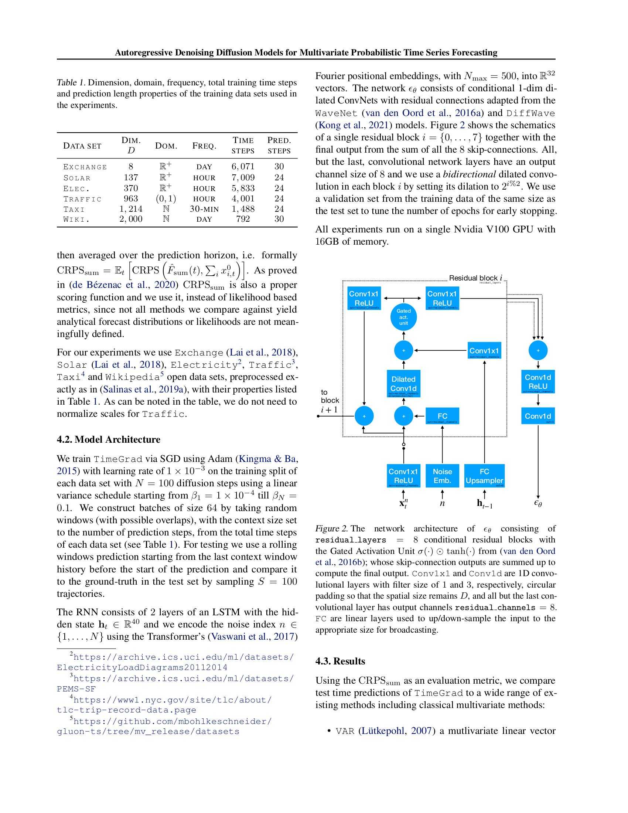

# 07 Datasets + Baselines + Metric (Section 4.1–4.2)

paper p.5. **6 real-world datasets + 11 baselines + CRPS_sum metric**. 실험 setup.

---

## 7.1 챕터 한 줄 요약

> **"6 datasets (Exchange 8 / Solar 137 / Electricity 370 / Traffic 963 / Taxi 1,214 / Wikipedia 2,000) × 11 baselines (VES / VAR / VAR-Lasso / GARCH / KVAE / Vec-LSTM-ind-scaling / Vec-LSTM-lowrank-Copula / GP-scaling / GP-Copula / Transformer-MAF) + TimeGrad. Metric = CRPS_sum (sum across dimensions). Train V100 16GB GPU, lr=1e-3, batch=64, N=100, warmup early stopping."**

---

## 7.2 Section 4 — Experimental Setup

paper p.5:
> "We benchmark TimeGrad on six real-world data sets and evaluate against several competitive baselines."

### Source code

paper:
> "The source code of the model will be made available after the review process."

**현재 상태**: paper repo 직접 공개 없음. PyTorch GluonTS 의 TimeGrad 구현 참조 가능 (https://github.com/awslabs/gluonts).

---

## 7.3 Section 4.1 — Datasets (Table 1)


*paper p.5 Table 1 — 6 datasets 의 차원, 도메인, frequency, train/predict steps.*

### Table 1 정확 인용

| Dataset | $D$ (Dim) | Domain | Freq | Time Steps | Predict Steps |
|---------|-----------|--------|------|------------|---------------|
| **Exchange** | 8 | $\mathbb{R}^+$ | Day | 6,071 | 30 |
| **Solar** | 137 | $\mathbb{R}^+$ | Hour | 7,009 | 24 |
| **Elec.** | 370 | $\mathbb{R}^+$ | Hour | 5,833 | 24 |
| **Traffic** | 963 | (0, 1) | Hour | 4,001 | 24 |
| **Taxi** | 1,214 | $\mathbb{N}$ | 30-min | 1,488 | 24 |
| **Wiki.** | 2,000 | $\mathbb{N}$ | Day | 792 | 30 |

### Dataset 출처 + 의미

| Dataset | 출처 | 의미 |
|---------|------|------|
| **Exchange** | Lai 2018 | 8개국 daily 환율 (1990–2016) |
| **Solar** | Lai 2018 | 137 solar power plants hourly |
| **Electricity** | UCI ML Repo | 370 customers hourly (2012–2014) |
| **Traffic** | Caltrans PEMS-SF | 963 freeway sensors hourly (2008/01–2009/03) |
| **Taxi** | NYC TLC | 1,214 30-min taxi pickups (2015) |
| **Wikipedia** | Github mbohlkeschneider | 2,000 Wikipedia pages daily views |

paper:
> "As can be noted in the table, we do not need to normalize scales for Traffic."

→ Traffic 만 $(0, 1)$ 범위라 scaling 불필요. 나머지 5개는 [05_method_c_scaling_covariates.md](05_method_c_scaling_covariates.md) 의 per-entity mean scaling 사용.

### Domain 의 의미

- $\mathbb{R}^+$: positive real (Exchange/Solar/Electricity)
- $(0, 1)$: bounded interval (Traffic — 도로 점유율)
- $\mathbb{N}$: natural number (Taxi pickup count, Wikipedia page views)

---

## 7.4 Section 4.2 — Model Architecture

paper p.5:
> "We train TimeGrad via SGD using Adam (Kingma & Ba, 2015) with learning rate of $1 \times 10^{-3}$ on the training split of each data set with $N = 100$ diffusion steps using a linear variance schedule starting from $\beta_1 = 1 \times 10^{-4}$ till $\beta_N = 0.1$. We construct batches of size 64 by taking random windows (with possible overlaps), with the context set to the number of prediction steps, from the total time steps of each data set (see Table 1)."

### Hyperparameters

| Param | Value | Note |
|-------|-------|------|
| Optimizer | Adam | Kingma-Ba 2015 |
| Learning rate | $1 \times 10^{-3}$ | |
| Diffusion steps $N$ | 100 | Linear schedule |
| $\beta_1$ | $10^{-4}$ | Initial noise |
| $\beta_N$ | $0.1$ | Final noise |
| Batch size | 64 | Random windows, possible overlaps |
| Context length | = prediction steps | Per dataset |
| RNN | 2-layer LSTM | Hidden = 40 |
| $\epsilon_\theta$ network | 8 residual blocks | Conv1d + Gated Activation |
| Residual channels | 8 | |
| Noise embedding dim | 32 | Fourier positional |
| Noise embedding max | 500 | $N_\max$ |
| Validation | Test set size from training data | Early stopping |
| GPU | Nvidia V100 16GB | Single |

### Test Setup

paper:
> "For testing we use a rolling windows prediction starting from the last context window history before the start of the prediction and compare it to the ground-truth in the test set by sampling $S = 100$ trajectories."

**Rolling window evaluation**:
- Test set 의 시작 직전 context window 로 RNN warm-up.
- Algorithm 2 로 prediction window sample.
- S = 100 trajectories — empirical distribution.

### Network Architecture (Fig 2 재인용)



*paper p.5 Fig. 2 — $\epsilon_\theta$ network. 8 residual blocks + Gated Activation Unit + Conv1d/Conv1x1 + skip connections summation.*

---

## 7.5 Section 4.3 — Baselines (11 모델)

paper p.5-6:
> "Using the CRPS_sum as an evaluation metric, we compare test time predictions of TimeGrad to a wide range of existing methods including classical multivariate methods:"

### 고전 통계 (4 baselines)

| Baseline | 출처 | 핵심 |
|----------|------|------|
| **VAR** (Vector Autoregression) | Lütkepohl 2007 | Multivariate linear AR with lags |
| **VAR-Lasso** | Lütkepohl 2007 | VAR + Lasso regularization |
| **GARCH** | van der Weide 2002 | Multivariate conditional heteroskedastic |
| **VES** | Hyndman 2008 | Innovation state space model (exponential smoothing) |

### Deep Learning (7 baselines)

| Baseline | 출처 | 핵심 |
|----------|------|------|
| **KVAE** | Fraccaro 2017 | VAE + linear state space dynamics |
| **Vec-LSTM-ind-scaling** | Salinas 2019a | RNN + independent Gaussian mean-scaling |
| **Vec-LSTM-lowrank-Copula** | Salinas 2019a | RNN + low-rank + diagonal covariance Gaussian copula |
| **GP-scaling** | Salinas 2019a | LSTM with scaling per entity + low-rank Gaussian |
| **GP-Copula** | Salinas 2019a | LSTM per entity + Gaussian copula |
| **Transformer-MAF** | Rasul 2021 | Transformer + Masked Autoregressive Flow |

**Transformer-MAF**: 같은 그룹 (Zalando Research) 의 직전 paper. TimeGrad 의 가장 강한 경쟁자.

---

## 7.6 Section 4.1 — CRPS_sum Metric

paper p.4:
> "For evaluation, we compute the Continuous Ranked Probability Score (CRPS) (Matheson & Winkler, 1976) on each time series dimension, as well as on the sum of all time series dimensions (the latter denoted by CRPS_sum)."

### CRPS 정의

$$
\text{CRPS}(F, x) = \int_\mathbb{R} (F(z) - \mathbb{1}_{\{x \leq z\}})^2 dz
$$

**기호 뜻**:
- $F$ = predicted CDF
- $x$ = observed value
- $\mathbb{1}\{x \leq z\}$ = step function

### 친근 풀이

**일상 비유**: "확률 예측의 점수표". 예측 분포 $F$ 가 실제 관측값 $x$ 와 얼마나 가까운가.

- $F$ 가 $x$ 에 sharply 집중 → CRPS 작음 (좋음).
- $F$ 가 widely 퍼짐 또는 빗나감 → CRPS 큼 (나쁨).

**Proper scoring rule**: 모델이 진실된 분포 출력 시 minimum score → 모델이 정직해야.

### Empirical CRPS 계산

paper:
> "Employing the empirical CDF of $F$, i.e. $\hat F(z) = \frac{1}{S}\sum_{s=1}^S \mathbb{1}\{X_s \leq z\}$ with $S$ samples $X_s \sim F$ as a natural approximation of the predictive CDF, CRPS can be directly computed from simulated samples of the conditional distribution (8) at each time point (Jordan et al., 2019)."

**Empirical CRPS**:
1. $S = 100$ samples 추출 ($\mathbf{x}^0_t^{(s)}$ for $s = 1, \ldots, 100$).
2. Empirical CDF $\hat F_t$ 구성.
3. CRPS$(\hat F_t, x^{obs}_t)$ 계산.

### CRPS_sum — Multivariate

paper:
> "Finally, $CRPS_\text{sum}$ is obtained by first summing across the $D$ time-series — both for the ground-truth data, and sampled data (yielding $\hat F_\text{sum}(t)$ for each time point). The results are then averaged over the prediction horizon, i.e. formally"

$$
\text{CRPS}_\text{sum} = \mathbb{E}_t\left[ \text{CRPS}\left(\hat F_\text{sum}(t), \sum_i x^0_{i,t}\right) \right]
$$

**의미**: $D$ 차원의 합 ($\sum_i x^0_{i,t}$) 의 forecasting 정확도.

paper:
> "As proved in (de Bézenac et al., 2020) $CRPS_\text{sum}$ is also a proper scoring function and we use it instead of likelihood based metrics, since not all methods we compare against yield analytical forecast distributions or likelihoods are not meaningfully defined."

→ Likelihood-free metric — 모든 baseline (analytic vs sample-based) 비교 가능.

---

## 7.7 정리 — Experimental Pipeline

```
[ Training ]                              [ Testing ]
─────────────                            ─────────────

For each batch:                          For each rolling window:
  Pick random window                       Warm-up: h_T = RNN(test context)
  Encode RNN → h_{t₀-1}                    Sample S=100 trajectories:
  For each t in pred window:                 For each forecast t:
    Algorithm 1 (random n, ε)                  Algorithm 2 (Langevin)
    Loss MSE                                   Update h_t
    Backward                                 Compute CRPS_sum
  Update RNN h_t                          Average over rolling windows
```

---

## 자기점검 (이 챕터)

### 핵심 3가지

1. **6 datasets 의 차원 차이 ($D = 8$ vs $D = 2,000$) 가 모델 학습에 어떻게 영향?**
2. **Transformer-MAF (Rasul 2021) 와 TimeGrad (이 paper) 의 핵심 차이는?**
3. **CRPS_sum (multivariate) vs CRPS (per-dimension) 의 장점?**

### 답변

1. **Low-D (Exchange 8)**: $\epsilon_\theta$ output channel 도 작아 학습 빠름 + overfitting 위험. Vec-LSTM, GP-Copula 도 비슷한 성능 — diffusion 의 advantage 작음. **High-D (Wikipedia 2,000)**: full covariance Gaussian 불가능 → low-rank Gaussian (Vec-LSTM) 의 second-order 한계 명확. TimeGrad 의 diffusion 이 functional form 자유로 advantage 큼. Table 2 의 SOTA 도 high-D dataset (Traffic, Taxi, Wikipedia) 에서 가장 큰 차이.
2. **Backbone**: Transformer-MAF = Transformer + Masked Autoregressive Flow. TimeGrad = RNN + DDPM diffusion. **Distribution**: MAF = invertible NN (Jacobian determinant 제약). Diffusion = score matching (functional form 자유). **결과**: paper Table 2 에서 TimeGrad 가 6 datasets 중 5개에서 best (Exchange tie at 0.005-0.006). **방향**: Zalando Research 의 동일 그룹의 후속 work — flow → diffusion.
3. (a) **Compactness**: $D = 2,000$ entities 의 평균 CRPS 보다 $D$-sum CRPS 가 simpler scalar. (b) **Likelihood-free**: 모든 baseline (analytic Gaussian vs sample-based diffusion) 비교 가능 — likelihood 계산 안 됨. (c) **Proper scoring rule** (de Bézenac 2020): 진실된 sum distribution 출력 시 최소 — 모델이 dimension 간 합산 의미 학습 강제. (d) **단점**: dimension 간 cancellation 가능 (entity A 양수 + B 음수 → 합산 0). 이를 위해 paper Table 2 에 추가 per-dimension CRPS 결과 (Internet Appendix) 도 있음.

다음 [08_main_results.md](08_main_results.md) — Table 2 정확 수치 분석.
