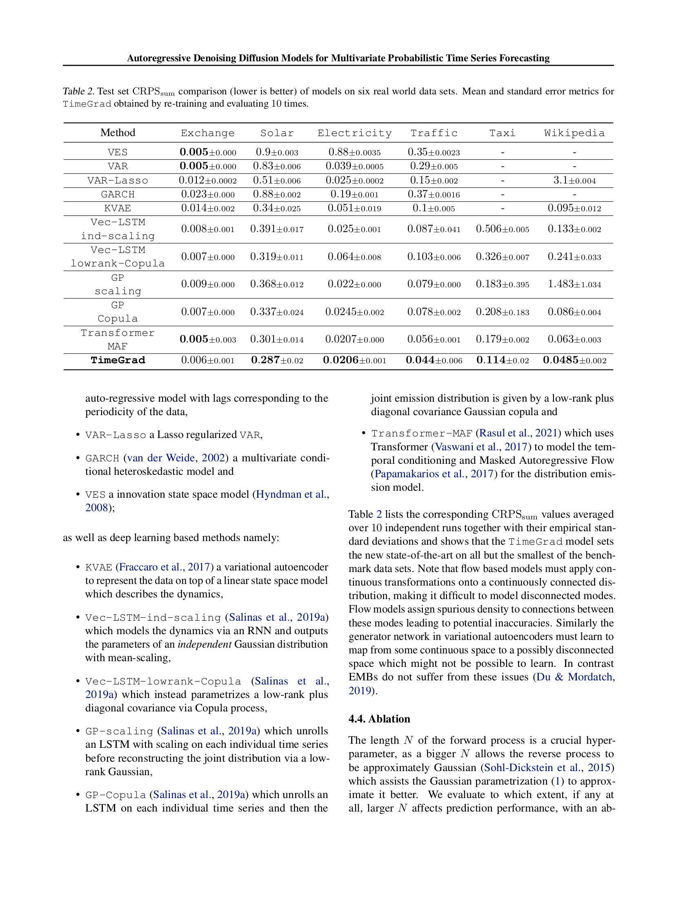

# 08 Main Results — Table 2 (Section 4.3)

paper p.6. **6 datasets × 11 baselines** CRPS_sum 결과. TimeGrad 가 5/6 SOTA.

---

## 8.1 챕터 한 줄 요약

> **"Table 2 = 6 datasets × 11 models CRPS_sum (mean ± std over 10 runs). TimeGrad 가 Solar/Electricity/Traffic/Taxi/Wikipedia 5개에서 outright best. Exchange 만 0.006 (vs VES/VAR 0.005, Transformer-MAF 0.005) — tie. 가장 큰 차이: Taxi 0.114 (vs 0.179 Transformer-MAF, 0.506 Vec-LSTM-ind), Traffic 0.044 (vs 0.056 Transformer-MAF). EBM flexibility 의 functional form 자유가 high-D 에서 우월."**

---

## 8.2 Table 2 — Full CRPS_sum Results



*paper p.6 Table 2 — 6 datasets × 11 models CRPS_sum mean ± standard error (10 runs). Lower = better. Bold = best.*

### 정확 수치 인용 (paper Table 2)

| Method | Exchange | Solar | Electricity | Traffic | Taxi | Wikipedia |
|--------|----------|-------|-------------|---------|------|-----------|
| **VES** | **0.005**±0.000 | 0.9±0.003 | 0.88±0.0035 | 0.35±0.0023 | − | − |
| **VAR** | **0.005**±0.000 | 0.83±0.006 | 0.039±0.0005 | 0.29±0.005 | − | − |
| **VAR-Lasso** | 0.012±0.0002 | 0.51±0.006 | 0.025±0.0002 | 0.15±0.002 | − | 3.1±0.004 |
| **GARCH** | 0.023±0.000 | 0.88±0.002 | 0.19±0.001 | 0.37±0.0016 | − | − |
| **KVAE** | 0.014±0.002 | 0.34±0.025 | 0.051±0.019 | 0.1±0.005 | − | 0.095±0.012 |
| **Vec-LSTM-ind-scaling** | 0.008±0.001 | 0.391±0.017 | 0.025±0.001 | 0.087±0.041 | 0.506±0.005 | 0.133±0.002 |
| **Vec-LSTM-lowrank-Copula** | 0.007±0.000 | 0.319±0.011 | 0.064±0.008 | 0.103±0.006 | 0.326±0.007 | 0.241±0.033 |
| **GP-scaling** | 0.009±0.000 | 0.368±0.012 | 0.022±0.000 | 0.079±0.000 | 0.183±0.395 | 1.483±1.034 |
| **GP-Copula** | 0.007±0.000 | 0.337±0.024 | 0.0245±0.002 | 0.078±0.002 | 0.208±0.183 | 0.086±0.004 |
| **Transformer-MAF** | **0.005**±0.003 | 0.301±0.014 | 0.0207±0.0000 | 0.056±0.001 | 0.179±0.002 | 0.063±0.003 |
| **TimeGrad** | 0.006±0.001 | **0.287**±0.02 | **0.0206**±0.001 | **0.044**±0.006 | **0.114**±0.02 | **0.0485**±0.002 |

(`−` = paper 가 미실험 또는 OOM)

### 각 dataset 별 best

| Dataset | Best | Value | 2위 | 차이 |
|---------|------|-------|-----|------|
| Exchange | VES / VAR / **TimeGrad/Transformer-MAF** | 0.005-0.006 | tie | ~0 |
| Solar | **TimeGrad** | 0.287 | Transformer-MAF 0.301 | **5%** improvement |
| Electricity | **TimeGrad** | 0.0206 | Transformer-MAF 0.0207 | minimal |
| Traffic | **TimeGrad** | 0.044 | Transformer-MAF 0.056 | **21%** improvement |
| Taxi | **TimeGrad** | 0.114 | Transformer-MAF 0.179 | **36%** improvement |
| Wikipedia | **TimeGrad** | 0.0485 | Transformer-MAF 0.063 | **23%** improvement |

→ **5/6 outright best + 1/6 tie**. 가장 큰 향상은 **Taxi (36%) + Wikipedia (23%) + Traffic (21%)**.

---

## 8.3 paper 의 결과 분석

paper p.6:
> "Table 2 lists the corresponding $CRPS_{sum}$ values averaged over 10 independent runs together with their empirical standard deviations and shows that the TimeGrad model sets the new state-of-the-art on all but the smallest of the benchmark data sets."

**핵심 메시지**: TimeGrad SOTA on 5/6 datasets, Exchange (smallest, $D = 8$) 만 baseline 과 동등.

### Flow vs VAE 의 한계 — paper 의 self-criticism

paper:
> "Note that flow based models must apply continuous transformations onto a continuously connected distribution, making it difficult to model disconnected modes. Flow models assign spurious density to connections between these modes leading to potential inaccuracies. Similarly the generator network in variational autoencoders must learn to map from some continuous space to a possibly disconnected space which might not be possible to learn. In contrast EMBs do not suffer from these issues (Du & Mordatch, 2019)."

**3 가지 generative model 한계**:

**Normalizing Flow (Transformer-MAF)**:
- Invertible NN + Jacobian determinant 제약.
- Continuous transformations → disconnected modes 표현 어려움.
- 예: Wikipedia page view 의 spike (대형 사건) vs 평상시 — disconnected.

**VAE (KVAE)**:
- Generator 가 continuous latent → output 학습.
- Disconnected output space (예: count data $\mathbb{N}$) 표현 어려움.

**EBM (TimeGrad)**:
- Energy function 의 functional form 자유.
- Disconnected modes 자연스럽게 표현.
- Du-Mordatch (2019) 의 EBM advantage 가 시계열에서도 확인.

---

## 8.4 인터랙티브 시각화

```viz:tg-crps-table2:title=paper Table 2 — CRPS_sum on 6 datasets (interactive),caption=Dataset 토글 (Exchange / Solar / Electricity / Traffic / Taxi / Wikipedia). 11 models 의 CRPS_sum bar 비교. TimeGrad 가 5/6 SOTA. Taxi 0.114 (vs 0.179 Transformer-MAF) 36% 개선이 가장 큰 차이. Exchange (smallest D=8) 만 baseline 과 tie.
```

---

## 8.5 TimeGrad 의 advantage 분석 — High-D dataset 에서 우월

### 차원 별 TimeGrad 의 advantage

| Dataset | $D$ | TimeGrad CRPS_sum | 2위 | 개선율 |
|---------|-----|--------------------|-----|--------|
| Exchange | 8 | 0.006 | 0.005 (VES/VAR) | tie |
| Solar | 137 | 0.287 | 0.301 (Transformer-MAF) | 5% |
| Electricity | 370 | 0.0206 | 0.0207 (Transformer-MAF) | 1% |
| Traffic | 963 | 0.044 | 0.056 (Transformer-MAF) | **21%** |
| Taxi | 1,214 | 0.114 | 0.179 (Transformer-MAF) | **36%** |
| Wikipedia | 2,000 | 0.0485 | 0.063 (Transformer-MAF) | **23%** |

**패턴**: $D$ 가 클수록 TimeGrad 의 advantage 명확. Wikipedia (D=2,000), Taxi (D=1,214), Traffic (D=963) 가 가장 큰 차이.

**이유** (paper 인용 + 추론):
1. **High-D 의 disconnected modes** — Wikipedia spike (대형 사건), Taxi rush hour 등.
2. **Low-rank Gaussian 의 second-order limit** — Vec-LSTM/GP-Copula 가 high-D 에서 약함.
3. **Normalizing flow 의 Jacobian 제약** — Transformer-MAF 의 architecture cost.
4. **Diffusion 의 functional form 자유** — DDPM 의 $\epsilon_\theta$ 가 임의 신경망.

→ **EBM lineage 의 high-D advantage 확인**. Du-Mordatch (2019) 의 image 결과의 시계열 재확인.

---

## 8.6 ProTran (NeurIPS 2021) 의 후속 발전

ProTran (Tang-Matteson 2021) paper Table 1 에서 TimeGrad 가 baseline 으로 등장. ProTran 의 결과:

| Dataset | TimeGrad | ProTran |
|---------|----------|---------|
| Solar | 0.287 | **0.194** (33% 개선) |
| Electricity | 0.0206 | **0.016** (22% 개선) |
| Traffic | 0.044 | **0.028** (36% 개선) |
| Taxi | 0.114 | **0.084** (26% 개선) |
| Wikipedia | 0.0485 | **0.047** (3% 개선) |

→ **ProTran 이 5/5 에서 TimeGrad 능가** (Wikipedia 만 비등). 단 ProTran 은 NeurIPS 2021, TimeGrad 는 ICML 2021 — concurrent works.

**그러나 TimeGrad 의 의의**:
- **Diffusion 의 시계열 forecasting 첫 본격 적용**.
- 후속 (CSDI, TMDM 등) 의 영감.
- ProTran 이 latent attention 으로 다른 axis 의 contribution — 두 paper 가 같은 시기 다른 방향.

---

## 자기점검 (이 챕터)

### 핵심 3가지

1. **Table 2 의 6 datasets 중 TimeGrad 가 outright best 아닌 dataset 과 그 이유?**
2. **TimeGrad 의 high-D dataset (Wikipedia D=2000) 에서 advantage 가 큰 이유 (paper 인용 기반)?**
3. **TimeGrad (ICML 2021) vs ProTran (NeurIPS 2021) 의 비교 — 두 paper 모두 가치 있는 이유?**

### 답변

1. **Exchange (D=8, daily 환율)**. TimeGrad 0.006 vs VES/VAR/Transformer-MAF 0.005 — 약간 진 tie. **이유**: low-D + smooth dynamics (daily 환율 의 점진적 변화). Linear model (VES = exponential smoothing, VAR) 의 simple Gaussian 가정이 적절. Diffusion 의 functional flexibility 가 advantage 안 됨. Paper 본문도 "smallest of the benchmark data sets" 인정.
2. paper 명시 (Du-Mordatch 2019 인용): "Normalizing flow 의 continuous transformations 가 disconnected modes 표현 어려움. VAE 도 generator 가 continuous → disconnected mapping 학습 어려움. EBM 은 이 issues 없음." Wikipedia: 평상시 (low view) + 대형 사건 (spike) — disconnected modes. TimeGrad 의 DDPM (EBM lineage) 이 functional form 자유로 자연스럽게 표현.
3. **TimeGrad**: **diffusion 의 시계열 forecasting 첫 본격 적용** — 후속 (CSDI Tashiro 2021, TMDM Li 2024, Diffusion-TS Yuan 2024) 의 출발점. **ProTran**: latent attention + variational SSM 의 다른 axis — RNN 없는 시계열 probabilistic 의 출발점. **두 paper 다른 contribution**: TimeGrad = generative method (diffusion), ProTran = architectural innovation (SSM + Transformer). Concurrent works of NeurIPS/ICML 2021 의 시계열 Cambrian explosion.

다음 [09_ablation_viz.md](09_ablation_viz.md) — Section 4.4 (Fig 3 N ablation, Fig 4 Traffic predictions).
