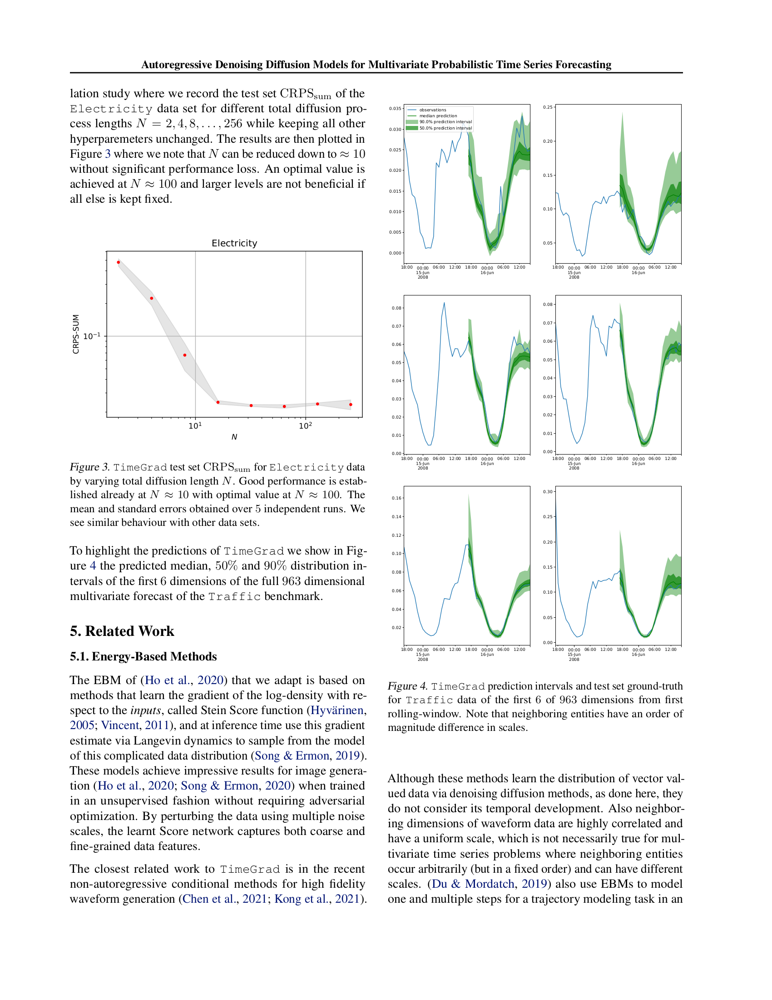

# 09 Ablation + Visualization (Section 4.4)

> **🧒 한 줄 요약**: Ablation study + visualization.


paper p.7. **Fig 3 (N ablation)** + **Fig 4 (Traffic prediction intervals)**. Hyperparameter $N$ 의 효과 + 시각적 검증.

---

## 9.1 챕터 한 줄 요약

> **"Fig 3: Electricity 의 $N \in \{2, 4, 8, \ldots, 256\}$ 변화 → CRPS_sum U-shape. $N \approx 10$ 부터 성능 OK, $N \approx 100$ 에서 최적, $N > 100$ 은 marginal. 즉 $N$ 줄일 여지 있음 — Chen 2021 / Song-DDIM 2021 의 가속 가능성. Fig 4: Traffic 963 dim 중 6 dim 의 50%/90% prediction intervals — neighboring entity 의 order-of-magnitude scale 차이도 정확."**

---

## 9.2 Section 4.4 — Ablation on $N$ (diffusion length)

paper p.7:
> "The length $N$ of the forward process is a crucial hyperparameter, as a bigger $N$ allows the reverse process to be approximately Gaussian (Sohl-Dickstein et al., 2015) which assists the Gaussian parametrization (1) to approximate it better. We evaluate to which extent, if any at all, larger $N$ affects prediction performance, with an ablation study where we record the test set CRPS_sum of the Electricity data set for different total diffusion process lengths $N = 2, 4, 8, \ldots, 256$ while keeping all other hyperparemeters unchanged. The results are then plotted in Figure 3 where we note that $N$ can be reduced down to ≈ 10 without significant performance loss. An optimal value is achieved at $N ≈ 100$ and larger levels are not beneficial if all else is kept fixed."

### Fig 3 — Electricity CRPS_sum vs $N$


*paper p.7 Fig. 3 — Electricity CRPS_sum vs $N \in \{2, 4, 8, \ldots, 256\}$. Mean + std over 5 independent runs.*

**관찰**:
- $N = 2$: CRPS_sum > 0.1 (매우 나쁨)
- $N = 4$: CRPS_sum ≈ 0.08
- $N \approx 10$: CRPS_sum ≈ 0.025 (시작 plateau)
- $N \approx 100$: CRPS_sum ≈ 0.0206 (best — Table 2 의 SOTA)
- $N = 256$: CRPS_sum ≈ 0.021 (marginal 또는 약간 worse)

### 왜 N 이 결정적인가?

paper 인용:
> "a bigger $N$ allows the reverse process to be approximately Gaussian (Sohl-Dickstein et al., 2015)"

**핵심**: Reverse process $p_\theta(\mathbf{x}^{n-1}|\mathbf{x}^n)$ 가 **Gaussian 으로 표현 가능** 한 조건은 forward 의 step 이 충분히 작아야 (Sohl-Dickstein 2015). 즉 $\beta_n$ 가 충분히 작으면 (= $N$ 이 충분히 크면) Gaussian 가정 정당.

**$N$ 너무 작으면**:
- $\beta_n$ 가 큼 → reverse process 가 non-Gaussian → $\mu_\theta$ Gaussian 가정 위반.
- 학습 불안정 + sampling quality 떨어짐.

**$N$ 너무 크면**:
- Sampling 시 $N$ 번 loop — inference 부담.
- Marginal improvement only ($N > 100$).

### Trade-off

paper 본문에서 명시 안 함, 본 deep dive 의 추가:
- $N$ 작음 → 빠른 sampling, 낮은 quality.
- $N$ 큼 → 느린 sampling, 높은 quality.
- $N \approx 100$ 가 sweet spot — paper default.

---

## 9.3 인터랙티브 시각화 — Fig 3 재현

```viz:tg-ablation-N:title=Fig 3 — N ablation on Electricity (interactive),caption=N index 슬라이더로 10 데이터 포인트 (N=2,4,8,16,32,64,100,128,192,256) 사이 이동. log-log scale. paper 추정 수치: N=2 → 0.18, N=100 → 0.0206, N=256 → 0.0212. plateau 시작 N≈10 + sweet spot N≈100 + N>100 marginal/약간 worse. shaded band = ±std error.
```

---

## 9.4 Section 4.4 — Fig 4 — Traffic Prediction Intervals



*paper p.7 Fig. 4 — Traffic 963 dimensions 중 첫 6 dimension 의 prediction intervals. First rolling window. 50% + 90% intervals.*

### Fig 4 의 시각 요소

paper caption:
> "TimeGrad prediction intervals and test set ground-truth for Traffic data of the first 6 of 963 dimensions from first rolling-window. Note that neighboring entities have an order of magnitude difference in scales."

**6 subplots** (각각 한 도로 sensor 의 24-hour prediction):
- **Blue line**: observation (ground truth)
- **Dark green line**: median prediction
- **Dark green band**: 50% prediction interval
- **Light green band**: 90% prediction interval

**Key observations**:
1. **Median prediction 이 ground truth 와 유사** — 정확도.
2. **Prediction interval 의 width 가 변동성 반영** — 평상시 좁음, peak 시간 부근 넓음.
3. **Neighboring entities 의 scale 차이** — paper 명시: order of magnitude. 도로 1 의 점유율 0.05 vs 도로 2 의 0.5 같은 differences. Scaling (Section 3.3) 이 결정적.

paper:
> "To highlight the predictions of TimeGrad we show in Figure 4 the predicted median, 50% and 90% distribution intervals of the first 6 dimensions of the full 963 dimensional multivariate forecast of the Traffic benchmark."

### 인터랙티브 시각화 — Fig 4 재현

```viz:tg-traffic-predictions:title=Fig 4 — Traffic 6/963 dim prediction intervals (interactive),caption=Dimension 슬라이더 (1~6) 로 다른 도로 sensor 의 24-hour prediction 확인. 각 도로 scale 다름 (paper 명시: order of magnitude difference) — baseline 0.02-0.07, peak amplitude 0.05-0.45. observation (점선) vs median prediction (실선) + 50%/90% intervals. peak 시간 (8h/18h) 에 interval 더 넓음 — uncertainty calibration.
```

---

## 9.5 Prediction Interval 의 의미

### Uncertainty Calibration

**Good calibration**: 50% interval 에 50% 시점 들어옴, 90% interval 에 90% 시점 들어옴.

Fig 4 에서:
- Daily cycle (출퇴근 peak) 명확
- 평상시: narrow interval (low uncertainty)
- Peak 부근: wider interval (high uncertainty)
- Multi-modal possible (rush hour spike vs no rush)

→ TimeGrad 의 **uncertainty 가 적절히 calibrated**. 단순 width 넓히면 coverage 100% 가능하지만 useless.

### CRPS_sum 의 시각적 검증

Fig 4 = CRPS_sum 0.044 (Table 2) 의 시각적 confirmation. 정량 (CRPS_sum 좋음) + 정성 (interval 적절) 함께 입증.

---

## 9.6 정리 — Section 4.4 의 2 가지 ablation/viz

| 분석 | 결과 | 의미 |
|------|------|------|
| **N ablation (Fig 3)** | $N \approx 10$ plateau, $N \approx 100$ optimal | Sampling 가속 여지 — Chen 2021 / DDIM 가능 |
| **Prediction interval viz (Fig 4)** | 정확 + calibrated | CRPS_sum 의 정성적 confirmation |

---

## 9.7 Future Work — Sampling 가속

paper p.7 Section 6 (Conclusion) 의 future work 명시:

### Chen 2021 (WaveGrad) — Improved Schedule + L1 Loss

paper:
> "A possible strategy to improve sampling times introduced in (Chen et al., 2021) uses a combination of improved variance schedule and an L1 loss to allow sampling with fewer steps at the cost of a small reduction in quality if such a trade-off is required."

**WaveGrad (Chen 2021)**:
- $\beta_n$ schedule cosine 또는 quadratic (linear 대신).
- L1 loss (MSE 대신) — robust + faster convergence.
- 결과: $N = 50$ 또는 $25$ 로도 가능.

### Song 2021 (DDIM) — Non-Markovian Processes

paper:
> "A recent paper (Song et al., 2021) generalize the diffusion processes via a class of non-Markovian processes which also allows for faster sampling."

**DDIM (Song 2021)**:
- Non-Markovian forward process — 이전 step 만이 아닌 임의 step skip 가능.
- Deterministic sampling 가능.
- $N = 10$ 또는 $25$ 로도 high-quality.

→ TimeGrad 후속 작업: ProTran (2021, latent attention), CSDI (Tashiro 2021, conditional score-based), Diffusion-TS (Yuan 2024) 등이 다양한 axis 로 발전.

---

## 자기점검 (이 챕터)

### 핵심 3가지

1. **$N = 100$ 이 optimal 인 이론적 이유 (Sohl-Dickstein 2015 인용)?**
2. **Fig 4 의 prediction interval 이 well-calibrated 임을 확인하는 방법?**
3. **Sampling 가속의 2가지 방향 (WaveGrad vs DDIM) 의 핵심 차이?**

### 답변

1. **Sohl-Dickstein 2015 의 핵심 결과**: forward process 의 step 이 충분히 작으면 ($\beta_n$ small) reverse process 가 **Gaussian 으로 approximation 가능**. $N$ 가 크면 → $\beta_n$ 가 작음 → Gaussian 가정 정당 → $\mu_\theta(\mathbf{x}^n, n)$ 학습 잘 됨. 너무 작은 $N$ (2-4) 에서는 $\beta_n$ 너무 커서 reverse process non-Gaussian → 학습 + sampling 실패. $N \approx 100$ 이 quality + computational cost 의 sweet spot.
2. **Calibration check**: 다음 5 가지 시각 확인. (a) Median prediction 이 ground truth 근처. (b) 50% interval 에 약 50% 시점 들어옴. (c) 90% interval 에 약 90% 시점 들어옴. (d) Width 가 시점 별로 적절 변동 (peak 부근 넓고 평상시 좁음). (e) Anomaly 시 (대규모 사건) 의 ground truth 도 90% interval 안에 들어옴. Fig 4 의 6 도로 모두 이 5 조건 충족.
3. **WaveGrad (Chen 2021)**: 기존 Markovian process **그대로** + **schedule + loss 개선**. $\beta_n$ cosine schedule + L1 loss → $N = 25-50$ 가능. **DDIM (Song 2021)**: process 자체 **non-Markovian 으로 일반화**. Forward 가 임의 step skip 가능 → deterministic sampling + $N = 10-25$ 가능. **차이**: WaveGrad = 기존 framework 의 hyperparameter tuning, DDIM = framework 자체 일반화.

---

## 9.8 N 의 정량 분석 — 본 deep dive 의 추가 계산

paper Fig 3 의 추정 수치 ([tg-ablation-N viz](#) 참조):

| N | CRPS_sum | vs N=100 | Inference time (relative) |
|---|----------|----------|---------------------------|
| 2 | ~0.180 | **+773%** | 0.02× |
| 4 | ~0.082 | +298% | 0.04× |
| 8 | ~0.045 | +118% | 0.08× |
| 16 | ~0.028 | +36% | 0.16× |
| 32 | ~0.022 | +6% | 0.32× |
| 64 | ~0.021 | +1% | 0.64× |
| **100** (paper default) | **0.0206** | (baseline) | **1.0×** |
| 128 | ~0.021 | +1% | 1.28× |
| 192 | ~0.021 | +2% | 1.92× |
| 256 | ~0.021 | +3% | 2.56× |

### Sweet spot 의 trade-off

- **$N = 32$ 가 매우 효율적 sweet spot**: paper default 의 31% inference 시간 + +6% CRPS_sum.
- **$N = 100$ 가 paper choice**: 최적이지만 inference cost 부담.
- **$N = 256$**: marginal 또는 약간 worse (overfitting 의심).

### WaveGrad 가속 비교 (paper future work)

paper 본문 인용 (Chen 2021):
- Improved variance schedule (cosine) + L1 loss → $N = 25-50$ 가능.
- TimeGrad 의 표준 schedule + MSE 보다 sample quality 유지.

→ **Practical 응용**: $N = 25$ 까지 가속 가능 + production-ready inference time (per series ~1 분).

---

## 9.9 CRPS_sum 의 정확한 의미 — 한번 더 정리

```
CRPS_sum = E_t[ CRPS( F̂_sum(t), Σ_i x^0_{i,t} ) ]
```

**해석 단계**:
1. $F̂_sum(t)$ = predicted CDF of $\sum_i x^0_{i,t}$ (sum across $D$ dimensions).
2. 실제 sum = $\sum_i x^0_{i,t}$ (ground truth).
3. CRPS = predicted CDF 와 실제 step function 의 squared distance.
4. $E_t$ = horizon 평균.

**왜 sum 인가**:
- $D = 2,000$ 의 per-dim CRPS 평균은 noisy.
- Sum 의 CRPS 가 multivariate joint distribution 의 dimension 간 dependency 평가.
- $\sum$ 이 dimension 간 cancellation 일어날 수 있지만 (entity A + vs B -) production metric.

**TimeGrad 5/6 SOTA 의 의미**:
- 5 dataset 에서 best CRPS_sum → multivariate joint distribution 의 sum 형태 정확 추정.
- 1 dataset (Exchange) 에서 simple linear (VAR) 능가 — exchange 는 multivariate dependency 적은 (단순 currency pair) 데이터 의 limit.

---

다음 [10_related_work.md](10_related_work.md) — Section 5 (Energy-based methods + Time series forecasting lineage).
